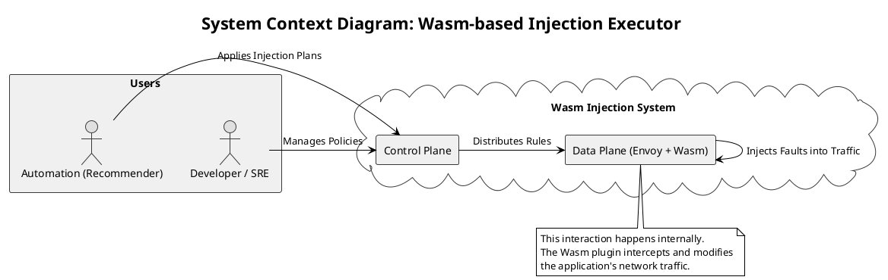
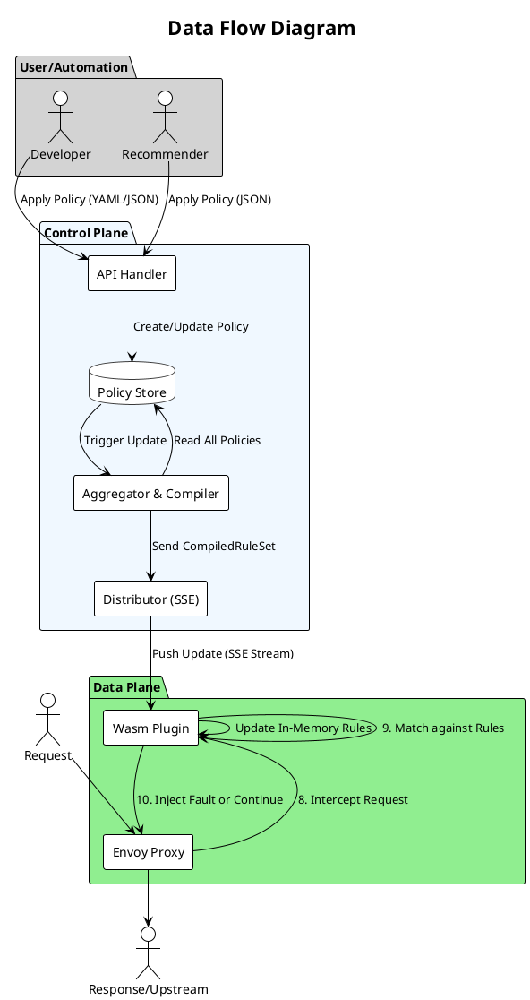
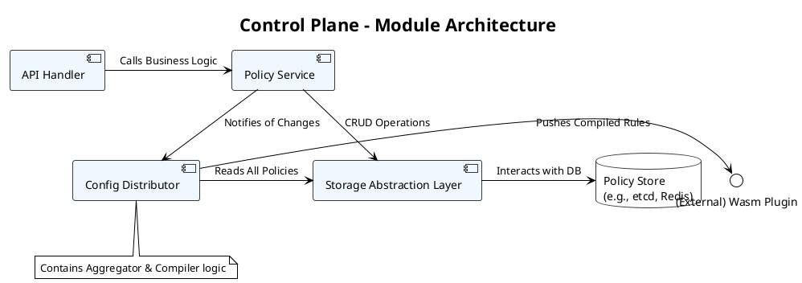
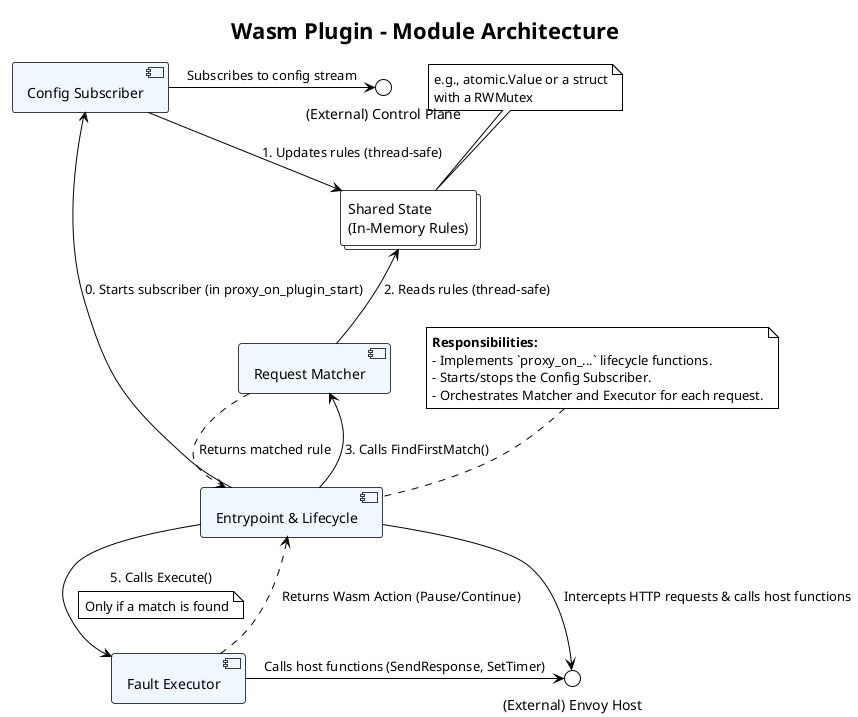

**Wasm-based Injection Executor 系统设计文档**

# **5W2H 需求拆解：基于 Wasm 的 Injection Executor 系统**

使用 **5W2H 分析法**来全面、系统地拆解“设计并实现一个基于 Wasm 的 Injection Executor”这个需求。

## **WHAT (做什么？) - 系统的核心功能是什么？**

* **核心产品**: 一个可动态配置的、基于 WebAssembly (Wasm) 的 Envoy 插件，用于在网络请求层面执行故障注入。
* **配套系统**:
  * 一个**控制平面 (Control Plane)**，用于集中管理和分发故障注入策略。
  * 一套**声明式的配置规范 (Schema)**，用于定义故障注入策略 (`FaultInjectionPolicy`)。
  * 一个**命令行工具 (CLI)**，方便用户和自动化脚本与控制平面交互。
* **具体功能**:
  * **故障类型**: 支持中止 (Abort) 和延迟 (Delay) 请求。
  * **匹配能力**: 能根据请求的路径 (Path)、方法 (Method)、请求头 (Headers) 等多种条件精确匹配目标请求。
  * **动态性**: 支持在不重启服务或代理的情况下，实时更新和应用故障注入规则。

## **WHY (为什么做？) - 项目的目标和价值是什么？**

* **追求极致灵活性**: 实现 Istio 原生功能无法支持的、更复杂的自定义故障注入逻辑（如基于请求体的匹配、状态化故障等）。
* **赋能上层智能**: 为`Injection Recommender` 智能决策系统提供一个强大、可靠的执行底层，将“决策”与“执行”彻底解耦。
* **提升开发者体验**: 提供一套声明式、API 驱动的韧性测试工具，让混沌工程实验变得更简单、更安全、更可控。

## **WHO (为谁做？) - 系统的用户是谁？**

* **主要用户**:
  * **SRE / DevOps 工程师**: 使用该系统进行混沌工程实验，测试服务的韧性和容错能力。
  * **QA / 测试工程师**: 在测试环境中模拟各种网络异常，验证应用的健壮性。
  * **应用开发者**: 在开发阶段，使用该工具模拟下游依赖的故障，进行单元或集成测试。

## **WHEN (何时做？) - 项目的时间规划和阶段是什么？**

* **第一阶段 (MVP - 最小可行产品)**:
  * 实现核心功能：支持 Abort 和 Delay 故障，支持基于 Path/Method/Header 的匹配。
  * 完成 Control Plane 的基本 API（增删改查策略）和基于 SSE 的配置分发。
  * 完成 Wasm 插件的核心逻辑，能接收并执行规则。
  * 提供基础的 CLI 工具 (`apply` 命令)。
* **第二阶段 (功能增强)**:
  * 在 Wasm 插件中增加对请求体 (Body) 的匹配能力。
  * 增强 Control Plane 的高可用性（如使用 etcd/Redis 进行状态存储）。
  * 完善 CLI 功能 (`get`, `delete` 等)。
  * 提供更详细的监控指标（如注入了多少次故障）。
* **第三阶段 (生态与集成)**:
  * 与 `Injection Recommender` 进行深度集成和端到端测试。
  * 提供 Helm Chart，简化在 Kubernetes 上的部署。
  * 编写完善的开发者文档和用户教程。

## **WHERE (在哪里做？) - 系统的运行环境和部署场景是什么？**

* **运行环境**:
  * **数据平面**: Wasm 插件运行在 **Envoy 代理**内部。使用istio 将 Envoy 作为 Sidecar 部署在 Kubernetes Pod 中。
  * **控制平面**: 部署为一个独立的微服务，容器化并部署在 **Kubernetes** 集群中。
* **应用场景**:
  * **微服务架构**: 在服务间的通信（东西向流量）中注入故障。
  * **API 网关**: 在入口流量（南北向流量）中模拟后端服务故障。
  * **开发、测试、预发和生产环境**: 适用于软件生命周期的各个阶段（在生产环境使用需格外谨慎，并配合精细的 `percentage` 控制）。

## **HOW (如何做？) - 系统的技术选型和实现方案是什么？**

* **Control Plane**:
  * **语言**: Go (高并发、云原生生态好)。
  * **框架**: `gin` (RESTful API), `gRPC` (流式 API), `net/http` (SSE)。
  * **存储**: 初期使用内存，后期可选 Redis/etcd/PostgreSQL。
* **Wasm Plugin**:
  * **语言**: Go (`proxy-wasm-go-sdk`) 或 Rust (`proxy-wasm-rust-sdk`)。
  * **通信**: 通过后台 goroutine/thread 与 Control Plane 建立长连接（SSE 或 gRPC Stream）来接收配置。
  * **配置管理**: 使用读写锁在内存中安全地管理和访问规则。
* **CLI 工具**:
  * **语言**: Go (易于构建跨平台二进制文件)。
  * **框架**: `Cobra` 或 `urfave/cli`。
* **部署**:
  * 所有组件都将被容器化 (Dockerfile)。
  * 使用 Kubernetes YAML 清单（Deployment, Service, ConfigMap）进行部署。
  * 后期提供 Helm Chart 进行一键部署。

## **HOW MUCH (成本多少？) - 项目的成本和衡量标准是什么？**

* **开发成本**:
  * **人力**: 需要熟悉 Go、云原生、Envoy 和 Wasm 的工程师。预估需要 1-2 名工程师投入数周到数月的时间（根据阶段划分）。
  * **技术门槛**: Wasm for Envoy 开发有一定学习曲线，需要投入时间进行技术预研。
* **运维成本**:
  * **资源**: Control Plane 和 Envoy 代理会消耗一定的 CPU 和内存资源，但相比完整的 Istio 控制平面会低很多。
* **衡量成功的标准 (Metrics for Success)**:
  * **功能性**: 是否成功实现了所有预定的故障注入和匹配功能。
  * **性能**: Wasm 插件对请求的平均延迟影响（在不注入故障时）应在毫秒级以下。
  * **动态性**: 从策略应用到 Wasm 插件生效的时间应在秒级。
  * **易用性**: 开发者是否能通过文档和 CLI 在短时间内（如半小时内）成功配置并运行一个故障注入实验。
  * **稳定性**: Control Plane 和 Wasm 插件在长时间高并发运行下的稳定性和内存泄漏情况。

# **设计方案：Wasm-based Injection Executor v1.0**

## **系统上下文图 (System Context Diagram)**

此图展示了本系统与外部用户和系统的交互关系。

## **服务划分原则**

本系统遵循 **“关注点分离” (Separation of Concerns)** 和 **“单一职责原则” (Single Responsibility Principle)** 进行服务划分，旨在实现高内聚、低耦合。

1. **决策与执行分离**:
    * **上游系统 (如 `Recommender`)**: 负责 **“决策” (Why & What to inject)**，进行复杂的算法分析，但它不关心如何执行。
    * **本系统 (Injection Executor)**: 负责 **“执行” (How to inject)**，将抽象的策略转化为物理世界的动作。

2. **控制平面与数据平面分离**:
    * **控制平面 (Control Plane)**: **大脑和管理中心**。无状态，负责策略的接收、存储、聚合、编译和分发。它不直接处理业务流量，追求的是**最终一致性**和**管理上的便利性**。
    * **数据平面 (Data Plane)**: **手和脚**。由 Envoy 代理和 Wasm 插件组成，直接嵌入在业务流量路径上。它追求的是**极致的性能、低延迟和高吞吐量**。它不存储状态，仅执行从控制平面接收的指令。

3. **API 网关与流式分发分离**:
    * 在控制平面内部，将处理**外部请求的 API 服务 (RESTful)** 与处理**对内配置分发的流式服务 (SSE/gRPC Stream)** 分开。这使得两者可以独立扩展和优化。例如，API 服务可能需要更强的认证和限流，而流式服务则需要优化长连接管理。

## **关键接口定义 (Key Interface Definition)**

### **Control Plane: Northbound API (对上游)**

* **Endpoint**: `/v1/policies`
* **协议**: RESTful (HTTP/1.1)
* **数据格式**: JSON

| Method   | Path                  | 描述                         | 请求体                 | 成功响应                            |
| :------- | :-------------------- | :--------------------------- | :--------------------- | :---------------------------------- |
| `POST`   | `/v1/policies`        | 创建或更新一个故障注入策略 | `FaultInjectionPolicy` | `201 Accepted`, `{ "name": "..." }` |
| `GET`    | `/v1/policies`        | 列出所有策略的摘要信息。     | (无)                   | `200 OK`, `[{"name":"..."}, ...]`   |
| `GET`    | `/v1/policies/{name}` | 获取指定名称的策略详情。     | (无)                   | `200 OK`, `FaultInjectionPolicy`    |
| `DELETE` | `/v1/policies/{name}` | 删除一个策略。               | (无)                   | `204 No Content`                    |

### **Control Plane: Southbound API (对下游 - Wasm 插件)**

* **Endpoint**: `/v1/config/stream`
* **协议**: Server-Sent Events (SSE) over HTTP
* **数据格式**: JSON in `data` field

* **描述**: Wasm 插件与此端点建立长连接。每当控制平面的策略发生变化，服务器会主动推送一个 `update` 事件，其数据负载是**完整的、编译后的规则集** (`CompiledRuleSet`)。

  * **Event**: `update`
  * **Data**: `{"version":"<hash_or_timestamp>","rules":[...]}`

## **数据流示意图 (Data Flow Diagram)**

此图展示了从策略创建到故障注入的完整数据流动过程。

**流程解释**:

1. 开发者或 Recommender 通过 API Handler 应用策略。
2. API Handler 将策略写入 Policy Store。
3. 存储的变更触发 Aggregator。
4. Aggregator 从 Store 读取所有策略，进行编译。
5. 编译后的规则集发送给 Distributor。
6. Distributor 通过 SSE 流将规则推送给 Wasm 插件。
7. Wasm 插件更新其内存中的规则。
8. 当业务流量到达时，Envoy 将其交给 Wasm 插件。
9. Wasm 插件根据内存中的规则进行匹配。
10. 根据匹配结果，执行故障注入或放行请求。

## **技术栈选型对比表 (Technology Stack Selection)**

| 组件                   | 选项 1                       | 选项 2        | 选项 3           | **推荐 & 原因**                                                                                                                                         |
| :--------------------- | :--------------------------- | :------------ | :--------------- | :------------------------------------------------------------------------------------------------------------------------------------------------------ |
| **Control Plane 语言** | **Go**                       | Java (Spring) | Python (FastAPI) | **Go**。云原生首选，性能高，并发模型简单，部署为单个二进制文件方便。社区生态极其丰富。                                                                  |
| **Wasm 插件语言**      | **Go**                       | **Rust**      | AssemblyScript   | **Go/Rust (并列推荐)**。 **Go**: 开发效率高，GC 已支持，社区活跃。 **Rust**: 极致性能，无 GC，内存安全保证，Wasm 生态成熟。可根据团队技术栈选择。 |
| **Control Plane 存储** | **etcd**                     | Redis         | PostgreSQL       | **etcd**。云原生事实上的配置存储标准，提供 watch 机制，天然适合配置变更的场景。高可用性强。若追求简单，初期可用内存+文件备份。                          |
| **配置分发协议**       | **Server-Sent Events (SSE)** | gRPC Stream   | WebSockets       | **SSE**。单向通信（Server -> Client），实现简单，基于标准 HTTP，无需特殊库。对于 Wasm 插件这种只需接收配置的场景，SSE 是最轻量、最高效的选择。          |
| **CLI 框架 (Go)**      | **Cobra**                    | urfave/cli    | (无)             | **Cobra**。功能强大，被 Kubernetes (`kubectl`), Docker, Hugo 等大量项目使用，社区成熟，支持子命令和自动生成文档。                                       |

好的，现在我们进入详细设计阶段。我们将把整个 **Wasm-based Injection Executor 系统** 分解为具体的、可开发的模块，并明确每个模块的职责、输入和输出。这为后续的代码实现提供了清晰的结构和指南。

我们将系统划分为三个主要组件，每个组件再细分为多个模块：

1.  **Control Plane (控制平面)**
2.  **Wasm Plugin (数据平面插件)**
3.  **CLI (命令行工具)**

## **Control Plane (控制平面) - 详细模块设计**

控制平面是系统的核心管理中心。

### **模块 1.1: API Handler (HTTP/gRPC)**

*   **职责**: 作为系统的入口，负责解析外部请求，进行基础验证，并调用业务逻辑层。
*   **子模块**:
    *   **Router**: 使用 `gin` 或 `gorilla/mux` 定义路由规则（如 `/v1/policies/{name}`）。
    *   **Request/Response Models**: 定义用于 API 交互的 Go 结构体，并处理 JSON 的序列化/反序列化。
    *   **Input Validation**: 验证请求体是否符合 `FaultInjectionPolicy` 的 schema（如必需字段、数据类型等）。
    *   **Middleware**: 实现通用功能，如日志记录、请求追踪 (Tracing)、认证/授权 (Authentication/Authorization)。
*   **输入**: HTTP/gRPC 请求。
*   **输出**: HTTP/gRPC 响应。

### **模块 1.2: Policy Service (业务逻辑层)**

*   **职责**: 实现所有关于 `FaultInjectionPolicy` 的核心业务逻辑，不关心底层存储和外部通信。
*   **接口/方法**:
    *   `CreateOrUpdatePolicy(ctx context.Context, policy *v1alpha1.FaultInjectionPolicy) error`
    *   `GetPolicyByName(ctx context.Context, name string) (*v1alpha1.FaultInjectionPolicy, error)`
    *   `ListPolicies(ctx context.Context) ([]*v1alpha1.FaultInjectionPolicy, error)`
    *   `DeletePolicy(ctx context.Context, name string) error`
*   **核心逻辑**:
    *   在执行创建/更新/删除操作后，通过一个**事件总线 (Event Bus)** 或简单的 **channel** **通知** `Config Distributor` 模块策略已发生变更。
*   **输入**: 来自 API Handler 的经过验证的请求数据。
*   **输出**: 业务处理结果或错误。

### **模块 1.3: Storage Abstraction Layer (DAL - 数据访问层)**

*   **职责**: 封装所有与后端存储的交互细节，为 `Policy Service` 提供一个统一、简洁的数据访问接口。
*   **接口 (`Store` interface)**:
    *   定义与 `Policy Service` 中方法对应的 CRUD 接口。
*   **实现**:
    *   `etcdStore.go`: 使用 `etcd/clientv3` 实现 `Store` 接口。
    *   `redisStore.go`: 使用 `go-redis` 实现 `Store` 接口。
    *   `memoryStore.go`: 使用 `map` 和 `sync.RWMutex` 实现，用于测试和本地开发。
*   **输入**: 来自 `Policy Service` 的数据操作请求。
*   **输出**: 从数据库中读取的数据或操作结果。

### **模块 1.4: Config Distributor (配置分发器)**

*   **职责**: 监听策略变更，聚合、编译最新的规则集，并将其主动推送给所有连接的 Wasm 插件。
*   **子模块**:
    *   **Change Notifier**: 订阅 `Policy Service` 发出的变更事件。
    *   **Aggregator/Compiler**: 当收到通知时，调用 `DAL` 获取所有策略，并将其编译成 `CompiledRuleSet`。
    *   **SSE/gRPC Stream Manager**:
        *   维护一个并发安全的客户端连接池。
        *   处理新客户端的连接请求 (`/v1/config/stream`)，并立即发送一份最新的规则集。
        *   当 Aggregator 生成新的规则集时，遍历连接池，将新规则推送给所有客户端。
        *   处理客户端的断开连接。
*   **输入**: 策略变更通知。
*   **输出**: 通过 SSE/gRPC Stream 发送的 `CompiledRuleSet` JSON。

**具体实现**：[控制平面设计](./Design_1_Control_Plane.md)

## **Wasm Plugin (数据平面插件) - 详细模块设计**

Wasm 插件的代码结构需要清晰且高性能。

### **模块 2.1: Plugin Entrypoint & Lifecycle (`main.go`, `plugin.go`)**

*   **职责**: 插件的入口和生命周期管理。
*   **函数**:
    *   `main()`: Go Wasm 的入口，通常为空。
    *   `proxy_on_vm_start`: VM 级别的初始化，可以解析插件的全局配置。
    *   `proxy_on_plugin_start`: 插件实例级别的初始化。**关键**：在此处启动 `Config Subscriber` 的后台 goroutine。
    *   `proxy_on_http_request_headers`: 每个 HTTP 请求的处理入口。

### **模块 2.2: Config Subscriber (`config_subscriber.go`)**

*   **职责**: 负责与 Control Plane 保持长连接，并安全地更新本地规则缓存。
*   **核心逻辑**:
    *   **`connectAndSubscribe()`**: 在一个无限循环中尝试连接 Control Plane 的流式 API。处理重连逻辑。
    *   **`processStream()`**: 读取 SSE/gRPC 事件流，解析 `CompiledRuleSet`。
    *   **`updateRules(rules *CompiledRuleSet)`**: 使用**读写锁**更新一个全局的 `atomic.Value` 或 `struct` 变量，该变量存储了当前生效的规则。
*   **输入**: 来自 Control Plane 的流式数据。
*   **输出**: 更新插件的内部状态（规则缓存）。

### **模块 2.3: Request Matcher (`matcher.go`)**

*   **职责**: 实现高效的请求匹配逻辑。这是性能热点路径。
*   **函数**:
    *   `findFirstMatch(reqInfo RequestInfo, rules []CompiledRule) (*CompiledRule, bool)`:
        *   `RequestInfo` 是一个包含了当前请求所有相关信息的结构体（如 Path, Method, Headers）。
        *   该函数按顺序遍历已排序的规则，对每个规则调用 `isMatch`。
        *   一旦找到匹配，立即返回该规则，不再继续。
*   **核心逻辑 (`isMatch`)**:
    *   实现对 Path (prefix/exact/regex), Method, Headers 等条件的匹配。
    *   尽量避免在热路径中进行内存分配。
*   **输入**: 请求信息和当前规则集。
*   **输出**: 匹配到的规则（或 `nil`）。

### **模块 2.4: Fault Executor (`fault_executor.go`)**

*   **职责**: 执行具体的故障注入动作。
*   **函数**:
    *   `execute(fault *v1alpha1.Fault) (action types.Action)`:
        *   **Percentage Check**: `if rand.Intn(100) < fault.Percentage`。
        *   **Abort Logic**: 调用 `proxy.SendHttpResponse()`。
        *   **Delay Logic**: 调用 `proxy.SetTimer()` 注册一个回调。
*   **输入**: 匹配到的规则中的 `Fault` 定义。
*   **输出**: `proxy-wasm` SDK 定义的动作（如 `ActionPause`, `ActionContinue`）。

**具体实现**：[数据平面插件设计](./Design_2_Wasm_plugin.md)

## **CLI (命令行工具) - 详细模块设计**

CLI 工具的模块化主要体现在命令的组织结构上。

### **模块 3.1: Root Command (`root.go`)**

*   **职责**: CLI 的主入口，设置全局标志（如 `--control-plane-addr`, `--timeout`），并注册子命令。
*   **框架**: 使用 `Cobra`。

### **模块 3.2: Policy Commands (`policy.go`)**

*   **职责**: 实现所有与 `policy` 资源相关的子命令。
*   **子命令**:
    *   **`applyCmd`**:
        *   接收 `-f` 标志指定文件名。
        *   读取并解析 YAML/JSON 文件。
        *   调用 `API Client` 发送 `POST` 请求。
    *   **`getCmd`**:
        *   可以获取所有策略或指定名称的策略。
        *   调用 `API Client` 发送 `GET` 请求，并格式化输出（如表格）。
    *   **`deleteCmd`**:
        *   接收策略名称作为参数。
        *   调用 `API Client` 发送 `DELETE` 请求。

### **模块 3.3: API Client (`client.go`)**

*   **职责**: 封装与 Control Plane API 的所有 HTTP 交互。
*   **核心逻辑**:
    *   一个 Go `struct`，包含了 `http.Client` 和 Control Plane 的地址。
    *   提供与 `Policy Service` 业务逻辑一一对应的方法（如 `CreatePolicy`, `GetPolicy` 等）。
*   **输入**: Go 结构体（如 `FaultInjectionPolicy`）。
*   **输出**: 从 API Server 返回的响应或错误。

**具体实现**：[CLI设计](./Design_3_CLI.md)