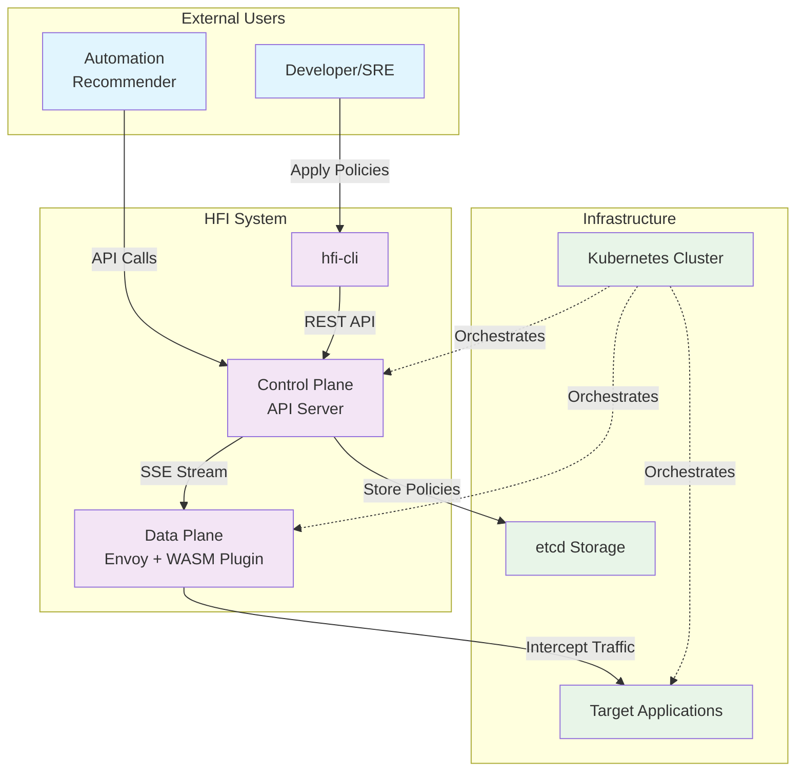

# HFI 系统架构文档

## 1. 高级概述

**HFI (HTTP Fault Injection)** 是一个基于 Kubernetes 和 Envoy 的云原生故障注入平台，专为混沌工程和弹性测试设计。该系统旨在解决传统故障注入工具的局限性：缺乏精确的控制粒度、难以集成到现代微服务架构、以及缺乏实时动态配置能力。

HFI 通过将故障注入逻辑下沉到数据平面（Envoy Sidecar），并采用声明式配置管理，实现了高性能、精确可控的故障注入能力。系统支持基于请求路径、方法、头部等多维度条件的精确匹配，能够在不重启服务的情况下动态调整故障注入策略，为现代云原生应用的韧性测试提供了强大而灵活的工具。

### 系统上下文图



## 2. 核心设计原则

### 2.1 控制平面与数据平面分离

HFI 严格遵循云原生架构的核心原则，将系统分为控制平面和数据平面两个独立的层次：

**控制平面 (Control Plane)**：
- **职责**：策略管理、配置分发、系统监控
- **特性**：无状态、高可用、可独立扩展
- **优势**：
  - **管理简化**：集中化的策略管理，支持声明式配置
  - **独立扩展**：可以根据管理负载独立扩展，不受数据平面流量影响
  - **故障隔离**：控制平面的故障不会直接影响数据平面的正常工作

**数据平面 (Data Plane)**：
- **职责**：流量拦截、故障注入执行、实时决策
- **特性**：高性能、低延迟、嵌入式部署
- **优势**：
  - **极致性能**：直接嵌入到流量路径，避免额外的网络跳转
  - **实时响应**：在微秒级别内完成故障注入决策
  - **故障容错**：即使控制平面不可用，数据平面仍可基于最后的配置正常工作

### 2.2 决策与执行分离

HFI 采用"决策与执行分离"的设计哲学，为未来与智能决策系统的集成奠定基础：

**决策层 (未来的 Recommender)**：
- **职责**：基于系统状态、历史数据、AI 算法等进行故障注入策略的智能决策
- **特性**：复杂算法、机器学习、大数据分析

**执行层 (HFI Executor)**：
- **职责**：高效、可靠地执行故障注入指令
- **特性**：高性能、实时性、确定性执行

这种分离带来的优势：
- **专业化**：每个层次专注于自己的核心能力
- **可测试性**：可以独立测试执行逻辑的正确性
- **可扩展性**：可以支持多种不同的决策算法
- **技术多样性**：决策层可以使用 Python/R 等科学计算语言，执行层使用高性能系统语言

### 2.3 声明式 API

HFI 采用类似 Kubernetes CRD 的声明式配置模式：

**声明式的优势**：
- **意图表达**：用户描述"想要什么"而不是"怎么做"
- **幂等性**：多次应用相同配置产生相同结果
- **版本控制友好**：配置文件可以纳入 Git 版本控制
- **审计追踪**：配置变更历史清晰可追溯

**设计考量**：
```yaml
# 用户只需要描述故障注入的意图
apiVersion: v1
kind: FaultInjectionPolicy
metadata:
  name: api-delay-test
spec:
  rules:
    - match:
        path:
          prefix: "/api/v1"
        method:
          exact: "GET"
      fault:
        delay:
          fixedDelay: "1s"
        percentage: 20
```

## 3. 技术选型与理由

### 3.1 核心技术栈

| 组件 | 技术选择 | 主要理由 |
|------|----------|----------|
| **Control Plane** | Go | 云原生生态首选，并发模型简单，部署为单二进制文件 |
| **WASM Plugin** | Rust | 极致性能，内存安全，无 GC 停顿，WASM 生态成熟 |
| **存储后端** | etcd | 云原生标准，提供 watch 机制，强一致性保证 |
| **配置分发** | Server-Sent Events | 单向推送场景的最佳选择，基于标准 HTTP，实现简单 |
| **Web 框架** | Gin (Go) | 高性能 HTTP 框架，中间件生态丰富 |
| **CLI 框架** | Cobra (Go) | Kubernetes 生态标准，功能完善，自动文档生成 |

### 3.2 关键技术决策解析

#### 为什么选择 Rust 而不是 Go 开发 WASM 插件？

虽然 Go 是我们控制平面的首选语言，但在 WASM 插件开发上，我们选择了 Rust：

**Rust 的优势**：
1. **零成本抽象**：编译后的 WASM 代码极其精简，运行时开销最小
2. **内存安全**：编译时保证内存安全，避免在数据平面出现内存泄漏或越界访问
3. **无垃圾回收**：没有 GC 停顿，确保故障注入的延迟可预测性
4. **WASM 生态成熟**：`proxy-wasm-rust-sdk` 比 Go 版本更完善，社区更活跃
5. **性能极致**：在每个请求都要执行的热路径上，性能差异会被放大

**Go (TinyGo) 的局限性**：
1. **运行时体积**：即使是 TinyGo，生成的 WASM 文件仍然较大
2. **GC 影响**：垃圾回收器在受限的 WASM 环境中可能导致不可预测的延迟
3. **生态不成熟**：`proxy-wasm-go-sdk` 相对较新，功能和稳定性不如 Rust 版本

#### 为什么选择 SSE 而不是 gRPC Stream？

**SSE 的优势**：
- **单向通信**：配置分发是典型的单向通信场景，SSE 天然适合
- **基于 HTTP**：无需额外的协议支持，防火墙友好
- **实现简单**：服务端只需 `fmt.Fprintf(w, "data: %s\n\n", json)`
- **自动重连**：浏览器和大多数 HTTP 客户端都内置了重连机制
- **轻量级**：相比 gRPC 的 protobuf 序列化开销更小

**gRPC Stream 的劣势**：
- **双向能力浪费**：WASM 插件不需要向控制平面发送数据
- **协议复杂性**：需要处理 HTTP/2 连接管理、frame 处理等
- **防火墙问题**：某些网络环境对 HTTP/2 支持不完善

## 4. 核心数据流

### 4.1 数据流架构图

```mermaid
sequenceDiagram
    participant U as User/CLI
    participant API as API Handler
    participant PS as Policy Service
    participant Store as etcd Store
    participant Dist as Config Distributor
    participant Wasm as WASM Plugin
    participant App as Target App
    
    Note over U,App: 配置阶段
    U->>+API: POST /v1/policies (policy.yaml)
    API->>+PS: CreateOrUpdatePolicy()
    PS->>+Store: Save Policy
    Store-->>-PS: Success
    PS->>Dist: Notify Policy Change
    PS-->>-API: Policy Created
    API-->>-U: 201 Created
    
    Dist->>+Store: Read All Policies
    Store-->>-Dist: All Policies
    Dist->>Dist: Compile to RuleSet
    Dist->>Wasm: SSE: CompiledRuleSet
    Wasm->>Wasm: Update In-Memory Rules
    
    Note over U,App: 运行时阶段
    App->>+Wasm: HTTP Request
    Wasm->>Wasm: Match Against Rules
    alt Fault Injection Match
        Wasm->>Wasm: Execute Fault (Delay/Abort)
        Wasm-->>-App: Modified Response
    else No Match
        Wasm-->>-App: Continue Normally
    end
```

### 4.2 详细流程解析

#### 配置阶段（毫秒级延迟）

1. **策略提交**：
   - 用户通过 `hfi-cli policy apply -f policy.yaml` 提交故障注入策略
   - CLI 解析 YAML 文件并发送 HTTP POST 请求到控制平面

2. **策略验证与存储**：
   - API Handler 接收请求，进行 JSON Schema 验证
   - Policy Service 执行业务逻辑验证（如名称唯一性、配置合理性）
   - 验证通过后，策略被持久化到 etcd 存储

3. **配置编译与分发**：
   - Config Distributor 接收到策略变更通知
   - 从 etcd 读取所有活跃策略，编译成优化的 `CompiledRuleSet`
   - 通过 SSE 流将编译后的规则推送给所有连接的 WASM 插件

4. **插件规则更新**：
   - WASM 插件接收到新的规则集
   - 使用原子操作更新内存中的规则缓存
   - 整个过程对正在处理的请求透明，无需重启

#### 运行时阶段（微秒级延迟）

1. **请求拦截**：
   - 目标应用接收到的每个 HTTP 请求都会被 Envoy 拦截
   - Envoy 调用 WASM 插件的 `proxy_on_http_request_headers` 函数

2. **规则匹配**：
   - WASM 插件从内存中读取当前规则集（无锁读取）
   - 按照优先级顺序逐一匹配请求的路径、方法、头部等条件
   - 使用高效的字符串匹配算法（前缀匹配、正则表达式等）

3. **故障执行决策**：
   - 如果找到匹配规则，根据配置的百分比进行随机决策
   - 对于延迟故障：调用 `proxy_set_timer` 设置定时器
   - 对于中断故障：调用 `proxy_send_http_response` 直接返回错误响应

4. **请求继续或修改**：
   - 如果不需要故障注入，请求正常转发给目标应用
   - 如果执行了故障注入，请求被修改（延迟）或终止（中断）

### 4.3 性能特性

- **配置更新延迟**：通常在 100-500ms 内完成从策略提交到 WASM 插件生效
- **运行时开销**：每个请求的故障注入决策时间 < 10μs
- **内存占用**：WASM 插件内存占用 < 1MB，主要用于缓存编译后的规则
- **并发处理**：支持数万 QPS 的高并发故障注入，性能线性扩展

## 5. 关键接口设计

### 5.1 北向接口（用户 API）

```http
# 策略管理
POST   /v1/policies          # 创建或更新策略
GET    /v1/policies          # 列出所有策略
GET    /v1/policies/{name}   # 获取特定策略
DELETE /v1/policies/{name}   # 删除策略

# 系统状态
GET    /v1/health           # 健康检查
GET    /v1/metrics          # 系统指标
```

### 5.2 南向接口（内部通信）

```http
# 配置分发（SSE）
GET /v1/config/stream
Accept: text/event-stream

# 事件格式
event: update
data: {"version":"abc123","rules":[...]}
```

### 5.3 数据模型

```yaml
# FaultInjectionPolicy CRD
apiVersion: v1
kind: FaultInjectionPolicy
metadata:
  name: string
  version: string
spec:
  rules:
    - match:
        path:
          exact: string
          prefix: string
          regex: string
        method:
          exact: string
        headers:
          - name: string
            exact: string
      fault:
        percentage: int (0-100)
        delay:
          fixedDelay: duration
        abort:
          httpStatus: int
```

## 6. 部署架构

### 6.1 Kubernetes 部署拓扑

```
┌─────────────────────────────────────────────────────────────┐
│                    Kubernetes Cluster                       │
│                                                             │
│  ┌─────────────────┐    ┌─────────────────────────────────┐  │
│  │  Control Plane  │    │         Data Plane              │  │
│  │                 │    │                                 │  │
│  │  ┌─────────────┐│    │  ┌─────────────┐ ┌───────────┐  │  │
│  │  │ hfi-control ││    │  │    Pod A    │ │   Pod B   │  │  │
│  │  │   plane     ││◄───┼──┤             │ │           │  │  │
│  │  │             ││    │  │  ┌────────┐ │ │ ┌───────┐ │  │  │
│  │  └─────────────┘│    │  │  │  App   │ │ │ │  App  │ │  │  │
│  │                 │    │  │  └────────┘ │ │ └───────┘ │  │  │
│  │  ┌─────────────┐│    │  │  ┌────────┐ │ │ ┌───────┐ │  │  │
│  │  │    etcd     ││    │  │  │ Envoy  │ │ │ │ Envoy │ │  │  │
│  │  │             ││    │  │  │ +WASM  │ │ │ │ +WASM │ │  │  │
│  │  └─────────────┘│    │  │  └────────┘ │ │ └───────┘ │  │  │
│  └─────────────────┘    │  └─────────────┘ └───────────┘  │  │
│                         └─────────────────────────────────┘  │
└─────────────────────────────────────────────────────────────┘
```

### 6.2 高可用考虑

- **控制平面**：多副本部署，通过 Kubernetes Service 实现负载均衡
- **etcd**：3 节点集群部署，保证数据一致性和可用性
- **WASM 插件**：随 Envoy 分布式部署，单点故障不影响其他实例
- **配置同步**：采用 eventually consistent 模型，保证配置最终一致性

---

这份架构文档为 HFI 系统的设计和实现提供了全面的指导，帮助开发者理解系统的核心设计理念、技术选择和关键实现细节。
