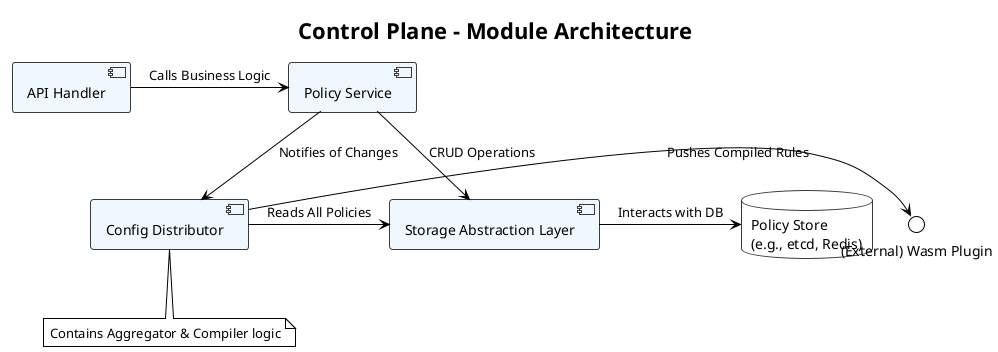
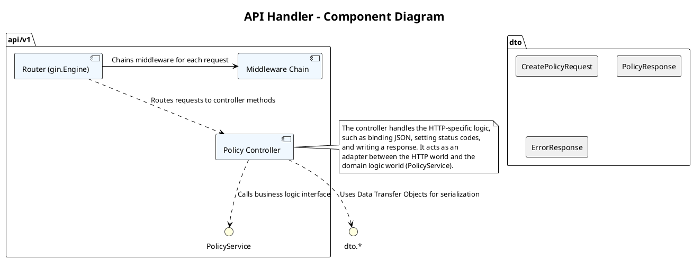
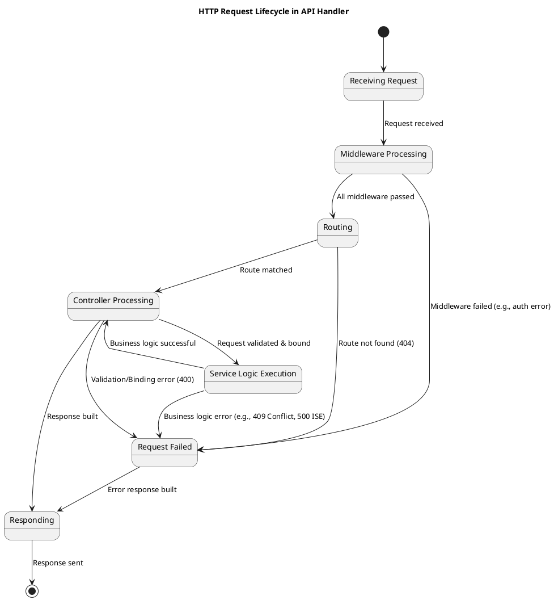
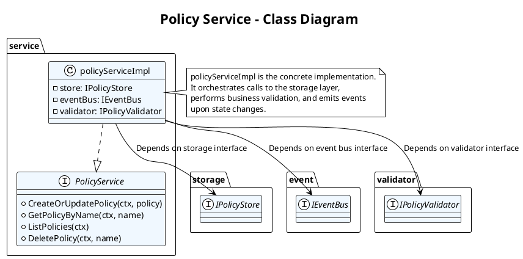
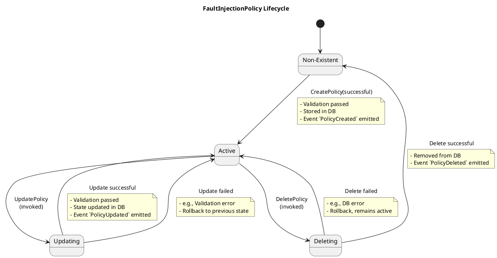
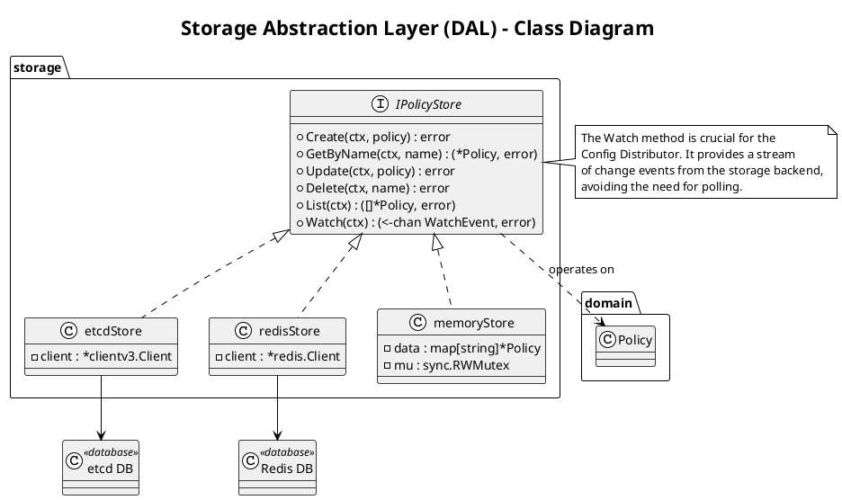
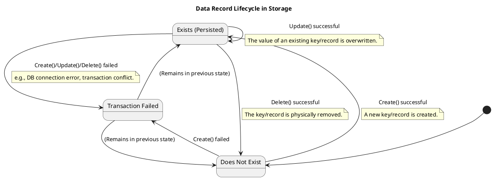
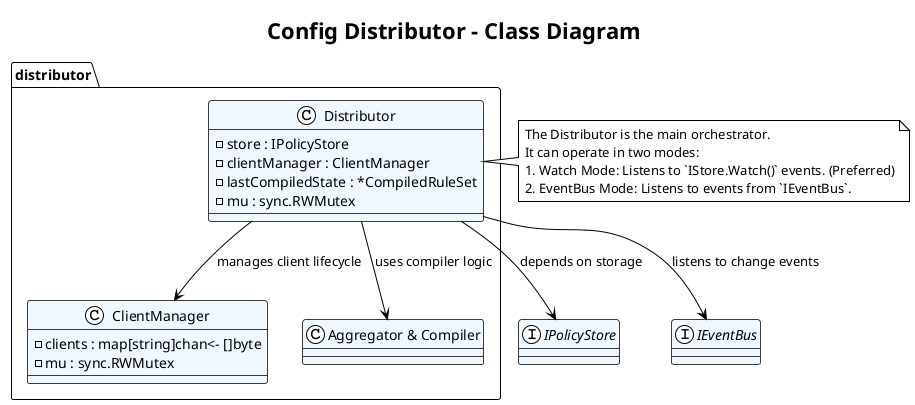
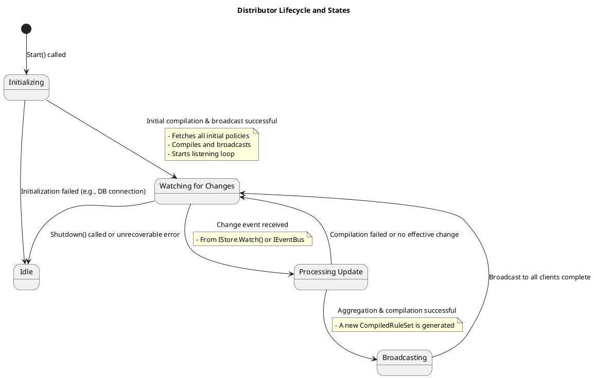

# Control Plane (控制平面) - 详细模块设计

控制平面是系统的核心管理中心。



[返回Design.md](./Design.md)

## 模块  API Handler (HTTP/gRPC)

* 职责: 作为系统的入口，负责解析外部请求，进行基础验证，并调用业务逻辑层。
* 子模块:
  * Router: 使用 `gin` 或 `gorilla/mux` 定义路由规则（如 `/v1/policies/{name}`）。
  * Request/Response Models: 定义用于 API 交互的 Go 结构体，并处理 JSON 的序列化/反序列化。
  * Input Validation: 验证请求体是否符合 `FaultInjectionPolicy` 的 schema（如必需字段、数据类型等）。
  * Middleware: 实现通用功能，如日志记录、请求追踪 (Tracing)、认证/授权 (Authentication/Authorization)。
* 输入: HTTP/gRPC 请求。
* 输出: HTTP/gRPC 响应。

详细设计文档：API Handler 模块 (v1.0)

### 模块  API Handler (HTTP/gRPC) 概述 (Overview)

API Handler 是控制平面的入口网关，是整个系统对外提供服务的门户。它的核心职责是接收、解析、验证来自外部客户端（如 CLI、自动化工具）的请求，并将其委派给业务逻辑层 (`Policy Service`) 进行处理。本模块的设计目标是健壮、安全、易于使用且可观测。

本设计将优先关注 RESTful (HTTP) 接口，gRPC 接口可作为后续扩展。

### 类图 (Class/Component Diagram)

此图展示了 API Handler 模块内部的主要组件及其协作关系。



主要领域对象/组件说明:

* Router (`gin.Engine`): 使用 `gin` 框架，负责将 URL 路径和 HTTP 方法映射到具体的处理函数（Controller 方法）。
* Middleware Chain: 一系列在请求到达 Controller 之前或响应返回客户端之后执行的函数。例如：`Logger`, `Tracer`, `Authenticator`, `Recover`。
* Policy Controller: 包含一组处理 `FaultInjectionPolicy` 相关 HTTP 请求的方法（如 `CreatePolicy`, `GetPolicy`）。它负责解析 HTTP 请求，调用 `PolicyService`，并构建 HTTP 响应。
* PolicyService (Interface): 业务逻辑层的接口。Controller 依赖此接口，而不是具体实现，以实现解耦。
* DTO (Data Transfer Objects): 用于在 API 边界进行数据传输的结构体，与核心领域模型解耦。
  * `CreatePolicyRequest`: 对应 `POST` 请求的 body。
  * `PolicyResponse`: 用于 `GET` 请求的响应。
  * `ErrorResponse`: 标准化的错误响应格式。

### 状态转换图 (State Transition Diagram)

对于一个 HTTP 请求的处理生命周期，我们可以用状态转换图来描述其流转过程。



状态说明:

1. Receiving Request: 服务器接收到 TCP 连接和 HTTP 请求。
2. Middleware Processing: 请求依次通过日志、追踪、认证等中间件。任何一个中间件失败都可能直接中断流程并进入 `Failed` 状态。
3. Routing: `gin` 引擎根据 URL 和方法查找匹配的处理函数。
4. Controller Processing: Controller 方法被调用，它负责将请求体绑定到 Go 结构体并进行验证。
5. Service Logic Execution: Controller 调用业务逻辑层接口，等待其执行结果。
6. Request Failed: 任何步骤中发生的可预见或不可预见的错误，都会使请求进入此状态。
7. Responding: 构建最终的 HTTP 响应（成功或失败），并将其发送回客户端。

### 异常处理矩阵 (Error Handling Matrix)

一个健壮的 API 必须有清晰、一致的错误处理机制。我们将错误码进行分类，并定义标准的响应格式。

标准错误响应体 (`ErrorResponse`):

```json
{
  "error": {
    "code": "INVALID_ARGUMENT",
    "message": "The 'name' field in metadata is required.",
    "details": [
      {
        "field": "metadata.name",
        "description": "This field cannot be empty."
      }
    ]
  }
}
```

错误码分类与处理矩阵:

| HTTP Status Code              | Error Code (String)  | 触发条件                                                                               | 描述与示例                                                                   |
| :- | :- | :- | : |
| 400 Bad Request           | `INVALID_ARGUMENT`   | 请求体 JSON 格式错误、缺少必需字段、字段值类型或格式不正确。                           | `message: "Invalid 'priority' value, must be an integer."`                   |
| 401 Unauthorized          | `UNAUTHENTICATED`    | 请求缺少有效的认证凭据（如 Token）。                                                   | `message: "Authentication token is missing or invalid."`                     |
| 403 Forbidden             | `PERMISSION_DENIED`  | 用户已认证，但无权执行此操作（如普通用户尝试删除策略）。                               | `message: "User 'alice' does not have permission to delete policies."`       |
| 404 Not Found             | `NOT_FOUND`          | 1. 请求的 URL 路径不存在。<br>2. 请求的资源不存在（如 `GET /policies/non-existent`）。 | `message: "Policy 'non-existent' not found."`                                |
| 409 Conflict              | `ALREADY_EXISTS`     | 尝试创建的资源已存在（如 `POST` 一个同名的 `FaultInjectionPolicy`）。                  | `message: "A policy with the name 'my-policy' already exists."`              |
| 429 Too Many Requests     | `RESOURCE_EXHAUSTED` | 客户端在单位时间内请求次数超过了速率限制。                                             | `message: "Request rate limit exceeded. Please try again later."`            |
| 500 Internal Server Error | `INTERNAL`           | 控制平面内部发生未知或不可恢复的错误，如数据库连接失败、空指针异常等。                 | `message: "An internal server error occurred. Please contact support."`      |
| 503 Service Unavailable   | `UNAVAILABLE`        | 控制平面暂时无法处理请求，如正在进行维护或依赖的服务（如 etcd）不可用。                | `message: "The service is temporarily unavailable. Please try again later."` |

实现策略:

* 在 `Policy Service` 和 `Storage` 层，错误应该被包装成带有明确错误类型的自定义 `error`。例如 `ErrNotFound`, `ErrAlreadyExists`。
* 在 `Controller` 层，捕获从 `Service` 层返回的错误，并根据其类型映射到上述矩阵中定义的 HTTP 状态码和 `ErrorResponse`。
* 使用一个全局的 `Recover` 中间件来捕获任何未处理的 `panic`，并将其作为 `500 INTERNAL` 错误进行响应，防止程序崩溃。

## 模块  Policy Service (业务逻辑层)

* 职责: 实现所有关于 `FaultInjectionPolicy` 的核心业务逻辑，不关心底层存储和外部通信。
* 接口/方法:
  * `CreateOrUpdatePolicy(ctx context.Context, policy *v1alpha1.FaultInjectionPolicy) error`
  * `GetPolicyByName(ctx context.Context, name string) (*v1alpha1.FaultInjectionPolicy, error)`
  * `ListPolicies(ctx context.Context) ([]*v1alpha1.FaultInjectionPolicy, error)`
  * `DeletePolicy(ctx context.Context, name string) error`
* 核心逻辑:
  * 在执行创建/更新/删除操作后，通过一个事件总线 (Event Bus) 或简单的 channel 通知 `Config Distributor` 模块策略已发生变更。
* 输入: 来自 API Handler 的经过验证的请求数据。
* 输出: 业务处理结果或错误。

### Policy Service 模块概述 (Overview)

Policy Service 是控制平面的核心业务逻辑层。它封装了所有关于 `FaultInjectionPolicy` 资源的操作和规则，是连接上层 API Handler 和底层数据存储的桥梁。本模块的设计目标是领域纯粹性、可测试性和可扩展性。它不应该包含任何 HTTP 或数据库特定的代码，只关注核心业务逻辑。

### 类图 (Class/Component Diagram)

此图展示了 Policy Service 模块及其依赖关系。



主要领域对象/组件说明:

* PolicyService (Interface): 定义了本模块向外暴露的契约。上层的 API Handler 将依赖这个接口。
* policyServiceImpl (Concrete Implementation): `PolicyService` 接口的具体实现。这是所有业务逻辑的所在地。
* IPolicyStore (Interface): 数据访问层的接口。`policyServiceImpl` 通过此接口与底层数据库交互，实现了对具体存储技术的解耦。
* IEventBus (Interface): 事件总线的接口。`policyServiceImpl` 在成功修改策略后，通过此接口发布一个事件（如 `PolicyUpdatedEvent`），以通知其他模块（如 `Config Distributor`）发生了变更。
* IPolicyValidator (Interface): 策略验证器的接口。负责执行比 API Handler 层更复杂的业务规则验证（例如，检查规则之间的逻辑冲突）。

### 状态转换图 (State Transition Diagram)

此图描述了一个 `FaultInjectionPolicy` 资源在其生命周期中的状态变迁。



状态说明:

1. Non-Existent: 策略在系统中不存在。
2. Active: 策略已成功创建并存储，是当前生效的状态。
3. Updating: 系统正在处理一个针对此策略的更新请求。这是一个瞬时状态。如果更新成功，策略回到 `Active` 状态（内容已更新）；如果失败，则回滚并回到 `Active` 状态（内容未变）。
4. Deleting: 系统正在处理一个删除此策略的请求。这是一个瞬时状态。如果成功，策略进入 `Non-Existent` 状态；如果失败，则回到 `Active` 状态。

### 异常处理矩阵 (Error Handling Matrix)

Policy Service 模块不直接处理 HTTP 状态码，而是通过返回领域特定的、可被识别的错误类型来向上层传递失败信息。API Handler 层将负责将这些领域错误翻译成 HTTP 错误。

自定义错误类型 (Custom Error Types in Go):

```go
// errors/errors.go
var (
    ErrNotFound      = errors.New("resource not found")
    ErrAlreadyExists = errors.New("resource already exists")
    ErrInvalidInput  = errors.New("invalid input")
    // ...
)
```

错误分类与处理矩阵:

| 业务方法                 | 触发条件                                   | 返回的错误类型     | 上层 API Handler 应转换的 HTTP 状态码 | 描述                                                                               |
| :-- | :-- | :-- | : | : |
| CreateOrUpdatePolicy | 尝试创建的策略名称已存在。                 | `ErrAlreadyExists` | `409 Conflict`                        | 在创建模式下，如果 `store.GetByName()` 成功找到了同名策略，则返回此错误。          |
|                          | 策略内容不符合业务规则（如规则逻辑冲突）。 | `ErrInvalidInput`  | `400 Bad Request`                     | `IPolicyValidator` 验证失败。错误信息中应包含详细的验证失败原因。                  |
|                          | 底层存储操作失败。                         | (Wrapped DB Error) | `500 Internal Server Error`           | 对 `store.Create()` 或 `store.Update()` 的调用返回了错误。                         |
| GetPolicyByName      | 指定名称的策略不存在。                     | `ErrNotFound`      | `404 Not Found`                       | 对 `store.GetByName()` 的调用返回了 "not found" 类型的错误。                       |
|                          | 底层存储操作失败。                         | (Wrapped DB Error) | `500 Internal Server Error`           | 对 `store.GetByName()` 的调用返回了其他类型的错误。                                |
| ListPolicies         | 底层存储操作失败。                         | (Wrapped DB Error) | `500 Internal Server Error`           | 对 `store.List()` 的调用返回了错误。                                               |
| DeletePolicy         | 尝试删除的策略不存在。                     | `ErrNotFound`      | `404 Not Found`                       | 在删除前，`store.GetByName()` 检查发现策略不存在，可以提前返回此错误以保证幂等性。 |
|                          | 底层存储操作失败。                         | (Wrapped DB Error) | `500 Internal Server Error`           | 对 `store.Delete()` 的调用返回了错误。                                             |

实现策略:

* 在 `policyServiceImpl` 的每个方法中，使用 `defer/recover` 并不是首选。应通过明确的 `if err != nil` 来检查和处理从依赖项（`IStore`, `IValidator`）返回的错误。
* 使用 Go 1.13+ 的错误包装特性 (`fmt.Errorf("...: %w", err)`) 来保留原始的错误上下文，这有助于调试。
* 上游的 API Handler 可以使用 `errors.Is(err, service.ErrNotFound)` 来判断错误的具体类型，并做出相应的 HTTP 响应。
* 所有未被明确分类的、来自依赖项的未知错误，都应被视为内部错误，并由上层统一处理为 `500 Internal Server Error`。

## 模块  Storage Abstraction Layer (DAL - 数据访问层)

* 职责: 封装所有与后端存储的交互细节，为 `Policy Service` 提供一个统一、简洁的数据访问接口。
* 接口 (`Store` interface):
  * 定义与 `Policy Service` 中方法对应的 CRUD 接口。
* 实现:
  * `etcdStore.go`: 使用 `etcd/clientv3` 实现 `Store` 接口。
  * `redisStore.go`: 使用 `go-redis` 实现 `Store` 接口。
  * `memoryStore.go`: 使用 `map` 和 `sync.RWMutex` 实现，用于测试和本地开发。
* 输入: 来自 `Policy Service` 的数据操作请求。
* 输出: 从数据库中读取的数据或操作结果。

### Storage Abstraction Layer (DAL) 模块概述 (Overview)

Storage Abstraction Layer (DAL) 是控制平面的数据持久化层。它的核心职责是封装所有与后端物理存储（如 etcd, Redis, PostgreSQL, 或内存）的交互细节，并向上层的 `Policy Service` 提供一个统一、简洁、与具体技术无关的数据访问接口。本模块的设计目标是可替换性、一致性和数据完整性。

### 类图 (Class/Component Diagram)

此图展示了 DAL 的核心接口和其多种可能的实现。



主要领域对象/组件说明:

* IPolicyStore (Interface): 定义了 DAL 向外暴露的统一契约。`Policy Service` 和 `Config Distributor` 将依赖此接口。
* Policy (Domain Object): 核心的领域对象 `FaultInjectionPolicy`。DAL 负责此对象的持久化和检索。
* etcdStore: `IPolicyStore` 接口的 etcd 实现。它使用 etcd 的 KV API 进行数据存取，并使用 `Watch` API 来实现 `Watch` 方法。
* redisStore: `IPolicyStore` 接口的 Redis 实现。策略可以作为 JSON 字符串存储在 Redis 的 Key 中。`Watch` 方法可以通过 Redis 的 Pub/Sub 机制实现。
* memoryStore: `IPolicyStore` 接口的内存实现。用于单元测试和本地开发，不提供真正的持久化。`Watch` 方法可以通过 Go channels 实现。
* WatchEvent: 一个表示存储层变更的事件结构体。

    ```go
    type EventType string
    const (
        EventTypePut    EventType = "PUT"
        EventTypeDelete EventType = "DELETE"
    )

    type WatchEvent struct {
        Type   EventType
        Policy *Policy // On PUT, this is the new policy. On DELETE, this might be the old one or nil.
    }
    ```

### 状态转换图 (State Transition Diagram)

DAL 本身是无状态的；它的职责是改变和查询数据记录的状态。因此，状态转换图更适合描述一个数据记录在数据库中的生命周期，这与 `Policy Service` 的生命周期图非常相似，但视角更偏向于物理存储。



状态说明:

1. Does Not Exist: 数据库中不存在对应 `policy.metadata.name` 的记录。
2. Exists (Persisted): 数据库中存在该记录。
3. Transaction Failed (Transient): 任何数据库操作（创建、更新、删除）在执行过程中失败。操作将被回滚，数据记录的状态将恢复到操作之前的状态。

### 异常处理矩阵 (Error Handling Matrix)

DAL 层的错误处理至关重要，它需要将底层数据库驱动返回的、技术性强的错误，翻译成上层业务逻辑可以理解的、统一的领域错误。

DAL 层应返回的自定义错误类型:

* `storage.ErrNotFound`: 当尝试获取或删除一个不存在的记录时返回。
* `storage.ErrConflict` 或 `storage.ErrVersionMismatch`: 当更新操作因并发冲突（如乐观锁版本不匹配）而失败时返回。
* `storage.ErrAlreadyExists`: 当尝试创建一个已存在的记录时返回 (如果 `Create` 方法有此语义约束)。
* `storage.ErrInternal`: 包装所有其他无法分类的、预料之外的数据库错误（如连接错误、权限问题等）。

错误翻译与处理矩阵 (以 `etcdStore` 为例):

| `etcd/clientv3` 返回的错误/情况       | `etcdStore` 方法            | 翻译成的 DAL 错误类型 (`storage.Err...`) | 上层 (`Policy Service`) 的处理方式                |
| : | :-- | : | : |
| `client.Get` 响应的 `Count == 0`      | `GetByName`                 | `ErrNotFound`                            | 返回 `404 Not Found` 给客户端。                   |
| `client.Txn` 中 `CreateRevision == 0` | `Create` (with `If` clause) | `ErrAlreadyExists`                       | 返回 `409 Conflict` 给客户端。                    |
| `client.Txn` 中 `ModRevision` 不匹配  | `Update` (with `If` clause) | `ErrConflict`                            | 可选择重试或返回 `409 Conflict`。                 |
| gRPC 错误 `codes.Unavailable`         | Any method                  | `ErrInternal` (wrapped)                  | 返回 `503 Service Unavailable`。                  |
| gRPC 错误 `codes.PermissionDenied`    | Any method                  | `ErrInternal` (wrapped)                  | 返回 `500 Internal Server Error` 并记录严重日志。 |
| context deadline exceeded             | Any method                  | `context.DeadlineExceeded` (passthrough) | 返回 `504 Gateway Timeout` 或 `500`。             |
| 其他所有未知 gRPC 或 client 错误      | Any method                  | `ErrInternal` (wrapped)                  | 返回 `500 Internal Server Error` 并告警。         |

实现策略:

* 每个 `Store` 的实现（如 `etcdStore.go`）都必须包含一个错误转换函数 `translateError(err error)`。
* 这个函数使用 `switch` 或 `errors.Is`/`As` 来检查底层驱动返回的错误类型，并返回相应的 `storage.Err...`。
* 例如，在 `etcdStore.GetByName` 中：

    ```go
    resp, err := s.client.Get(ctx, key)
    if err != nil {
        return nil, translateError(err) // Translate gRPC errors
    }
    if resp.Count == 0 {
        return nil, storage.ErrNotFound // Specific domain error
    }
    // ... deserialize and return policy
    ```

* `Policy Service` 层只处理 `storage.Err...` 类型的错误，完全不知道底层是 etcd 还是 Redis，从而实现了真正的解耦。

## 模块  Config Distributor (配置分发器)

* 职责: 监听策略变更，聚合、编译最新的规则集，并将其主动推送给所有连接的 Wasm 插件。
* 子模块:
  * Change Notifier: 订阅 `Policy Service` 发出的变更事件。
  * Aggregator/Compiler: 当收到通知时，调用 `DAL` 获取所有策略，并将其编译成 `CompiledRuleSet`。
  * SSE/gRPC Stream Manager:
    * 维护一个并发安全的客户端连接池。
    * 处理新客户端的连接请求 (`/v1/config/stream`)，并立即发送一份最新的规则集。
    * 当 Aggregator 生成新的规则集时，遍历连接池，将新规则推送给所有客户端。
    * 处理客户端的断开连接。
* 输入: 策略变更通知。
* 输出: 通过 SSE/gRPC Stream 发送的 `CompiledRuleSet` JSON。

### 详细设计文档：Config Distributor 模块 (v1.0)

### 概述 (Overview)

Config Distributor 是控制平面的主动推送引擎。它的核心职责是监听系统内 `FaultInjectionPolicy` 的任何状态变更，然后聚合、编译所有当前生效的策略，最终将一个统一、优化过的规则集分发给所有连接的数据平面客户端（Wasm 插件）。本模块的设计目标是高效、实时、可靠且可扩展，确保数据平面能以最小的延迟获取最新的配置。

### 类图 (Class/Component Diagram)

此图展示了 Config Distributor 内部的组件及其交互。



主要领域对象/组件说明:

* Distributor: 模块的主协调器。它负责启动监听，触发编译，并调用 `ClientManager` 来分发配置。
* ClientManager: 负责管理所有已连接的 Wasm 插件客户端。这是一个并发安全的组件。
  * `clients`: 一个 map，其中 key 是客户端的唯一标识（如 UUID），value 是一个用于向该客户端发送数据的 channel。
  * `AddClient(id string, ch chan<- []byte)`: 注册一个新客户端。
  * `RemoveClient(id string)`: 移除一个断开的客户端。
  * `Broadcast(data []byte)`: 遍历所有客户端 channel，并向它们发送最新的配置数据。
* Aggregator & Compiler: 一个逻辑组件（可以是一个独立的函数或结构体），负责：
  * 从 `IPolicyStore` 获取所有策略。
  * 将所有策略中的规则提取出来，并根据 `priority` 进行全局排序。
  * 将排序后的规则列表编译成一个对 Wasm 插件友好的、轻量的 `CompiledRuleSet` 结构。
* CompiledRuleSet: 最终分发给 Wasm 插件的数据结构。

    ```go
    type CompiledRuleSet struct {
        Version string         `json:"version"` // A hash or timestamp to identify the version
        Rules   []CompiledRule `json:"rules"`   // A flat, sorted list of rules
    }
    ```

### 状态转换图 (State Transition Diagram)

此图描述了 Distributor 模块自身的生命周期和工作状态。



状态说明:

1. Idle: Distributor 处于非活动状态。
2. Initializing: 模块启动时进入此状态。它会执行一次初始的配置加载和分发。
3. Watching for Changes: 模块的正常工作状态。它在后台持续监听来自存储层或事件总线的变更通知。
4. Processing Update: 当收到变更通知时，进入此瞬时状态。它会调用 Aggregator & Compiler 来生成新的规则集。
5. Broadcasting: 当新的规则集生成后，进入此瞬时状态。它会调用 `ClientManager` 将新配置推送给所有客户端。

### 异常处理矩阵 (Error Handling Matrix)

Config Distributor 是一个后台服务，其错误主要影响系统的配置同步，通常不直接返回给用户。因此，错误处理的核心是日志记录、告警和自动恢复。

| 模块/操作                | 潜在异常/错误                               | 严重性            | 处理策略                                                                                                                                            | 对系统的影响                                             |
| :-- | : | :- | :-- | :- |
| Initializing         | 无法连接到存储 (etcd/Redis)。               | 高 (Critical) | 1. 记录致命错误 (Fatal Log)。<br>2. 不启动 Distributor，使控制平面启动失败或进入降级模式。<br>3. 触发告警。                             | 控制平面无法向任何插件分发配置，新插件将无法获取规则。   |
|                          | 初始策略加载失败。                          | 高 (Critical) | 同上。                                                                                                                                              | 同上。                                                   |
| Watching for Changes | 与存储的 `Watch` 连接中断。                 | 中 (Error)    | 1. 记录错误日志。<br>2. 启动指数退避重试 (Exponential Backoff Retry) 机制，尝试重新建立 `Watch` 连接。<br>3. 触发告警。                 | 在连接恢复前，系统无法感知新的策略变更，配置会变得陈旧。 |
| Processing Update    | 从存储读取所有策略失败。                    | 高 (Critical) | 1. 记录错误日志。<br>2. 放弃本次更新，保持上一次成功的 `CompiledRuleSet` 不变。<br>3. 触发告警。                                        | 本次策略变更无法生效，但系统仍使用旧的、有效的配置运行。 |
|                          | 编译过程发生 `panic`。                      | 高 (Critical) | 1. 使用 `recover` 捕获 panic，防止进程崩溃。<br>2. 记录详细的堆栈信息和错误日志。<br>3. 触发严重告警。                                  | 本次更新失败，但服务得以幸存。                           |
| Broadcasting         | 向某个客户端的 channel 发送数据阻塞或失败。 | 低 (Warning)  | 1. 设置发送超时。<br>2. 如果超时或失败，假定该客户端已死或网络不佳。<br>3. 从 `ClientManager` 中移除该客户端。<br>4. 记录警告日志。 | 该特定客户端将无法接收新配置，但不会影响其他正常客户端。 |
|                          | `ClientManager` 广播时发生 `panic`。        | 高 (Critical) | 同上，使用 `recover` 捕获。                                                                                                                         | 广播过程可能中断，部分客户端可能未收到更新。             |

核心健壮性设计:

* 幂等性: Distributor 推送的始终是全量的 `CompiledRuleSet`，而不是增量变更。这使得客户端的处理逻辑非常简单，即使错过了一次更新，下一次更新也能使其恢复到最新状态。
* 版本号/哈希: `CompiledRuleSet` 中的 `version` 字段让客户端可以轻松判断收到的配置是否是新的，避免不必要的重载。
* 自动恢复: 对与后端服务的连接中断（如 etcd watch）必须有自动重连机制，确保系统在短暂网络抖动后能自行恢复。