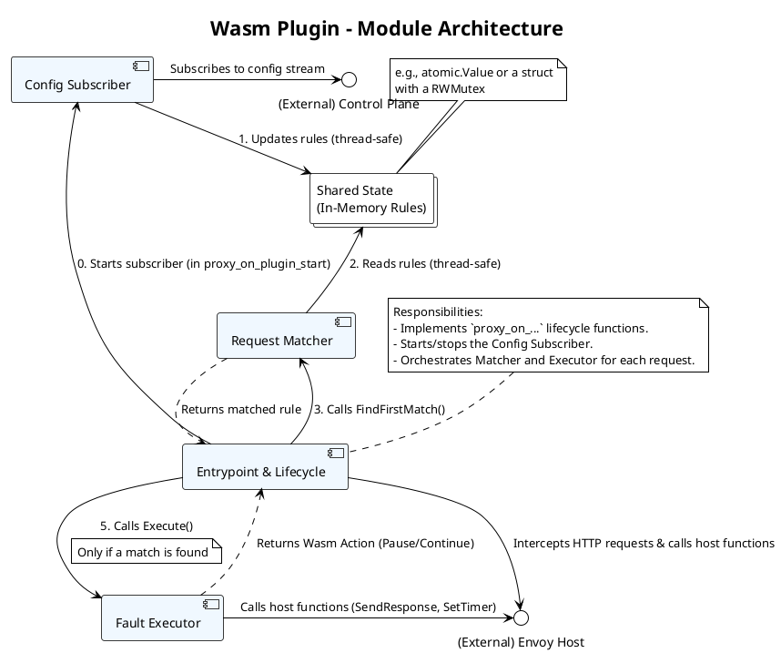
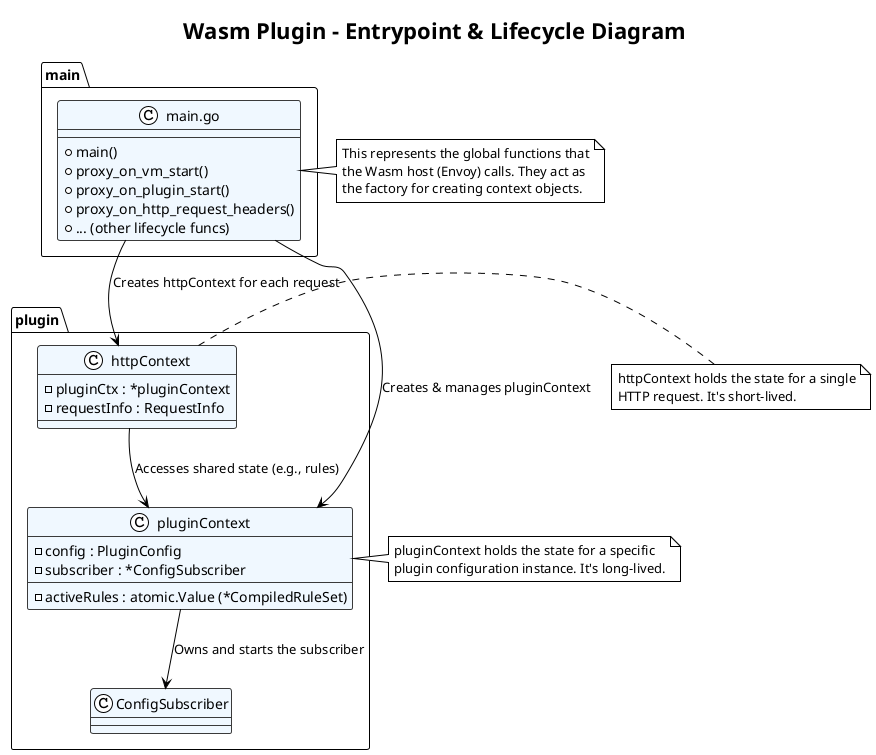
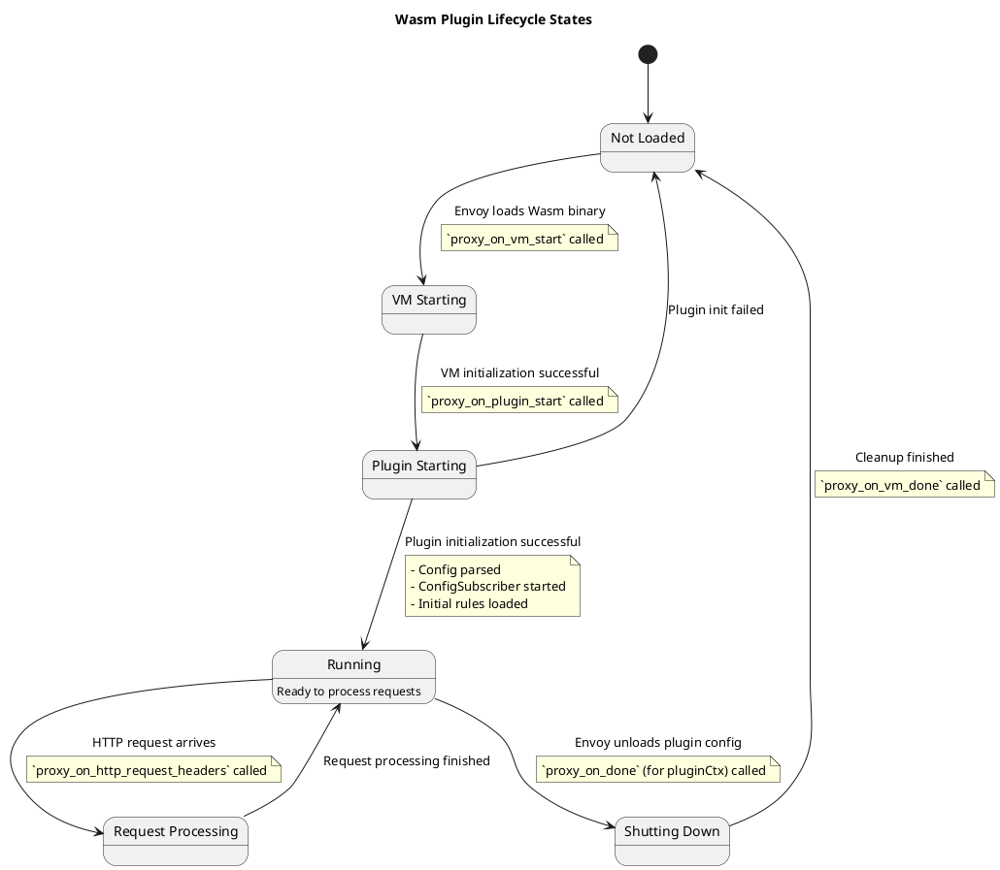
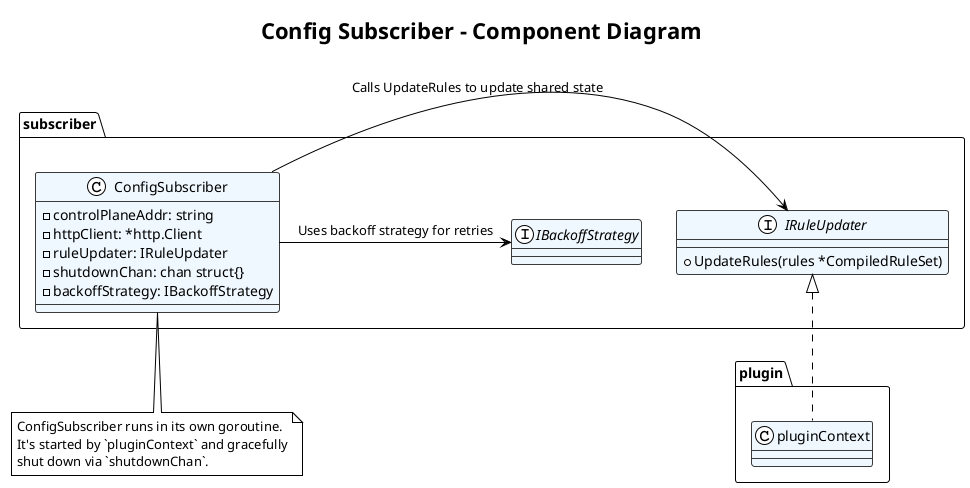
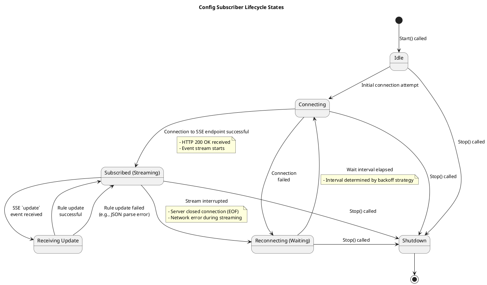
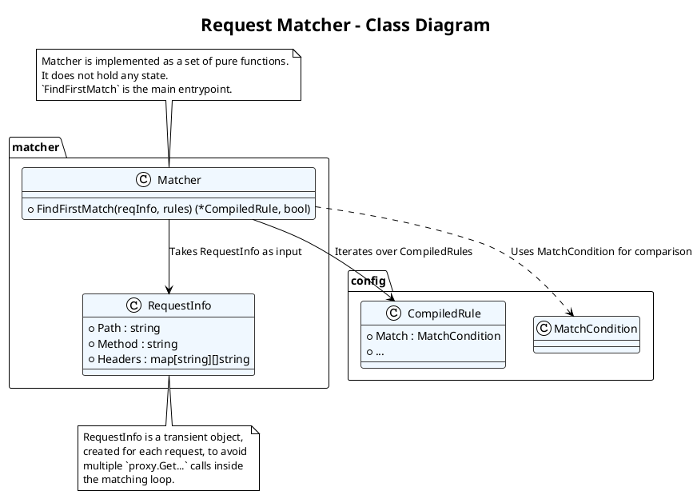
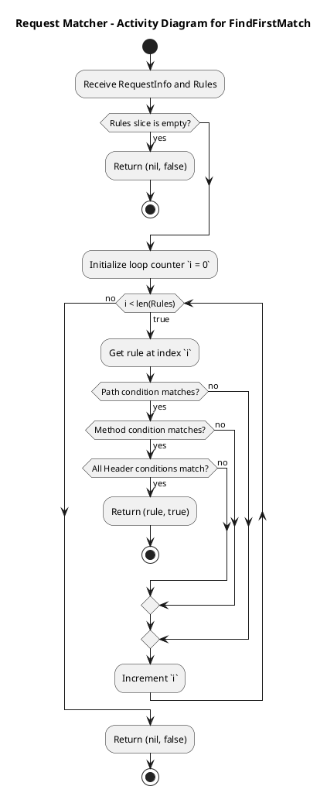
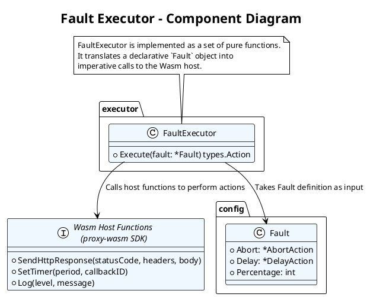
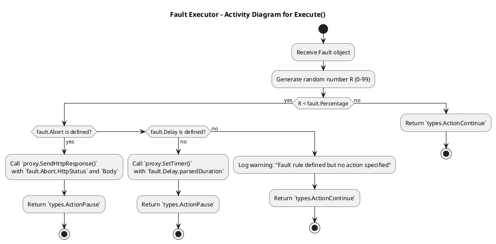

# Wasm Plugin (数据平面插件) - 详细模块设计



[返回Design.md](./Design.md)

## 模块  Plugin Entrypoint & Lifecycle (`main.go`, `plugin.go`)

* 职责: 插件的入口和生命周期管理。
* 函数:
  * `main()`: Go Wasm 的入口，通常为空。
  * `proxy_on_vm_start`: VM 级别的初始化，可以解析插件的全局配置。
  * `proxy_on_plugin_start`: 插件实例级别的初始化。关键：在此处启动 `Config Subscriber` 的后台 goroutine。
  * `proxy_on_http_request_headers`: 每个 HTTP 请求的处理入口。

详细设计文档：Wasm Plugin - Entrypoint & Lifecycle 模块 (v1.0)

### 概述 (Overview)

Plugin Entrypoint & Lifecycle 模块是 Wasm 插件的启动器和总控制器。它的核心职责是实现 `proxy-wasm` ABI (Application Binary Interface) 定义的生命周期回调函数，负责初始化插件的运行环境，启动后台任务（如配置订阅），并在每个 HTTP 请求的生命周期中，将请求分派给相应的处理模块（Matcher, Executor）。本模块的设计目标是结构清晰、生命周期管理可靠、与 `proxy-wasm` SDK 深度集成。

### 类图 (Class/Component Diagram)

此图展示了插件入口和生命周期管理相关的核心结构体及其关系。



主要领域对象/组件说明:

* `main.go`: 包含所有全局的 `proxy_...` 函数。这些函数是 Wasm 宿主（Envoy）与插件代码交互的入口点。它们是无状态的，主要职责是创建和返回相应的上下文对象。
* `pluginContext`:
  * 职责: 管理插件实例级别的状态和生命周期。当 Envoy 加载一个插件配置时，会创建一个 `pluginContext`。它在插件的整个生命周期中都存在。
  * 包含:
    * `PluginConfig`: 从 Envoy 配置中解析出的插件配置（如 Control Plane 地址）。
    * `ConfigSubscriber`: 指向后台配置订阅器的指针，由 `pluginContext` 创建和管理。
    * `activeRules`: 一个并发安全的容器（如 `atomic.Value` 或带读写锁的结构体），存储从 `ConfigSubscriber` 接收到的最新规则集。
* `httpContext`:
  * 职责: 管理单个 HTTP 请求级别的状态。每当一个新的 HTTP 请求被插件拦截时，就会创建一个 `httpContext`。请求结束后，它被销毁。
  * 包含:
    * `pluginCtx`: 指向其所属的 `pluginContext`，以便访问共享的配置和规则。
    * `requestInfo`: 在处理过程中收集的当前请求的信息（Path, Method, Headers 等）。

### 状态转换图 (State Transition Diagram)

此图描述了 Wasm 插件从加载到卸载的完整生命周期状态。



状态说明:

1. Not Loaded: Wasm 插件二进制文件尚未被 Envoy 加载。
2. VM Starting: Envoy 正在初始化 Wasm 虚拟机。`proxy_on_vm_start` 在此阶段被调用，适合执行一次性的全局初始化。
3. Plugin Starting: 插件的一个具体实例正在被创建。`proxy_on_plugin_start` 在此阶段被调用，负责解析配置、启动后台任务（如 `ConfigSubscriber`）。如果此阶段失败，插件将无法进入 `Running` 状态。
4. Running: 插件已成功初始化并处于活动状态，等待处理 HTTP 请求。
5. Request Processing: 这是一个瞬时、高频发生的状态。每当有请求被拦截，插件就进入此状态，处理完毕后返回 `Running` 状态。
6. Shutting Down: 当 Envoy 的配置发生变化，需要卸载此插件实例时，进入此状态。`proxy_on_done` 和 `proxy_on_vm_done` 会被调用，适合执行资源清理工作（如关闭 `ConfigSubscriber` 的连接）。

### 异常处理矩阵 (Error Handling Matrix)

插件的异常处理主要分为两类：初始化阶段的致命错误和请求处理阶段的可恢复错误。

| 发生阶段                        | 潜在异常/错误                                              | 严重性            | 处理策略                                                                                                                                                                                                                         | 对系统的影响                                                                                |
| : | : | :- | :- | : |
| `proxy_on_vm_start`         | 全局初始化失败（如无法分配关键资源）。                     | 高 (Critical) | 1. 记录致命错误日志 (`proxy.LogCritical`)。<br>2. 返回 `false`。                                                                                                                                                         | Envoy 将无法启动 Wasm VM，该插件将完全不可用。Envoy 的启动可能会失败。                      |
| `proxy_on_plugin_start`     | 插件配置（如 Control Plane 地址）解析失败。                | 高 (Critical) | 1. 记录致命错误日志。<br>2. 返回 `false`。                                                                                                                                                                               | 该插件实例将无法加载，无法处理任何请求。                                                    |
|                                 | 无法启动 `ConfigSubscriber`（如无法创建 goroutine）。      | 高 (Critical) | 同上。                                                                                                                                                                                                                           | 同上。                                                                                      |
|                                 | 首次从 Control Plane 同步配置失败。                        | 中 (Error)    | 1. 记录错误日志 (`proxy.LogError`)。<br>2. 可以有两种策略: <br>   a) 严格模式: 返回 `false`，插件加载失败。<br>   b) 宽松模式: 返回 `true`，插件加载成功但规则为空，所有请求都将放行。后台会继续重试。(推荐) | a) 影响启动。<br>b) 插件可用但无功能，直到配置同步成功。                                    |
| `proxy_on_http_request_...` | 内部逻辑发生 `panic`。                                     | 高 (Critical) | 1. 必须在每个 `proxy_...` 函数的入口使用 `defer/recover`。<br>2. 在 `recover` 中记录详细的堆栈信息 (`proxy.LogCritical`)。<br>3. 返回一个安全的值，如 `types.ActionContinue`，以避免影响请求流。                             | 捕获 panic 可防止整个 Envoy worker 线程崩溃。该次请求的故障注入会失败，但其他请求不受影响。 |
|                                 | 获取请求信息失败（如 `proxy.GetHttpRequestHeader` 出错）。 | 中 (Error)    | 1. 记录错误日志。<br>2. 终止本次匹配逻辑，直接返回 `types.ActionContinue`，将请求放行。                                                                                                                                  | 本次请求无法进行故障注入匹配，但不影响其正常处理。                                          |
| `proxy_on_done`             | 清理资源时（如关闭后台连接）失败。                         | 低 (Warning)  | 1. 记录警告日志 (`proxy.LogWarn`)。<br>2. 无需特殊处理，因为插件即将被销毁。                                                                                                                                                 | 可能导致资源（如 goroutine）泄漏，但影响范围仅限于插件卸载过程。                            |

核心健壮性设计:

* Panic Safety: 每个暴露给 Envoy 的 `proxy_...` 函数都必须是 panic-safe 的，这是插件稳定性的基石。
* Fail-Open 原则: 在请求处理期间遇到任何非致命错误时，默认行为应该是放行请求 (`ActionContinue`)，而不是中断它。这确保了插件的内部问题不会影响到核心业务流量。
* 清晰的日志: 在不同阶段使用不同级别的日志（`LogInfo`, `LogWarn`, `LogError`, `LogCritical`），有助于快速定位问题是出在初始化阶段还是请求处理阶段。

## 模块  Config Subscriber (`config_subscriber.go`)

* 职责: 负责与 Control Plane 保持长连接，并安全地更新本地规则缓存。
* 核心逻辑:
  * `connectAndSubscribe()`: 在一个无限循环中尝试连接 Control Plane 的流式 API。处理重连逻辑。
  * `processStream()`: 读取 SSE/gRPC 事件流，解析 `CompiledRuleSet`。
  * `updateRules(rules *CompiledRuleSet)`: 使用读写锁更新一个全局的 `atomic.Value` 或 `struct` 变量，该变量存储了当前生效的规则。
* 输入: 来自 Control Plane 的流式数据。
* 输出: 更新插件的内部状态（规则缓存）。

详细设计文档：Config Subscriber 模块 (v1.0)

### 概述 (Overview)

Config Subscriber 是一个在后台运行的、长生命周期的组件，其唯一职责是与 `Control Plane` 建立并维持一个稳定的长连接，实时接收最新的故障注入规则集，并将其安全地更新到插件的共享内存中。本模块的设计目标是高可用、自动恢复、线程安全和高效。

### 类图 (Class/Component Diagram)

此图展示了 Config Subscriber 及其内部结构和依赖。



主要领域对象/组件说明:

* ConfigSubscriber: 模块的核心结构体。
  * `controlPlaneAddr`: 控制平面的地址。
  * `httpClient`: 用于发起 HTTP 请求的客户端。
  * `ruleUpdater`: 一个接口，其具体实现是 `pluginContext`。`ConfigSubscriber` 通过这个接口来调用 `pluginContext` 的方法，更新共享的规则集，实现了与 `pluginContext` 的解耦。
  * `shutdownChan`: 一个 channel，用于从外部（`pluginContext`）优雅地通知该 goroutine 停止。
  * `backoffStrategy`: 一个接口，定义了重连的退避策略（如指数退避），用于在连接失败时避免频繁重试。
* IRuleUpdater (Interface): 定义了规则更新的契约。`pluginContext` 会实现这个接口。

    ```go
    type IRuleUpdater interface {
        UpdateRules(rules *CompiledRuleSet)
    }
    ```

* IBackoffStrategy (Interface): 定义了重试间隔的计算策略。

    ```go
    type IBackoffStrategy interface {
        NextInterval() time.Duration
        Reset()
    }
    ```

### 状态转换图 (State Transition Diagram)

此图描述了 Config Subscriber 的 goroutine 在其生命周期中的状态变迁。



状态说明:

1. Idle: goroutine 已启动但尚未开始连接。
2. Connecting: 正在尝试与 Control Plane 的流式 API建立 HTTP 连接。
3. Subscribed (Streaming): 已成功建立连接，正在监听和接收 SSE 事件。这是正常的工作状态。
4. Reconnecting (Waiting): 连接失败或中断后进入此状态。它会根据退避策略等待一段时间，然后转换到 `Connecting` 状态进行重试。
5. Receiving Update: 这是一个瞬时状态，当在 `Subscribed` 状态下接收到一条完整的 SSE 消息时进入，处理完毕后立即返回 `Subscribed`。
6. Shutdown: 当外部调用 `Stop()` 时，所有状态都会转换到此状态，goroutine 将清理资源并退出。

### 异常处理矩阵 (Error Handling Matrix)

Config Subscriber 是一个后台任务，其错误处理侧重于日志记录和自动恢复。

| 发生阶段                   | 潜在异常/错误                                      | 严重性            | 处理策略                                                                                                                                    | 对系统的影响                                                         |
| :- | :- | :- | : | :- |
| Connecting             | DNS 解析失败或无法建立 TCP 连接。                  | 中 (Error)    | 1. 记录错误日志。<br>2. 进入 `Reconnecting` 状态，使用退避策略等待后重试。<br>3. 首次失败时触发告警。                           | 插件无法获取配置，将使用空的或陈旧的规则。                           |
|                            | HTTP 响应码非 200 OK（如 404, 503）。              | 中 (Error)    | 同上。可能是 Control Plane 暂时不可用。                                                                                                     | 同上。                                                               |
| Subscribed (Streaming) | 从事件流中读取数据时发生网络错误或 EOF。           | 中 (Error)    | 1. 记录信息日志 (Info)，表明连接正常断开或被中断。<br>2. 进入 `Reconnecting` 状态，立即尝试重连（可以重置退避策略）。               | 短暂的配置同步中断，系统会快速自愈。                                 |
| Receiving Update       | 解析 SSE 消息失败（格式不符）。                    | 高 (Error)    | 1. 记录严重错误日志，包含原始消息内容。<br>2. 忽略这条损坏的消息，继续监听下一条。<br>3. 触发告警。                             | 本次配置更新丢失，可能导致插件与 Control Plane 状态不一致。          |
|                            | 解析 `data` 字段的 JSON (`CompiledRuleSet`) 失败。 | 高 (Error)    | 同上。                                                                                                                                      | 同上。                                                               |
| Rule Update            | 调用 `ruleUpdater.UpdateRules()` 时发生 `panic`。  | 高 (Critical) | 1. 在 `ConfigSubscriber` 的主循环中使用 `defer/recover`。<br>2. 记录致命错误和堆栈。<br>3. 进入 `Reconnecting` 状态，尝试重新开始。 | 插件内部状态可能已损坏。重新连接并获取全量配置是一种有效的恢复手段。 |

核心健壮性设计:

* 无限重试与指数退避: 必须实现一个健壮的重连循环，并使用指数退避（Exponential Backoff with Jitter）来避免在 Control Plane 故障时发起“重试风暴”。
* 优雅关闭 (Graceful Shutdown): `shutdownChan` 机制是必不可少的。当插件被卸载时，`pluginContext` 会关闭这个 channel，`ConfigSubscriber` 的主循环检测到关闭信号后，应立即清理 HTTP 连接并安全退出 goroutine，防止资源泄漏。
* 上下文感知 (Context-Aware): `httpClient` 的所有请求都应该使用一个可被 `shutdownChan` 取消的 `context.Context`，确保在关闭时能立即中断正在进行的 HTTP 请求。

## 模块  Request Matcher (`matcher.go`)

* 职责: 实现高效的请求匹配逻辑。这是性能热点路径。
* 函数:
  * `findFirstMatch(reqInfo RequestInfo, rules []CompiledRule) (*CompiledRule, bool)`:
    * `RequestInfo` 是一个包含了当前请求所有相关信息的结构体（如 Path, Method, Headers）。
    * 该函数按顺序遍历已排序的规则，对每个规则调用 `isMatch`。
    * 一旦找到匹配，立即返回该规则，不再继续。
* 核心逻辑 (`isMatch`):
  * 实现对 Path (prefix/exact/regex), Method, Headers 等条件的匹配。
  * 尽量避免在热路径中进行内存分配。
* 输入: 请求信息和当前规则集。
* 输出: 匹配到的规则（或 `nil`）。

详细设计文档：Request Matcher 模块 (v1.0)

### 概述 (Overview)

Request Matcher 是一个无状态、高性能的纯函数式组件。它的核心职责是接收当前 HTTP 请求的信息和一份已编译的规则集，然后高效地、按优先级顺序遍历规则，找出第一个完全匹配当前请求的规则。本模块的设计目标是极致的性能、低内存分配和逻辑的准确性。

### 类图 (Class/Component Diagram)

此图展示了 Matcher 模块的核心数据结构和函数。



主要领域对象/组件说明:

* Matcher: 模块的逻辑集合，可以是一个 `struct` 也可以是一组包级函数。核心是 `FindFirstMatch` 函数。
* RequestInfo: 一个临时的数据结构，用于在匹配开始前一次性地从 Envoy Host（通过 `proxy-wasm` SDK）收集所有需要的请求信息。这样做可以避免在遍历规则的循环中反复调用 `proxy.Get...` 函数，从而提高性能。
* CompiledRule: 从 Control Plane 接收到的、已编译和排序的单一规则。
* MatchCondition: `CompiledRule` 中的一部分，定义了所有匹配条件（如 Path, Method, Headers）。

    ```go
    // config/types.go
    type MatchCondition struct {
        Path   *PathMatcher   `json:"path,omitempty"`
        Method *StringMatcher `json:"method,omitempty"`
        Headers []HeaderMatcher `json:"headers,omitempty"`
    }

    type PathMatcher struct {
        Prefix string `json:"prefix,omitempty"`
        Exact  string `json:"exact,omitempty"`
        Regex  string `json:"regex,omitempty"`
        // Pre-compiled regex object
        compiledRegex *regexp.Regexp `json:"-"`
    }
    // ... other matcher structs
    ```

    关键优化: `PathMatcher` 中的 `compiledRegex` 字段。当从 Control Plane 接收到规则时，如果 `Regex` 字段不为空，就预先编译它，并将结果缓存到 `compiledRegex` 字段。这避免了在每个请求的热路径中重复编译正则表达式。

### 状态转换图 (State Transition Diagram)

由于 Request Matcher 是一个无状态的纯函数式组件，它没有自身的生命周期状态。它的行为可以用一个活动图 (Activity Diagram) 或流程图 (Flowchart) 来描述，展示其内部的决策逻辑。



流程说明:

1. 接收请求信息和排序好的规则列表。
2. 如果规则列表为空，直接返回未匹配。
3. 按顺序遍历规则列表（由于列表已按优先级排序，这保证了高优先级的规则先被检查）。
4. 对每个规则，按序检查其所有匹配条件（Path, Method, Headers）。
5. 所有条件都必须满足（AND 逻辑）。任何一个条件不满足，立即跳到下一条规则，这是一种短路优化。
6. 一旦找到第一条所有条件都满足的规则，立即返回该规则，并停止遍历。
7. 如果遍历完所有规则都未找到完全匹配的，则返回未匹配。

### 异常处理矩阵 (Error Handling Matrix)

Request Matcher 运行在请求处理的热路径上，其异常处理策略必须以性能和安全为最高优先级。它不应该产生可恢复的错误，任何异常都应被视为 bug。

| 发生阶段         | 潜在异常/错误                                      | 严重性            | 处理策略                                                                                                                                                                                             | 对系统的影响                                                                           |
| : | :- | :- | : | :- |
| 规则编译时   | 正则表达式 (`Regex`) 编译失败。                    | 高 (Error)    | 在 Control Plane 的 Compiler 模块或 Wasm 的 Config Subscriber 中处理。<br>1. 记录错误日志，指明哪个策略的哪个 Regex 无效。<br>2. 标记该规则为无效，并从生效的规则集中移除。<br>3. 触发告警。 | 无效的规则不会被加载到 Matcher 中，避免了在热路径上处理错误。保证了 Matcher 的纯粹性。 |
| 匹配执行时   | 发生 `panic`（如空指针引用）。                     | 高 (Critical) | 由上层的 `proxy_on_http_request_headers` 函数的 `defer/recover` 机制捕获。<br>1. 记录致命错误和详细堆栈。<br>2. Matcher 自身不处理，由调用方保证安全。                                           | 防止 Envoy worker 线程崩溃。本次请求的匹配和注入会失败，但系统整体稳定。               |
| 匹配逻辑错误 | 匹配结果不符合预期（如 `prefix` 写成了 `exact`）。 | 低 (Bug)      | 通过单元测试和集成测试来发现和修复。<br>需要为各种匹配条件编写详尽的测试用例。                                                                                                                   | 功能性错误，可能导致故障注入到错误的请求上，或无法注入到预期的请求上。                 |

核心性能和健壮性设计:

* 零分配 (Zero Allocation): 在 `FindFirstMatch` 的主循环中，应尽力避免任何内存分配。`RequestInfo` 在循环外创建，所有字符串比较应直接进行，避免创建临时子串。
* 短路评估 (Short-circuiting): 匹配条件的检查顺序应该是从最有可能失败的或计算成本最低的开始，例如先检查 Method，再检查 Path，最后检查 Headers。
* 预编译 (Pre-compilation): 所有正则表达式必须在配置加载时（`Config Subscriber` 接收到新配置后）进行预编译，绝不能在请求处理路径上编译。
* 详尽的单元测试: Matcher 的逻辑必须被 100% 的单元测试覆盖，包括各种边界情况、合法的和非法的输入，以确保其正确性。

## 模块  Fault Executor (`fault_executor.go`)

* 职责: 执行具体的故障注入动作。
* 函数:
  * `execute(fault *v1alpha1.Fault) (action types.Action)`:
    * Percentage Check: `if rand.Intn(100) < fault.Percentage`。
    * Abort Logic: 调用 `proxy.SendHttpResponse()`。
    * Delay Logic: 调用 `proxy.SetTimer()` 注册一个回调。
* 输入: 匹配到的规则中的 `Fault` 定义。
* 输出: `proxy-wasm` SDK 定义的动作（如 `ActionPause`, `ActionContinue`）。

详细设计文档：Fault Executor 模块 (v1.0)

### 概述 (Overview)

Fault Executor 是一个无状态、动作驱动的组件。它的核心职责是接收一个明确的故障定义 (`Fault` 对象)，并调用 `proxy-wasm` SDK 提供的相应函数来执行物理的故障注入动作，如中止请求或注入延迟。本模块的设计目标是执行准确、行为可预测、与 `proxy-wasm` ABI 紧密集成。

### 类图 (Class/Component Diagram)

此图展示了 Fault Executor 模块及其与 `proxy-wasm` SDK 的交互。



主要领域对象/组件说明:

* FaultExecutor: 模块的逻辑集合，核心是 `Execute` 函数。
* Fault (Config Object): 从 `CompiledRule` 中传入的故障定义。它是一个声明式的对象，描述了“要做什么”，而不是“如何做”。

    ```go
    // config/types.go
    type Fault struct {
        Abort      *AbortAction `json:"abort,omitempty"`
        Delay      *DelayAction `json:"delay,omitempty"`
        Percentage int          `json:"percentage"`
    }

    type AbortAction struct {
        HttpStatus int    `json:"httpStatus"`
        Body       string `json:"body,omitempty"`
    }

    type DelayAction struct {
        FixedDelay string `json:"fixedDelay"` // e.g., "2s", "100ms"
        // Parsed duration
        parsedDuration time.Duration `json:"-"`
    }
    ```

    关键优化: `DelayAction` 中的 `parsedDuration` 字段。与正则表达式类似，时间字符串（如 "2s"）应该在配置加载时预先解析为 `time.Duration` 类型并缓存，避免在热路径上进行字符串解析。
* Wasm Host Functions (SDK): `proxy-wasm` Go SDK 提供的函数，是插件与 Envoy 宿主环境交互的唯一途径。`FaultExecutor` 的主要工作就是调用这些函数。

### 状态转换图 (State Transition Diagram)

与 Matcher 类似，Fault Executor 是一个无状态的动作执行器。它的内部逻辑可以用一个活动图 (Activity Diagram) 来清晰地描述 `Execute` 函数的流程。



流程说明:

1. 接收 `Fault` 定义对象。
2. 执行概率检查: 首先检查是否应该执行故障。生成一个随机数，与 `Percentage` 字段比较。
3. 不执行故障: 如果随机数大于或等于 `Percentage`，则直接返回 `ActionContinue`，请求将被放行。
4. 执行故障:
    * 检查 Abort: 如果 `Abort` 动作被定义，调用 `proxy.SendHttpResponse()` 来立即中断请求并返回一个本地响应。然后返回 `ActionPause` 来终止后续处理。
    * 检查 Delay: 如果 `Delay` 动作被定义，调用 `proxy.SetTimer()` 来设置一个定时器。Wasm 宿主将在指定时间后调用插件的 `proxy_on_timer` 回调。`Execute` 函数本身返回 `ActionPause` 来暂停请求的处理。
    * 配置错误: 如果规则中定义了 `fault` 字段但既没有 `abort` 也没有 `delay`，这是一个配置错误。记录一条警告日志并安全地放行请求。

### 异常处理矩阵 (Error Handling Matrix)

Fault Executor 的异常主要与调用 Host Function 失败有关，或者是由无效的配置引起的。

| 发生阶段                   | 潜在异常/错误                                              | 严重性                    | 处理策略                                                                                                                                                                                                    | 对系统的影响                                                                  |
| :- | : | : | :- | :- |
| 规则编译时             | `DelayAction.FixedDelay` 字符串解析失败（如 "2seconds"）。 | 高 (Error)            | 在 Control Plane 的 Compiler 模块或 Wasm 的 Config Subscriber 中处理。<br>1. 记录错误日志，指明哪个策略的 `fixedDelay` 格式无效。<br>2. 标记该规则为无效，并从生效的规则集中移除。<br>3. 触发告警。 | 无效的规则不会被加载，避免了在热路径上处理解析错误。                          |
| 执行 Abort 时          | `proxy.SendHttpResponse()` 调用失败。                      | 中 (Error)            | 1. 记录错误日志 (`proxy.LogError`)。<br>2. 回退到安全行为: 返回 `types.ActionContinue`，放行请求。<br>3. 这种失败很少见，通常表示 Wasm Host 状态有问题。                                                | 预期的故障注入失败，请求被意外放行。系统保持稳定。                            |
| 执行 Delay 时          | `proxy.SetTimer()` 调用失败。                              | 中 (Error)            | 1. 记录错误日志。<br>2. 回退到安全行为: 返回 `types.ActionContinue`，放行请求。                                                                                                                         | 预期的延迟注入失败，请求被意外放行。系统保持稳定。                            |
| 配置逻辑错误           | `Fault` 对象为空，或 `Percentage` 无效（如 <0 或 >100）。  | 中 (Bug/Config Error) | 由前置的配置验证逻辑保证。<br>Control Plane 在接收策略时就应该校验这些值的合法性。如果仍然发生，Executor 应记录警告并安全放行。                                                                         | 功能性错误，不影响稳定性。                                                    |
| 执行过程中发生 `panic` | 空指针引用（如 `fault.Abort` 为 `nil` 时尝试访问其字段）。 | 高 (Critical)         | 由上层的 `proxy_on_http_request_headers` 函数的 `defer/recover` 机制捕获。<br>代码中应有防御性检查 `if fault.Abort != nil` 等，来防止这类 `panic` 的发生。                                              | 捕获 `panic` 可防止 Envoy worker 线程崩溃。本次故障注入失败，但系统整体稳定。 |

核心健壮性设计:

* 声明与执行分离: Executor 只负责执行一个已经被完全解析和验证过的 `Fault` 对象。所有解析（如时间字符串）和验证（如百分比范围）工作都应在前置的 `Config Subscriber` 或 `Control Plane` 中完成。
* Fail-Open 原则: 在任何执行 Host Function 失败的情况下，默认行为都是记录错误并放行请求 (`ActionContinue`)。这确保了插件的内部故障不会升级为业务流量的中断。
* 防御性编程: 在 `Execute` 函数内部，对传入的 `Fault` 对象及其字段进行 `nil` 检查，即使理论上它们不应该是 `nil`。这增加了代码的鲁棒性。
* 清晰的日志: 在执行故障时，可以记录一条 `Info` 或 `Debug` 级别的日志，说明“正在对请求 X 执行 Y 故障”，这对于调试和追踪非常有用。
