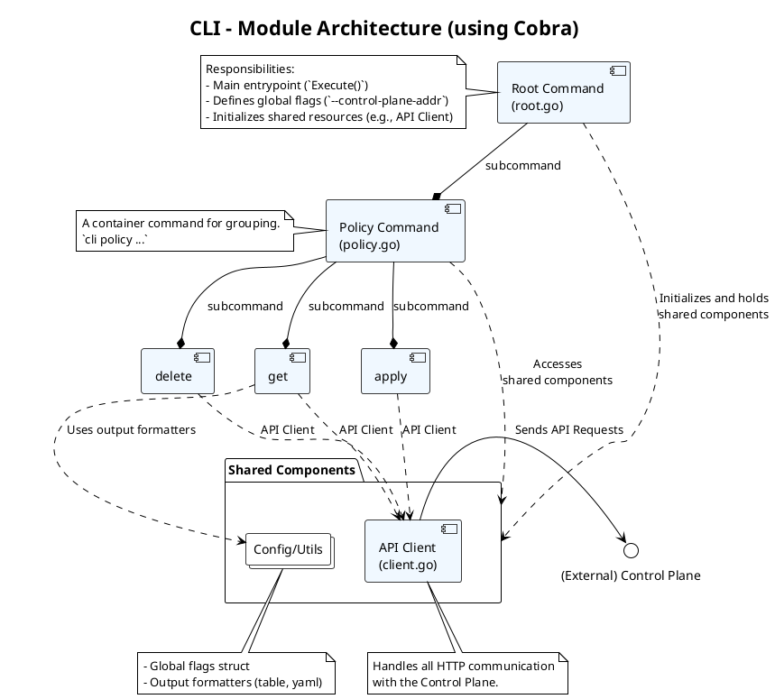
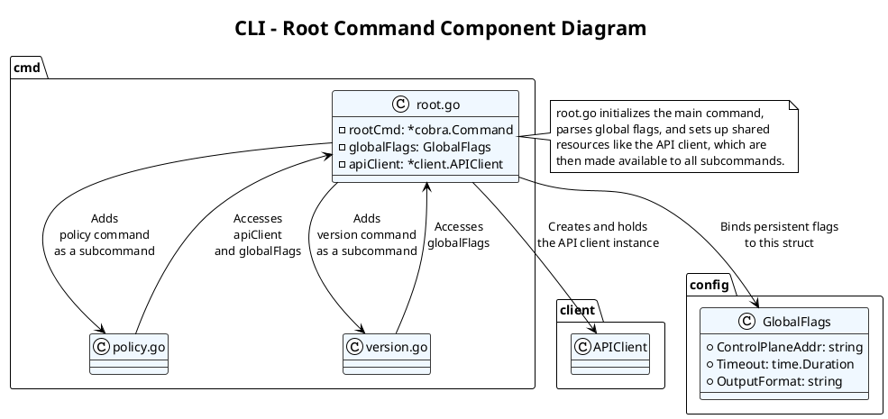
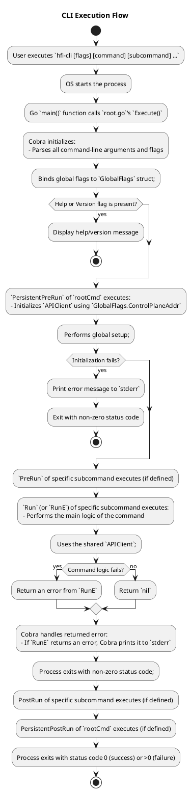
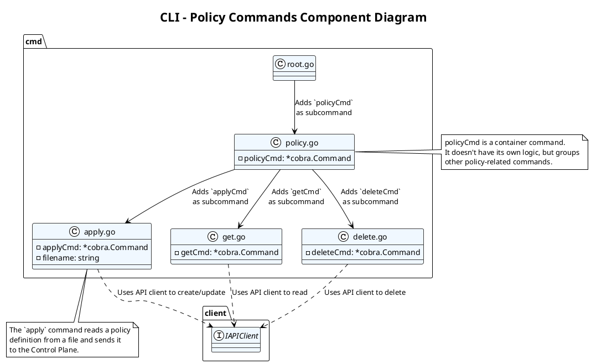
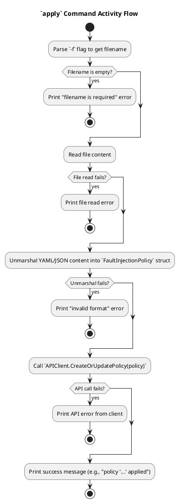
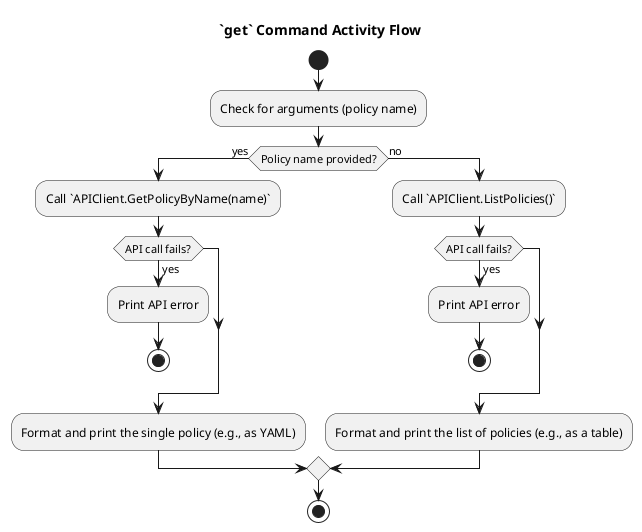
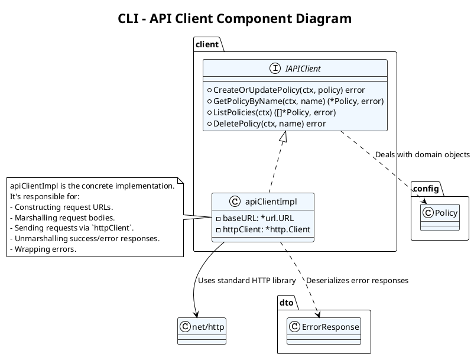
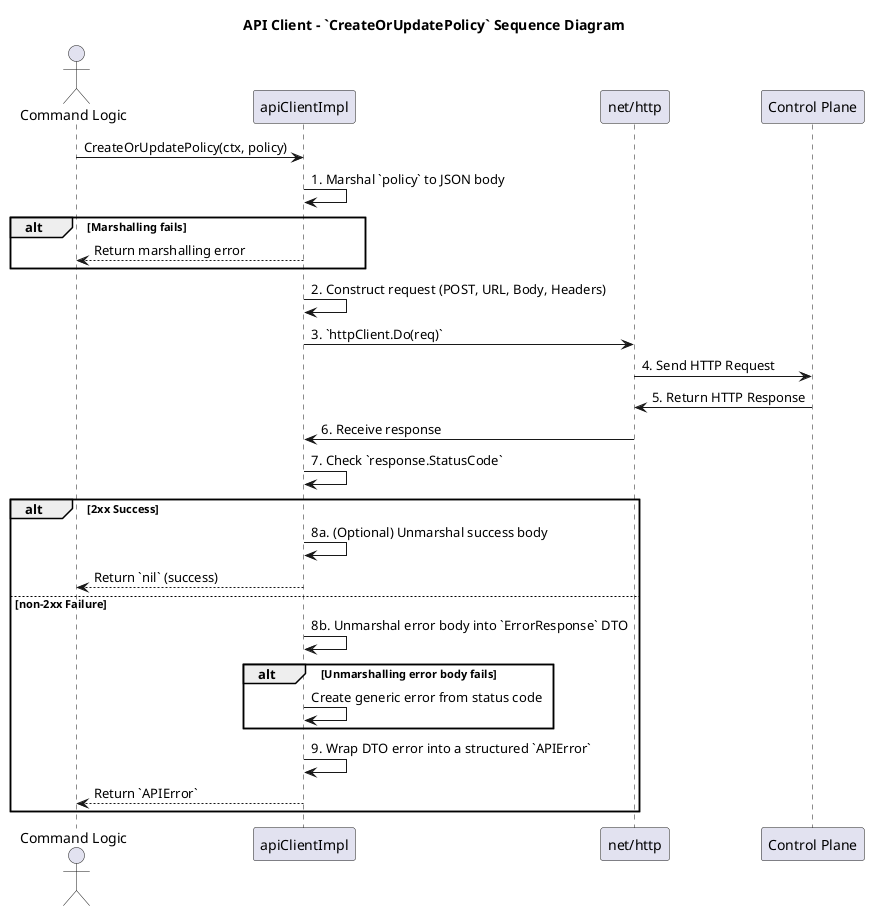

# CLI (命令行工具) - 详细模块设计



[返回Design.md](./Design.md)

## 模块  Root Command (`root.go`)

* 职责: CLI 的主入口，设置全局标志（如 `--control-plane-addr`, `--timeout`），并注册子命令。
* 框架: 使用 `Cobra`。

详细设计文档：CLI - Root Command 模块 (v1.0)

### 概述 (Overview)

Root Command 模块是 `hfi-cli` 的主入口点和命令树的根。它的核心职责是构建命令行应用的基本结构，处理全局标志 (Global Flags)，初始化共享的客户端和配置，并注册所有的子命令。本模块的设计目标是用户友好、可扩展、配置灵活。

我们将使用业界广泛采用的 `cobra` 库来构建 CLI。

### 类图 (Class/Component Diagram)

此图展示了 Root Command 及其与子命令和共享组件的关系。



主要领域对象/组件说明:

* `root.go`: 包含 `rootCmd` 的定义和初始化逻辑。
* `rootCmd (*cobra.Command)`: `cobra` 库的核心对象，代表了 CLI 的根命令 (`hfi-cli`)。
* `GlobalFlags`: 一个结构体，用于聚合所有在根命令上定义的持久化全局标志 (Persistent Global Flags)。这些标志对所有子命令都可用。
* `APIClient`: 一个封装了与 Control Plane HTTP 交互的客户端。它在 `rootCmd` 的 `PersistentPreRun` 钩子中被初始化，并存储起来，以便所有子命令可以复用同一个客户端实例。
* `policy.go`, `version.go`: 代表不同的子命令模块。它们会在 `root.go` 的 `init()` 函数中被添加到 `rootCmd`。

### 活动图 (Activity Diagram)



### 异常处理矩阵 (Error Handling Matrix)

CLI 的异常处理直接面向最终用户，因此错误信息必须清晰、可操作。

| 发生阶段               | 潜在异常/错误                                              | 严重性                 | 处理策略                                                                                             | 用户看到的输出 (示例)                                                                                                           |
| : | : | : | : | : |
| 参数解析时         | 用户输入了未定义的命令或标志。                             | 低 (User Error)    | 由 `cobra` 自动处理。<br>Cobra 会打印出帮助信息和错误提示。                                      | `Error: unknown command "policis" for "hfi-cli"`<br>`Run 'hfi-cli --help' for usage.`                                   |
|                        | 标志的参数类型不正确。                                     | 低 (User Error)    | 由 `cobra` 自动处理。                                                                            | `Error: invalid argument "abc" for "--timeout" flag: time: invalid duration "abc"`                                              |
| `PersistentPreRun` | 全局标志的值无效（如 `--control-plane-addr` 格式不正确）。 | 中 (User Error)    | 在 PreRun 钩子中进行验证，如果失败则返回一个错误。                                                   | `Error: invalid control plane address: "htp://localhost:8080"`                                                                  |
|                        | `APIClient` 初始化失败（如无法解析地址）。                 | 高 (Config Error)  | 同上，返回一个包含清晰原因的错误。                                                                   | `Error: failed to initialize API client: invalid URL scheme`                                                                    |
| 子命令 `RunE`      | 与 Control Plane 的网络连接失败。                          | 高 (Runtime Error) | `APIClient` 模块应返回一个包含网络错误信息的、包装过的错误。                                         | `Error: failed to apply policy: Post "http://localhost:8080/v1/policies": dial tcp 127.0.0.1:8080: connect: connection refused` |
|                        | Control Plane 返回了非 2xx 的 HTTP 状态码。                | 中 (API Error)     | `APIClient` 应解析 `ErrorResponse` JSON，并将其中的 `code` 和 `message` 格式化为一个用户友好的错误。 | `Error: failed to create policy (status 409): A policy with the name 'my-policy' already exists.`                               |
|                        | 文件操作失败（如 `apply -f` 时文件不存在）。               | 中 (User Error)    | 在命令的 `RunE` 中使用 `os.Stat` 等进行检查，并返回清晰的错误。                                      | `Error: failed to read policy file: open non-existent-file.yaml: no such file or directory`                                     |
|                        | 内部发生 `panic`。                                         | 高 (Critical Bug)  | 不应发生。如果发生，Go 运行时会打印堆栈信息并退出。需要通过代码审查和测试来避免。                | (原始的 Go panic 堆栈信息)                                                                                                      |

核心健壮性设计:

* 使用 `RunE` 而不是 `Run`: `cobra` 的 `RunE` 函数签名允许返回一个 `error`。这使得错误处理非常优雅，子命令只需返回错误，Cobra 的主执行循环会负责捕获并打印它，无需在每个命令中都写 `fmt.Println(err)`。
* 统一的 `APIClient`: 所有与后端的交互都通过一个统一的 `APIClient` 模块。这个模块负责处理 HTTP 细节、超时和错误包装，使得命令逻辑更简洁。
* 清晰的帮助信息: 为每个命令和标志编写清晰、简洁的 `Use`, `Short`, `Long` 描述。这是 CLI 用户体验的关键。
* 退出码 (Exit Codes): 严格遵守约定，成功时退出码为 0，失败时为非 0。这对于将 CLI 集成到自动化脚本中至关重要。

## 模块  Policy Commands (`policy.go`)

* 职责: 实现所有与 `policy` 资源相关的子命令。
* 子命令:
  * `applyCmd`:
    * 接收 `-f` 标志指定文件名。
    * 读取并解析 YAML/JSON 文件。
    * 调用 `API Client` 发送 `POST` 请求。
  * `getCmd`:
    * 可以获取所有策略或指定名称的策略。
    * 调用 `API Client` 发送 `GET` 请求，并格式化输出（如表格）。
  * `deleteCmd`:
    * 接收策略名称作为参数。
    * 调用 `API Client` 发送 `DELETE` 请求。

详细设计文档：CLI - Policy Commands 模块 (v1.0)

### 概述 (Overview)

Policy Commands 模块是 `hfi-cli` 的一个子命令集，专门用于对 `FaultInjectionPolicy` 资源执行 CRUD (Create, Read, Update, Delete) 操作。它为用户提供了一套类似 `kubectl` 的、声明式的交互体验。本模块的设计目标是功能完备、用户友好、输出清晰。

### 类图 (Class/Component Diagram)

此图展示了 `policy` 命令及其子命令的结构。



主要领域对象/组件说明:

* `policyCmd (*cobra.Command)`: 一个父命令，用作 `policy` 命令的命名空间。它本身不执行任何操作，仅用于组织子命令。用法：`hfi-cli policy [subcommand]`。
* `applyCmd (*cobra.Command)`: 实现 `apply` 功能。它定义了一个 `-f` 或 `--filename` 标志来接收策略文件的路径。
* `getCmd (*cobra.Command)`: 实现 `get` 功能。它可以不带参数以列出所有策略，也可以带一个参数来获取特定策略的详情。
* `deleteCmd (*cobra.Command)`: 实现 `delete` 功能。它需要一个参数来指定要删除的策略名称。
* `IAPIClient` (Interface): 从 `root` 命令中继承的、用于与 Control Plane 通信的客户端接口。所有 `policy` 子命令都通过这个接口执行后端调用。

### 活动图 (Activity Diagram)

#### `apply` 命令活动图



#### `get` 命令活动图



### 异常处理矩阵 (Error Handling Matrix)

此矩阵详细说明了 `policy` 子命令在执行过程中可能遇到的错误及其对用户的反馈。

| 命令         | 阶段         | 潜在异常/错误                       | 严重性                     | 处理策略                                                                                                               | 用户看到的输出 (示例)                                                                               |
| :-- | :-- | :- | :- | : | :-- |
| `apply`  | 参数解析 | `-f` 标志未提供或为空。             | 低 (User Error)        | 在命令的 `RunE` 逻辑中检查，返回一个错误。                                                                             | `Error: -f, --filename is required`                                                                 |
|              | 文件处理 | 文件不存在或无读取权限。            | 中 (User Error)        | 使用 `os.ReadFile`，并直接返回其错误。                                                                                 | `Error: failed to read policy file: open my-policy.yaml: no such file or directory`                 |
|              |              | 文件内容不是有效的 YAML/JSON。      | 中 (User Error)        | 捕获 `yaml.Unmarshal` 的错误并返回。                                                                                   | `Error: failed to parse policy file: yaml: line 5: did not find expected key`                       |
|              | API 调用 | 网络错误或 Control Plane 返回错误。 | 高 (Runtime/API Error) | 直接返回从 `APIClient` 传回的、已经格式化好的错误。                                                                    | `Error: failed to apply policy (status 400): Invalid 'priority' value, must be a positive integer.` |
| `get`    | API 调用 | 获取单个策略时，策略不存在。        | 中 (API Error)         | `APIClient` 返回 `404 Not Found` 错误。                                                                                | `Error: policies.hfi.dev "non-existent-policy" not found`                                       |
|              |              | 获取列表或单个策略时发生网络错误。  | 高 (Runtime Error)     | 直接返回 `APIClient` 的错误。                                                                                          | `Error: failed to get policies: Get "http://...": connection timed out`                             |
| `delete` | 参数解析 | 未提供要删除的策略名称。            | 低 (User Error)        | `cobra` 的参数验证逻辑会处理。                                                                                         | `Error: requires at least 1 arg(s), only received 0`                                                |
|              | API 调用 | 删除不存在的策略。                  | 低 (API Error)         | `APIClient` 返回 `404 Not Found`。可以选择忽略此错误并打印成功信息（幂等性），或将其作为错误显示。(推荐显示为错误) | `Error: failed to delete policy: policies.hfi.dev "non-existent-policy" not found`              |
|              |              | 删除时发生网络或服务器错误。        | 高 (Runtime/API Error) | 直接返回 `APIClient` 的错误。                                                                                          | `Error: failed to delete policy (status 503): service unavailable`                                  |

核心用户体验设计:

* 一致的输出格式:
  * `get` 命令应支持 `-o` 或 `--output` 标志，允许用户选择输出格式（如 `table`, `yaml`, `json`）。这对于脚本集成非常重要。
  * 默认使用对人类最友好的格式（表格）。
* 清晰的成功反馈:
  * `apply` 成功后，应打印：`faultinjectionpolicy.hfi.dev "my-policy" applied`。
  * `delete` 成功后，应打印：`faultinjectionpolicy.hfi.dev "my-policy" deleted`。
  * 这种仿 `kubectl` 的输出格式让用户感到熟悉和专业。
* 幂等性考量:
  * `apply` 命令应具有“创建或更新”的语义，使其可以被重复执行。
  * `delete` 命令在处理不存在的资源时，可以选择静默成功，但这可能会隐藏用户的拼写错误。更安全的做法是返回 `Not Found` 错误。


这份详细设计文档为 `policy` 相关命令的实现提供了清晰的指引，涵盖了从命令结构、执行流程到用户交互和错误处理的方方面面，有助于打造一个功能完备且用户体验良好的命令行工具。

## 模块  API Client (`client.go`)

* 职责: 封装与 Control Plane API 的所有 HTTP 交互。
* 核心逻辑:
  * 一个 Go `struct`，包含了 `http.Client` 和 Control Plane 的地址。
  * 提供与 `Policy Service` 业务逻辑一一对应的方法（如 `CreatePolicy`, `GetPolicy` 等）。
* 输入: Go 结构体（如 `FaultInjectionPolicy`）。
* 输出: 从 API Handler 返回的响应或错误。

详细设计文档：CLI - API Client 模块 (v1.0)

### 概述 (Overview)

API Client 是一个封装了所有与 Control Plane RESTful API 交互细节的客户端库。它的核心职责是构建 HTTP 请求，发送请求，处理响应，以及将 HTTP 层的错误翻译成对调用方（命令逻辑）友好的、结构化的 Go `error`。本模块的设计目标是可靠、可配置、易于使用且便于测试。

### 类图 (Class/Component Diagram)

此图展示了 API Client 的结构及其与外部的交互。



主要领域对象/组件说明:

* IAPIClient (Interface): 定义了客户端向外暴露的契约。所有 `cmd` 模块都将依赖此接口，方便进行 mock 测试。
* apiClientImpl (Concrete Implementation): `IAPIClient` 接口的具体实现。
  * `baseURL (*url.URL)`: Control Plane 的基础 URL（如 `http://localhost:8080`），在创建客户端实例时提供。
  * `httpClient (*http.Client)`: 一个标准的 Go HTTP 客户端。将其作为成员变量允许我们自定义其行为，例如设置超时 (Timeout)。
* Policy (Domain Object): `FaultInjectionPolicy` 的 Go 结构体表示。
* ErrorResponse (DTO): 用于反序列化 Control Plane 返回的标准化错误 JSON 的结构体。

### 顺序图 (Sequence Diagram)



流程说明:

1. 序列化: 将传入的 Go 对象序列化为 JSON。
2. 构建请求: 创建一个 `http.Request` 对象，设置方法、URL、请求头和请求体。
3. 发送请求: 使用 `httpClient` 发送请求。
4. 检查状态码: 这是关键的分支点。根据响应的 HTTP 状态码决定是处理成功响应还是错误响应。
5. 反序列化:
    * 成功时，可能需要反序列化响应体。
    * 失败时，尝试将响应体反序列化为标准的 `ErrorResponse` DTO。
6. 错误包装: 将 HTTP 错误或业务逻辑错误包装成一个自定义的、信息丰富的 Go `error` 类型，然后返回给调用方。

### 异常处理矩阵 (Error Handling Matrix)

API Client 层的核心任务之一就是错误处理和翻译。它需要将底层的、模糊的错误转化为上层命令可以清晰展示给用户的错误。

自定义错误类型 (`APIError`):

```go
type APIError struct {
    StatusCode int
    ErrCode    string // From ErrorResponse DTO, e.g., "INVALID_ARGUMENT"
    Message    string // From ErrorResponse DTO
}

func (e *APIError) Error() string {
    return fmt.Sprintf("failed with status %d: %s", e.StatusCode, e.Message)
}
```

错误分类与处理矩阵:

| 发生阶段       | 潜在异常/错误                                     | 严重性                        | 处理策略                                                                                                                                                                            | 返回给调用方 (`cmd` 模块) 的 `error`                                            |
| :- | : | :- | :- | : |
| 请求构建时 | `policy` 对象序列化为 JSON 失败。                 | 高 (Bug)                  | 1. 这是一个编程错误，应在开发阶段发现。<br>2. 返回一个包装了原始 `json.Marshal` 错误的 `error`。                                                                                    | `fmt.Errorf("failed to serialize request body: %w", err)`                       |
|                | 构建 `http.NewRequest` 失败（如 URL 无效）。      | 高 (Bug/Config Error)     | 1. `baseURL` 在客户端初始化时就应被验证。<br>2. 返回一个包装了原始错误的 `error`。                                                                                                  | `fmt.Errorf("failed to create new request: %w", err)`                           |
| 请求发送时 | DNS 解析失败、TCP 连接超时、连接被拒绝。          | 高 (Network Error)        | 1. `httpClient.Do()` 会返回一个包含网络细节的 `error`。<br>2. 直接将这个 `error` 包装后返回。                                                                                       | `fmt.Errorf("request to control plane failed: %w", err)` (保留原始网络错误信息) |
|                | 请求超时（`context.DeadlineExceeded`）。          | 高 (Network/Server Error) | 1. `httpClient.Do()` 会返回 `context.DeadlineExceeded`。<br>2. 将其包装后返回。                                                                                                     | `fmt.Errorf("request timed out: %w", err)`                                      |
| 响应处理时 | 收到非 2xx HTTP 状态码。                          | 中 (API Error)            | 1. 核心逻辑：尝试读取响应体并反序列化为 `ErrorResponse` DTO。<br>2. 构建一个 `APIError` 对象，填充 `StatusCode`, `ErrCode`, `Message`。<br>3. 将 `APIError` 作为 `error` 返回。 | `&APIError{StatusCode: 409, ErrCode: "ALREADY_EXISTS", ...}`                    |
|                | 收到非 2xx 状态码，但错误响应体为空或格式不正确。 | 中 (API Error)            | 1. 在反序列化 `ErrorResponse` 失败后，进行降级处理。<br>2. 构建一个只包含 `StatusCode` 和通用消息的 `APIError`。<br>3. `Message` 可以是 `http.StatusText(statusCode)`。             | `&APIError{StatusCode: 502, Message: "Bad Gateway"}`                            |
|                | 收到 2xx 状态码，但成功响应体反序列化失败。       | 高 (Bug)                  | 1. 这通常表示客户端的 DTO 与服务器的响应不匹配。<br>2. 返回一个包装了 `json.Unmarshal` 错误的 `error`。                                                                             | `fmt.Errorf("failed to parse successful response: %w", err)`                    |

核心健robustness设计:

* 超时配置: 必须为 `httpClient` 设置一个合理的总超时 (`Timeout`)。这可以防止 CLI 在网络状况不佳时无限期地挂起。
* 上下文传播: 所有 `IAPIClient` 接口的方法都接收一个 `context.Context`。这个 `context` 应该被传递给 `http.NewRequestWithContext`，以支持取消 (cancellation)。例如，如果用户按下 `Ctrl+C`，CLI 可以取消正在进行的 API 调用。
* 可测试性: 由于所有命令都依赖 `IAPIClient` 接口，我们可以轻松地编写一个 `MockAPIClient` 来进行单元测试，而无需启动一个真实的 Control Plane 服务。
