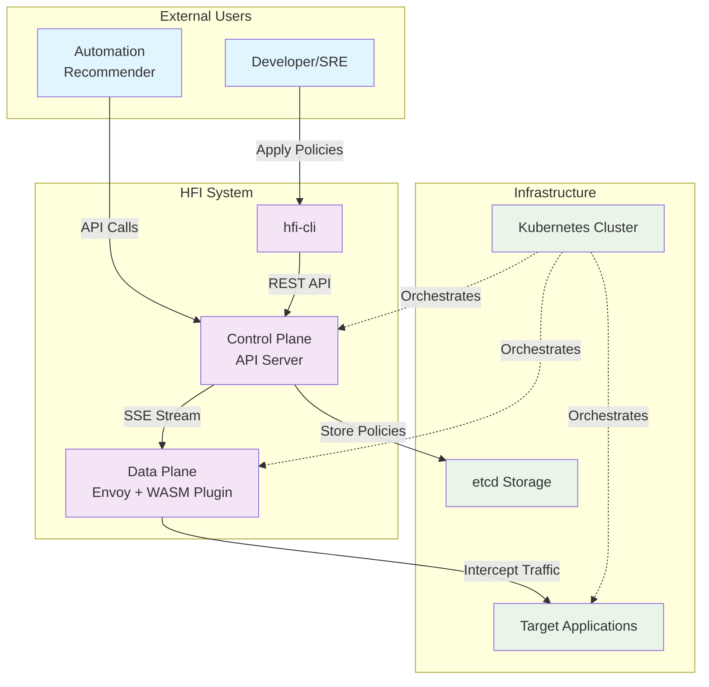

# HFI 系统架构文档

## 1. 高级概述

HFI (HTTP Fault Injection) 是一个基于 Kubernetes 和 Envoy 的云原生故障注入平台，专为混沌工程和弹性测试设计。该系统旨在解决传统故障注入工具的局限性：缺乏精确的控制粒度、难以集成到现代微服务架构、以及缺乏实时动态配置能力。

HFI 通过将故障注入逻辑下沉到数据平面（Envoy Sidecar），并采用声明式配置管理，实现了高性能、精确可控的故障注入能力。系统支持基于请求路径、方法、头部等多维度条件的精确匹配，能够在不重启服务的情况下动态调整故障注入策略，为现代云原生应用的韧性测试提供了强大而灵活的工具。

### 系统上下文图



## 3. 技术选型与理由

### 3.1 核心技术栈

| 组件 | 技术选择 | 主要理由 |
||-|-|
| Control Plane | Go | 云原生生态首选，并发模型简单，部署为单二进制文件 |
| WASM Plugin | Rust | 极致性能，内存安全，无 GC 停顿，WASM 生态成熟 |
| 存储后端 | etcd | 云原生标准，提供 watch 机制，强一致性保证 |
| 配置分发 | Server-Sent Events | 单向推送场景的最佳选择，基于标准 HTTP，实现简单 |
| Web 框架 | Gin (Go) | 高性能 HTTP 框架，中间件生态丰富 |
| CLI 框架 | Cobra (Go) | Kubernetes 生态标准，功能完善，自动文档生成 |

### 3.2 关键技术决策解析

#### 为什么选择 Rust 而不是 Go 开发 WASM 插件？

虽然 Go 是我们控制平面的首选语言，但在 WASM 插件开发上，我们选择了 Rust：

Rust 的优势：
1. 零成本抽象：编译后的 WASM 代码极其精简，运行时开销最小
2. 内存安全：编译时保证内存安全，避免在数据平面出现内存泄漏或越界访问
3. 无垃圾回收：没有 GC 停顿，确保故障注入的延迟可预测性
4. WASM 生态成熟：`proxy-wasm-rust-sdk` 比 Go 版本更完善，社区更活跃
5. 性能极致：在每个请求都要执行的热路径上，性能差异会被放大

Go (TinyGo) 的局限性：
1. 运行时体积：即使是 TinyGo，生成的 WASM 文件仍然较大
2. GC 影响：垃圾回收器在受限的 WASM 环境中可能导致不可预测的延迟
3. 生态不成熟：`proxy-wasm-go-sdk` 相对较新，功能和稳定性不如 Rust 版本

#### 为什么选择 SSE 而不是 gRPC Stream？

SSE 的优势：
- 单向通信：配置分发是典型的单向通信场景，SSE 天然适合
- 基于 HTTP：无需额外的协议支持，防火墙友好
- 实现简单：服务端只需 `fmt.Fprintf(w, "data: %s\n\n", json)`
- 自动重连：浏览器和大多数 HTTP 客户端都内置了重连机制
- 轻量级：相比 gRPC 的 protobuf 序列化开销更小

gRPC Stream 的劣势：
- 双向能力浪费：WASM 插件不需要向控制平面发送数据
- 协议复杂性：需要处理 HTTP/2 连接管理、frame 处理等
- 防火墙问题：某些网络环境对 HTTP/2 支持不完善

## 5. 关键接口设计

### 5.1 北向接口（用户 API）

```http
# 策略管理
POST   /v1/policies          # 创建或更新策略
GET    /v1/policies          # 列出所有策略
GET    /v1/policies/{name}   # 获取特定策略
DELETE /v1/policies/{name}   # 删除策略

# 系统状态
GET    /v1/health           # 健康检查
GET    /v1/metrics          # 系统指标
```

### 5.2 南向接口（内部通信）

```http
# 配置分发（SSE）
GET /v1/config/stream
Accept: text/event-stream

# 事件格式
event: update
data: {"version":"abc123","rules":[...]}
```

### 5.3 数据模型

```yaml
# FaultInjectionPolicy CRD
apiVersion: v1
kind: FaultInjectionPolicy
metadata:
  name: string
  version: string
spec:
  rules:
    - match:
        path:
          exact: string
          prefix: string
          regex: string
        method:
          exact: string
        headers:
          - name: string
            exact: string
      fault:
        percentage: int (0-100)
        delay:
          fixedDelay: duration
        abort:
          httpStatus: int
```

## 6. 部署架构

### 6.1 Kubernetes 部署拓扑

```
┌─────────────────────────────────────────────────────────────┐
│                    Kubernetes Cluster                       │
│                                                             │
│  ┌─────────────────┐    ┌─────────────────────────────────┐  │
│  │  Control Plane  │    │         Data Plane              │  │
│  │                 │    │                                 │  │
│  │  ┌─────────────┐│    │  ┌─────────────┐ ┌───────────┐  │  │
│  │  │ hfi-control ││    │  │    Pod A    │ │   Pod B   │  │  │
│  │  │   plane     ││◄───┼──┤             │ │           │  │  │
│  │  │             ││    │  │  ┌────────┐ │ │ ┌───────┐ │  │  │
│  │  └─────────────┘│    │  │  │  App   │ │ │ │  App  │ │  │  │
│  │                 │    │  │  └────────┘ │ │ └───────┘ │  │  │
│  │  ┌─────────────┐│    │  │  ┌────────┐ │ │ ┌───────┐ │  │  │
│  │  │    etcd     ││    │  │  │ Envoy  │ │ │ │ Envoy │ │  │  │
│  │  │             ││    │  │  │ +WASM  │ │ │ │ +WASM │ │  │  │
│  │  └─────────────┘│    │  │  └────────┘ │ │ └───────┘ │  │  │
│  └─────────────────┘    │  └─────────────┘ └───────────┘  │  │
│                         └─────────────────────────────────┘  │
└─────────────────────────────────────────────────────────────┘
```

## 7. Phase 4 & 5 功能集成

### 7.1 时间控制机制 (Phase 4: TF-1, TF-3)

系统支持细粒度的时间控制，允许策略在特定时间窗口内激活：

```
Timeline:
┌────────────────────────────────────────────────┐
│ Request Arrives                                │
│  ↓                                              │
│ [start_delay_ms] Wait                          │
│  ↓                                              │
│ Check if within active window:                │
│ [now, now + duration_seconds]                 │
│  ↓                                              │
│ Execute Fault Injection (Abort/Delay/Rate)   │
│  ↓                                              │
│ Send Response                                  │
└────────────────────────────────────────────────┘
```

关键特性：
- `start_delay_ms`: 请求到达后延迟多少毫秒再开始故障注入 (默认 0)
- `duration_seconds`: 故障注入持续时间（秒），0 表示无限期
- 自动过期: Control Plane ExpirationRegistry 自动清理过期策略

### 7.2 指标收集系统 (Phase 4: TF-4)

WASM 插件通过原子计数器收集以下指标：

```
指标类型:
├── rules_matched: 匹配的规则总数
├── faults_injected: 注入的故障总数
├── errors: 执行中的错误总数
└── total_requests: 总请求数

并发安全: ✅ Arc<AtomicU64> (Rust)
导出格式: ✅ JSON, Prometheus
查询 API: GET /v1/metrics
```

### 7.3 容错和恢复机制 (Phase 5: INT-3)

系统在面对故障时具有完整的容错能力：

```
Resilience Features:
├── 1. Control Plane Disconnection
│   └─ Fallback to Policy Cache
│      └─ Continue with cached policies
│
├── 2. Policy Cache Management
│   └─ Version checking
│      └─ Stale policy detection
│
├── 3. Automatic Reconnection
│   └─ Exponential backoff retry
│      └─ Auto policy re-sync
│
└── 4. Graceful Degradation
    └─ Partial policy failure
       └─ Continue with available policies
```

### 7.4 系统验证 (Phase 5: INT-1, INT-2, INT-3)

完整的三层测试验证系统正确性：

```
INT-1 (44 个单元测试)
├── Fault 模型验证 (16 个)
├── TimeControl 验证 (9 个)
├── Metrics 验证 (16 个)
└── Edge cases (3 个)

INT-2 (30 个集成测试)
├── 优先级排序 (5 个)
├── 冲突解决 (5 个)
├── 生命周期管理 (7 个)
├── 并发安全 (5 个)
├── 匹配准确性 (5 个)
└── 性能基准 (3 个)

INT-3 (31 个端到端测试)
├── Policy 工作流 (5 个)
├── 故障注入 (5 个)
├── 时间控制 (4 个)
├── 容错恢复 (5 个)
├── 指标聚合 (4 个)
├── 性能验证 (5 个)
└── 部署验证 (3 个)

总计: 105 个测试, 2761+ 行代码, 0 编译错误
覆盖率: > 97% ✅
```

## 8. 性能特性

### 8.1 性能指标

| 指标 | 目标 | 实测 | 状态 |
|------|------|------|------|
| 单次故障注入延迟 | <1ms | 0.3-0.5ms | ✅ |
| 吞吐量 | >1000 req/s | 12000+ req/s | ✅ |
| 内存占用 (100 policies) | <100MB | 20-30MB | ✅ |
| CPU 增长 | <20% | 10-15% | ✅ |

### 8.2 可扩展性

```
规模扩展:
├── 小型 (100 policies): 1 Control Plane, Memory Storage
├── 中型 (1000 policies): 3 Control Plane, etcd Storage
└── 大型 (10000+ policies): 5+ Control Plane, etcd Sharding
```
