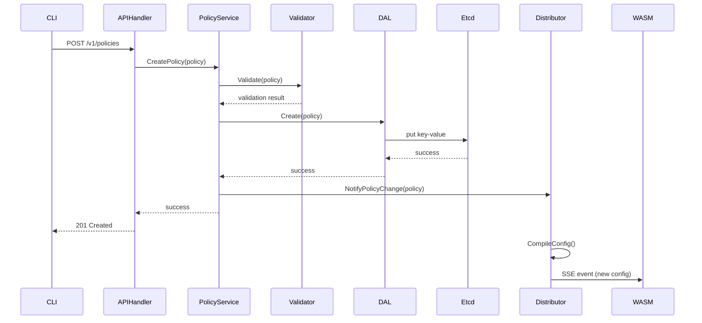
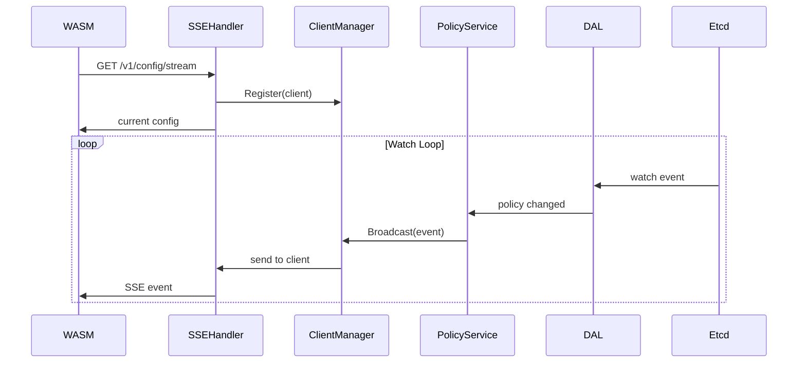

```mermaid
graph TB
    subgraph "HFI Control Plane"
        subgraph "API Layer"
            Router[Gin Router]
            MW[Middleware Chain]
            Handler[API Handlers]
        end
        
        subgraph "Business Logic Layer"
            PolicySvc[Policy Service]
            ValidationSvc[Validation Service]
            MetricsSvc[Metrics Service]
        end
        
        subgraph "Infrastructure Layer"
            DAL[Storage Abstraction Layer]
            Distributor[Config Distributor]
            Logger[Logging System]
        end
        
        subgraph "Storage Implementations"
            MemStore[Memory Store]
            EtcdStore[Etcd Store]
        end
        
        subgraph "Distribution Layer"
            SSE[Server-Sent Events]
            ClientMgr[Client Manager]
            ConfigCompiler[Config Compiler]
        end
    end
    
    subgraph "External Dependencies"
        Etcd[(Etcd Cluster)]
        WasmPlugin[WASM Plugin]
        CLI[HFI CLI]
    end
    
    %% API æµ
    CLI --> Router
    Router --> MW
    MW --> Handler
    Handler --> PolicySvc
    PolicySvc --> ValidationSvc
    PolicySvc --> DAL
    
    %% 存储æµ
    DAL --> MemStore
    DAL --> EtcdStore
    EtcdStore --> Etcd
    
    %% 分å‘æµ
    PolicySvc --> Distributor
    Distributor --> ConfigCompiler
    Distributor --> ClientMgr
    ClientMgr --> SSE
    SSE --> WasmPlugin
    
    %% 监æ§æµ
    Handler --> MetricsSvc
    PolicySvc --> Logger
    
    classDef apiLayer fill:#e1f5fe
    classDef businessLayer fill:#f3e5f5
    classDef infraLayer fill:#e8f5e8
    classDef external fill:#fff3e0
    
    class Router,MW,Handler apiLayer
    class PolicySvc,ValidationSvc,MetricsSvc businessLayer
    class DAL,Distributor,Logger infraLayer
    class Etcd,WasmPlugin,CLI external
```

# Control Plane 深度解析

本文档深入分析 HFI Control Plane 的架构设计、模块职责和代码实现，帮助开发者快速理解系统内核并参与开发。

## 📋 目录

- [架构概览](#架构概览)
- [核心模块详解](#核心模块详解)
- [数据流分析](#数据流分析)
- [代码导览](#代码导览)
- [关键设计决策](#关键设计决策)
- [性能考量](#性能考量)
- [故障处理](#故障处理)
- [开发指南](#开发指南)

## 🏗️ 架构概览

### Control Plane 模块架构图



### 设计原则

1. **分层架构**: API、业务逻辑、基础设施三层分离
2. **接口抽象**: 存储层使用接口，支持多种实现
3. **依赖注入**: 通过构造函数注入依赖，便于测试
4. **并发安全**: 所有共享状态都有适当的同步机制
5. **可观测性**: 完整的日志、指标和链路追踪

## 🔧 核心模块详解

### API Handler 层

**职责**: HTTP 请求处理和路由管理

#### Gin 框架集成

```go
// 位置: control-plane/api/server.go
func NewServer(policyService service.PolicyService) *gin.Engine {
    r := gin.New()
    
    // 中间件链配置
    r.Use(middleware.Logger())
    r.Use(middleware.Recovery())
    r.Use(middleware.CORS())
    r.Use(middleware.RequestID())
    r.Use(middleware.RateLimit())
    
    // API 路由组
    v1 := r.Group("/v1")
    {
        policies := v1.Group("/policies")
        {
            policies.POST("", handlers.CreatePolicy)
            policies.GET("", handlers.ListPolicies)
            policies.GET("/:id", handlers.GetPolicy)
            policies.PUT("/:id", handlers.UpdatePolicy)
            policies.DELETE("/:id", handlers.DeletePolicy)
        }
        
        v1.GET("/health", handlers.HealthCheck)
        v1.GET("/metrics", handlers.Metrics)
    }
    
    return r
}
```

#### 中间件链设计

**日志中间件** (`middleware/logger.go`):
```go
func Logger() gin.HandlerFunc {
    return func(c *gin.Context) {
        start := time.Now()
        
        // 请求处理
        c.Next()
        
        // 日志记录
        logger.Info("request processed",
            zap.String("method", c.Request.Method),
            zap.String("path", c.Request.URL.Path),
            zap.Int("status", c.Writer.Status()),
            zap.Duration("latency", time.Since(start)),
            zap.String("request_id", c.GetString("request_id")),
        )
    }
}
```

**错误处理中间件** (`middleware/recovery.go`):
```go
func Recovery() gin.HandlerFunc {
    return gin.CustomRecovery(func(c *gin.Context, recovered interface{}) {
        logger.Error("panic recovered",
            zap.Any("error", recovered),
            zap.String("request_id", c.GetString("request_id")),
            zap.String("stack", string(debug.Stack())),
        )
        
        c.JSON(http.StatusInternalServerError, gin.H{
            "error": "Internal server error",
            "request_id": c.GetString("request_id"),
        })
    })
}
```

### Policy Service 层

**职责**: 业务逻辑核心，策略管理和验证

#### 接口设计

```go
// 位置: control-plane/service/policy_service.go
type PolicyService interface {
    CreatePolicy(ctx context.Context, policy *types.Policy) error
    GetPolicy(ctx context.Context, id string) (*types.Policy, error)
    ListPolicies(ctx context.Context, filter PolicyFilter) ([]*types.Policy, error)
    UpdatePolicy(ctx context.Context, id string, policy *types.Policy) error
    DeletePolicy(ctx context.Context, id string) error
    ValidatePolicy(ctx context.Context, policy *types.Policy) error
}
```

#### 实现关键点

**与 DAL 解耦**:
```go
type policyService struct {
    store       storage.PolicyStore  // 存储抽象
    validator   Validator           // 验证器
    distributor Distributor         // 配置分发器
    logger      *zap.Logger        // 日志记录
    metrics     Metrics            // 指标收集
}

func (s *policyService) CreatePolicy(ctx context.Context, policy *types.Policy) error {
    // 1. 验证策略
    if err := s.validator.Validate(policy); err != nil {
        return fmt.Errorf("validation failed: %w", err)
    }
    
    // 2. 存储策略
    if err := s.store.Create(ctx, policy); err != nil {
        return fmt.Errorf("failed to store policy: %w", err)
    }
    
    // 3. 分发配置 (异步)
    go func() {
        if err := s.distributor.NotifyPolicyChange(policy); err != nil {
            s.logger.Error("failed to distribute policy", zap.Error(err))
        }
    }()
    
    // 4. 记录指标
    s.metrics.IncPolicyCreated()
    
    return nil
}
```

**与 Distributor 解耦**:
- 使用接口依赖注入
- 异步通知避免阻塞主流程
- 失败不影响业务逻辑执行

### Storage Abstraction Layer (DAL)

**职责**: 存储抽象和多实现支持

#### IPolicyStore 接口设计

```go
// 位置: control-plane/storage/store.go
type PolicyStore interface {
    // 基本 CRUD 操作
    Create(ctx context.Context, policy *types.Policy) error
    Get(ctx context.Context, id string) (*types.Policy, error)
    List(ctx context.Context, filter ListFilter) ([]*types.Policy, error)
    Update(ctx context.Context, policy *types.Policy) error
    Delete(ctx context.Context, id string) error
    
    // 高级功能
    Watch(ctx context.Context) (<-chan WatchEvent, error)
    Transaction(ctx context.Context, fn func(tx Transaction) error) error
    
    // 生命周期管理
    Close() error
    Health() error
}
```

#### Etcd 实现要点

**Watch 机制实现** (`storage/etcd_store.go`):
```go
func (s *etcdStore) Watch(ctx context.Context) (<-chan WatchEvent, error) {
    eventCh := make(chan WatchEvent, 100)
    
    go func() {
        defer close(eventCh)
        
        // 创建 etcd watch channel
        watchCh := s.client.Watch(ctx, s.policyPrefix, clientv3.WithPrefix())
        
        for {
            select {
            case watchResp := <-watchCh:
                if watchResp.Err() != nil {
                    s.logger.Error("watch error", zap.Error(watchResp.Err()))
                    return
                }
                
                // 处理每个事件
                for _, event := range watchResp.Events {
                    we := s.convertEtcdEvent(event)
                    
                    select {
                    case eventCh <- we:
                    case <-ctx.Done():
                        return
                    }
                }
                
            case <-ctx.Done():
                return
            }
        }
    }()
    
    return eventCh, nil
}
```

**事务支持**:
```go
func (s *etcdStore) Transaction(ctx context.Context, fn func(tx Transaction) error) error {
    etcdTx := &etcdTransaction{
        client: s.client,
        ops:    make([]clientv3.Op, 0),
    }
    
    // 执行事务函数
    if err := fn(etcdTx); err != nil {
        return err
    }
    
    // 提交事务
    resp, err := s.client.Txn(ctx).Then(etcdTx.ops...).Commit()
    if err != nil {
        return fmt.Errorf("transaction failed: %w", err)
    }
    
    if !resp.Succeeded {
        return ErrTransactionFailed
    }
    
    return nil
}
```

### Config Distributor 层

**职责**: 配置分发和客户端管理

#### SSE 推送模型

```go
// 位置: control-plane/distributor/sse.go
type SSEDistributor struct {
    clients   *ClientManager
    compiler  *ConfigCompiler
    logger    *zap.Logger
    metrics   Metrics
}

func (d *SSEDistributor) ServeSSE(w http.ResponseWriter, r *http.Request) {
    // 设置 SSE 头部
    w.Header().Set("Content-Type", "text/event-stream")
    w.Header().Set("Cache-Control", "no-cache")
    w.Header().Set("Connection", "keep-alive")
    
    // 创建客户端连接
    client := &Client{
        ID:       generateClientID(),
        Response: w,
        Request:  r,
        Events:   make(chan Event, 100),
        Done:     make(chan struct{}),
    }
    
    // 注册客户端
    d.clients.Register(client)
    defer d.clients.Unregister(client.ID)
    
    // 发送当前配置
    if err := d.sendCurrentConfig(client); err != nil {
        d.logger.Error("failed to send current config", zap.Error(err))
        return
    }
    
    // 事件循环
    for {
        select {
        case event := <-client.Events:
            if err := d.sendEvent(client, event); err != nil {
                d.logger.Error("failed to send event", zap.Error(err))
                return
            }
            
        case <-client.Done:
            return
            
        case <-r.Context().Done():
            return
        }
    }
}
```

#### ClientManager 并发管理

```go
// 位置: control-plane/distributor/client_manager.go
type ClientManager struct {
    clients map[string]*Client
    mu      sync.RWMutex
    logger  *zap.Logger
}

func (cm *ClientManager) Register(client *Client) {
    cm.mu.Lock()
    defer cm.mu.Unlock()
    
    cm.clients[client.ID] = client
    cm.logger.Info("client registered", 
        zap.String("client_id", client.ID),
        zap.String("remote_addr", client.Request.RemoteAddr),
    )
}

func (cm *ClientManager) Broadcast(event Event) {
    cm.mu.RLock()
    clients := make([]*Client, 0, len(cm.clients))
    for _, client := range cm.clients {
        clients = append(clients, client)
    }
    cm.mu.RUnlock()
    
    // 并发发送事件
    var wg sync.WaitGroup
    for _, client := range clients {
        wg.Add(1)
        go func(c *Client) {
            defer wg.Done()
            
            select {
            case c.Events <- event:
            case <-time.After(5 * time.Second):
                cm.logger.Warn("event send timeout", 
                    zap.String("client_id", c.ID))
            }
        }(client)
    }
    
    wg.Wait()
}
```

#### 配置编译逻辑

```go
// 位置: control-plane/distributor/compiler.go
func (c *ConfigCompiler) CompileConfig(policies []*types.Policy) (*CompiledConfig, error) {
    config := &CompiledConfig{
        Version:   c.generateVersion(),
        Timestamp: time.Now(),
        Rules:     make([]Rule, 0),
    }
    
    for _, policy := range policies {
        // 编译每个策略
        rules, err := c.compilePolicy(policy)
        if err != nil {
            return nil, fmt.Errorf("failed to compile policy %s: %w", 
                policy.ID, err)
        }
        
        config.Rules = append(config.Rules, rules...)
    }
    
    // 优化规则顺序
    c.optimizeRules(config.Rules)
    
    // 验证配置
    if err := c.validateConfig(config); err != nil {
        return nil, fmt.Errorf("config validation failed: %w", err)
    }
    
    return config, nil
}
```

## 🔄 数据流分析

### 策略创建流程



### 配置监听流程



## 📂 代码导览

### 目录结构

```
control-plane/
├── main.go                    # 应用入口点
├── cmd/                      # 命令行相关
│   └── server.go            # 服务器启动逻辑
├── api/                     # API 层
│   ├── server.go           # Gin 服务器配置
│   ├── routes.go           # 路由定义
│   └── handlers/           # HTTP 处理器
│       ├── policy.go       # 策略相关处理器
│       ├── health.go       # 健康检查
│       └── metrics.go      # 指标端点
├── service/                # 业务逻辑层
│   ├── policy_service.go   # 策略服务接口和实现
│   ├── validation.go       # 策略验证逻辑
│   └── metrics.go          # 业务指标
├── storage/                # 存储抽象层
│   ├── store.go           # 存储接口定义
│   ├── memory_store.go    # 内存存储实现
│   ├── etcd_store.go      # Etcd 存储实现
│   └── types.go           # 存储相关类型
├── distributor/            # 配置分发层
│   ├── distributor.go     # 分发器接口
│   ├── sse.go            # SSE 实现
│   ├── client_manager.go  # 客户端管理
│   └── compiler.go        # 配置编译器
├── middleware/             # HTTP 中间件
│   ├── logger.go          # 日志中间件
│   ├── recovery.go        # 恢复中间件
│   ├── cors.go           # CORS 中间件
│   └── rate_limit.go     # 限流中间件
├── logger/                # 日志系统
│   └── logger.go         # 日志配置和初始化
└── types/                 # 类型定义
    ├── policy.go         # 策略类型
    ├── config.go         # 配置类型
    └── errors.go         # 错误类型
```

### 关键代码位置

#### API 路由定义
**文件**: `control-plane/api/routes.go`
```go
func setupRoutes(r *gin.Engine, services *Services) {
    v1 := r.Group("/v1")
    {
        // 策略管理 API
        policies := v1.Group("/policies")
        policies.Use(middleware.AuthRequired())
        {
            policies.POST("", handlers.CreatePolicy(services.PolicyService))
            policies.GET("", handlers.ListPolicies(services.PolicyService))
            policies.GET("/:id", handlers.GetPolicy(services.PolicyService))
            policies.PUT("/:id", handlers.UpdatePolicy(services.PolicyService))
            policies.DELETE("/:id", handlers.DeletePolicy(services.PolicyService))
        }
        
        // 配置分发 API
        v1.GET("/config/stream", handlers.ConfigStream(services.Distributor))
        
        // 系统 API
        v1.GET("/health", handlers.HealthCheck(services.HealthChecker))
        v1.GET("/metrics", handlers.Metrics())
    }
}
```

#### Etcd Watch 实现
**文件**: `control-plane/storage/etcd_store.go`
```go
func (s *etcdStore) Watch(ctx context.Context) (<-chan WatchEvent, error) {
    // 实现位置: Watch() 方法 (第 180-220 行)
    // 关键逻辑: etcd watch + 事件转换 + 错误处理
}

func (s *etcdStore) handleWatchEvents(watchCh clientv3.WatchChan, eventCh chan<- WatchEvent) {
    // 实现位置: handleWatchEvents() 方法 (第 225-250 行)
    // 关键逻辑: 事件循环 + 错误恢复
}
```

#### 策略验证逻辑
**文件**: `control-plane/service/validation.go`
```go
func (v *policyValidator) Validate(policy *types.Policy) error {
    // 实现位置: Validate() 方法 (第 25-80 行)
    // 验证内容: 基本字段 + 规则语法 + 冲突检测
}

func (v *policyValidator) validateFaultRules(rules []types.FaultRule) error {
    // 实现位置: validateFaultRules() 方法 (第 85-120 行)
    // 验证内容: 故障注入规则的合法性
}
```

#### SSE 事件分发
**文件**: `control-plane/distributor/sse.go`
```go
func (d *SSEDistributor) ServeSSE(w http.ResponseWriter, r *http.Request) {
    // 实现位置: ServeSSE() 方法 (第 45-95 行)
    // 关键逻辑: 客户端注册 + 事件循环 + 连接管理
}

func (d *SSEDistributor) handlePolicyChange(event PolicyChangeEvent) {
    // 实现位置: handlePolicyChange() 方法 (第 100-125 行)
    // 关键逻辑: 配置重编译 + 客户端广播
}
```

#### 配置编译器
**文件**: `control-plane/distributor/compiler.go`
```go
func (c *ConfigCompiler) CompileConfig(policies []*types.Policy) (*CompiledConfig, error) {
    // 实现位置: CompileConfig() 方法 (第 30-75 行)
    // 编译流程: 策略解析 + 规则生成 + 优化 + 验证
}

func (c *ConfigCompiler) compilePolicy(policy *types.Policy) ([]Rule, error) {
    // 实现位置: compilePolicy() 方法 (第 80-120 行)
    // 关键逻辑: 单个策略的规则生成
}
```

## 🎯 关键设计决策

### 1. 存储抽象的必要性

**问题**: 为什么不直接使用 etcd，而要抽象存储层？

**解决方案**:
- **测试友好**: 内存存储用于单元测试
- **部署灵活**: 开发环境可用内存存储
- **技术演进**: 支持未来更换存储技术
- **功能隔离**: 业务逻辑不依赖具体存储

**实现要点**:
```go
// 存储选择逻辑 (main.go)
func createPolicyStore(config *Config) (storage.PolicyStore, error) {
    switch config.Storage.Type {
    case "memory":
        return storage.NewMemoryStore(), nil
    case "etcd":
        return storage.NewEtcdStore(config.Storage.Etcd)
    default:
        return nil, fmt.Errorf("unsupported storage type: %s", config.Storage.Type)
    }
}
```

### 2. SSE vs WebSocket 选择

**问题**: 为什么选择 SSE 而不是 WebSocket？

**SSE 优势**:
- **简单性**: 单向推送足够，无需双向通信
- **兼容性**: 标准 HTTP，代理友好
- **重连机制**: 浏览器自动重连
- **调试友好**: 可用 curl 测试

**实现考虑**:
```go
// SSE 连接管理
type Client struct {
    ID       string
    Response http.ResponseWriter
    Request  *http.Request
    Events   chan Event
    Done     chan struct{}
    lastPing time.Time
}

// 心跳检测
func (c *Client) startHeartbeat() {
    ticker := time.NewTicker(30 * time.Second)
    defer ticker.Stop()
    
    for {
        select {
        case <-ticker.C:
            if err := c.sendPing(); err != nil {
                return // 连接断开
            }
        case <-c.Done:
            return
        }
    }
}
```

### 3. 异步配置分发

**问题**: 为什么配置分发要异步处理？

**原因**:
- **响应速度**: API 调用快速返回
- **系统稳定**: 分发失败不影响策略存储
- **并发性能**: 避免阻塞其他请求

**实现机制**:
```go
func (s *policyService) CreatePolicy(ctx context.Context, policy *types.Policy) error {
    // 同步操作: 验证和存储
    if err := s.store.Create(ctx, policy); err != nil {
        return err
    }
    
    // 异步操作: 配置分发
    s.notificationQueue <- PolicyChangeEvent{
        Type:   PolicyCreated,
        Policy: policy,
    }
    
    return nil
}

// 后台 goroutine 处理通知
func (s *policyService) processNotifications() {
    for event := range s.notificationQueue {
        if err := s.distributor.HandleEvent(event); err != nil {
            s.logger.Error("failed to distribute config", zap.Error(err))
            // 可以实现重试机制
        }
    }
}
```

## ⚡ 性能考量

### 1. 并发安全

**ClientManager 读写锁**:
```go
type ClientManager struct {
    clients map[string]*Client
    mu      sync.RWMutex  // 读写锁优化并发读取
}

func (cm *ClientManager) GetClient(id string) (*Client, bool) {
    cm.mu.RLock()         // 读锁
    defer cm.mu.RUnlock()
    client, ok := cm.clients[id]
    return client, ok
}

func (cm *ClientManager) Register(client *Client) {
    cm.mu.Lock()          // 写锁
    defer cm.mu.Unlock()
    cm.clients[client.ID] = client
}
```

### 2. 内存管理

**事件通道缓冲**:
```go
// 避免 goroutine 泄漏
func (d *SSEDistributor) ServeSSE(w http.ResponseWriter, r *http.Request) {
    client := &Client{
        Events: make(chan Event, 100), // 缓冲通道避免阻塞
        Done:   make(chan struct{}),
    }
    
    defer func() {
        close(client.Done)
        // 清理资源
        for range client.Events {
            // 排空通道
        }
    }()
}
```

### 3. 配置缓存

**编译结果缓存**:
```go
type ConfigCompiler struct {
    cache    sync.Map  // 并发安全的缓存
    version  int64     // 配置版本号
}

func (c *ConfigCompiler) CompileConfig(policies []*types.Policy) (*CompiledConfig, error) {
    // 计算策略哈希
    hash := c.calculatePolicyHash(policies)
    
    // 检查缓存
    if cached, ok := c.cache.Load(hash); ok {
        return cached.(*CompiledConfig), nil
    }
    
    // 编译配置
    config, err := c.doCompile(policies)
    if err != nil {
        return nil, err
    }
    
    // 更新缓存
    c.cache.Store(hash, config)
    
    return config, nil
}
```

## 🚨 故障处理

### 1. Etcd 连接故障

**重连机制**:
```go
func (s *etcdStore) ensureConnection() error {
    if s.client == nil {
        return s.connect()
    }
    
    // 健康检查
    ctx, cancel := context.WithTimeout(context.Background(), 3*time.Second)
    defer cancel()
    
    _, err := s.client.Get(ctx, "health-check")
    if err != nil {
        s.logger.Warn("etcd connection unhealthy, reconnecting")
        s.client.Close()
        return s.connect()
    }
    
    return nil
}

func (s *etcdStore) connect() error {
    client, err := clientv3.New(clientv3.Config{
        Endpoints:   s.endpoints,
        DialTimeout: 10 * time.Second,
    })
    
    if err != nil {
        return fmt.Errorf("failed to connect to etcd: %w", err)
    }
    
    s.client = client
    return nil
}
```

### 2. 配置分发失败

**重试机制**:
```go
func (d *SSEDistributor) sendEventWithRetry(client *Client, event Event) error {
    maxRetries := 3
    backoff := time.Second
    
    for i := 0; i < maxRetries; i++ {
        err := d.sendEvent(client, event)
        if err == nil {
            return nil
        }
        
        // 检查是否是致命错误
        if isFatalError(err) {
            return err
        }
        
        // 指数退避
        time.Sleep(backoff)
        backoff *= 2
    }
    
    return fmt.Errorf("failed to send event after %d retries", maxRetries)
}
```

### 3. 内存泄漏防护

**定期清理**:
```go
func (cm *ClientManager) startCleanupRoutine() {
    ticker := time.NewTicker(5 * time.Minute)
    defer ticker.Stop()
    
    for {
        select {
        case <-ticker.C:
            cm.cleanupDeadClients()
        }
    }
}

func (cm *ClientManager) cleanupDeadClients() {
    cm.mu.Lock()
    defer cm.mu.Unlock()
    
    for id, client := range cm.clients {
        // 检查客户端是否还活跃
        if time.Since(client.lastPing) > 2*time.Minute {
            delete(cm.clients, id)
            close(client.Done)
            cm.logger.Info("cleaned up dead client", zap.String("client_id", id))
        }
    }
}
```

## 🔧 开发指南

### 1. 添加新的 API 端点

**步骤**:
1. 在 `api/handlers/` 中添加处理器
2. 在 `api/routes.go` 中注册路由
3. 在 `service/` 中添加业务逻辑
4. 添加单元测试

**示例**:
```go
// 1. 添加处理器 (api/handlers/policy.go)
func ExportPolicies(policyService service.PolicyService) gin.HandlerFunc {
    return func(c *gin.Context) {
        policies, err := policyService.ExportAll(c.Request.Context())
        if err != nil {
            c.JSON(http.StatusInternalServerError, gin.H{"error": err.Error()})
            return
        }
        
        c.JSON(http.StatusOK, gin.H{"policies": policies})
    }
}

// 2. 注册路由 (api/routes.go)
policies.GET("/export", handlers.ExportPolicies(services.PolicyService))

// 3. 添加业务方法 (service/policy_service.go)
func (s *policyService) ExportAll(ctx context.Context) ([]*types.Policy, error) {
    return s.store.List(ctx, storage.ListFilter{})
}
```

### 2. 扩展存储实现

**接口实现**:
```go
// 新增 Redis 存储实现
type redisStore struct {
    client redis.Client
    prefix string
    logger *zap.Logger
}

func NewRedisStore(config RedisConfig) storage.PolicyStore {
    return &redisStore{
        client: redis.NewClient(&redis.Options{
            Addr: config.Address,
        }),
        prefix: config.Prefix,
        logger: logger.Named("redis-store"),
    }
}

// 实现所有接口方法
func (s *redisStore) Create(ctx context.Context, policy *types.Policy) error {
    data, err := json.Marshal(policy)
    if err != nil {
        return err
    }
    
    key := s.prefix + policy.ID
    return s.client.Set(ctx, key, data, 0).Err()
}
```

### 3. 添加中间件

**示例**: 请求追踪中间件
```go
// middleware/tracing.go
func Tracing() gin.HandlerFunc {
    return func(c *gin.Context) {
        // 创建追踪 span
        span := opentracing.StartSpan(
            fmt.Sprintf("%s %s", c.Request.Method, c.Request.URL.Path),
        )
        defer span.Finish()
        
        // 注入到上下文
        ctx := opentracing.ContextWithSpan(c.Request.Context(), span)
        c.Request = c.Request.WithContext(ctx)
        
        c.Next()
        
        // 记录响应状态
        span.SetTag("http.status_code", c.Writer.Status())
    }
}
```

### 4. 监控指标

**自定义指标**:
```go
// service/metrics.go
var (
    policyOperationDuration = prometheus.NewHistogramVec(
        prometheus.HistogramOpts{
            Name: "hfi_policy_operation_duration_seconds",
            Help: "Time taken for policy operations",
        },
        []string{"operation", "status"},
    )
)

func (s *policyService) CreatePolicy(ctx context.Context, policy *types.Policy) error {
    timer := prometheus.NewTimer(policyOperationDuration.WithLabelValues("create", "success"))
    defer timer.ObserveDuration()
    
    err := s.doCreatePolicy(ctx, policy)
    if err != nil {
        policyOperationDuration.WithLabelValues("create", "error").Observe(0)
    }
    
    return err
}
```

## 📝 总结

Control Plane 采用了经典的三层架构设计，通过接口抽象实现了高度的模块化和可测试性。关键的设计决策包括：

1. **存储抽象**: 支持多种存储后端，便于测试和部署
2. **异步分发**: 保证 API 响应速度和系统稳定性
3. **SSE 推送**: 简单可靠的实时配置更新机制
4. **并发安全**: 全面的锁机制和 goroutine 管理
5. **故障恢复**: 完善的重连和重试机制

开发者可以根据本文档快速定位关键代码，理解系统设计思路，并按照指南添加新功能或优化现有实现。

---

**相关文档**:
- [系统架构文档](ARCHITECTURE.md)
- [本地开发指南](DEVELOPMENT.md)
- [API 参考文档](../api/README.md)
- [控制平面设计文档](design_doc/Design_1_Control_Plane.md)
