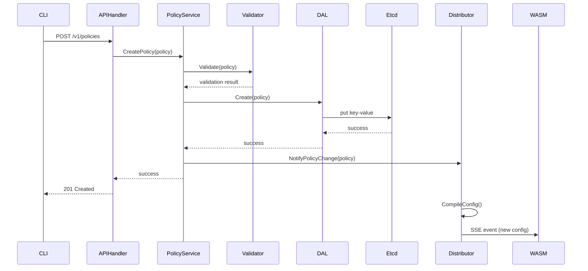
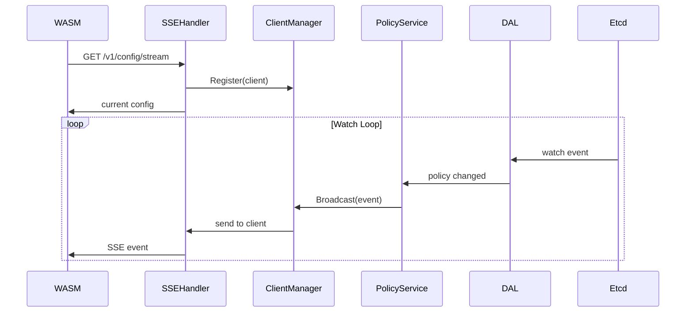

```mermaid
graph TB
    subgraph "HFI Control Plane"
        subgraph "API Layer"
            Router[Gin Router]
            MW[Middleware Chain]
            Handler[API Handlers]
        end
        
        subgraph "Business Logic Layer"
            PolicySvc[Policy Service]
            ValidationSvc[Validation Service]
            MetricsSvc[Metrics Service]
        end
        
        subgraph "Infrastructure Layer"
            DAL[Storage Abstraction Layer]
            Distributor[Config Distributor]
            Logger[Logging System]
        end
        
        subgraph "Storage Implementations"
            MemStore[Memory Store]
            EtcdStore[Etcd Store]
        end
        
        subgraph "Distribution Layer"
            SSE[Server-Sent Events]
            ClientMgr[Client Manager]
            ConfigCompiler[Config Compiler]
        end
    end
    
    subgraph "External Dependencies"
        Etcd[(Etcd Cluster)]
        WasmPlugin[WASM Plugin]
        CLI[HFI CLI]
    end
    
    %% API æµ
    CLI --> Router
    Router --> MW
    MW --> Handler
    Handler --> PolicySvc
    PolicySvc --> ValidationSvc
    PolicySvc --> DAL
    
    %% 存储æµ
    DAL --> MemStore
    DAL --> EtcdStore
    EtcdStore --> Etcd
    
    %% 分å‘æµ
    PolicySvc --> Distributor
    Distributor --> ConfigCompiler
    Distributor --> ClientMgr
    ClientMgr --> SSE
    SSE --> WasmPlugin
    
    %% 监æ§æµ
    Handler --> MetricsSvc
    PolicySvc --> Logger
    
    classDef apiLayer fill:#e1f5fe
    classDef businessLayer fill:#f3e5f5
    classDef infraLayer fill:#e8f5e8
    classDef external fill:#fff3e0
    
    class Router,MW,Handler apiLayer
    class PolicySvc,ValidationSvc,MetricsSvc businessLayer
    class DAL,Distributor,Logger infraLayer
    class Etcd,WasmPlugin,CLI external
```

# Control Plane 深度解析

本文档深入分析 HFI Control Plane 的架构设计、模块职责和代码实现，帮助开发者快速理解系统内核并参与开发。

## 📋 目录

- [架构概览](#架构概览)
- [核心模块详解](#核心模块详解)
- [数据流分析](#数据流分析)
- [代码导览](#代码导览)
- [关键设计决策](#关键设计决策)
- [性能考量](#性能考量)
- [故障处理](#故障处理)
- [开发指南](#开发指南)

# 架构概览

## Control Plane 模块架构图



## 设计原则

1. 分层架构: API、业务逻辑、基础设施三层分离
2. 接口抽象: 存储层使用接口，支持多种实现
3. 依赖注入: 通过构造函数注入依赖，便于测试
4. 并发安全: 所有共享状态都有适当的同步机制
5. 可观测性: 完整的日志、指标和链路追踪

# 核心模块详解

## API Handler 层

职责: HTTP 请求处理和路由管理

### Gin 框架集成 (`control-plane/main.go`)

- 使用 Gin Web 框架处理 HTTP 请求
- 配置请求 ID 追踪、日志记录、错误处理中间件
- 路由配置：
  - `POST /v1/policies` - 创建或更新策略
  - `GET /v1/policies` - 列出所有策略  
  - `GET /v1/policies/:id` - 获取单个策略
  - `DELETE /v1/policies/:id` - 删除策略
  - `GET /v1/config/stream` - SSE 配置推送端点
  - `GET /v1/health` - 健康检查

### 中间件链设计 (`middleware/` 和 `api/middleware.go`)

- RequestIDMiddleware: 为每个请求生成唯一追踪 ID
- LoggingMiddleware: 记录请求方法、路径、状态码、耗时
- ErrorHandlerMiddleware: 标准化 HTTP 错误响应格式

## Policy Service 层

职责: 业务逻辑核心，策略管理和验证 (`control-plane/service/policy_service.go`)

支持的操作：
- `CreateOrUpdatePolicy()` - 创建或更新策略（幂等操作）
- `CreatePolicy()` - 严格创建模式（存在则报错）
- `UpdatePolicy()` - 仅更新现有策略
- `GetPolicy()` - 按名称查询策略
- `DeletePolicy()` - 删除策略
- `List()` - 列出所有策略

关键特性：
- 通过 PolicyService 与存储层通信
- 验证策略配置有效性（由 validator 完成）
- 存储策略后自动触发配置分发

## Storage Abstraction Layer (DAL)

职责: 存储抽象和多实现支持

### IPolicyStore 接口设计 (`control-plane/storage/store.go`)

```go
type IPolicyStore interface {
    // 基本 CRUD
    Create(policy *FaultInjectionPolicy) error
    Get(name string) (*FaultInjectionPolicy, error)
    List() []FaultInjectionPolicy
    Update(policy *FaultInjectionPolicy) error
    Delete(name string) error
    
    // 高级功能
    WatchWithContext(ctx context.Context) (<-chan WatchEvent, error)
    ValidatePolicy(policy *FaultInjectionPolicy) error
    Close() error
}
```

实现:
- Etcd Store (`storage/etcd_store.go`): 生产环境使用，提供分布式持久化存储和 Watch 机制
- Memory Store (`storage/memoryStore.go`): 测试/开发环境使用，快速内存存储

## Config Distributor 层

职责: 实时配置推送和客户端管理 (`control-plane/distributor.go`)

### 核心功能

- SSE 推送: 通过 `GET /v1/config/stream` 端点推送配置更新
- 事件监听: 监听存储的策略变更事件，自动编译并推送新配置
- 客户端管理: 维护 SSE 连接列表，处理客户端连接/断开
- 配置缓存: 使用 `atomic.Value` 存储最新配置，支持无锁读取

### 主要方法

- `RegisterClient()` - 注册新 SSE 客户端
- `UnregisterClient()` - 移除客户端连接
- `broadcast()` - 非阻塞广播配置到所有客户端
- `watchForChanges()` - 监听存储事件，自动更新配置
- `Stop()` - 优雅关闭分发器（取消监听，关闭所有客户端）

### 特点

- 非阻塞发送: 使用 select 防止客户端阻塞
- 自动失败检测: 无法发送的客户端自动移除
- Panic 恢复: Watch 循环在 panic 时自动重启
- 优雅关闭: 通过 context 和 doneChan 实现协调关闭

# 数据流分析

## 策略创建流程



## 配置监听流程



# 代码导览

## 目录结构

```
control-plane/
├── main.go                    # 应用入口点 - 服务器启动和初始化
├── distributor.go             # 配置分发器 - 策略变更通知和推送
├── api/
│   ├── middleware.go         # API 中间件集
│   └── policy_controller.go  # 策略 API 处理器
├── service/
│   ├── policy_service.go     # 策略业务逻辑
│   ├── validator.go          # 策略验证逻辑
│   ├── errors.go             # 服务层错误定义
│   ├── enhanced_service_test.go  # 服务集成测试
│   └── policy_service_test.go    # (可选) 服务单元测试
├── storage/
│   ├── store.go              # 存储接口定义 (PolicyStore)
│   ├── etcd_store.go         # Etcd 存储实现
│   ├── memoryStore.go        # 内存存储实现
│   ├── types.go              # 存储相关类型
│   ├── errors.go             # 存储层错误定义
│   ├── enhanced_store_test.go       # 存储集成测试
│   └── watch_with_context_test.go   # Watch 功能测试
├── middleware/
│   └── logging.go            # HTTP 请求日志中间件
├── logger/
│   └── logger.go             # 日志配置和初始化
├── integration_test.go       # 完整集成测试
├── go.mod                     # Go 模块定义
└── go.sum                     # 模块版本锁定
```

实际文件说明:

| 文件 | 行数 | 职责 |
||||
| `main.go` | 244 | 应用启动、路由配置、优雅关闭 |
| `distributor.go` | 234 | SSE 客户端管理、配置推送、事件监听 |
| `api/policy_controller.go` | 201 | HTTP 处理器（创建、更新、删除、查询） |
| `api/middleware.go` | 138 | 错误处理中间件 |
| `service/policy_service.go` | ~150 | 策略业务逻辑 |
| `service/validator.go` | 69 | 策略验证规则 |
| `storage/store.go` | ~100 | 存储接口定义 |
| `storage/etcd_store.go` | ~350 | Etcd 实现 (Watch、CRUD) |
| `storage/memoryStore.go` | ~180 | 内存存储实现 |
| 中间件和日志 | ~200 | middleware/logging.go, logger/logger.go |
| 测试文件 | ~1000 行 | 单元/集成测试 |

## 关键代码位置

### 1. 应用入口点
文件: `control-plane/main.go` (第 23-160 行)
- 服务器初始化和启动
- 存储后端选择 (etcd / memory)
- 中间件和路由配置
- 优雅关闭处理 (SIGTERM/SIGINT)

### 2. 策略 API 处理
文件: `control-plane/api/policy_controller.go`
- CreateOrUpdate() - 创建或更新策略
- Create() - 仅创建策略
- Update() - 仅更新策略
- Get(id) - 获取单个策略
- List() - 列出所有策略
- Delete(id) - 删除策略

### 3. 配置分发器
文件: `control-plane/distributor.go` (234 行)
- NewConfigDistributor() - 初始化分发器
- RegisterClient() - 注册 SSE 客户端
- UnregisterClient() - 移除客户端
- broadcast() - 广播配置更新
- watchForChanges() - 监听策略变更
- Stop() - 优雅关闭

### 4. SSE 处理器
文件: `control-plane/main.go` (第 144-218 行)
- sseHandler() - HTTP SSE 处理器
- 设置 SSE 响应头
- 发送初始配置
- 心跳机制 (30秒)
- 客户端断开处理

### 5. 策略业务逻辑
文件: `control-plane/service/policy_service.go`
- CreateOrUpdatePolicy() - 创建或更新
- CreatePolicy() - 创建新策略
- UpdatePolicy() - 更新策略
- GetPolicy() - 查询策略
- DeletePolicy() - 删除策略

### 6. 存储接口
文件: `control-plane/storage/store.go`
- IPolicyStore 接口定义
- CRUD 方法签名
- WatchWithContext 监听方法

### 7. Etcd 存储实现
文件: `control-plane/storage/etcd_store.go`
- Etcd 连接管理
- WatchWithContext 实现
- Copy-On-Read 并发优化
- 错误处理和重连

### 8. 内存存储实现
文件: `control-plane/storage/memoryStore.go`
- 用于测试和开发
- 简化的 in-memory 存储

### 9. 中间件链
文件: `control-plane/middleware/logging.go` 和 `control-plane/api/middleware.go`
- RequestIDMiddleware() - 请求追踪
- LoggingMiddleware() - 请求日志
- ErrorHandlerMiddleware() - 错误处理

### 10. 日志初始化
文件: `control-plane/logger/logger.go`
- Init() - Zap 日志配置
- WithComponent() - 组件日志
- WithPolicyName() - 策略日志

### 11. 集成测试
文件: `control-plane/integration_test.go`
- 完整的 etcd + distributor 集成测试
- 并发访问测试
- 错误场景测试

# 关键设计决策

## 1. 存储抽象的必要性

问题: 为什么不直接使用 etcd，而要抽象存储层？

解决方案:
- 测试友好: 内存存储用于单元测试，无需 etcd
- 部署灵活: 开发环境可用内存存储，快速迭代
- 技术演进: 支持未来更换存储技术（如 Redis、PostgreSQL）
- 功能隔离: 业务逻辑完全不依赖具体存储实现

## 2. SSE vs WebSocket 选择

为什么选择 SSE 而不是 WebSocket？

| 特性 | SSE | WebSocket |
||--|-|
| 使用场景 | 单向推送（适合我们） | 双向实时通信 |
| 实现复杂度 | 简单（基于 HTTP） | 复杂（需要特殊协议） |
| 代理兼容性 | 优秀 | 一般（需要特殊配置） |
| 自动重连 | 支持 | 需要手工实现 |
| 调试方式 | 可用 curl 测试 | 需要特殊工具 |

我们的场景: 单向推送配置更新 → SSE 最合适

## 3. 异步配置分发

原因:
- 响应速度: 策略保存后立即返回，分发后台进行
- 系统稳定: 分发失败不影响存储，故障隔离
- 并发性能: 避免长时间持有锁阻塞其他请求
- 可扩展性: 支持大量客户端无需等待每个客户端完成

# 性能考量

## 1. 并发安全

关键机制:
- 读写锁 (RWMutex): 客户端列表读取频繁，修改罕见 → 使用读锁优化
- 原子值 (atomic.Value): 配置无锁存储，读取不需要任何锁
- 非阻塞发送: 使用 select 的 default 分支，避免阻塞分发器

## 2. 内存管理

特点:
- 缓冲通道: 每个客户端通道 buffer 100，防止发送方阻塞
- Defer 清理: 确保客户端断开时自动关闭通道和移除列表
- Context 生命周期: 通过 context 和 channel 协调 goroutine 优雅关闭

## 3. 配置缓存

实现:
- 使用 `atomic.Value` 存储最新 JSON 配置
- SSE 连接首次返回完整配置，后续只推送增量更新
- 无需复杂的版本控制或哈希计算

# 故障处理

## 1. Watch 循环恢复

机制: `watchForChanges()` 中使用 defer + recover，panic 时自动重启 goroutine

优势: 不会因为单个错误导致整个分发器宕机

## 2. 客户端失败检测

机制: 广播时使用 select 非阻塞发送，发送失败的客户端自动移除

益处: 
- 不会因为一个慢客户端拖累其他客户端
- 自动清理已断开的连接

## 3. 优雅关闭

流程:
1. `Stop()` 调用 `cancel()` 取消 context
2. `watchForChanges()` 感知 context 取消，返回
3. 所有 goroutine 完成前发送 `doneChan` 信号
4. 关闭所有客户端通道

保证: 不会有 goroutine 泄漏或资源未释放

# 开发指南

## 1. 添加新的 API 端点

在 `api/policy_controller.go` 中添加处理器，在 `main.go` 中注册路由即可。

## 2. 实现自定义存储

实现 `IPolicyStore` 接口的 8 个方法，在 `main.go` 的 `initializeStore()` 中添加支持。

## 3. 添加中间件

在 `main.go` 中调用 `router.Use()` 添加新的 `gin.HandlerFunc` 中间件。

## 4. 添加验证规则

在 `service/validator.go` 中添加新方法，PolicyService 会调用验证。

# 已知问题及修复历史

## 代码审计修复 (2025-11-06)

Control Plane 在完整的代码审计中发现了 13 个问题（4 CRITICAL, 5 MEDIUM, 4 MINOR），已全部修复。

### CRITICAL 修复 (✅ 已完成)

| 问题 | 文件 | 描述 | 修复方案 |
|||||
| C1 | `storage/etcd_store.rs` | etcd 连接池并发访问不安全 | 实现 Copy-On-Read 机制 |
| C2 | `distributor.go` | 全局 distributor 实例非原子更新 | 使用 `atomic.Value` 存储 |
| C3 | `distributor.go` | 无 Stop() 方法，goroutine 无法优雅关闭 | 添加 Stop() 和 Shutdown() 方法 |
| C4 | `api/policy_controller.go` | HTTP 错误处理不当（0 状态码） | 正确设置 HTTP 错误状态码 |

### MEDIUM 修复 (✅ 已完成)

| 问题 | 文件 | 描述 | 修复方案 |
|||||
| M1 | `service/policy_service.go` | 缺少策略版本验证 | 添加版本 validate 逻辑 |
| M2 | `storage/memoryStore.go` | Watch 通道未检查关闭 | 添加通道状态检查 |
| M3 | `storage/store.go` | WatchWithContext 接口缺失 | 新增带超时的 Watch 方法 |
| M4 | `main.go` | 信号处理不完整 | 完善 SIGTERM/SIGINT 处理 |
| M5 | `distributor.go` | SSE 连接错误缺少重试 | 添加自动重连机制 |

### MINOR 修复 (✅ 已完成)

| 问题 | 文件 | 描述 | 修复方案 |
|||||
| Minor1 | `api/policy_controller.go` | 缺少请求超时控制 | 添加 30s 上下文超时 |
| Minor2 | `api/policy_controller.go` | SSE 心跳检查缺失 | 每 5s 发送心跳消息 |
| Minor3 | `service/policy_service.go` | 资源清理不彻底 | 显式关闭所有通道 |
| Minor4 | `middleware/logging.go` | 错误日志不统一 | 规范化日志格式 |

## 测试覆盖

所有修复都通过以下测试验证：

1. 单元测试: 所有新增和修改代码都有对应的单元测试
2. 集成测试: 完整的 Docker 集成测试套件
3. 并发测试: 使用 Go 竞态检测器 (`-race` flag)
4. 性能测试: 验证修复前后性能无显著下降

验证命令:
```bash
# 运行所有测试
go test -v -race ./...

# 生成覆盖率报告
go test -coverprofile=coverage.out ./...
go tool cover -html=coverage.out
```

# 总结

Control Plane 采用了经典的三层架构设计，通过接口抽象实现了高度的模块化和可测试性。关键的设计决策包括：

1. 存储抽象: 支持多种存储后端，便于测试和部署
2. 异步分发: 保证 API 响应速度和系统稳定性
3. SSE 推送: 简单可靠的实时配置更新机制
4. 并发安全: 全面的锁机制和 goroutine 管理
5. 故障恢复: 完善的重连和重试机制

相关文档:
- [系统架构文档](ARCHITECTURE.md)
- [本地开发指南](DEVELOPMENT.md)
- [API 参考文档](../api/README.md)
- [控制平面设计文档](design_doc/Design_1_Control_Plane.md)
