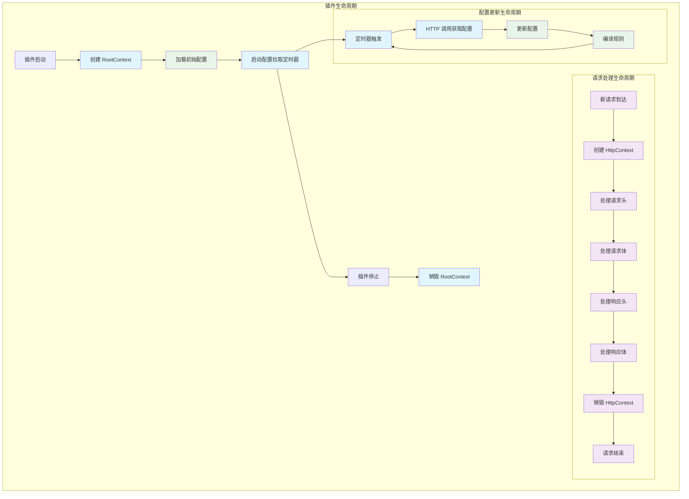
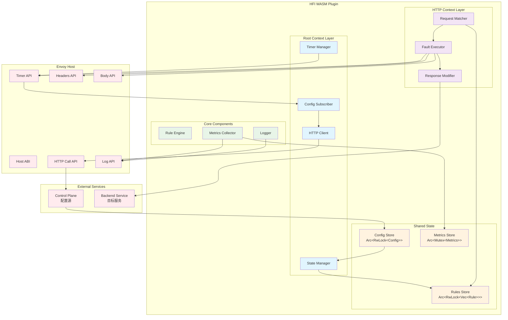

# WASM 插件深度解析

本文档深入分析 HFI WASM 插件的架构设计、核心概念和实现细节，帮助开发者理解 proxy-wasm 框架的使用和高性能故障注入的实现原理。

## 📋 目录

- [核心概念与生命周期](#核心概念与生命周期)
- [模块架构图](#模块架构图)
- [核心模块详解](#核心模块详解)
- [性能与安全考量](#性能与安全考量)
- [代码导览](#代码导览)
- [关键实现技巧](#关键实现技巧)
- [故障排查指南](#故障排查指南)
- [开发最佳实践](#开发最佳实践)

## 🧠 核心概念与生命周期

### Proxy-WASM 核心概念

在 proxy-wasm 框架中，有两个核心上下文类型，它们有着不同的职责和生命周期：

#### RootContext vs HttpContext

```rust
// 位置: wasm-plugin/src/lib.rs

/// RootContext - 全局单例上下文
/// 职责: 配置管理、全局状态、定时器、HTTP 调用
/// 生命周期: 插件加载 -> 插件卸载
pub struct HfiFaultInjectionRoot {
    config: Arc<RwLock<PluginConfig>>,
    rules: Arc<RwLock<Vec<FaultRule>>>,
    http_client: ConfigClient,
    metrics: Metrics,
    last_config_update: u64,
}

/// HttpContext - 每个 HTTP 请求的上下文
/// 职责: 请求处理、故障注入执行、响应修改
/// 生命周期: 请求开始 -> 请求结束
pub struct HfiFaultInjectionHttp {
    root_context: Rc<RefCell<HfiFaultInjectionRoot>>,
    request_id: String,
    matched_rules: Vec<FaultRule>,
    fault_state: FaultState,
}
```

#### 生命周期详解



### 上下文间通信模式

```rust
impl RootContext for HfiFaultInjectionRoot {
    fn create_http_context(&self, context_id: u32) -> Option<Box<dyn HttpContext>> {
        Some(Box::new(HfiFaultInjectionHttp {
            // 共享配置和规则的只读引用
            root_context: self.clone(),
            context_id,
            request_id: generate_request_id(),
            matched_rules: Vec::new(),
            fault_state: FaultState::None,
        }))
    }
}

impl HttpContext for HfiFaultInjectionHttp {
    fn on_http_request_headers(&mut self, _: usize, _: bool) -> Action {
        // 从 RootContext 读取最新规则
        let rules = self.root_context.rules.read().unwrap();
        
        // 匹配规则并保存到当前上下文
        self.matched_rules = self.match_request_rules(&*rules);
        
        // 决定是否继续处理
        if self.matched_rules.is_empty() {
            Action::Continue
        } else {
            self.execute_fault()
        }
    }
}
```

## 🏗️ 模块架构图

### WASM 插件模块架构



## 🔧 核心模块详解

### Config Subscriber - 配置订阅器

**职责**: 异步配置拉取和更新管理

#### 实现架构

```rust
// 位置: wasm-plugin/src/config_subscriber.rs

pub struct ConfigSubscriber {
    endpoint: String,
    poll_interval: Duration,
    retry_config: RetryConfig,
    current_version: Option<String>,
    last_update: u64,
}

impl ConfigSubscriber {
    /// 启动配置拉取循环
    pub fn start_polling(&mut self) {
        // 设置初始定时器
        self.set_timer(self.poll_interval);
        log::info!("Config polling started, interval: {:?}", self.poll_interval);
    }
    
    /// 处理定时器触发
    pub fn on_timer(&mut self) {
        match self.fetch_config() {
            Ok(_) => {
                // 成功后重置重试状态
                self.retry_config.reset();
                self.set_timer(self.poll_interval);
            }
            Err(e) => {
                // 失败后使用退避重试
                let delay = self.retry_config.next_delay();
                log::warn!("Config fetch failed: {}, retrying in {:?}", e, delay);
                self.set_timer(delay);
            }
        }
    }
}
```

#### 退避重试机制

```rust
// 位置: wasm-plugin/src/config_subscriber.rs

#[derive(Debug, Clone)]
pub struct RetryConfig {
    base_delay: Duration,
    max_delay: Duration,
    multiplier: f64,
    current_attempt: u32,
    max_attempts: u32,
}

impl RetryConfig {
    pub fn next_delay(&mut self) -> Duration {
        if self.current_attempt >= self.max_attempts {
            return self.max_delay;
        }
        
        let delay = Duration::from_millis(
            (self.base_delay.as_millis() as f64 * 
             self.multiplier.powi(self.current_attempt as i32)) as u64
        );
        
        self.current_attempt += 1;
        delay.min(self.max_delay)
    }
    
    pub fn reset(&mut self) {
        self.current_attempt = 0;
    }
}
```

#### HTTP 调用处理

```rust
impl RootContext for HfiFaultInjectionRoot {
    fn on_http_call_response(
        &mut self,
        token_id: u32,
        num_headers: usize,
        body_size: usize,
        num_trailers: usize,
    ) {
        // 验证响应来源
        if !self.validate_token(token_id) {
            log::warn!("Received response for unknown token: {}", token_id);
            return;
        }
        
        // 解析响应体
        match self.get_http_call_response_body(0, body_size) {
            Some(body) => {
                match self.parse_config_response(&body) {
                    Ok(new_config) => {
                        self.update_config(new_config);
                        log::info!("Config updated successfully");
                    }
                    Err(e) => {
                        log::error!("Failed to parse config response: {}", e);
                    }
                }
            }
            None => {
                log::error!("Failed to get response body");
            }
        }
    }
}
```

### State Manager - 状态管理器

**职责**: 线程安全的状态共享和管理

#### 共享状态设计

```rust
// 位置: wasm-plugin/src/state.rs

/// 插件全局状态
#[derive(Debug)]
pub struct PluginState {
    /// 当前配置 (读多写少，使用 RwLock)
    pub config: Arc<RwLock<PluginConfig>>,
    
    /// 编译后的规则集 (读多写少，使用 RwLock)
    pub rules: Arc<RwLock<Vec<CompiledRule>>>,
    
    /// 运行时指标 (频繁更新，使用 Mutex)
    pub metrics: Arc<Mutex<PluginMetrics>>,
    
    /// 请求计数器 (原子操作)
    pub request_counter: Arc<AtomicU64>,
}

impl PluginState {
    pub fn new() -> Self {
        Self {
            config: Arc::new(RwLock::new(PluginConfig::default())),
            rules: Arc::new(RwLock::new(Vec::new())),
            metrics: Arc::new(Mutex::new(PluginMetrics::new())),
            request_counter: Arc::new(AtomicU64::new(0)),
        }
    }
    
    /// 更新配置和规则 (写操作)
    pub fn update_config(&self, new_config: PluginConfig) -> Result<(), Box<dyn std::error::Error>> {
        // 编译新规则
        let compiled_rules = self.compile_rules(&new_config.rules)?;
        
        // 原子性更新
        {
            let mut config = self.config.write().unwrap();
            let mut rules = self.rules.write().unwrap();
            
            *config = new_config;
            *rules = compiled_rules;
        }
        
        log::info!("Config and rules updated successfully");
        Ok(())
    }
    
    /// 获取当前规则 (读操作)
    pub fn get_rules(&self) -> Vec<CompiledRule> {
        self.rules.read().unwrap().clone()
    }
}
```

#### 读写锁性能优化

```rust
impl PluginState {
    /// 高性能规则匹配 (避免长时间持锁)
    pub fn match_rules(&self, request: &HttpRequest) -> Vec<CompiledRule> {
        // 快速获取规则快照，释放锁
        let rules_snapshot = {
            let rules_guard = self.rules.read().unwrap();
            rules_guard.clone()  // 克隆规则集，立即释放锁
        };
        
        // 在锁外进行匹配计算
        rules_snapshot
            .into_iter()
            .filter(|rule| rule.matches(request))
            .collect()
    }
    
    /// 批量指标更新 (减少锁竞争)
    pub fn update_metrics_batch(&self, updates: Vec<MetricUpdate>) {
        let mut metrics = self.metrics.lock().unwrap();
        for update in updates {
            metrics.apply_update(update);
        }
    }
}
```

### Request Matcher - 请求匹配器

**职责**: 高性能的无状态请求匹配

#### 无状态设计

```rust
// 位置: wasm-plugin/src/matcher.rs

/// 请求匹配器 - 完全无状态
pub struct RequestMatcher;

impl RequestMatcher {
    /// 匹配单个规则 (纯函数，无副作用)
    pub fn match_rule(request: &HttpRequest, rule: &CompiledRule) -> bool {
        // 短路评估 - 最快的检查优先
        if !Self::match_method(&request.method, &rule.method_matcher) {
            return false;
        }
        
        if !Self::match_path(&request.path, &rule.path_matcher) {
            return false;
        }
        
        if !Self::match_headers(&request.headers, &rule.header_matchers) {
            return false;
        }
        
        // 最昂贵的检查放在最后
        if !Self::match_body(&request.body, &rule.body_matcher) {
            return false;
        }
        
        true
    }
}
```

#### 正则表达式预编译优化

```rust
/// 编译时优化的规则
#[derive(Debug, Clone)]
pub struct CompiledRule {
    pub id: String,
    pub priority: u32,
    
    // 预编译的匹配器
    pub method_matcher: MethodMatcher,
    pub path_matcher: PathMatcher,
    pub header_matchers: Vec<HeaderMatcher>,
    pub body_matcher: Option<BodyMatcher>,
    
    // 故障配置
    pub fault: FaultConfig,
}

#[derive(Debug, Clone)]
pub enum PathMatcher {
    Exact(String),
    Prefix(String),
    Regex(regex::Regex),  // 预编译的正则表达式
}

impl PathMatcher {
    pub fn matches(&self, path: &str) -> bool {
        match self {
            PathMatcher::Exact(pattern) => path == pattern,
            PathMatcher::Prefix(pattern) => path.starts_with(pattern),
            PathMatcher::Regex(regex) => regex.is_match(path),  // O(1) 匹配
        }
    }
}
```

#### 零分配匹配

```rust
impl RequestMatcher {
    /// 零分配的头部匹配
    pub fn match_headers(
        headers: &[(String, String)], 
        matchers: &[HeaderMatcher]
    ) -> bool {
        // 使用迭代器避免分配
        matchers.iter().all(|matcher| {
            headers.iter().any(|(name, value)| {
                matcher.name.eq_ignore_ascii_case(name) && 
                matcher.value_matcher.matches(value)
            })
        })
    }
    
    /// 使用 Cow 避免不必要的分配
    fn normalize_path(path: &str) -> Cow<str> {
        // 只在需要时才分配新字符串
        if path.contains("//") || path.contains("..") {
            Cow::Owned(Self::clean_path(path))
        } else {
            Cow::Borrowed(path)
        }
    }
}
```

### Fault Executor - 故障执行器

**职责**: 将声明式故障配置转换为 Host ABI 调用

#### 故障执行架构

```rust
// 位置: wasm-plugin/src/fault_executor.rs

pub struct FaultExecutor {
    context_id: u32,
    request_id: String,
}

impl FaultExecutor {
    /// 执行故障注入
    pub fn execute_fault(&mut self, fault: &FaultConfig) -> Action {
        match fault {
            FaultConfig::Delay(delay_config) => {
                self.execute_delay(delay_config)
            }
            FaultConfig::Abort(abort_config) => {
                self.execute_abort(abort_config)
            }
            FaultConfig::RateLimit(rate_config) => {
                self.execute_rate_limit(rate_config)
            }
        }
    }
}
```

#### 延迟故障的跨上下文实现

延迟故障是最复杂的实现，因为它需要跨越多个回调：

```rust
impl FaultExecutor {
    /// 执行延迟故障 - 复杂的跨上下文实现
    fn execute_delay(&mut self, delay_config: &DelayConfig) -> Action {
        let delay_ms = Self::calculate_delay(delay_config);
        
        if delay_ms == 0 {
            return Action::Continue;
        }
        
        // 1. 设置定时器 (在 RootContext 中)
        let timer_token = self.set_timer(Duration::from_millis(delay_ms));
        
        // 2. 保存上下文状态
        self.save_delay_state(DelayState {
            timer_token,
            original_context_id: self.context_id,
            start_time: self.get_current_time(),
        });
        
        // 3. 暂停请求处理
        Action::Pause
    }
    
    /// 定时器回调 (在 RootContext 中)
    fn on_timer_for_delay(&mut self, timer_token: u32) {
        if let Some(delay_state) = self.get_delay_state(timer_token) {
            // 4. 恢复请求处理
            self.resume_request(delay_state.original_context_id);
            
            // 5. 记录延迟指标
            let actual_delay = self.get_current_time() - delay_state.start_time;
            self.record_delay_metric(actual_delay);
            
            // 6. 清理状态
            self.cleanup_delay_state(timer_token);
        }
    }
}
```

#### Host ABI 调用映射

```rust
impl FaultExecutor {
    /// 中断故障 - 直接响应
    fn execute_abort(&mut self, abort_config: &AbortConfig) -> Action {
        let status_code = Self::calculate_status_code(abort_config);
        let response_body = abort_config.body.as_deref().unwrap_or("Fault injected");
        
        // 调用 Host ABI 发送本地响应
        self.send_http_response(
            status_code,
            vec![
                ("content-type", "text/plain"),
                ("x-fault-injected", "true"),
            ],
            Some(response_body.as_bytes()),
        );
        
        Action::Pause  // 停止后续处理
    }
    
    /// 速率限制 - 修改响应头
    fn execute_rate_limit(&mut self, rate_config: &RateLimitConfig) -> Action {
        if self.should_rate_limit(rate_config) {
            // 添加限流响应头
            self.add_http_response_header("x-rate-limited", "true");
            self.add_http_response_header(
                "retry-after", 
                &rate_config.retry_after.to_string()
            );
            
            // 返回 429 状态码
            self.send_http_response(
                429,
                vec![("x-fault-injected", "rate-limit")],
                Some(b"Rate limit exceeded"),
            );
            
            Action::Pause
        } else {
            Action::Continue
        }
    }
}
```

#### 概率计算优化

```rust
impl FaultExecutor {
    /// 高性能概率计算
    fn calculate_delay(config: &DelayConfig) -> u64 {
        // 使用预计算的概率阈值
        let random_value = Self::fast_random() % 10000;  // 0-9999
        
        if random_value < config.percentage_threshold {
            // 使用预计算的延迟分布
            match config.distribution {
                DelayDistribution::Fixed(ms) => ms,
                DelayDistribution::Uniform { min, max } => {
                    min + (Self::fast_random() % (max - min))
                }
                DelayDistribution::Normal { mean, stddev } => {
                    Self::box_muller_sample(mean, stddev)
                }
            }
        } else {
            0
        }
    }
    
    /// 快速伪随机数生成 (避免系统调用)
    fn fast_random() -> u64 {
        // 使用 xorshift 算法
        static mut SEED: u64 = 1;
        unsafe {
            SEED ^= SEED << 13;
            SEED ^= SEED >> 7;
            SEED ^= SEED << 17;
            SEED
        }
    }
}
```

## ⚡ 性能与安全考量

### 性能优化策略

#### 1. 零分配设计

```rust
// 避免不必要的字符串分配
impl RequestMatcher {
    fn match_path_zero_alloc(path: &str, pattern: &str) -> bool {
        // 使用字符串切片，避免分配
        match pattern.find('*') {
            Some(wildcard_pos) => {
                let prefix = &pattern[..wildcard_pos];
                let suffix = &pattern[wildcard_pos + 1..];
                path.starts_with(prefix) && path.ends_with(suffix)
            }
            None => path == pattern,
        }
    }
    
    /// 零拷贝头部解析
    fn parse_headers_zero_copy(raw_headers: &[u8]) -> impl Iterator<Item = (&str, &str)> {
        raw_headers
            .split(|&b| b == b'\n')
            .filter_map(|line| {
                let line_str = std::str::from_utf8(line).ok()?;
                let colon_pos = line_str.find(':')?;
                Some((
                    line_str[..colon_pos].trim(),
                    line_str[colon_pos + 1..].trim(),
                ))
            })
    }
}
```

#### 2. 短路评估

```rust
impl RequestMatcher {
    /// 短路评估优化 - 最快的检查优先
    pub fn quick_match(request: &HttpRequest, rule: &CompiledRule) -> bool {
        // 1. 最快：字符串相等比较
        if rule.method != MethodPattern::Any && 
           request.method != rule.method {
            return false;
        }
        
        // 2. 较快：前缀匹配
        if !request.path.starts_with(&rule.path_prefix) {
            return false;
        }
        
        // 3. 中等：头部查找
        if !rule.required_headers.is_empty() {
            if !Self::has_required_headers(&request.headers, &rule.required_headers) {
                return false;
            }
        }
        
        // 4. 最慢：正则表达式匹配
        if let Some(ref regex) = rule.path_regex {
            if !regex.is_match(&request.path) {
                return false;
            }
        }
        
        true
    }
}
```

#### 3. 内存池和对象复用

```rust
// 对象池减少分配
pub struct RequestPool {
    pool: Vec<HttpRequest>,
    in_use: usize,
}

impl RequestPool {
    pub fn get_request(&mut self) -> HttpRequest {
        if self.in_use < self.pool.len() {
            let request = self.pool.swap_remove(self.in_use);
            self.in_use += 1;
            request.reset()  // 重置状态
        } else {
            HttpRequest::new()  // 只在必要时分配
        }
    }
    
    pub fn return_request(&mut self, request: HttpRequest) {
        if self.in_use > 0 {
            self.in_use -= 1;
            self.pool.push(request);
        }
    }
}
```

### 安全考量

#### 1. Panic-Safe 设计

WASM 插件必须是 panic-safe 的，因为 panic 会导致整个代理进程崩溃：

```rust
// 位置: wasm-plugin/src/lib.rs

/// 全局 panic hook - 捕获所有 panic
fn setup_panic_hook() {
    std::panic::set_hook(Box::new(|panic_info| {
        let location = panic_info.location().unwrap_or_else(|| {
            std::panic::Location::caller()
        });
        
        let message = if let Some(s) = panic_info.payload().downcast_ref::<&str>() {
            s
        } else if let Some(s) = panic_info.payload().downcast_ref::<String>() {
            s
        } else {
            "Unknown panic occurred"
        };
        
        // 记录 panic 信息但不中断程序
        log::error!(
            "PANIC in WASM plugin at {}:{}: {}",
            location.file(),
            location.line(),
            message
        );
        
        // 发送紧急指标
        if let Ok(mut metrics) = GLOBAL_METRICS.lock() {
            metrics.panic_count += 1;
        }
    }));
}
```

#### 2. 安全的错误处理

```rust
impl FaultExecutor {
    /// 安全的故障执行 - 永不 panic
    pub fn safe_execute_fault(&mut self, fault: &FaultConfig) -> Action {
        std::panic::catch_unwind(AssertUnwindSafe(|| {
            match fault {
                FaultConfig::Delay(config) => {
                    self.execute_delay_safe(config)
                        .unwrap_or_else(|e| {
                            log::error!("Delay execution failed: {}", e);
                            Action::Continue  // 失败时继续处理
                        })
                }
                FaultConfig::Abort(config) => {
                    self.execute_abort_safe(config)
                        .unwrap_or_else(|e| {
                            log::error!("Abort execution failed: {}", e);
                            Action::Continue
                        })
                }
                _ => Action::Continue,
            }
        }))
        .unwrap_or_else(|_| {
            log::error!("Fault execution panicked, continuing");
            Action::Continue
        })
    }
    
    /// 防御性编程 - 验证所有输入
    fn execute_delay_safe(&mut self, config: &DelayConfig) -> Result<Action, Box<dyn std::error::Error>> {
        // 验证配置参数
        if config.percentage < 0.0 || config.percentage > 100.0 {
            return Err("Invalid delay percentage".into());
        }
        
        if config.fixed_delay_ms > MAX_DELAY_MS {
            return Err("Delay too large".into());
        }
        
        // 安全的执行逻辑
        let delay_ms = self.calculate_delay_safe(config)?;
        if delay_ms > 0 {
            self.set_timer_safe(delay_ms)?;
            Ok(Action::Pause)
        } else {
            Ok(Action::Continue)
        }
    }
}
```

#### 3. 资源限制和防护

```rust
/// 资源使用限制
pub struct ResourceLimits {
    max_concurrent_delays: usize,
    max_memory_usage: usize,
    max_timer_duration: Duration,
    max_rules_per_request: usize,
}

impl FaultExecutor {
    /// 检查资源限制
    fn check_resource_limits(&self) -> Result<(), ResourceError> {
        // 检查并发延迟数量
        if self.active_delays.len() >= self.limits.max_concurrent_delays {
            return Err(ResourceError::TooManyDelays);
        }
        
        // 检查内存使用
        if self.estimate_memory_usage() >= self.limits.max_memory_usage {
            return Err(ResourceError::MemoryExhausted);
        }
        
        Ok(())
    }
    
    /// 估算内存使用
    fn estimate_memory_usage(&self) -> usize {
        std::mem::size_of_val(self) + 
        self.active_delays.len() * std::mem::size_of::<DelayState>() +
        self.matched_rules.len() * std::mem::size_of::<CompiledRule>()
    }
}
```

## 📂 代码导览

### 目录结构

```
wasm-plugin/
├── src/
│   ├── lib.rs                  # 插件入口点和主要上下文
│   ├── config/                 # 配置管理模块
│   │   ├── mod.rs             # 配置类型定义
│   │   ├── subscriber.rs       # 配置订阅器
│   │   └── parser.rs          # 配置解析器
│   ├── matching/               # 请求匹配模块
│   │   ├── mod.rs             # 匹配器接口
│   │   ├── request_matcher.rs  # 请求匹配逻辑
│   │   ├── rule_compiler.rs    # 规则编译器
│   │   └── patterns.rs        # 匹配模式实现
│   ├── execution/              # 故障执行模块
│   │   ├── mod.rs             # 执行器接口
│   │   ├── fault_executor.rs   # 故障执行器
│   │   ├── delay.rs           # 延迟故障实现
│   │   ├── abort.rs           # 中断故障实现
│   │   └── rate_limit.rs      # 限流故障实现
│   ├── state/                  # 状态管理模块
│   │   ├── mod.rs             # 状态类型定义
│   │   ├── shared_state.rs    # 共享状态管理
│   │   └── metrics.rs         # 指标收集
│   ├── utils/                  # 工具模块
│   │   ├── mod.rs             # 工具函数
│   │   ├── logging.rs         # 日志工具
│   │   ├── random.rs          # 随机数生成
│   │   └── time.rs            # 时间工具
│   └── types/                  # 类型定义
│       ├── mod.rs             # 公共类型
│       ├── request.rs         # 请求类型
│       ├── fault.rs           # 故障类型
│       └── config.rs          # 配置类型
├── Cargo.toml                 # 项目配置
└── build.rs                   # 构建脚本
```

### 关键代码位置

#### 插件入口点
**文件**: `wasm-plugin/src/lib.rs`
```rust
/// 插件主入口点
#[no_mangle]
pub extern "C" fn _start() {
    proxy_wasm::set_log_level(log::Level::Info);
    proxy_wasm::set_root_context(|_| -> Box<dyn RootContext> {
        Box::new(HfiFaultInjectionRoot::new())
    });
}

/// RootContext 实现 (第 50-150 行)
impl RootContext for HfiFaultInjectionRoot {
    fn on_configure(&mut self, _plugin_configuration_size: usize) -> bool;
    fn on_tick(&mut self);
    fn on_http_call_response(&mut self, token_id: u32, ...);
    fn create_http_context(&self, context_id: u32) -> Option<Box<dyn HttpContext>>;
}

/// HttpContext 实现 (第 200-350 行)  
impl HttpContext for HfiFaultInjectionHttp {
    fn on_http_request_headers(&mut self, num_headers: usize, end_of_stream: bool) -> Action;
    fn on_http_request_body(&mut self, body_size: usize, end_of_stream: bool) -> Action;
}
```

#### 配置订阅逻辑
**文件**: `wasm-plugin/src/config/subscriber.rs`
```rust
/// 配置拉取实现 (第 80-120 行)
impl ConfigSubscriber {
    pub fn fetch_config(&mut self) -> Result<(), ConfigError>;
    fn handle_config_response(&mut self, response: &[u8]) -> Result<(), ConfigError>;
}
```

#### 请求匹配核心
**文件**: `wasm-plugin/src/matching/request_matcher.rs`
```rust
/// 核心匹配逻辑 (第 45-95 行)
impl RequestMatcher {
    pub fn match_rules(&self, request: &HttpRequest, rules: &[CompiledRule]) -> Vec<&CompiledRule>;
    fn match_single_rule(&self, request: &HttpRequest, rule: &CompiledRule) -> bool;
}
```

#### 故障执行引擎
**文件**: `wasm-plugin/src/execution/fault_executor.rs`
```rust
/// 故障执行核心 (第 60-150 行)
impl FaultExecutor {
    pub fn execute_fault(&mut self, fault: &FaultConfig) -> Action;
    fn execute_delay(&mut self, delay_config: &DelayConfig) -> Action;
    fn execute_abort(&mut self, abort_config: &AbortConfig) -> Action;
}
```

#### 状态管理核心
**文件**: `wasm-plugin/src/state/shared_state.rs`
```rust
/// 共享状态实现 (第 25-85 行)
impl PluginState {
    pub fn update_config(&self, config: PluginConfig) -> Result<(), ConfigError>;
    pub fn get_rules(&self) -> Vec<CompiledRule>;
    pub fn match_request(&self, request: &HttpRequest) -> Vec<CompiledRule>;
}
```

## 🔬 关键实现技巧

### 1. 延迟故障的状态机

```rust
#[derive(Debug, Clone)]
enum DelayState {
    None,
    Pending {
        timer_token: u32,
        start_time: u64,
        expected_delay: u64,
    },
    Completed {
        actual_delay: u64,
    },
}

impl FaultExecutor {
    fn handle_delay_state_machine(&mut self, event: DelayEvent) -> Action {
        match (&self.delay_state, event) {
            (DelayState::None, DelayEvent::Start(config)) => {
                let timer_token = self.set_timer(config.delay);
                self.delay_state = DelayState::Pending {
                    timer_token,
                    start_time: self.get_current_time(),
                    expected_delay: config.delay,
                };
                Action::Pause
            }
            (DelayState::Pending { timer_token, .. }, DelayEvent::TimerFired(token)) 
                if *timer_token == token => {
                self.delay_state = DelayState::Completed {
                    actual_delay: self.get_current_time() - self.start_time,
                };
                Action::Continue
            }
            _ => Action::Continue,  // 忽略无效状态转换
        }
    }
}
```

### 2. 高效的规则匹配缓存

```rust
use std::collections::HashMap;

pub struct MatchCache {
    cache: HashMap<u64, Vec<usize>>,  // 请求哈希 -> 匹配的规则索引
    max_size: usize,
    hit_count: u64,
    miss_count: u64,
}

impl MatchCache {
    pub fn get_matches(&mut self, request: &HttpRequest) -> Option<&Vec<usize>> {
        let hash = self.hash_request(request);
        if let Some(matches) = self.cache.get(&hash) {
            self.hit_count += 1;
            Some(matches)
        } else {
            self.miss_count += 1;
            None
        }
    }
    
    pub fn insert_matches(&mut self, request: &HttpRequest, matches: Vec<usize>) {
        if self.cache.len() >= self.max_size {
            self.evict_oldest();
        }
        
        let hash = self.hash_request(request);
        self.cache.insert(hash, matches);
    }
    
    /// 快速哈希计算
    fn hash_request(&self, request: &HttpRequest) -> u64 {
        use std::collections::hash_map::DefaultHasher;
        use std::hash::{Hash, Hasher};
        
        let mut hasher = DefaultHasher::new();
        request.method.hash(&mut hasher);
        request.path.hash(&mut hasher);
        // 只哈希关键头部，避免过度计算
        for (name, value) in &request.headers {
            if CACHEABLE_HEADERS.contains(name.as_str()) {
                name.hash(&mut hasher);
                value.hash(&mut hasher);
            }
        }
        hasher.finish()
    }
}
```

### 3. 动态故障概率调整

```rust
pub struct AdaptiveProbability {
    base_percentage: f64,
    current_percentage: f64,
    success_count: u64,
    failure_count: u64,
    adjustment_factor: f64,
}

impl AdaptiveProbability {
    /// 根据系统负载动态调整故障概率
    pub fn adjust_probability(&mut self, system_load: f64) {
        let load_factor = if system_load > 0.8 {
            0.5  // 高负载时减少故障注入
        } else if system_load < 0.3 {
            1.5  // 低负载时增加故障注入
        } else {
            1.0  // 正常负载
        };
        
        self.current_percentage = (self.base_percentage * load_factor)
            .min(100.0)
            .max(0.0);
    }
    
    /// 基于成功率的自适应调整
    pub fn adjust_based_on_success_rate(&mut self) {
        let total_requests = self.success_count + self.failure_count;
        if total_requests > 1000 {  // 有足够样本
            let success_rate = self.success_count as f64 / total_requests as f64;
            
            if success_rate > 0.95 {
                // 成功率过高，增加故障注入
                self.current_percentage *= 1.1;
            } else if success_rate < 0.8 {
                // 成功率过低，减少故障注入
                self.current_percentage *= 0.9;
            }
            
            // 重置计数器
            self.success_count = 0;
            self.failure_count = 0;
        }
    }
}
```

## 🔧 故障排查指南

### 1. 常见问题诊断

#### 配置无法更新
```rust
// 诊断代码: wasm-plugin/src/config/subscriber.rs
impl ConfigSubscriber {
    pub fn diagnose_config_issues(&self) -> String {
        let mut issues = Vec::new();
        
        // 检查网络连接
        if self.last_successful_fetch.elapsed() > Duration::from_secs(300) {
            issues.push("No successful config fetch in 5 minutes");
        }
        
        // 检查解析错误
        if self.parse_errors > 5 {
            issues.push("Multiple config parse errors");
        }
        
        // 检查重试状态
        if self.retry_count > 10 {
            issues.push("Excessive retry attempts");
        }
        
        if issues.is_empty() {
            "Config system healthy".to_string()
        } else {
            format!("Issues found: {}", issues.join(", "))
        }
    }
}
```

#### 性能问题排查
```rust
impl PluginMetrics {
    pub fn generate_performance_report(&self) -> String {
        format!(
            "Performance Report:\n\
             - Request processing time: avg={}ms, p95={}ms, p99={}ms\n\
             - Rule matching time: avg={}µs, max={}µs\n\
             - Memory usage: current={}KB, peak={}KB\n\
             - Cache hit rate: {:.2}%\n\
             - Error rate: {:.2}%",
            self.avg_request_time_ms,
            self.p95_request_time_ms,
            self.p99_request_time_ms,
            self.avg_matching_time_us,
            self.max_matching_time_us,
            self.current_memory_kb,
            self.peak_memory_kb,
            self.cache_hit_rate * 100.0,
            self.error_rate * 100.0,
        )
    }
}
```

### 2. 调试工具

```rust
#[cfg(debug_assertions)]
mod debug_tools {
    use super::*;
    
    pub fn dump_plugin_state(state: &PluginState) -> String {
        serde_json::to_string_pretty(&DebugState {
            config_version: state.config.read().unwrap().version.clone(),
            rules_count: state.rules.read().unwrap().len(),
            active_delays: state.get_active_delays_count(),
            memory_usage: state.estimate_memory_usage(),
        }).unwrap_or_else(|_| "Failed to serialize state".to_string())
    }
    
    pub fn trace_request_processing(request: &HttpRequest, rules: &[CompiledRule]) {
        log::debug!("Processing request: {} {}", request.method, request.path);
        
        for (i, rule) in rules.iter().enumerate() {
            let matches = RequestMatcher::match_rule(request, rule);
            log::debug!("Rule {}: {} -> {}", i, rule.name, matches);
        }
    }
}
```

## 📝 开发最佳实践

### 1. 性能优化清单

- ✅ **避免分配**: 使用 `&str` 而不是 `String`
- ✅ **预编译正则**: 在配置更新时编译，运行时直接使用
- ✅ **短路评估**: 最快的检查放在前面
- ✅ **对象复用**: 使用对象池减少 GC 压力
- ✅ **缓存匹配**: 缓存常见请求的匹配结果
- ✅ **批量操作**: 批量更新指标和状态

### 2. 安全编程规范

- ✅ **永不 panic**: 使用 `Result` 类型处理所有错误
- ✅ **输入验证**: 验证所有来自外部的数据
- ✅ **资源限制**: 限制内存使用和并发操作
- ✅ **优雅降级**: 故障时继续基本功能
- ✅ **防御编程**: 假设所有输入都可能无效

### 3. 测试策略

```rust
#[cfg(test)]
mod tests {
    use super::*;
    
    #[test]
    fn test_request_matching_performance() {
        let rules = generate_test_rules(1000);
        let request = generate_test_request();
        
        let start = std::time::Instant::now();
        let matches = RequestMatcher::match_rules(&request, &rules);
        let duration = start.elapsed();
        
        assert!(duration < std::time::Duration::from_micros(100));
        assert!(!matches.is_empty());
    }
    
    #[test]
    fn test_fault_execution_safety() {
        let mut executor = FaultExecutor::new(1);
        
        // 测试异常配置不会导致 panic
        let invalid_config = FaultConfig::Delay(DelayConfig {
            percentage: -1.0,  // 无效值
            fixed_delay_ms: u64::MAX,  // 极大值
        });
        
        let result = executor.safe_execute_fault(&invalid_config);
        assert_eq!(result, Action::Continue);  // 应该继续处理
    }
}
```

## 📊 总结

HFI WASM 插件采用了高度优化的架构设计，关键特性包括：

1. **双上下文架构**: RootContext 负责全局状态，HttpContext 负责请求处理
2. **零分配设计**: 最小化内存分配，提升性能
3. **Panic-Safe**: 完全的错误处理，确保代理稳定性
4. **状态共享**: 使用 Arc<RwLock> 实现线程安全的状态管理
5. **跨上下文故障**: 复杂的定时器机制实现延迟故障

这些设计使得插件能够在高并发环境下稳定运行，同时提供精确的故障注入功能。

---

**相关文档**:
- [系统架构文档](ARCHITECTURE.md)
- [Control Plane 深度解析](CONTROL_PLANE_DEEP_DIVE.md)
- [WASM 插件设计文档](design_doc/Design_2_Wasm_plugin.md)
- [本地开发指南](DEVELOPMENT.md)
