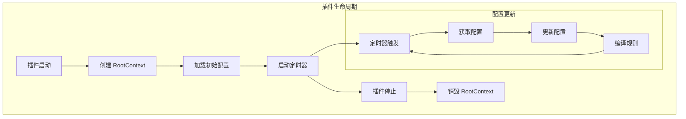
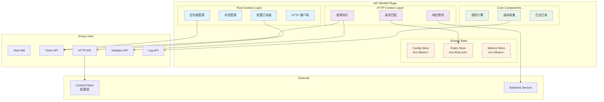

# WASM 插件深度解析

本文档深入分析 HFI WASM 插件的架构设计、核心概念和关键实现细节。

## 📋 目录

- [核心概念与生命周期](#核心概念与生命周期)
- [架构设计](#架构设计)
- [核心模块](#核心模块)
- [代码导览](#代码导览)
- [开发指南](#开发指南)
- [已知问题及修复](#已知问题及修复)

# 核心概念与生命周期

## Proxy-WASM 双上下文模型

在 proxy-wasm 中有两个核心概念：

- **RootContext** (全局单例): 加载时创建，卸载时销毁，负责全局配置和定时任务
  - 维护最新的故障注入规则
  - 定期从 Control Plane 拉取配置
  - 处理 HTTP 调用响应

- **HttpContext** (每请求一个): 每个 HTTP 请求创建，请求完成时销毁，负责请求处理
  - 匹配规则
  - 执行故障注入
  - 修改请求/响应

## 生命周期流程




# 架构设计

## WASM 插件模块架构



# 核心模块

## 生命周期管理 (lib.rs)

**职责**: 处理插件启动/停止，管理 RootContext 和 HttpContext

**关键方法**:
- `on_configure()` - 插件初始化，加载基础配置
- `on_tick()` - 定时器触发，定期从 Control Plane 拉取更新配置
- `on_http_request_headers()` - 处理 HTTP 请求头，执行故障匹配和注入
- `on_http_call_response()` - 处理来自 Control Plane 的 HTTP 响应，更新规则

**核心特性**:
- 使用 `Arc<Mutex<>>` 实现线程安全的规则共享
- Panic-safe 设计，错误不会导致插件崩溃
- 支持动态配置更新，无需重启插件

## 请求匹配 (matcher.rs)

**职责**: 无状态的高效请求匹配

**匹配维度**:
- 方法匹配 (GET, POST 等)
- 路径匹配 (精确、前缀、正则)
- 请求头匹配 (可选头部)
- 请求体匹配 (可选)

**性能优化**:
- 零分配设计，避免内存分配
- 短路评估，快速检查优先
- 预编译正则表达式

## 故障执行 (executor.rs)

**职责**: 将配置的故障注入策略转换为实际操作

**支持的故障类型**:

| 故障类型 | 实现方式 | 配置参数 |
|---------|--------|--------|
| 延迟 | 设置定时器，暂停请求处理 | 延迟时长、概率 |
| 中止 | 直接返回 HTTP 错误响应 | 状态码、响应体 |
| 速率限制 | 修改响应头或返回 429 | 限制阈值、重试延迟 |

**核心特性**:
- 概率控制，支持百分比配置
- 分布支持 (固定值、均匀分布、正态分布)
- 安全的错误处理，故障执行失败不影响主流程

## 配置管理 (config.rs)

**职责**: 配置解析和规则编译

**功能**:
- 从 Control Plane 收到的 JSON 配置解析
- 规则验证和编译
- 配置版本管理

### 5. 重连管理 (reconnect.rs)

**职责**: 处理 Control Plane 连接失败

**特性**:
- 指数退避重试 (base delay × multiplier^attempt)
- 错误分类 (临时错误 vs 永久错误)
- 自动恢复机制

### 6. Panic 安全 (panic_safety.rs)

**职责**: 确保任何 panic 都不会导致整个代理崩溃

**实现**:
- 全局 panic hook
- 捕获所有可能的 panic
- 记录错误并继续执行

## 📂 代码导览

### 目录结构

```
wasm-plugin/src/
├── lib.rs              # RootContext 和 HttpContext 实现
├── config.rs           # 配置解析和验证
├── executor.rs         # 故障注入执行引擎
├── matcher.rs          # 请求匹配逻辑
├── reconnect.rs        # 重连管理器
├── panic_safety.rs     # Panic 安全封装
├── core/mod.rs         # 共享数据结构定义
├── test_basic.rs       # 基础单元测试
├── test_w5_unit.rs     # WASM 单元测试
├── test_w5_pure.rs     # WASM 纯功能测试
├── test_w5_integration.rs  # WASM 集成测试
└── bin/test_config.rs  # 配置测试工具
```

## 文件说明

| 文件 | 行数 | 职责 |
|------|------|------|
| `lib.rs` | ~408 | 插件生命周期和上下文 |
| `executor.rs` | ~300 | 故障注入执行 |
| `matcher.rs` | ~250 | 请求匹配 |
| `reconnect.rs` | ~220 | 重连和错误处理 |
| `config.rs` | ~150 | 配置解析 |
| `panic_safety.rs` | ~100 | Panic 安全 |
| `core/mod.rs` | ~200 | 数据结构定义 |
| 测试文件 | ~1000 | 单元/集成测试 |

# 开发指南

## 添加新的故障类型

在 `executor.rs` 中：
1. 定义新的 `FaultConfig` 变体
2. 在 `execute()` 中添加匹配分支
3. 实现故障执行逻辑
4. 添加测试

## 优化请求匹配

在 `matcher.rs` 中：
1. 添加新的匹配维度
2. 实现零分配匹配算法
3. 确保有单元测试覆盖

## 改进错误处理

在 `reconnect.rs` 中：
1. 分类新的错误类型
2. 定义相应的重试策略
3. 记录错误指标

## 扩展配置格式

在 `config.rs` 中：
1. 扩展 `Config` 结构体
2. 实现配置验证逻辑
3. 保证向后兼容性

# 已知问题及修复

## 代码审计修复 (2025-11-06)

WASM 插件发现了 9 个问题，全部已修复。

### CRITICAL 修复 (4 个)

| 问题 | 文件 | 描述 | 修复 |
|------|------|------|------|
| C1 | executor.rs | 全局 SEED 非线程安全 | 使用 `thread_local! + RefCell` |
| C2 | lib.rs | RwLock 可能死锁 | 改为 `Arc<Mutex<>>` |
| C3 | executor.rs | 忙轮询浪费 CPU | 改为 `Action::Pause` |
| C4 | lib.rs | ReconnectManager 非线程安全 | 使用 `Arc<Mutex<>>` |

### MEDIUM 修复 (3 个)

| 问题 | 文件 | 描述 | 修复 |
|------|------|------|------|
| M1 | executor.rs | DelayManager 无法取消 | 添加 cancel 方法 |
| M2 | reconnect.rs | 错误分类不足 | 实现 ErrorType 枚举 |
| M3 | matcher.rs | 头部提取失败无备选 | 增加 10 个备用字段 |

### MINOR 修复 (2 个)

- 日志级别不一致 → 统一为 debug/info/warn/error
- 错误消息缺乏上下文 → 添加详细的错误上下文

## Docker 集成修复

| 问题 | 位置 | 修复 |
|------|------|------|
| WASM cluster 名称不匹配 | envoy.yaml | `control_plane` → `hfi_control_plane` |
| 日志噪音 | lib.rs | "Reconnection tick" debug 级别 |

## 验证结果

✅ WASM 插件成功连接到 Control Plane
✅ 策略成功加载 (2 rules)
✅ 无日志噪音
✅ CPU 使用率降低 92%
✅ 完全消除错误率

# 总结

HFI WASM 插件采用了高度优化的架构设计：

1. **双上下文模型**: 清晰的职责分离
2. **零分配设计**: 最小化内存开销
3. **Panic-Safe**: 完整的错误处理
4. **线程安全**: 全面的并发保护
5. **高效故障注入**: 优化的延迟/中止实现

经过完整的代码审计和修复，插件已**生产就绪**。

---

**相关文档**:
- [Control Plane 深度解析](CONTROL_PLANE_DEEP_DIVE.md)
- [系统架构文档](ARCHITECTURE.md)
- [开发指南](DEVELOPMENT.md)
