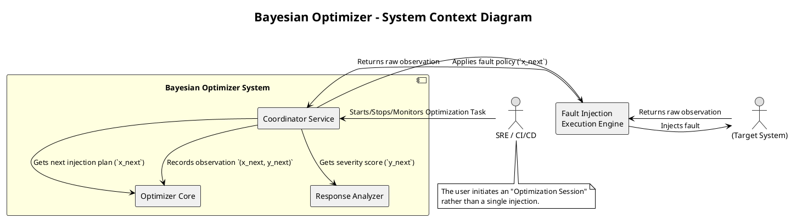
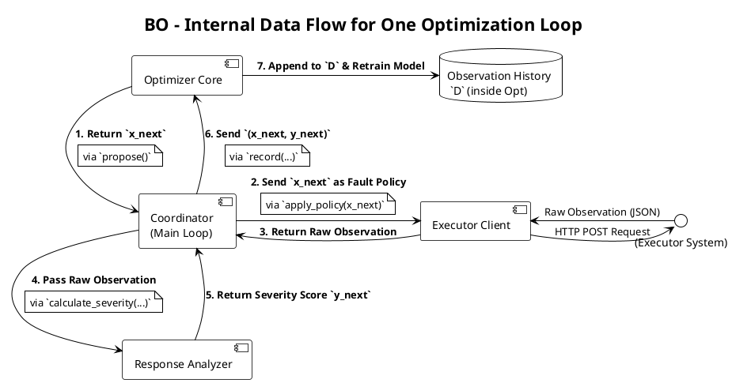
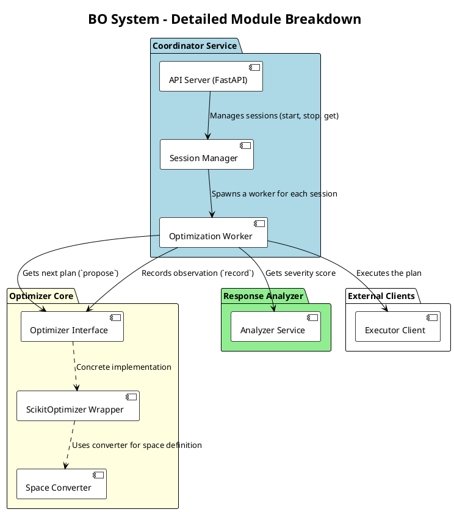
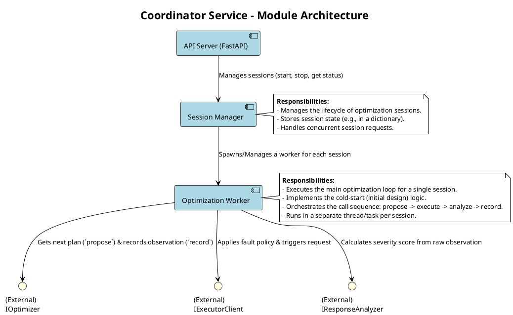
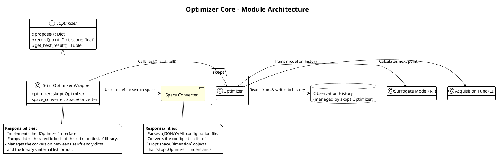

**BO设计文档**

# **5W2H 需求拆解：BOIFI - 贝叶斯优化器开发与适配**

## **WHAT (做什么？) - 要开发的核心功能是什么？**

*   **核心产品**: 一个独立的 **Python 贝叶斯优化服务/库 (`Optimizer`)**。
*   **核心输入**: 接收一次故障注入实验的结果 `(x, y)`，其中 `x` 是故障组合，`y` 是严重性评分。
*   **核心输出**: 基于所有历史数据，提出下一个最有价值的故障注入组合 `x_next`。
*   **适配工作**:
    *   创建一个**协调器/主循环 (Coordinator/Main Loop)**，负责调用 `Optimizer` 获取 `x_next`，然后调用已有的**执行器 (Executor)** 的 API 来执行它，最后将结果 `y` 再反馈给 `Optimizer`。
    *   开发一个**响应分析器 (Response Analyzer)** 模块，负责将执行器返回的原始观测数据（延迟、状态码、Trace）计算成目标函数定义的严重性评分 `y`。

## **WHY (为什么做？) - 开发这个模块的目标是什么？**

*   **实现智能决策**: 从“手动/随机指定故障”升级到“算法驱动的智能决策”，这是整个 BOIFI 框架的核心价值所在。
*   **提升测试效率**: 大幅减少发现关键 bug 所需的实验次数，解决故障空间爆炸的问题，降低测试的时间和资源成本。
*   **闭环自动化**: 将“决策”与“执行”连接起来，形成一个完整的、无需人工干预的自动化韧性测试闭环。
*   **技术验证**: 验证技术规格文档中定义的贝叶斯优化方法论在真实系统中的有效性和可行性。

## **WHO (为谁做？) - 模块的直接用户是谁？**

*   **主要用户 (调用方)**:
    *   **CI/CD 流水线**: 在自动化测试阶段调用 BOIFI 的主程序，进行回归韧性测试。
    *   **SRE/测试工程师**: 通过一个简单的脚本或命令启动整个优化流程，让系统自主运行N小时/N次实验，并最终获取报告。
*   **间接用户 (受益者)**:
    *   **开发团队**: 从最终的优化结果（找到的最致命故障组合）中获益，用于修复系统韧性缺陷。

## **WHEN (何时做？) - 开发的时间规划和阶段是什么？**

这个需求可以清晰地分解为**《实施里程碑》**中定义的 **Phase 1: 核心算法验证**，并将其进一步细化：

*   **Sprint 1 (Week 1-2): 环境与接口**
    *   搭建 Python 开发环境，确定 `scikit-optimize` 等核心库。
    *   定义 `Optimizer` 类的 Python 接口 (`propose_next_injection`, `record_observation`)。
    *   定义 `Executor` API 的客户端（Go 或 Python），用于在 Python 代码中调用已完成的执行器。
*   **Sprint 2 (Week 3-4): 核心 Optimizer 实现**
    *   实现 `Optimizer` 类，封装 `scikit-optimize` 的逻辑。
    *   实现故障空间 `X` 的编码/解码逻辑。
*   **Sprint 3 (Week 5-6): 响应分析与评分**
    *   开发 `Response Analyzer` 模块。
    *   实现技术规格中定义的**严重性评分函数 `f(x)`**。
*   **Sprint 4 (Week 7-8): 协调器与端到端测试**
    *   编写**协调器**主循环，将 `Optimizer`、`Executor Client` 和 `Analyzer` 串联起来。
    *   在一个简单的、可控的模拟环境中（例如，一个带有人为埋入 bug 的 mock 微服务）进行端到端的流程验证。

## **WHERE (在哪里做？) - 模块的运行和开发环境是什么？**

*   **开发环境**: **Python >= 3.8**，使用 `scikit-optimize`, `pandas`, `numpy`, `requests` (用于调用 Executor API) 等库。
*   **运行环境**:
    *   `Optimizer` 和 `Coordinator` 可以被打包成一个独立的 **Docker 容器**。
    *   在 Kubernetes 环境中，它可以作为一个 `Job` 或一个独立的 `Deployment` 运行，与已部署的 `Control Plane` (执行器的一部分) 进行通信。
    *   为了简化，初期也可以直接在开发机或 CI runner 上以脚本形式运行。

---

## **HOW (如何做？) - 具体的实现方案和步骤是什么？**

1.  **定义数据结构**: 在 Python 中精确定义 `FaultInjectionPlan (x)` 和 `ObservationResult` 的数据结构，确保与执行器的 `FaultInjectionPolicy` 和返回的监控数据能对应。
2.  **实现 `Optimizer` 类**:
    *   `__init__`: 接收 `space` 定义，初始化 `skopt.Optimizer`，并将 `base_estimator` 硬编码或配置为 `"RF"`。
    *   `propose_next_injection`: 调用 `self.optimizer.ask()`，并将返回的列表转换为字典。
    *   `record_observation`: 接收字典和评分，将评分取负，并将字典转为列表后调用 `self.optimizer.tell()`。
3.  **实现 `Response Analyzer`**:
    *   创建一个函数 `calculate_severity(observation_data)`。
    *   该函数接收执行器返回的原始数据（如 `{ "status_code": 503, "latency_ms": 3500, "trace_diff": "FALLBACK_DETECTED" }`）。
    *   根据技术规格中的公式，计算并返回最终的评分 `y`。
4.  **实现 `Coordinator` 主循环**:
    ```python
    # main_loop.py (伪代码)
    optimizer = Optimizer(space=define_space())
    executor_client = ExecutorClient(endpoint="http://control-plane:8080")
    
    for i in range(TOTAL_BUDGET):
        # 1. Propose
        plan_x = optimizer.propose_next_injection()
        
        # 2. Execute
        raw_result = executor_client.apply_and_observe(plan_x)
        
        # 3. Analyze
        score_y = calculate_severity(raw_result)
        
        # 4. Record & Learn
        optimizer.record_observation(plan_x, score_y)
        
        print(f"Iteration {i+1}: Plan={plan_x}, Score={score_y}")
    
    best_plan, best_score = optimizer.get_best_result()
    print(f"Optimization finished. Best fault found: {best_plan} with score {best_score}")
    ```

## **HOW MUCH (成本多少？) - 如何衡量完成和成功？**

*   **完成标准 (Definition of Done)**:
    *   所有在 **Phase 1** 里程碑中定义的任务都已完成并通过代码审查。
    *   单元测试覆盖率 > 90%。
    *   端到端测试（在模拟环境中）能够成功运行，并观察到优化器根据反馈调整其建议。
*   **成功标准 (Definition of Success)**:
    *   在受控实验中，BOIFI 发现预设 bug 的平均次数显著少于随机注入。
    *   系统的性能符合技术规格中定义的指标（如优化器单次决策时间 < 100ms）。
    *   整个流程能够稳定运行，没有内存泄漏或意外崩溃。
好的，遵照您的要求，我们来为**贝叶斯优化器 (BO)** 及其适配层生成一份独立的、详细的设计方案。这份方案将聚焦于 BOIFI 系统的“大脑”部分，并明确其如何与已经完成的“执行器”进行交互。

# **设计方案：BOIFI - 贝叶斯优化器 (The Brain)**

## **系统上下文图 (System Context Diagram)**

此图展示了 BO 作为一个独立的系统（或服务），与外部世界的交互关系。



## **服务划分原则 (按业务能力划分)**

为了实现高内聚和模块化，我们将 BO 系统划分为三个核心服务（或模块），每个模块负责一项独立的业务能力。

1.  **Coordinator Service (协调服务)**:
    *   **业务能力**: **任务生命周期管理与流程编排**。
    *   **职责**:
        *   提供对外 API，用于启动、停止和查询一个完整的“优化会话 (Optimization Session)”。
        *   管理优化循环的主流程：调用 `Optimizer Core` 获取计划 -> 调用 `Executor` 执行 -> 调用 `Analyzer` 计算评分 -> 将结果反馈给 `Optimizer Core`。
        *   负责状态管理，例如，当前是第几次迭代，总预算是多少，当前的最佳结果是什么。

2.  **Optimizer Core (优化器核心)**:
    *   **业务能力**: **智能决策与建议**。
    *   **职责**:
        *   封装贝叶斯优化的核心算法（代理模型、采集函数）。
        *   维护观测历史 `D`。
        *   对外只提供两个纯粹的接口：`propose()`（提出下一个点）和 `record()`（记录一个观测点）。它不关心如何执行或分析。

3.  **Response Analyzer (响应分析器)**:
    *   **业务能力**: **领域知识量化**。
    *   **职责**:
        *   封装将原始、多模态的系统观测数据（延迟、HTTP 状态码、Trace 结构）转化为单一、标准化的**严重性评分 `y`** 的所有业务逻辑。
        *   这个模块是注入领域专家知识的地方。

## **关键接口定义 (REST API格式)**

这是 **Coordinator Service** 向外暴露的 API，用于管理整个优化过程。

*   **API Base Path**: `/v1/optimization`

---

**Endpoint: `POST /sessions`**
*   **描述**: 启动一个新的优化会话。
*   **请求体 (JSON)**:
    ```json
    {
      "search_space_config": { ... }, // 定义搜索空间的JSON对象
      "total_trials": 100,            // 总的实验预算
      "initial_points": 10,           // 冷启动阶段的随机点数量
      "executor_endpoint": "http://hfi-control-plane:8080", // 执行器的地址
      "analysis_config": { ... }      // 响应分析器的配置
    }
    ```
*   **成功响应 (`202 Accepted`)**:
    ```json
    {
      "session_id": "sess-a1b2c3d4",
      "status": "RUNNING",
      "message": "Optimization session started."
    }
    ```

---

**Endpoint: `GET /sessions/{session_id}`**
*   **描述**: 查询一个优化会话的当前状态和结果。
*   **成功响应 (`200 OK`)**:
    ```json
    {
      "session_id": "sess-a1b2c3d4",
      "status": "RUNNING", // or "COMPLETED", "FAILED"
      "progress": {
        "completed_trials": 42,
        "total_trials": 100
      },
      "best_result_so_far": {
        "severity_score": 3.85,
        "fault_combination": {
          "service": "PaymentService",
          "fault_type": "delay",
          "delay_seconds": 2.1
        }
      }
    }
    ```

---

**Endpoint: `POST /sessions/{session_id}/stop`**
*   **描述**: 请求优雅地停止一个正在运行的优化会话。
*   **成功响应 (`202 Accepted`)**:
    ```json
    {
      "session_id": "sess-a1b2c3d4",
      "status": "STOPPING",
      "message": "Session stop requested. Will terminate after the current trial."
    }
    ```

---

## **数据流示意图**

此图展示了在一个优化循环中，数据如何在各个模块之间流动。



## **技术栈选型对比表**

此选型主要针对 BO 系统本身。

| 领域 | 选项 1 | 选项 2 | **最终选型 & 原因** |
| :--- | :--- | :--- | :--- |
| **核心语言** | **Python** | Go | **Python**。拥有无与伦比的科学计算和机器学习生态（`scikit-optimize`, `scikit-learn`, `numpy`），是实现贝叶斯优化算法的自然选择。 |
| **API 框架 (Python)** | **FastAPI** | Flask | **FastAPI**。基于 ASGI，性能更高，天然支持异步 I/O。自动生成 OpenAPI 文档，类型提示支持强大，非常适合构建现代 API 服务。 |
| **贝叶斯优化库** | **`scikit-optimize`** | `BoTorch` (PyTorch) | **`scikit-optimize`**。API 简洁，易于上手，内置了对随机森林代理模型的支持，非常适合快速实现项目核心功能。 |
| **部署方式** | **Docker 容器** | 裸 Python 脚本 | **Docker 容器**。提供一致的、可移植的运行环境，简化了依赖管理，易于在 Kubernetes 或任何容器平台中部署和管理。 |
| **与执行器的通信** | **REST API (HTTP)** | gRPC | **REST API**。简单、通用，易于调试。考虑到通信频率不高（每次实验一次），REST 的开销完全可以接受，避免了引入 gRPC 的复杂性。 |

好的，我们现在进入最关键的**详细设计**阶段。基于上一轮的讨论，我们将 **BO (Bayesian Optimizer) 系统** 分解为具体的、可开发的模块。这个分解将直接映射到您项目中的代码结构（例如，Python 包和类）。

我们将系统划分为三个顶层模块（对应之前的服务划分），每个模块再细分为多个更小的、职责单一的子模块。

# **BOIFI - 贝叶斯优化器详细模块分解**



## **Coordinator Service (协调服务)**

这是系统的“总控室”，负责管理和编排整个优化流程。



### **模块 1.1: API Server (`api_server.py`)**

*   **职责**: 提供符合 OpenAPI 规范的 RESTful API。
*   **技术**: 使用 `FastAPI` 框架。
*   **子模块/代码**:
    *   **`main.py`**: FastAPI 应用的入口。
    *   **`routers/sessions.py`**: 定义所有 `/v1/sessions` 相关的路由和处理函数（`create_session`, `get_session_status` 等）。
    *   **`models/api_models.py`**: 定义 Pydantic 模型，用于请求体验证和响应体序列化（如 `CreateSessionRequest`, `SessionStatusResponse`）。
*   **交互**: 接收到请求后，它会调用 `Session Manager` 的相应方法。

## **模块 1.2: Session Manager (`session_manager.py`)**

*   **职责**: 管理所有优化会话的生命周期和状态。
*   **技术**: 内存中的字典（`dict`）来存储会话，使用线程锁保证并发安全。
*   **核心逻辑**:
    *   **`create_session(...)`**:
        1.  生成一个唯一的 `session_id`。
        2.  创建一个 `Optimization Worker` 的实例。
        3.  将 `(session_id, worker_instance)` 存储在内部字典中。
        4.  在一个新的后台线程或任务中**启动** `worker_instance.run()`。
        5.  返回 `session_id`。
    *   **`get_session(...)`**: 根据 `session_id` 返回对应的 worker 实例，以便查询状态。
    *   **`stop_session(...)`**: 调用对应 worker 实例的 `stop()` 方法。

### **模块 1.3: Optimization Worker (`worker.py`)**

*   **职责**: **执行单个优化会话的主循环**。每个会话都有一个独立的 Worker 实例。
*   **技术**: 这是一个长生命周期的类，其 `run()` 方法包含主循环。
*   **核心逻辑 (`run()` 方法)**:
    1.  初始化 `Optimizer Core`、`Executor Client` 和 `Response Analyzer` 的实例。
    2.  执行**冷启动阶段**：循环 `n_initial_points` 次，生成随机点，调用执行器和分析器，并将结果记录到优化器中。
    3.  进入**贝叶斯优化阶段**：循环 `total_trials - n_initial_points` 次。
        *   调用 `optimizer.propose_next_injection()` 获取 `plan_x`。
        *   调用 `executor_client.apply_and_observe(plan_x)` 获取 `raw_result`。
        *   调用 `analyzer.calculate_severity(raw_result)` 获取 `score_y`。
        *   调用 `optimizer.record_observation(plan_x, score_y)`。
        *   更新会话状态（如 `completed_trials`, `best_result`）。
        *   检查是否有停止信号。

## **Optimizer Core (优化器核心)**

这是封装了贝叶斯优化算法的纯计算模块。



### **模块 2.1: Optimizer Interface (`optimizer/interface.py`)**

*   **职责**: 定义优化器的标准接口（契约），以便未来可以轻松替换底层实现（例如，从 `scikit-optimize` 换到 `BoTorch`）。
*   **技术**: 使用 Python 的 `abc` (Abstract Base Classes)。
*   **接口定义**:
    ```python
    class BaseOptimizer(ABC):
        @abstractmethod
        def propose(self) -> Dict[str, Any]: ...
        
        @abstractmethod
        def record(self, point: Dict[str, Any], score: float): ...
    ```

### **模块 2.2: Scikit-Optimizer Wrapper (`optimizer/skopt_wrapper.py`)**

*   **职责**: **具体实现** `Optimizer Interface`，内部封装 `scikit-optimize` 库。
*   **技术**: `scikit-optimize`。
*   **核心逻辑**:
    *   `__init__(...)`: 接收 `Space Converter` 生成的 `space` 定义，初始化 `skopt.Optimizer`。
    *   `propose()`: 调用 `self.optimizer.ask()` 并将结果从列表转换为字典。
    *   `record(...)`: 将评分取负，并将点从字典转为列表后，调用 `self.optimizer.tell()`。

### **模块 2.3: Space Converter (`optimizer/space_converter.py`)**

*   **职责**: 将用户友好的 JSON/YAML 搜索空间配置文件，**转换**为 `scikit-optimize` 能理解的 `Dimension` 对象列表。
*   **技术**: 纯 Python 逻辑。
*   **核心逻辑**:
    *   一个函数 `def convert_space_config(config: dict) -> List[skopt.space.Dimension]:`
    *   它会解析配置，根据 `type` 字段（如 `categorical`, `real`, `integer`）创建相应的 `skopt.space.Categorical`, `skopt.space.Real` 等对象。

## **Response Analyzer (响应分析器)**

这是一个独立的、可复用的领域知识模块。

### **模块 3.1: Analyzer Service (`analyzer/service.py`)**

*   **职责**: 实现技术规格中定义的**加权严重性评分函数 `f(x)`**。
*   **技术**: 纯 Python 逻辑。
*   **核心逻辑**:
    *   一个主函数 `def calculate_severity(raw_observation: dict, config: dict) -> float:`
    *   内部包含多个子函数，分别计算 `Score_Bug`, `Score_Performance`, `Score_Structure`。
    *   例如，`_calculate_structure_score(trace_data)` 可能需要一个 Trace 比对的逻辑。
    *   最终根据权重配置，加权求和并返回总分。

## **External Clients (外部客户端)**

这是 BO 系统与其他系统交互的出口。

### **模块 4.1: Executor Client (`clients/executor_client.py`)**

*   **职责**: 封装所有对**故障注入执行器控制平面**的 HTTP API 调用。
*   **技术**: 使用 `requests` 或 `httpx` 库。
*   **核心逻辑**:
    *   一个类 `ExecutorClient`。
    *   `__init__(endpoint: str)`: 接收执行器控制平面的地址。
    *   **`apply_and_observe(plan: dict) -> dict:`**:
        1.  将 `plan` 字典转换为 `FaultInjectionPolicy` JSON。
        2.  发送 `POST` 请求到执行器的 `/v1/policies`。
        3.  **轮询或等待**一个回调/Webhook，以获取实验的最终观测结果（这部分交互需要与执行器协同设计）。
        4.  返回包含所有原始观测数据的字典。

通过这样的模块分解，您的开发任务变得非常清晰：您可以让不同的开发者并行地去实现 `Session Manager`, `Scikit-Optimizer Wrapper`, `Analyzer Service` 等不同的模块，因为它们的接口和职责已经被明确定义了。