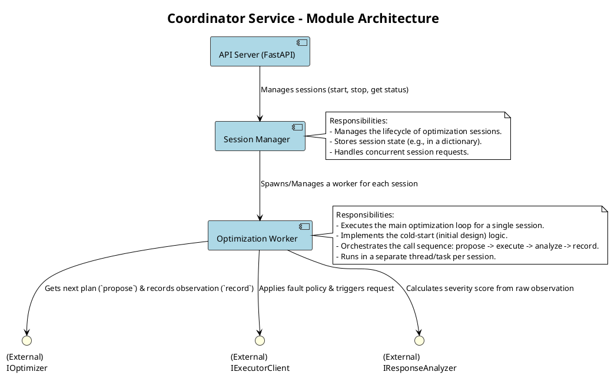
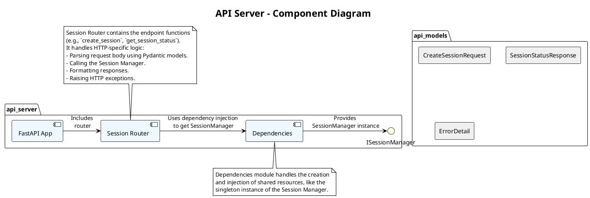
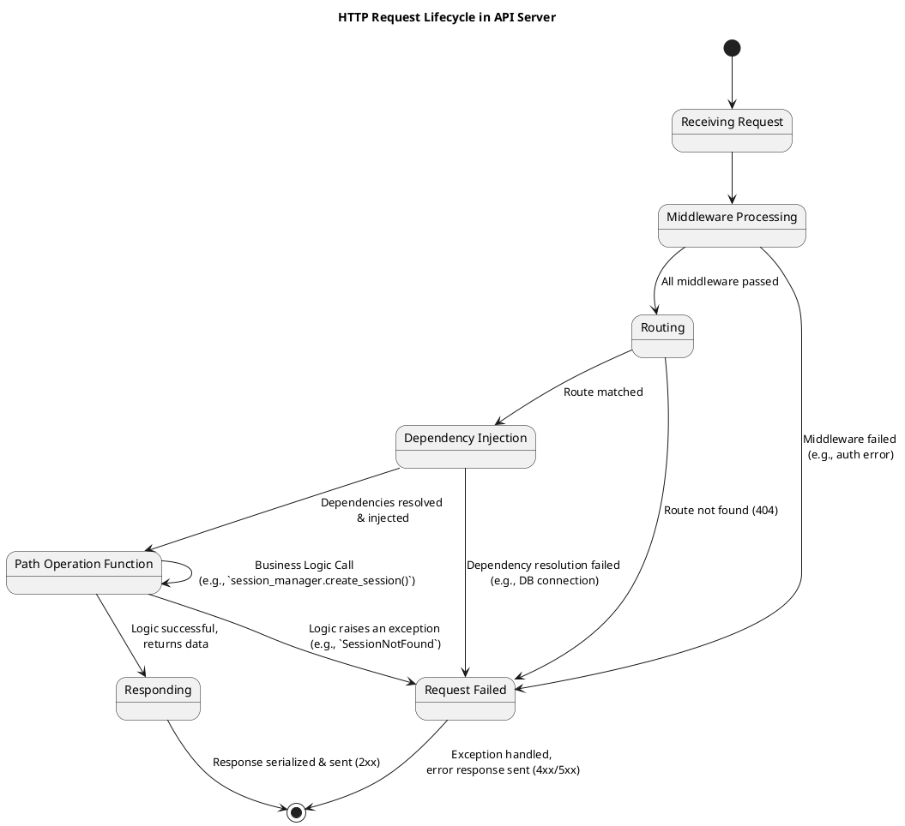
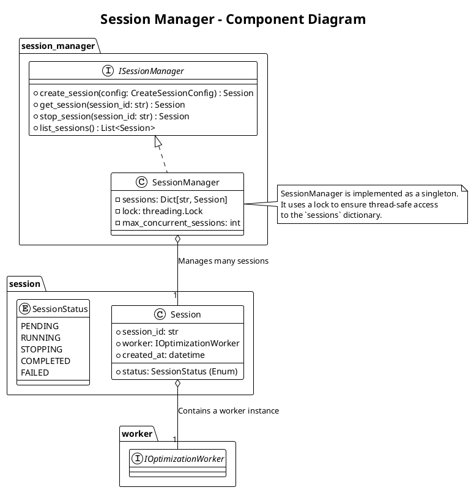
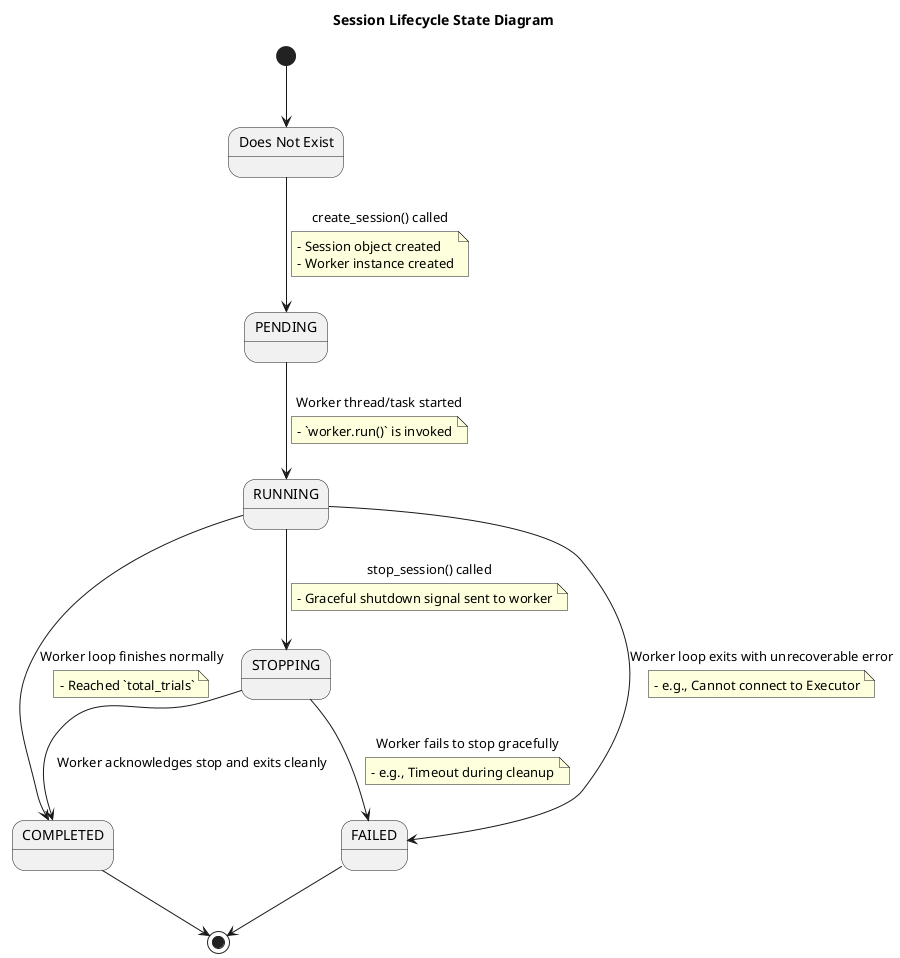
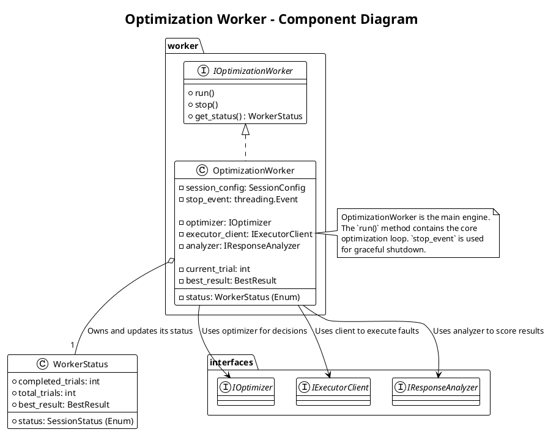
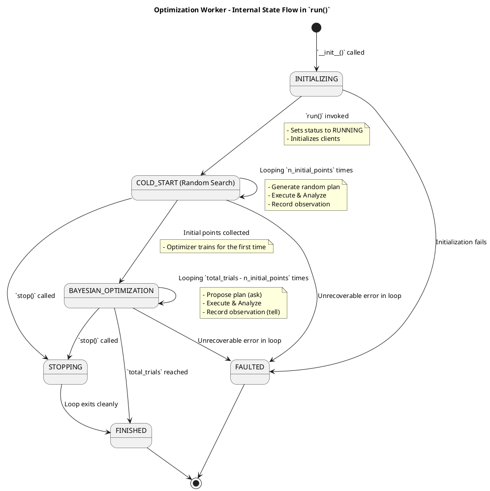

# 1. Coordinator Service (协调服务)

这是系统的“总控室”，负责管理和编排整个优化流程。



## 模块 1.1: API Server (`api_server.py`)

*   职责: 提供符合 OpenAPI 规范的 RESTful API。
*   技术: 使用 `FastAPI` 框架。
*   子模块/代码:
    *   `main.py`: FastAPI 应用的入口。
    *   `routers/sessions.py`: 定义所有 `/v1/sessions` 相关的路由和处理函数（`create_session`, `get_session_status` 等）。
    *   `models/api_models.py`: 定义 Pydantic 模型，用于请求体验证和响应体序列化（如 `CreateSessionRequest`, `SessionStatusResponse`）。
*   交互: 接收到请求后，它会调用 `Session Manager` 的相应方法。

### 概述 (Overview)

API Server 是 Coordinator Service 的对外门户，是整个 BOIFI 系统与外部世界交互的唯一入口。它负责提供一套符合 OpenAPI (Swagger) 规范的 RESTful API，用于管理优化会话的生命周期。本模块的设计目标是健壮、安全、易于使用且具备良好的可观测性。

我们将使用 FastAPI 框架来构建此模块，以利用其高性能、类型提示和自动文档生成等优势。

### 类图 (Component Diagram)

此图展示了 API Server 模块内部的主要组件及其协作关系。由于 FastAPI 的函数式编程风格，这里的“类”更多地体现为逻辑组件。



主要组件说明:

*   FastAPI App (`main.py`): FastAPI 应用的主实例。负责应用的初始化、中间件（Middleware）的加载以及路由的包含。
*   Session Router (`routers/sessions.py`): 一个 `APIRouter` 实例，包含了所有与 `/sessions` 端点相关的路径操作函数（Path Operation Functions）。
*   Dependencies (`dependencies.py`): 利用 FastAPI 的依赖注入系统，提供一个全局的、单例的 `SessionManager` 实例。这确保了整个应用共享同一个会话管理器。
*   ISessionManager (Interface): `SessionManager` 模块暴露的接口，Router 依赖此接口进行解耦和测试。
*   API Models (`models/api_models.py`): 使用 Pydantic 定义的数据模型，用于请求体验证、响应体序列化和 OpenAPI 文档的自动生成。

### 状态转换图 (State Transition Diagram)

此图描述了一个 HTTP 请求在 FastAPI 应用中的典型处理生命周期。


状态说明:
1.  Receiving Request: 服务器接收到请求。
2.  Middleware Processing: 请求通过 CORS、日志、追踪等中间件。
3.  Routing: FastAPI 查找与请求路径和方法匹配的路径操作函数。
4.  Dependency Injection: FastAPI 解析路径操作函数签名中的依赖项（如 `session_manager: ISessionManager = Depends(...)`），并注入实例。
5.  Path Operation Function: 核心的处理函数被执行。它解析请求体（已由 FastAPI 使用 Pydantic 模型自动完成），调用 `SessionManager`，并处理其返回结果。
6.  Request Failed: 任何步骤中抛出的 `HTTPException` 或其他未捕获的异常都会导致流程进入此状态，并最终由 FastAPI 的异常处理中间件转换为标准的错误响应。
7.  Responding: 成功时，将 Pydantic 模型或字典序列化为 JSON 并发送。

### 异常处理矩阵 (Error Handling Matrix)

FastAPI 的异常处理机制非常强大。我们主要通过抛出 `HTTPException` 和定义自定义异常处理器来实现。

标准错误响应体 (`ErrorDetail`):
```json
{
  "detail": "Session with ID 'sess-xxxxxxxx' not found."
}
```
*（FastAPI 默认的错误响应格式，可自定义）*

错误码分类与处理矩阵:

| HTTP Status Code | 触发条件 | FastAPI 实现方式 | 描述与示例 |
| : | : | : | : |
| 400 Bad Request | `SessionManager` 返回了 `InvalidInputError`（例如，`total_trials` <= 0）。 | 在路径操作函数中 `try...except InvalidInputError`，然后 `raise HTTPException(400, ...)`。 | `{"detail": "total_trials must be a positive integer."}` |
| 404 Not Found | 请求的 URL 路径不存在。 | FastAPI 自动处理。 | `{"detail": "Not Found"}` |
| | 请求的 `session_id` 在 `SessionManager` 中不存在。 | `SessionManager` 抛出 `SessionNotFoundError`，在路径操作函数中捕获并 `raise HTTPException(404, ...)`。 | `{"detail": "Session with ID '...' not found."}` |
| 422 Unprocessable Entity | 请求体 JSON 格式正确，但内容不符合 Pydantic 模型定义的类型或约束（如 `total_trials` 是字符串）。 | FastAPI 自动处理。这是 FastAPI 的一大特色。 | `{"detail": [{"loc": ["body", "total_trials"], "msg": "value is not a valid integer", "type": "type_error.integer"}]}` |
| 500 Internal Server Error | `SessionManager` 或其依赖项（如 Worker）发生了未预料的内部错误或 `panic`。 | 1. 定义一个全局的自定义异常处理器 (`@app.exception_handler(Exception)`)。<br>2. 在处理器中记录详细的错误日志和堆栈，并返回一个通用的 500 错误响应。 | `{"detail": "An internal server error occurred."}` |
| 503 Service Unavailable | `SessionManager` 无法创建新会话，因为系统资源耗尽（例如，达到了最大并发会话数）。 | `SessionManager` 抛出 `ResourceExhaustedError`，在路径操作函数中捕获并 `raise HTTPException(503, ...)`。 | `{"detail": "Maximum number of concurrent optimization sessions reached. Please try again later."}` |

实现策略:
*   充分利用 Pydantic: 将所有请求体验证的工作交给 Pydantic 模型，FastAPI 会自动处理 `422` 错误，代码非常简洁。
*   业务错误与 HTTP 错误解耦: `SessionManager` 只抛出领域相关的自定义异常（如 `SessionNotFoundError`）。`API Router` 层负责将这些领域异常翻译成 `HTTPException`。
*   全局异常捕获: 设置一个全局的异常处理器是保证 API 健壮性的最后一道防线，它可以防止任何未被捕获的异常导致服务崩溃。

## 模块 1.2: Session Manager (`session_manager.py`)

*   职责: 管理所有优化会话的生命周期和状态。
*   技术: 内存中的字典（`dict`）来存储会话，使用线程锁保证并发安全。
*   核心逻辑:
    *   `create_session(...)`:
        1.  生成一个唯一的 `session_id`。
        2.  创建一个 `Optimization Worker` 的实例。
        3.  将 `(session_id, worker_instance)` 存储在内部字典中。
        4.  在一个新的后台线程或任务中启动 `worker_instance.run()`。
        5.  返回 `session_id`。
    *   `get_session(...)`: 根据 `session_id` 返回对应的 worker 实例，以便查询状态。
    *   `stop_session(...)`: 调用对应 worker 实例的 `stop()` 方法。

### 概述 (Overview)

Session Manager 是 Coordinator Service 的核心状态管理和生命周期控制组件。它像一个“会话工厂”和“任务调度器”，负责创建、存储、检索和终止优化会 令(Optimization Sessions)。本模块的设计目标是线程安全、状态一致、资源可控。

### 类图 (Component Diagram)

此图展示了 Session Manager 及其核心数据结构和依赖关系。



主要领域对象/组件说明:

*   ISessionManager (Interface): 定义了 Session Manager 的公开契约，供 API Server 依赖。
*   SessionManager (Implementation):
    *   `sessions`: 一个字典，用于存储所有会话。`key` 是 `session_id`，`value` 是 `Session` 对象。
    *   `lock`: 一个线程锁（如 `threading.Lock` 或 `asyncio.Lock`），用于保护对 `sessions` 字典的并发访问。
    *   `max_concurrent_sessions`: 一个可配置的限制，防止系统因创建过多会话而耗尽资源。
*   Session:
    *   职责: 代表一个独立的优化会话的状态容器。它封装了会话的所有信息。
    *   `session_id`: 唯一标识符。
    *   `status`: 当前会话的状态，由 `SessionStatus` 枚举定义。
    *   `worker`: 指向负责执行此会话主循环的 `IOptimizationWorker` 实例的引用。
*   SessionStatus (Enum): 定义了会话在其生命周期中可能处于的几种明确状态。

### 状态转换图 (State Transition Diagram)

此图描述了单个 `Session` 对象在其生命周期中的状态变迁。



状态说明:
1.  PENDING: `create_session` 方法已成功创建了 `Session` 对象和 `Worker` 实例，但 `Worker` 的主循环尚未开始执行。这是一个非常短暂的状态。
2.  RUNNING: `Worker` 的主循环正在活跃地执行。
3.  STOPPING: 外部请求了停止，`SessionManager` 已经向 `Worker` 发送了优雅关闭的信号，正在等待 `Worker` 完成当前迭代并退出。
4.  COMPLETED: `Worker` 成功、正常地完成了所有任务（无论是达到预算还是被优雅停止）。
5.  FAILED: `Worker` 在运行过程中遇到了无法恢复的错误，异常退出。

### 异常处理矩阵 (Error Handling Matrix)

Session Manager 作为业务逻辑的核心，需要定义清晰的领域异常，供上层的 API Server 捕获和翻译。

自定义领域异常 (Domain-Specific Exceptions):
*   `SessionNotFoundError(Exception)`: 当尝试访问一个不存在的 `session_id` 时抛出。
*   `ResourceExhaustedError(Exception)`: 当活动的会话数已达到 `max_concurrent_sessions` 时，尝试创建新会话时抛出。
*   `InvalidSessionStateError(Exception)`: 当对处于不恰当状态的会话执行操作时抛出（例如，尝试停止一个已经 `COMPLETED` 的会话）。

错误分类与处理矩阵:

| 业务方法 | 触发条件 | 抛出的异常类型 | 上层 API Server 应转换的 HTTP 状态码 | 描述 |
| : | : | : | : | : |
| `create_session` | 当前运行的会话数已达到 `max_concurrent_sessions`。 | `ResourceExhaustedError` | `503 Service Unavailable` | 在创建会话前，检查当前 `len(self.sessions)`。 |
| | 创建 `Worker` 实例或启动其后台任务失败。 | `InternalServerError` (或标准 `Exception`) | `500 Internal Server Error` | 这是系统内部的严重问题，应记录详细日志。 |
| `get_session` | 提供的 `session_id` 在 `self.sessions` 字典中不存在。 | `SessionNotFoundError` | `404 Not Found` | 在访问 `self.sessions[session_id]` 前进行检查。 |
| `stop_session` | 提供的 `session_id` 不存在。 | `SessionNotFoundError` | `404 Not Found` | 同 `get_session`。 |
| | 尝试停止一个已经处于 `COMPLETED` 或 `FAILED` 状态的会话。 | `InvalidSessionStateError` | `409 Conflict` | 在调用 `worker.stop()` 之前，检查 `session.status`。 |
| `list_sessions` | (通常不会失败) | (无) | (无) | 这是一个只读操作。 |

核心健壮性设计:
*   线程安全: 所有对共享 `sessions` 字典的访问（增、删、改、查）必须被 `self.lock` 保护，以防止在并发 API 请求下出现竞态条件。
*   资源控制: `max_concurrent_sessions` 限制是防止系统被滥用或因意外负载而崩溃的关键保护机制。
*   状态一致性: `Session` 对象的状态 `status` 应该由其关联的 `Worker` 来更新，并通过回调或共享状态机制反映到 `Session` 对象中。`SessionManager` 主要负责读取此状态。
*   解耦: `SessionManager` 只与 `IWorker` 接口交互，而不关心 `Worker` 的具体实现细节。这使得 `Worker` 的内部逻辑可以独立演进。

## 模块 1.3: Optimization Worker (`worker.py`)

*   职责: 执行单个优化会话的主循环。每个会话都有一个独立的 Worker 实例。
*   技术: 这是一个长生命周期的类，其 `run()` 方法包含主循环。
*   核心逻辑 (`run()` 方法):
    1.  初始化 `Optimizer Core`、`Executor Client` 和 `Response Analyzer` 的实例。
    2.  执行冷启动阶段：循环 `n_initial_points` 次，生成随机点，调用执行器和分析器，并将结果记录到优化器中。
    3.  进入贝叶斯优化阶段：循环 `total_trials - n_initial_points` 次。
        *   调用 `optimizer.propose_next_injection()` 获取 `plan_x`。
        *   调用 `executor_client.apply_and_observe(plan_x)` 获取 `raw_result`。
        *   调用 `analyzer.calculate_severity(raw_result)` 获取 `score_y`。
        *   调用 `optimizer.record_observation(plan_x, score_y)`。
        *   更新会话状态（如 `completed_trials`, `best_result`）。
        *   检查是否有停止信号。

### 概述 (Overview)

Optimization Worker 是一个长生命周期的、有状态的组件，负责驱动单个优化会话的完整执行流程。每个 Worker 实例都与一个 Session 绑定，并拥有自己的主循环。它的核心职责是编排 `Optimizer Core`, `Executor Client`, 和 `Response Analyzer` 之间的交互，完成从冷启动到贝叶斯优化的全过程。本模块的设计目标是流程正确、状态可控、可优雅地启动和停止。

### 类图 (Component Diagram)

此图展示了 Optimization Worker 的内部结构及其依赖关系。



主要领域对象/组件说明:

*   IOptimizationWorker (Interface): 定义了 Worker 的公开契约，供 `SessionManager` 调用。
*   OptimizationWorker (Implementation):
    *   `session_config`: 包含了本次优化会话的所有配置，如 `total_trials`, `executor_endpoint` 等。
    *   `status`: 指向一个 `WorkerStatus` 对象，用于存储和对外暴露当前的工作状态。
    *   `stop_event`: 一个线程同步原语（如 `threading.Event`），用于从外部（`SessionManager`）向 `run()` 循环发送停止信号。
    *   `optimizer`, `executor_client`, `analyzer`: 通过依赖注入持有的三个核心服务模块的实例。
*   WorkerStatus: 一个数据类，封装了 Worker 的所有可查询状态，方便 `SessionManager` 获取并返回给 API。

### 状态转换图 (State Transition Diagram)

此图描述了 `OptimizationWorker` 实例在其 `run()` 方法执行过程中的内部状态变迁。这比 Session 的状态更细粒度。



### 异常处理矩阵 (Error Handling Matrix)

Worker 的异常处理是保证系统健壮性的关键。它需要区分可重试的瞬时错误和不可恢复的致命错误。

| 发生阶段 | 潜在异常/错误 | 严重性 | 处理策略 | Worker 最终状态 |
| : | : | : | : | : |
| `__init__` (初始化) | 无法实例化依赖项（如 `Optimizer`）。 | 高 (Critical) | 1. 构造函数抛出异常。<br>2. `SessionManager` 捕获后，应将 Session 状态直接置为 `FAILED`。 | (Worker 未成功创建) |
| `run()` - 冷启动/BO 循环 | `optimizer.propose()` 失败。 | 高 (Critical) | 1. 这是一个严重的内部 bug。<br>2. 记录致命错误日志和堆栈。<br>3. 中断循环，将自身状态更新为 `FAULTED`，然后退出。 | `FAILED` |
| | `executor_client.apply_and_observe()` 失败。 | 中 (Error) | 1. 实现重试机制。例如，对于网络超时或 503 错误，可以重试 2-3 次。<br>2. 如果重试后仍然失败，记录错误日志。<br>3. 跳过本次迭代 (`continue`)，不向 optimizer 记录任何数据点，并减少一次剩余预算。<br>4. 连续失败N次后，可判定为致命错误，中断循环。 | `RUNNING` (如果可恢复)<br>`FAILED` (如果连续失败) |
| | `analyzer.calculate_severity()` 失败。 | 高 (Critical) | 1. 这是一个严重的内部 bug（例如，收到了无法解析的观测数据）。<br>2. 记录致命错误日志。<br>3. 中断循环，将状态更新为 `FAULTED`，然后退出。 | `FAILED` |
| | `optimizer.record()` 失败。 | 高 (Critical) | 1. 这是一个严重的内部 bug。<br>2. 记录致命错误日志。<br>3. 中断循环，将状态更新为 `FAULTED`，然后退出。 | `FAILED` |
| `stop()` | (无，仅设置事件) | (无) | (无) | (无) |

核心健robustness设计:
*   优雅关闭 (Graceful Shutdown): `run()` 方法的主循环必须在每次迭代开始时检查 `self.stop_event.is_set()`。如果事件被设置，循环应立即 `break`，执行清理工作，并将最终状态设置为 `COMPLETED`。
*   状态隔离: 每个 `Worker` 实例都是完全独立的，拥有自己的配置、状态和依赖实例。这确保了一个会话的失败不会影响到其他正在运行的会话。
*   明确的错误传播: `Worker` 内部的 `run()` 方法应该捕获所有异常。对于可恢复的错误，它应该自行处理（重试/跳过）；对于致命错误，它应该将自身的 `status` 对象更新为 `FAILED` 并携带错误信息，然后干净地退出。`SessionManager` 通过轮询 `worker.get_status()` 来感知这种失败。
*   资源清理: 在 `run()` 方法的 `finally` 块中，应确保所有外部资源（如客户端连接）被妥善关闭。


# 附录：并发模型详解 (Concurrency Model)

## 概述

Recommender 系统需要支持多个优化会话的并发运行，以提高系统吞吐量。本附录详细说明并发设计、线程安全机制、GIL 影响分析和最佳实践。

## 并发架构

```
┌─────────────────────────────────────────────────────────────┐
│                    FastAPI Web Server                       │
│              (处理 API 请求，单线程事件循环)               │
└────────────────────────────┬────────────────────────────────┘
                             │
                             ▼
┌─────────────────────────────────────────────────────────────┐
│                  SessionManager (线程安全)                  │
│              管理所有优化会话的字典 + Lock                │
└────────────────────────────┬────────────────────────────────┘
                             │
        ┌────────────────────┼────────────────────┐
        ▼                    ▼                    ▼
    Session 1           Session 2           Session N
 ┌──────────────┐    ┌──────────────┐    ┌──────────────┐
 │  Worker-1    │    │  Worker-2    │    │  Worker-N    │
 │  (Thread)    │    │  (Thread)    │    │  (Thread)    │
 │              │    │              │    │              │
 │ - Optimizer  │    │ - Optimizer  │    │ - Optimizer  │
 │ - Executor   │    │ - Executor   │    │ - Executor   │
 │   Client     │    │   Client     │    │   Client     │
 │ - Analyzer   │    │ - Analyzer   │    │ - Analyzer   │
 └──────────────┘    └──────────────┘    └──────────────┘
```

关键特性:
1. ✅ 会话完全隔离: 每个 Session 拥有独立的 Worker 线程和服务实例
2. ✅ 线程安全: SessionManager 使用 `threading.Lock` 保护共享状态
3. ✅ 并发度: ~10-20 并发会话（受制于网络 I/O）

## 会话隔离 (Session Isolation)

每个优化会话完全独立，不共享任何可变状态：

```python
# 会话隔离示例
class Session:
    def __init__(self, session_id):
        self.session_id = session_id
        self.optimizer = ScikitOptimizer(...)        # 独立实例
        self.executor_client = ExecutorClient(...)   # 独立实例
        self.analyzer = AnalyzerService(...)         # 独立实例
        self.worker = OptimizationWorker(...)        # 独立线程
        self.status = SessionState(...)              # 独立状态

# SessionManager 存储 sessions
class SessionManager:
    def __init__(self):
        self.sessions = {}  # Dict[session_id, Session]
        self.lock = threading.Lock()  # 仅保护 dict 的访问

# 访问 sessions 时保持最小化的临界区
session = session_manager.get_session(session_id)
# Lock 已释放，worker 线程可以独立运行
session.worker.run()  # 在后台线程中执行
```

隔离的好处:
- ✅ 不会有全局状态竞争
- ✅ 一个会话的故障不影响其他会话
- ✅ 容易测试和调试

## Lock 使用规则

SessionManager 使用 `threading.Lock` 保证 `sessions` 字典的线程安全。

✅ 正确的做法:

```python
class SessionManager:
    def create_session(self, session_id, config):
        # Lock 保护：创建新 Session
        with self.lock:
            if session_id in self.sessions:
                raise SessionAlreadyExistsError(...)
            
            # 在 Lock 内创建 Session 对象
            session = Session(session_id, config)
            self.sessions[session_id] = session
        
        # Lock 已释放，启动 Worker 线程
        # (不在 Lock 内启动线程)
        session.worker.start()
        return session
    
    def get_session(self, session_id):
        # Lock 保护：读取 Session
        with self.lock:
            session = self.sessions.get(session_id)
        
        # Lock 已释放，可以安全地使用 session
        if session is None:
            raise SessionNotFoundError(...)
        return session
    
    def stop_session(self, session_id):
        # Lock 保护：读取和修改 Session 的 stop_event
        with self.lock:
            if session_id not in self.sessions:
                raise SessionNotFoundError(...)
            session = self.sessions[session_id]
        
        # Lock 已释放
        session.stop_event.set()  # 设置停止信号（线程安全的事件）
```

❌ 不正确的做法:

```python
# 错误 1: 在 Lock 内启动线程
def create_session_BAD(self, session_id, config):
    with self.lock:
        session = Session(session_id, config)
        self.sessions[session_id] = session
        session.worker.start()  # ❌ Lock 内启动线程：死锁风险
        session.worker.join()   # ❌ 在 Lock 内等待线程：死锁！
    # 其他 API 请求被阻塞

# 错误 2: 在 Lock 内执行耗时操作
def create_session_BAD2(self, session_id, config):
    with self.lock:
        session = Session(session_id, config)
        self.sessions[session_id] = session
        # 初始化 Executor Client (网络 I/O，可能耗时)
        session.executor_client.init()  # ❌ Lock 内执行 I/O：阻塞其他请求
    # 此时 Lock 被占用，其他 API 无法处理

# 错误 3: Lock 保护范围过大
def get_session_BAD(self, session_id):
    with self.lock:
        session = self.sessions.get(session_id)
        # ❌ 在 Lock 内进行业务逻辑计算
        result = session.worker.get_progress()  # 可能耗时
    return result
```

Lock 最佳实践总结:
1. ✅ 最小化临界区: 仅保护对共享数据结构的访问
2. ✅ 不在 Lock 内启动线程: 线程启动应在 Lock 外进行
3. ✅ 不在 Lock 内执行 I/O: 网络操作应在 Lock 外进行
4. ✅ 不在 Lock 内调用耗时方法: 业务逻辑应在 Lock 外进行
5. ✅ 使用 `threading.Event` 进行线程间同步: 比 Lock 更适合信号传递

## GIL (Global Interpreter Lock) 的影响

Python 的 GIL 限制了同一进程内多个线程在 CPU 密集工作上的并发度，但对 I/O 密集型操作影响很小。

GIL 释放的情况:
- ✅ 网络 I/O (HTTP 请求): 调用 Executor Client 时，GIL 会释放
- ✅ 文件 I/O: 读写文件时，GIL 会释放
- ❌ CPU 计算: 纯 Python 计算（如 pandas 操作），GIL 被持有

Recommender 系统的 I/O 组成:

```
单个优化迭代的耗时分解 (约 600ms)
├─ Optimizer.propose(): 20ms     (CPU，持有 GIL)
├─ Executor HTTP 请求: 500ms    (I/O，释放 GIL) ◄─ 占 83%
├─ Analyzer.calculate_severity(): 50ms  (CPU，持有 GIL)
└─ Optimizer.record(): 30ms      (CPU，持有 GIL)
```

并发性能分析:

| 场景 | 顺序执行 | 2 个并发会话 | 加速比 |
|:|::|::|::|
| 单迭代耗时 | 600ms | 600ms | 1.0x |
| 原因 | - | 两个线程在 HTTP I/O 时切换，几乎无等待 | GIL 释放得很好 |
| 5 次迭代 | 3000ms | 1500ms | ~2.0x |
| 10 次迭代 | 6000ms | 3000ms | ~2.0x |

GIL 的实际影响:
- 虽然 GIL 存在，但由于大部分时间用于 I/O（GIL 释放），实际并发度接近真正的并行
- Phase 1 (10-20 并发会话) 不需要特殊的 GIL 处理
- Phase 2 如果需要更高并发度，可考虑 `asyncio` 或多进程

不需要特殊处理的原因:
1. ✅ I/O 时间占主导 (>80%)
2. ✅ CPU 操作时间短 (<100ms)
3. ✅ GIL 释放得很充分

## 并发陷阱与解决方案

### 陷阱 1: 竞态条件 (Race Condition)

❌ 问题:
```python
# Worker 线程
session.status = "RUNNING"
# ← 其他线程可能在此刻修改 session.status
session.completed_trials = 5
```

✅ 解决方案:
```python
# 使用原子操作或锁
class SessionStatus:
    def __init__(self):
        self.lock = threading.Lock()
        self._status = "PENDING"
        self._completed_trials = 0
    
    def set_status(self, status):
        with self.lock:
            self._status = status
    
    def increment_trials(self):
        with self.lock:
            self._completed_trials += 1
```

### 陷阱 2: 死锁 (Deadlock)

❌ 问题:
```python
def stop_session(self, session_id):
    with self.lock:
        session = self.sessions[session_id]
        session.worker.join()  # 等待线程退出，但线程可能在等待 Lock
```

✅ 解决方案:
```python
def stop_session(self, session_id):
    with self.lock:
        session = self.sessions[session_id]
    # Lock 释放，线程可以继续
    session.stop_event.set()  # 设置停止信号
    session.worker.join(timeout=10)  # 等待线程退出，有超时
```

### 陷阱 3: 优先级倒转 (Priority Inversion)

❌ 问题: API 线程持有 Lock，Worker 线程饥饿（无法获取 Lock）

✅ 解决方案:
```python
# 确保 Lock 持有时间最短
with self.lock:
    session = self.sessions.get(session_id)  # 快速操作
# Lock 释放，Worker 线程可以继续
if session:
    process_session(session)  # 耗时操作在 Lock 外
```

### 陷阱 4: 向前进度失败 (Liveness Failure)

❌ 问题: Session 获取不到 Lock，无法启动 Worker

✅ 解决方案: 使用 `threading.Condition` 或 `threading.Event` 进行线程间同步

```python
class SessionManager:
    def __init__(self):
        self.sessions = {}
        self.lock = threading.Lock()
        self.session_created_event = threading.Event()  # 信号
    
    def create_session(self, session_id, config):
        with self.lock:
            session = Session(session_id, config)
            self.sessions[session_id] = session
        
        self.session_created_event.set()  # 通知等待者
        session.worker.start()
```

### 陷阱 5: 资源泄漏 (Resource Leak)

❌ 问题:
```python
def stop_session(self, session_id):
    session = self.sessions[session_id]
    session.worker.stop()
    # 忘记清理 session
```

✅ 解决方案:
```python
def stop_session(self, session_id):
    with self.lock:
        session = self.sessions.pop(session_id)  # 移除引用
    
    if session:
        session.worker.stop()
        session.executor_client.close()  # 关闭连接
        session.optimizer = None
        session.analyzer = None
```

### 陷阱 6: 顺序不一致 (Ordering Inconsistency)

❌ 问题:
```python
# API 线程看到的状态
session.status = "RUNNING"
session.best_result = None  # 设置为 None

# Worker 线程
best_result = session.best_result  # 可能读到不一致的组合
```

✅ 解决方案:
```python
# 将相关状态打包成一个对象，使用 Lock 保护
class SessionState:
    def __init__(self):
        self.lock = threading.Lock()
        self.status = "PENDING"
        self.best_result = None
    
    def get_snapshot(self):
        """原子地获取完整状态"""
        with self.lock:
            return {
                "status": self.status,
                "best_result": copy.deepcopy(self.best_result)
            }
```

## 并发测试方法

示例测试代码:
```python
import concurrent.futures
import time

def test_concurrent_sessions():
    """验证多个会话可以并发运行"""
    manager = SessionManager()
    
    def run_session(session_id):
        config = {...}
        session = manager.create_session(session_id, config)
        
        # 模拟 Worker 线程
        for i in range(5):
            time.sleep(0.1)  # 模拟优化迭代
            session.status = f"Trial {i}"
        
        manager.stop_session(session_id)
        return session_id
    
    # 并发运行 5 个会话
    with concurrent.futures.ThreadPoolExecutor(max_workers=5) as executor:
        futures = [executor.submit(run_session, f"sess-{i}") for i in range(5)]
        results = [f.result() for f in concurrent.futures.as_completed(futures)]
    
    assert len(results) == 5
    print(f"✅ All {len(results)} sessions completed successfully")
```

期望输出:
```
✅ All 5 sessions completed successfully
Elapsed time: ~0.5s (not 2.5s sequentially)
```

## 推荐与最佳实践

1. ✅ Phase 1 使用 threading: 简单、足够
2. ✅ 使用 `threading.Lock` 保护共享数据: 最小化临界区
3. ✅ 使用 `threading.Event` 进行线程间信号: 比 Lock 更高效
4. ✅ 在 Lock 外执行耗时操作: 保证系统响应性
5. ✅ 对并发代码进行彻底的单元测试: 并发 bug 很难调试
6. 📅 Phase 2 考虑 asyncio: 如果并发度需要 > 50
7. 🔮 未来考虑多进程: 如果 CPU 密集操作成为瓶颈

```
