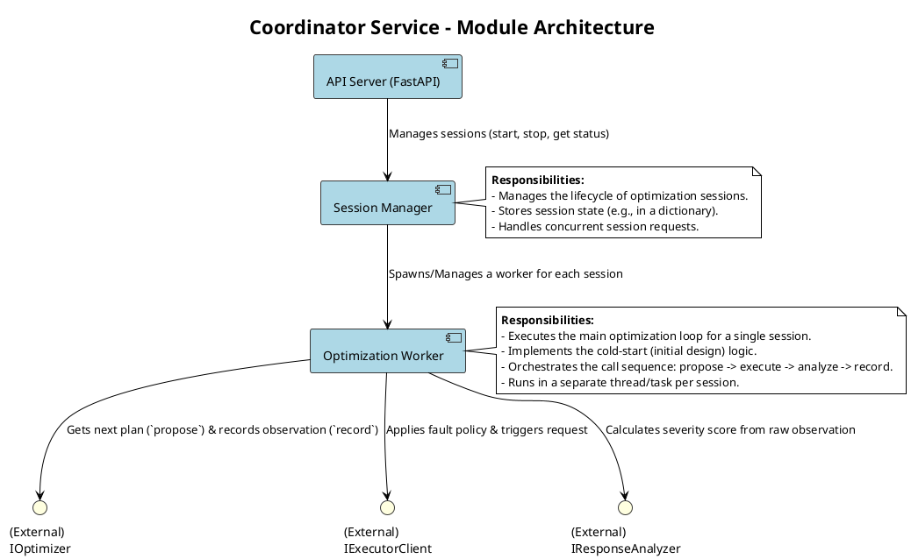
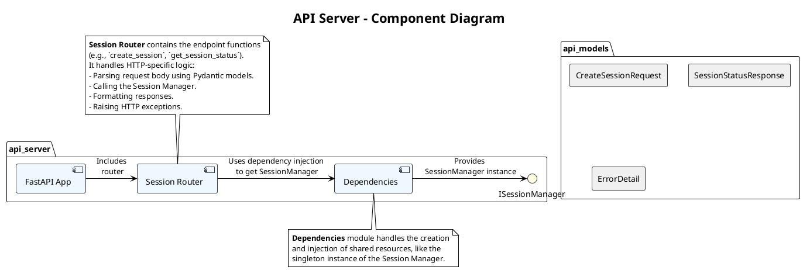
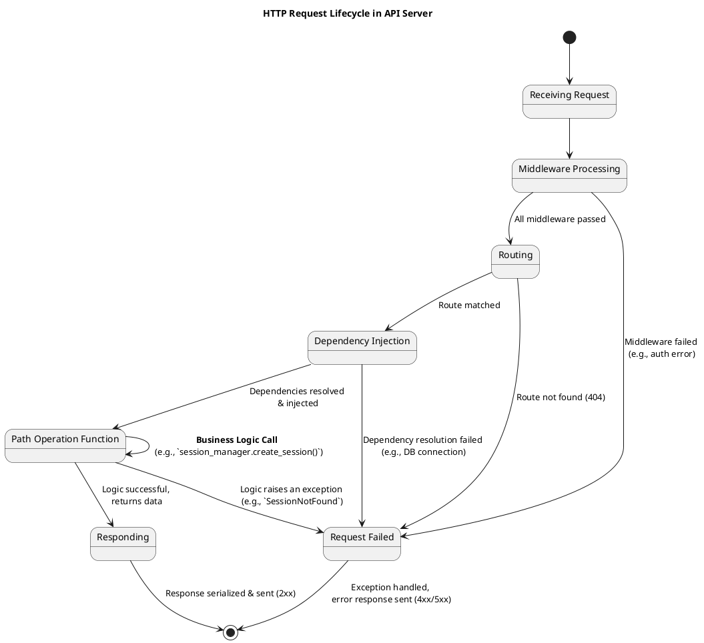
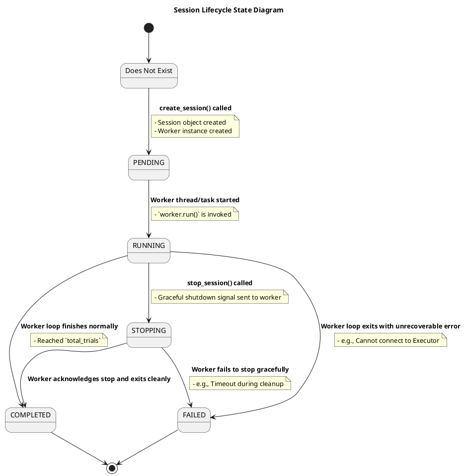
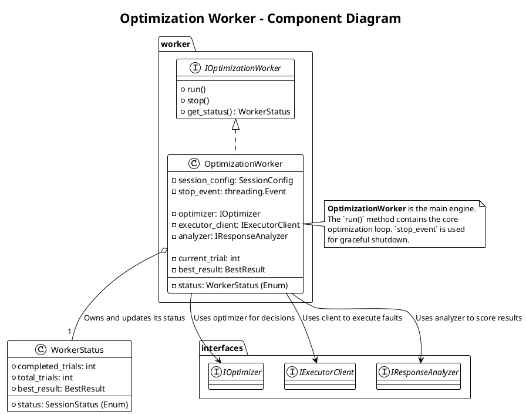
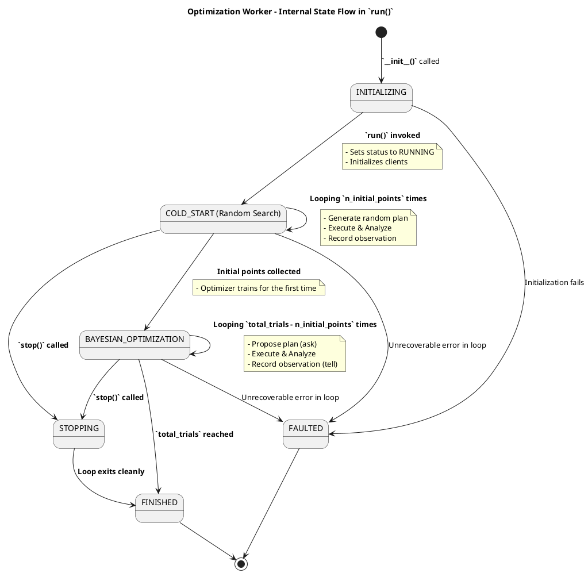

# **1. Coordinator Service (协调服务)**

这是系统的“总控室”，负责管理和编排整个优化流程。



## **模块 1.1: API Server (`api_server.py`)**

*   **职责**: 提供符合 OpenAPI 规范的 RESTful API。
*   **技术**: 使用 `FastAPI` 框架。
*   **子模块/代码**:
    *   **`main.py`**: FastAPI 应用的入口。
    *   **`routers/sessions.py`**: 定义所有 `/v1/sessions` 相关的路由和处理函数（`create_session`, `get_session_status` 等）。
    *   **`models/api_models.py`**: 定义 Pydantic 模型，用于请求体验证和响应体序列化（如 `CreateSessionRequest`, `SessionStatusResponse`）。
*   **交互**: 接收到请求后，它会调用 `Session Manager` 的相应方法。

### **概述 (Overview)**

**API Server** 是 **Coordinator Service** 的**对外门户**，是整个 BOIFI 系统与外部世界交互的唯一入口。它负责提供一套符合 OpenAPI (Swagger) 规范的 RESTful API，用于管理优化会话的生命周期。本模块的设计目标是**健壮、安全、易于使用且具备良好的可观测性**。

我们将使用 **FastAPI** 框架来构建此模块，以利用其高性能、类型提示和自动文档生成等优势。

### **类图 (Component Diagram)**

此图展示了 API Server 模块内部的主要组件及其协作关系。由于 FastAPI 的函数式编程风格，这里的“类”更多地体现为逻辑组件。



**主要组件说明**:

*   **FastAPI App (`main.py`)**: FastAPI 应用的主实例。负责应用的初始化、中间件（Middleware）的加载以及路由的包含。
*   **Session Router (`routers/sessions.py`)**: 一个 `APIRouter` 实例，包含了所有与 `/sessions` 端点相关的路径操作函数（Path Operation Functions）。
*   **Dependencies (`dependencies.py`)**: 利用 FastAPI 的依赖注入系统，提供一个全局的、单例的 `SessionManager` 实例。这确保了整个应用共享同一个会话管理器。
*   **ISessionManager (Interface)**: `SessionManager` 模块暴露的接口，Router 依赖此接口进行解耦和测试。
*   **API Models (`models/api_models.py`)**: 使用 **Pydantic** 定义的数据模型，用于请求体验证、响应体序列化和 OpenAPI 文档的自动生成。

### **状态转换图 (State Transition Diagram)**

此图描述了一个 HTTP 请求在 FastAPI 应用中的典型处理生命周期。


**状态说明**:
1.  **Receiving Request**: 服务器接收到请求。
2.  **Middleware Processing**: 请求通过 CORS、日志、追踪等中间件。
3.  **Routing**: FastAPI 查找与请求路径和方法匹配的路径操作函数。
4.  **Dependency Injection**: FastAPI 解析路径操作函数签名中的依赖项（如 `session_manager: ISessionManager = Depends(...)`），并注入实例。
5.  **Path Operation Function**: 核心的处理函数被执行。它解析请求体（已由 FastAPI 使用 Pydantic 模型自动完成），调用 `SessionManager`，并处理其返回结果。
6.  **Request Failed**: 任何步骤中抛出的 `HTTPException` 或其他未捕获的异常都会导致流程进入此状态，并最终由 FastAPI 的异常处理中间件转换为标准的错误响应。
7.  **Responding**: 成功时，将 Pydantic 模型或字典序列化为 JSON 并发送。

### **异常处理矩阵 (Error Handling Matrix)**

FastAPI 的异常处理机制非常强大。我们主要通过抛出 `HTTPException` 和定义自定义异常处理器来实现。

**标准错误响应体 (`ErrorDetail`)**:
```json
{
  "detail": "Session with ID 'sess-xxxxxxxx' not found."
}
```
*（FastAPI 默认的错误响应格式，可自定义）*

**错误码分类与处理矩阵**:

| HTTP Status Code | 触发条件 | FastAPI 实现方式 | 描述与示例 |
| :--- | :--- | :--- | :--- |
| **400 Bad Request** | `SessionManager` 返回了 `InvalidInputError`（例如，`total_trials` <= 0）。 | 在路径操作函数中 `try...except InvalidInputError`，然后 `raise HTTPException(400, ...)`。 | `{"detail": "total_trials must be a positive integer."}` |
| **404 Not Found** | 请求的 URL 路径不存在。 | **FastAPI 自动处理**。 | `{"detail": "Not Found"}` |
| | 请求的 `session_id` 在 `SessionManager` 中不存在。 | `SessionManager` 抛出 `SessionNotFoundError`，在路径操作函数中捕获并 `raise HTTPException(404, ...)`。 | `{"detail": "Session with ID '...' not found."}` |
| **422 Unprocessable Entity** | 请求体 JSON 格式正确，但内容不符合 Pydantic 模型定义的类型或约束（如 `total_trials` 是字符串）。 | **FastAPI 自动处理**。这是 FastAPI 的一大特色。 | `{"detail": [{"loc": ["body", "total_trials"], "msg": "value is not a valid integer", "type": "type_error.integer"}]}` |
| **500 Internal Server Error** | `SessionManager` 或其依赖项（如 Worker）发生了未预料的内部错误或 `panic`。 | 1. 定义一个全局的**自定义异常处理器 (`@app.exception_handler(Exception)`)**。<br>2. 在处理器中记录详细的错误日志和堆栈，并返回一个通用的 500 错误响应。 | `{"detail": "An internal server error occurred."}` |
| **503 Service Unavailable** | `SessionManager` 无法创建新会话，因为系统资源耗尽（例如，达到了最大并发会话数）。 | `SessionManager` 抛出 `ResourceExhaustedError`，在路径操作函数中捕获并 `raise HTTPException(503, ...)`。 | `{"detail": "Maximum number of concurrent optimization sessions reached. Please try again later."}` |

**实现策略**:
*   **充分利用 Pydantic**: 将所有请求体验证的工作交给 Pydantic 模型，FastAPI 会自动处理 `422` 错误，代码非常简洁。
*   **业务错误与 HTTP 错误解耦**: `SessionManager` 只抛出领域相关的自定义异常（如 `SessionNotFoundError`）。`API Router` 层负责将这些领域异常**翻译**成 `HTTPException`。
*   **全局异常捕获**: 设置一个全局的异常处理器是保证 API 健壮性的最后一道防线，它可以防止任何未被捕获的异常导致服务崩溃。

## **模块 1.2: Session Manager (`session_manager.py`)**

*   **职责**: 管理所有优化会话的生命周期和状态。
*   **技术**: 内存中的字典（`dict`）来存储会话，使用线程锁保证并发安全。
*   **核心逻辑**:
    *   **`create_session(...)`**:
        1.  生成一个唯一的 `session_id`。
        2.  创建一个 `Optimization Worker` 的实例。
        3.  将 `(session_id, worker_instance)` 存储在内部字典中。
        4.  在一个新的后台线程或任务中**启动** `worker_instance.run()`。
        5.  返回 `session_id`。
    *   **`get_session(...)`**: 根据 `session_id` 返回对应的 worker 实例，以便查询状态。
    *   **`stop_session(...)`**: 调用对应 worker 实例的 `stop()` 方法。

### **概述 (Overview)**

**Session Manager** 是 **Coordinator Service** 的**核心状态管理和生命周期控制**组件。它像一个“会话工厂”和“任务调度器”，负责创建、存储、检索和终止**优化会 令(Optimization Sessions)**。本模块的设计目标是**线程安全、状态一致、资源可控**。

### **类图 (Component Diagram)**

此图展示了 Session Manager 及其核心数据结构和依赖关系。


**主要领域对象/组件说明**:

*   **ISessionManager (Interface)**: 定义了 Session Manager 的公开契约，供 API Server 依赖。
*   **SessionManager (Implementation)**:
    *   `sessions`: 一个字典，用于存储所有会话。`key` 是 `session_id`，`value` 是 `Session` 对象。
    *   `lock`: 一个线程锁（如 `threading.Lock` 或 `asyncio.Lock`），用于保护对 `sessions` 字典的并发访问。
    *   `max_concurrent_sessions`: 一个可配置的限制，防止系统因创建过多会话而耗尽资源。
*   **Session**:
    *   **职责**: 代表一个独立的优化会话的**状态容器**。它封装了会话的所有信息。
    *   `session_id`: 唯一标识符。
    *   `status`: 当前会话的状态，由 `SessionStatus` 枚举定义。
    *   `worker`: 指向负责执行此会话主循环的 `IOptimizationWorker` 实例的引用。
*   **SessionStatus (Enum)**: 定义了会话在其生命周期中可能处于的几种明确状态。

### **状态转换图 (State Transition Diagram)**

此图描述了**单个 `Session` 对象**在其生命周期中的状态变迁。



**状态说明**:
1.  **PENDING**: `create_session` 方法已成功创建了 `Session` 对象和 `Worker` 实例，但 `Worker` 的主循环尚未开始执行。这是一个非常短暂的状态。
2.  **RUNNING**: `Worker` 的主循环正在活跃地执行。
3.  **STOPPING**: 外部请求了停止，`SessionManager` 已经向 `Worker` 发送了优雅关闭的信号，正在等待 `Worker` 完成当前迭代并退出。
4.  **COMPLETED**: `Worker` 成功、正常地完成了所有任务（无论是达到预算还是被优雅停止）。
5.  **FAILED**: `Worker` 在运行过程中遇到了无法恢复的错误，异常退出。

### **异常处理矩阵 (Error Handling Matrix)**

Session Manager 作为业务逻辑的核心，需要定义清晰的领域异常，供上层的 API Server 捕获和翻译。

**自定义领域异常 (Domain-Specific Exceptions)**:
*   `SessionNotFoundError(Exception)`: 当尝试访问一个不存在的 `session_id` 时抛出。
*   `ResourceExhaustedError(Exception)`: 当活动的会话数已达到 `max_concurrent_sessions` 时，尝试创建新会话时抛出。
*   `InvalidSessionStateError(Exception)`: 当对处于不恰当状态的会话执行操作时抛出（例如，尝试停止一个已经 `COMPLETED` 的会话）。

**错误分类与处理矩阵**:

| 业务方法 | 触发条件 | 抛出的异常类型 | 上层 API Server 应转换的 HTTP 状态码 | 描述 |
| :--- | :--- | :--- | :--- | :--- |
| **`create_session`** | 当前运行的会话数已达到 `max_concurrent_sessions`。 | `ResourceExhaustedError` | `503 Service Unavailable` | 在创建会话前，检查当前 `len(self.sessions)`。 |
| | 创建 `Worker` 实例或启动其后台任务失败。 | `InternalServerError` (或标准 `Exception`) | `500 Internal Server Error` | 这是系统内部的严重问题，应记录详细日志。 |
| **`get_session`** | 提供的 `session_id` 在 `self.sessions` 字典中不存在。 | `SessionNotFoundError` | `404 Not Found` | 在访问 `self.sessions[session_id]` 前进行检查。 |
| **`stop_session`** | 提供的 `session_id` 不存在。 | `SessionNotFoundError` | `404 Not Found` | 同 `get_session`。 |
| | 尝试停止一个已经处于 `COMPLETED` 或 `FAILED` 状态的会话。 | `InvalidSessionStateError` | `409 Conflict` | 在调用 `worker.stop()` 之前，检查 `session.status`。 |
| **`list_sessions`** | (通常不会失败) | (无) | (无) | 这是一个只读操作。 |

**核心健壮性设计**:
*   **线程安全**: 所有对共享 `sessions` 字典的访问（增、删、改、查）**必须**被 `self.lock` 保护，以防止在并发 API 请求下出现竞态条件。
*   **资源控制**: `max_concurrent_sessions` 限制是防止系统被滥用或因意外负载而崩溃的关键保护机制。
*   **状态一致性**: `Session` 对象的状态 `status` 应该由其关联的 `Worker` 来更新，并通过回调或共享状态机制反映到 `Session` 对象中。`SessionManager` 主要负责读取此状态。
*   **解耦**: `SessionManager` 只与 `IWorker` 接口交互，而不关心 `Worker` 的具体实现细节。这使得 `Worker` 的内部逻辑可以独立演进。

## **模块 1.3: Optimization Worker (`worker.py`)**

*   **职责**: **执行单个优化会话的主循环**。每个会话都有一个独立的 Worker 实例。
*   **技术**: 这是一个长生命周期的类，其 `run()` 方法包含主循环。
*   **核心逻辑 (`run()` 方法)**:
    1.  初始化 `Optimizer Core`、`Executor Client` 和 `Response Analyzer` 的实例。
    2.  执行**冷启动阶段**：循环 `n_initial_points` 次，生成随机点，调用执行器和分析器，并将结果记录到优化器中。
    3.  进入**贝叶斯优化阶段**：循环 `total_trials - n_initial_points` 次。
        *   调用 `optimizer.propose_next_injection()` 获取 `plan_x`。
        *   调用 `executor_client.apply_and_observe(plan_x)` 获取 `raw_result`。
        *   调用 `analyzer.calculate_severity(raw_result)` 获取 `score_y`。
        *   调用 `optimizer.record_observation(plan_x, score_y)`。
        *   更新会话状态（如 `completed_trials`, `best_result`）。
        *   检查是否有停止信号。

### **概述 (Overview)**

**Optimization Worker** 是一个**长生命周期的、有状态的**组件，负责**驱动单个优化会话的完整执行流程**。每个 Worker 实例都与一个 Session 绑定，并拥有自己的主循环。它的核心职责是编排 `Optimizer Core`, `Executor Client`, 和 `Response Analyzer` 之间的交互，完成从冷启动到贝叶斯优化的全过程。本模块的设计目标是**流程正确、状态可控、可优雅地启动和停止**。

### **类图 (Component Diagram)**

此图展示了 Optimization Worker 的内部结构及其依赖关系。



**主要领域对象/组件说明**:

*   **IOptimizationWorker (Interface)**: 定义了 Worker 的公开契约，供 `SessionManager` 调用。
*   **OptimizationWorker (Implementation)**:
    *   `session_config`: 包含了本次优化会话的所有配置，如 `total_trials`, `executor_endpoint` 等。
    *   `status`: 指向一个 `WorkerStatus` 对象，用于存储和对外暴露当前的工作状态。
    *   `stop_event`: 一个线程同步原语（如 `threading.Event`），用于从外部（`SessionManager`）向 `run()` 循环发送停止信号。
    *   `optimizer`, `executor_client`, `analyzer`: 通过**依赖注入**持有的三个核心服务模块的实例。
*   **WorkerStatus**: 一个数据类，封装了 Worker 的所有可查询状态，方便 `SessionManager` 获取并返回给 API。

### **状态转换图 (State Transition Diagram)**

此图描述了 **`OptimizationWorker` 实例**在其 `run()` 方法执行过程中的内部状态变迁。这比 Session 的状态更细粒度。



### **异常处理矩阵 (Error Handling Matrix)**

Worker 的异常处理是保证系统健壮性的关键。它需要区分**可重试的瞬时错误**和**不可恢复的致命错误**。

| 发生阶段 | 潜在异常/错误 | 严重性 | 处理策略 | Worker 最终状态 |
| :--- | :--- | :--- | :--- | :--- |
| **`__init__` (初始化)** | 无法实例化依赖项（如 `Optimizer`）。 | **高** (Critical) | 1. 构造函数抛出异常。<br>2. `SessionManager` 捕获后，应将 Session 状态直接置为 `FAILED`。 | (Worker 未成功创建) |
| **`run()` - 冷启动/BO 循环** | **`optimizer.propose()`** 失败。 | **高** (Critical) | 1. 这是一个严重的内部 bug。<br>2. 记录致命错误日志和堆栈。<br>3. **中断循环**，将自身状态更新为 `FAULTED`，然后退出。 | `FAILED` |
| | **`executor_client.apply_and_observe()`** 失败。 | **中** (Error) | 1. **实现重试机制**。例如，对于网络超时或 503 错误，可以重试 2-3 次。<br>2. 如果重试后仍然失败，记录错误日志。<br>3. **跳过本次迭代** (`continue`)，不向 optimizer 记录任何数据点，并减少一次剩余预算。<br>4. **连续失败N次后**，可判定为致命错误，中断循环。 | `RUNNING` (如果可恢复)<br>`FAILED` (如果连续失败) |
| | **`analyzer.calculate_severity()`** 失败。 | **高** (Critical) | 1. 这是一个严重的内部 bug（例如，收到了无法解析的观测数据）。<br>2. 记录致命错误日志。<br>3. **中断循环**，将状态更新为 `FAULTED`，然后退出。 | `FAILED` |
| | **`optimizer.record()`** 失败。 | **高** (Critical) | 1. 这是一个严重的内部 bug。<br>2. 记录致命错误日志。<br>3. **中断循环**，将状态更新为 `FAULTED`，然后退出。 | `FAILED` |
| **`stop()`** | (无，仅设置事件) | (无) | (无) | (无) |

**核心健robustness设计**:
*   **优雅关闭 (Graceful Shutdown)**: `run()` 方法的主循环必须在每次迭代开始时检查 `self.stop_event.is_set()`。如果事件被设置，循环应立即 `break`，执行清理工作，并将最终状态设置为 `COMPLETED`。
*   **状态隔离**: 每个 `Worker` 实例都是完全独立的，拥有自己的配置、状态和依赖实例。这确保了一个会话的失败不会影响到其他正在运行的会话。
*   **明确的错误传播**: `Worker` 内部的 `run()` 方法应该捕获所有异常。对于可恢复的错误，它应该自行处理（重试/跳过）；对于致命错误，它应该将自身的 `status` 对象更新为 `FAILED` 并携带错误信息，然后干净地退出。`SessionManager` 通过轮询 `worker.get_status()` 来感知这种失败。
*   **资源清理**: 在 `run()` 方法的 `finally` 块中，应确保所有外部资源（如客户端连接）被妥善关闭。
