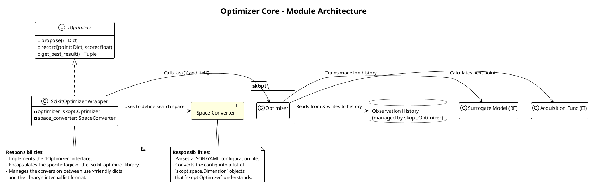
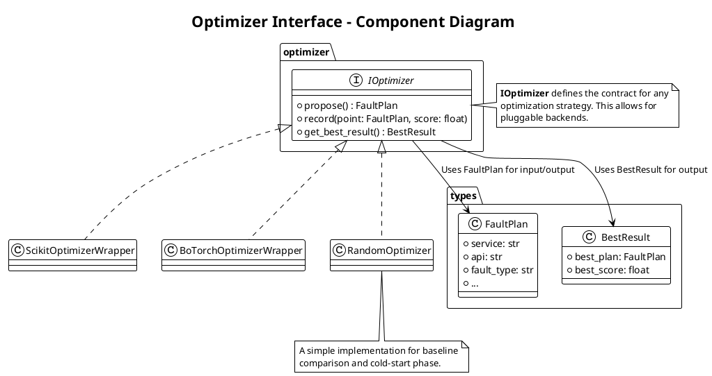
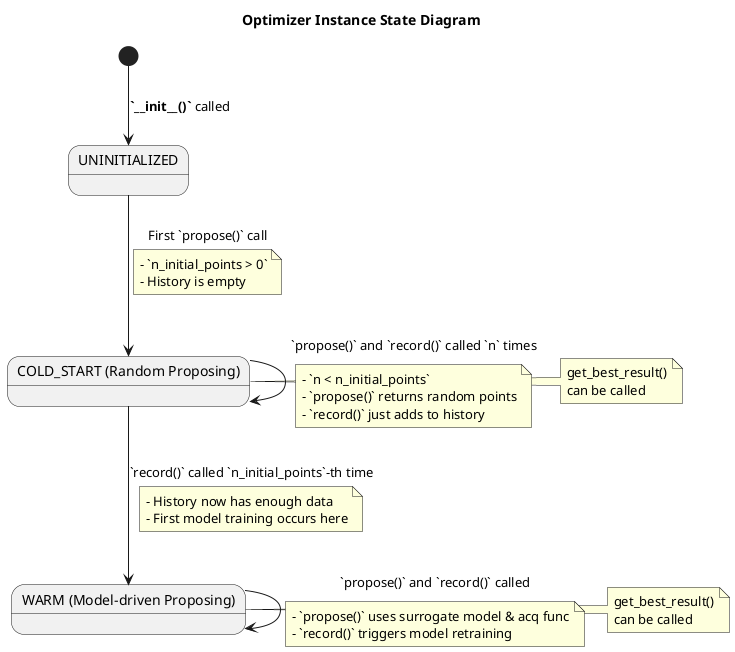
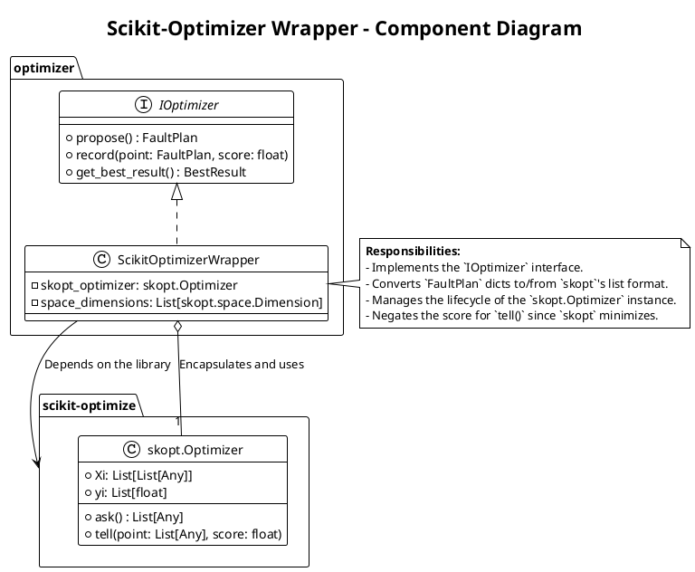
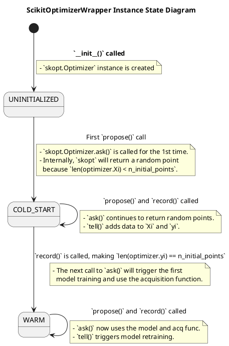
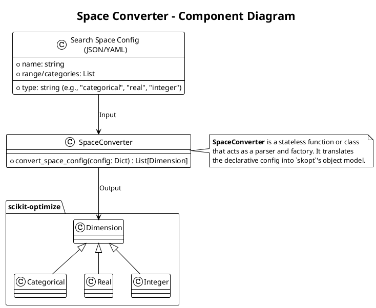
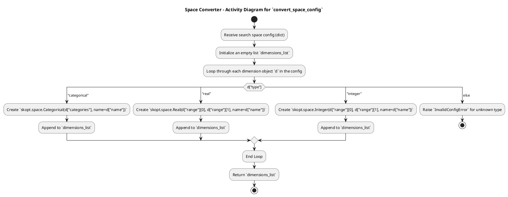

### **2. Optimizer Core (优化器核心)**

这是封装了贝叶斯优化算法的纯计算模块。



#### **模块 2.1: Optimizer Interface (`optimizer/interface.py`)**

*   **职责**: 定义优化器的标准接口（契约），以便未来可以轻松替换底层实现（例如，从 `scikit-optimize` 换到 `BoTorch`）。
*   **技术**: 使用 Python 的 `abc` (Abstract Base Classes)。
*   **接口定义**:
    ```python
    class BaseOptimizer(ABC):
        @abstractmethod
        def propose(self) -> Dict[str, Any]: ...
        
        @abstractmethod
        def record(self, point: Dict[str, Any], score: float): ...
    ```

### **详细设计文档：Optimizer Interface 模块 (v1.0)**

#### **1. 概述 (Overview)**

**Optimizer Interface** 模块是 **Optimizer Core** 的**统一抽象契约**。它的核心职责是定义一套标准的、与具体优化算法库（如 `scikit-optimize`, `BoTorch`）无关的接口。所有上层模块（特别是 `Optimization Worker`）都将通过这个接口与优化器进行交互。本模块的设计目标是**解耦、可替换性和清晰的职责边界**。

#### **2. 类图 (Component Diagram)**

此图展示了 Optimizer 接口及其与具体实现（Wrapper）和数据对象的关系。



**主要领域对象/组件说明**:

*   **IOptimizer (Interface)**:
    *   **职责**: 定义所有优化器实现都必须遵守的方法签名。它是 `Optimization Worker` 的**唯一依赖**。
    *   **实现**: 在 Python 中，这通常通过 `abc` (Abstract Base Classes) 模块来定义。
*   **FaultPlan (Type Alias / Dataclass)**:
    *   **职责**: 一个标准化的数据结构（如 `Dict` 或 `dataclass`），用于表示一个具体的故障注入计划。这是接口方法之间传递的核心数据对象。
*   **BestResult (Type Alias / Dataclass)**:
    *   **职责**: 一个标准化的数据结构，用于封装迄今为止找到的最佳结果。
*   **Concrete Implementations (e.g., `ScikitOptimizerWrapper`)**:
    *   **职责**: 具体的优化器实现类。它们实现了 `IOptimizer` 接口，并在内部封装了特定第三方库的调用逻辑。这种设计模式被称为**适配器模式 (Adapter Pattern)**。

#### **3. 状态转换图 (State Transition Diagram)**

**`IOptimizer` 接口本身是无状态的**，它只定义行为。然而，其**具体实现（如 `ScikitOptimizerWrapper`）是有状态的**，其内部状态会随着方法的调用而演进。此图描述了优化器实例的内部状态变迁。



**状态说明**:
1.  **UNINITIALIZED**: 对象刚刚被创建，但尚未开始任何优化工作。
2.  **COLD_START**: 优化器正处于初始的随机探索阶段。在此状态下，`propose()` 方法不使用任何模型，而是返回一个随机生成的点。
3.  **WARM**: 优化器已经收集了足够的初始数据，并成功训练了其第一个代理模型。从此状态开始，`propose()` 方法将基于贝叶斯优化理论进行智能决策。

#### **4. 异常处理矩阵 (Error Handling Matrix)**

`IOptimizer` 接口及其实现应该定义清晰的、领域特定的异常，以向上层（`Optimization Worker`）传递错误信息。

**自定义领域异常 (Domain-Specific Exceptions)**:
*   `OptimizerError(Exception)`: 所有优化器相关错误的基类。
*   `ProposalError(OptimizerError)`: 当 `propose()` 方法失败时抛出。
*   `RecordingError(OptimizerError)`: 当 `record()` 方法失败时抛出。
*   `InitializationError(OptimizerError)`: 当 `__init__` 失败时抛出。

**错误分类与处理矩阵**:

| 业务方法 | 触发条件 | 抛出的异常类型 | 上层 `Worker` 的处理策略 | 描述 |
| :--- | :--- | :--- | :--- | :--- |
| **`__init__`** | 搜索空间配置无效（例如，`SpaceConverter` 失败）。 | `InitializationError` | **致命错误**。`Worker` 初始化失败，整个会话应立即进入 `FAILED` 状态。 | 这是一个配置错误，无法继续。 |
| | 底层优化库（如 `skopt.Optimizer`）初始化失败。 | `InitializationError` | 同上。 | 可能是库的 bug 或配置问题。 |
| **`propose`** | 底层库的 `ask()` 方法失败或 `panic`。 | `ProposalError` | **致命错误**。`Worker` 无法获取下一步的计划，优化循环无法继续。应中断循环并进入 `FAILED` 状态。 | 这是一个严重的内部错误，表明优化器状态已损坏。 |
| | 连续多次尝试都无法生成一个满足约束的点（如果使用了拒绝采样）。 | `ProposalError` | 同上。 | 可能表明搜索空间或约束定义有误，导致可行域过小。 |
| **`record`** | 底层库的 `tell()` 方法失败（例如，模型更新失败）。 | `RecordingError` | **致命错误**。`Worker` 无法更新模型，后续的 `propose` 将基于陈旧的信息，优化将失效。应中断循环并进入 `FAILED` 状态。 | 表明代理模型训练失败，无法继续学习。 |
| | 传入的 `point` 或 `score` 格式不正确。 | `ValueError` (标准异常) | **致命错误**。这是调用方的编程错误，应立即失败并修复。 | `Worker` 模块应确保传入的数据格式正确。 |
| **`get_best_result`** | 历史记录为空。 | (无，应返回默认值) | (无) | 方法应返回一个清晰的默认值，如 `(None, -inf)`。 |

**核心健壮性设计**:
*   **接口隔离**: `Worker` 只与 `IOptimizer` 接口交互，这使得替换底层实现（例如，增加一个 `RandomOptimizer` 用于基线测试）变得非常简单，只需提供一个新的实现类即可。
*   **明确的错误信号**: 接口实现不应该“吞掉”错误或返回 `None` 来表示失败。它应该抛出明确的、可被捕获的异常，让调用方（`Worker`）能够清晰地知道优化流程已无法继续，并采取相应的失败处理措施。
*   **无副作用**: 接口方法应该是幂等的或具有明确的副作用。`propose` 应该可以被重复调用（虽然结果可能不同），`record` 的作用就是将一个观测点加入历史，副作用明确。

#### **模块 2.2: Scikit-Optimizer Wrapper (`optimizer/skopt_wrapper.py`)**

*   **职责**: **具体实现** `Optimizer Interface`，内部封装 `scikit-optimize` 库。
*   **技术**: `scikit-optimize`。
*   **核心逻辑**:
    *   `__init__(...)`: 接收 `Space Converter` 生成的 `space` 定义，初始化 `skopt.Optimizer`。
    *   `propose()`: 调用 `self.optimizer.ask()` 并将结果从列表转换为字典。
    *   `record(...)`: 将评分取负，并将点从字典转为列表后，调用 `self.optimizer.tell()`。

### **详细设计文档：Scikit-Optimizer Wrapper 模块 (v1.0)**

#### **1. 概述 (Overview)**

**Scikit-Optimizer Wrapper** 是 `IOptimizer` 接口的一个具体实现。它的核心职责是将通用的 `propose`, `record` 等调用，**翻译**成对 `scikit-optimize` (`skopt`) 库中 `Optimizer` 对象的具体方法调用（如 `ask`, `tell`）。它负责处理数据格式的转换、封装库的特定行为，并向上层屏蔽 `skopt` 的实现细节。本模块的设计目标是**正确适配、高效封装、错误传递清晰**。

#### **2. 类图 (Component Diagram)**

此图展示了 Wrapper 类如何实现接口并封装 `skopt.Optimizer`。



**主要领域对象/组件说明**:

*   **Scikit-OptimizerWrapper**:
    *   **职责**: 实现 `IOptimizer` 接口，充当我们的系统与 `skopt` 库之间的适配器。
    *   `skopt_optimizer`: 一个 `skopt.Optimizer` 的实例，是实际执行贝叶斯优化计算的对象。
    *   `space_dimensions`: 一个 `skopt.space.Dimension` 对象的列表，由 `SpaceConverter` 生成。Wrapper 保存这个列表的引用，因为它包含了维度的名称和顺序，这对于在字典和列表之间转换至关重要。

#### **3. 状态转换图 (State Transition Diagram)**

这个状态转换图与 `IOptimizer` 接口的状态图完全一致，因为它描述的是同一个逻辑状态的演进。这里我们再次呈现它，并附加上与 `skopt` 方法调用相关的注释。



#### **4. 异常处理矩阵 (Error Handling Matrix)**

Wrapper 层的职责是将底层 `skopt` 库可能抛出的异常，**捕获**并**翻译**成我们定义的、统一的领域异常（如 `ProposalError`, `RecordingError`）。

| `skopt` 方法 / 阶段 | 潜在异常/错误 | 严重性 | Wrapper 的处理策略 | 向上层 (`Worker`) 抛出的异常 |
| :--- | :--- | :--- | :--- | :--- |
| **`__init__`** | `skopt.Optimizer(...)` 初始化失败（例如，传入的 `dimensions` 格式错误）。 | **高** (Config Error) | 1. 使用 `try...except` 块包裹 `skopt.Optimizer` 的创建。<br>2. 捕获 `ValueError`, `TypeError` 等。<br>3. 记录详细的原始错误日志。 | `InitializationError` (包装原始错误) |
| **`propose`** | `self.skopt_optimizer.ask()` 失败或 `panic`。 | **高** (Critical Bug) | 1. 使用 `try...except Exception` 块包裹 `ask()` 调用。<br>2. 捕获任何异常。<br>3. 记录致命错误日志和堆栈。 | `ProposalError` (包装原始异常) |
| **`record`** | `self.skopt_optimizer.tell(point, score)` 失败。 | **高** (Critical Bug) | 1. 使用 `try...except Exception` 块包裹 `tell()` 调用。<br>2. 捕获任何异常（例如，模型拟合失败）。<br>3. 记录致命错误日志和堆栈。 | `RecordingError` (包装原始异常) |
| | 传入的 `point` 字典的 `keys` 与 `self.space_dimensions` 不匹配。 | **中** (Programming Error) | 在将 `dict` 转换为 `list` 之前进行校验，如果失败则抛出 `ValueError`。 | `ValueError` (或包装为 `RecordingError`) |
| **`get_best_result`** | `self.optimizer.yi` 为空。 | **低** (Normal Case) | 在访问 `yi` 之前进行检查。如果为空，返回一个预定义的默认值，如 `(None, -float('inf'))`。 | (不抛出异常) |
| | `numpy.argmin` 等操作失败（理论上不应发生）。 | **高** (Critical Bug) | 使用 `try...except` 捕获，并包装为 `OptimizerError`。 | `OptimizerError` |

**核心健壮性设计**:
*   **封装与隔离**: Wrapper 的核心价值在于它像一个“防爆墙”。它将 `skopt` 这个第三方库的所有行为都“关”在自己内部。即使 `skopt` 的某个版本在特定情况下会 `panic`，我们的 `try...except` 也能捕获它，并将其转换为一个可控的 `Exception`，防止整个应用程序崩溃。
*   **数据格式转换的健壮性**: 在 `dict` to `list` 和 `list` to `dict` 的转换中，必须严格依赖 `self.space_dimensions` 中定义的维度名称和顺序。这是最容易出错的地方，需要有详尽的单元测试来保证其正确性。
*   **负分转换**: 必须牢记 `skopt` 的目标是**最小化**，而我们的目标是**最大化**严重性评分。因此，在调用 `tell()` 时，传入的分数必须是 `-score`。在 `get_best_result()` 中，取出的最小 `yi` 值也需要取反才能得到正确的最高分。这个逻辑必须正确实现。

#### **模块 2.3: Space Converter (`optimizer/space_converter.py`)**

*   **职责**: 将用户友好的 JSON/YAML 搜索空间配置文件，**转换**为 `scikit-optimize` 能理解的 `Dimension` 对象列表。
*   **技术**: 纯 Python 逻辑。
*   **核心逻辑**:
    *   一个函数 `def convert_space_config(config: dict) -> List[skopt.space.Dimension]:`
    *   它会解析配置，根据 `type` 字段（如 `categorical`, `real`, `integer`）创建相应的 `skopt.space.Categorical`, `skopt.space.Real` 等对象。

好的，我们来为 **模块 2.3: Space Converter (`optimizer/space_converter.py`)** 编写一份详细的设计文档。这是一个小而关键的辅助模块。

---

### **详细设计文档：Space Converter 模块 (v1.0)**

#### **1. 概述 (Overview)**

**Space Converter** 是一个**无状态的、工具性的**模块。它的核心职责是**解析**一个人类可读的、结构化的搜索空间配置文件（通常是 JSON 或 YAML 格式），并将其**转换**为 `scikit-optimize` (`skopt`) 库能够理解的、由 `Dimension` 对象组成的列表。本模块的设计目标是**配置灵活、转换精确、错误提示清晰**。

#### **2. 类图 (Component Diagram)**

此图展示了 Space Converter 作为一个转换函数的角色。



**主要领域对象/组件说明**:

*   **Search Space Config**: 一个结构化的配置文件，定义了故障空间的所有维度。
    **示例 (YAML 格式)**:
    ```yaml
    dimensions:
      - name: "service"
        type: "categorical"
        categories: ["AuthService", "PaymentService", "OrderService"]
      - name: "fault_type"
        type: "categorical"
        categories: ["delay", "abort"]
      - name: "delay_seconds"
        type: "real"
        range: [0.1, 5.0]
      - name: "abort_code"
        type: "integer"
        range: [400, 599]
    ```
*   **SpaceConverter**:
    *   **职责**: 实现 `convert_space_config` 函数。这个函数是本模块的唯一入口。
*   **`skopt.space.Dimension`**: `scikit-optimize` 库中所有维度类的基类，包括 `Categorical`, `Real`, `Integer`。Converter 的目标就是创建这些对象的列表。

#### **3. 状态转换图 (State Transition Diagram)**

**Space Converter 是一个纯函数式、无状态的模块**。它没有自身的生命周期或内部状态。每次调用 `convert_space_config` 都是一次独立的、从输入到输出的确定性转换。

因此，使用**活动图 (Activity Diagram)** 来描述其内部处理流程更为合适。



**流程说明**:
1.  接收一个从 YAML/JSON 文件加载而来的字典。
2.  创建一个空列表用于存放结果。
3.  遍历配置中的每个维度定义。
4.  使用一个 `switch` (或 `if/elif/else`) 语句，根据 `type` 字段来决定创建哪种 `skopt.space.Dimension` 对象。
5.  从配置中提取相应的参数（如 `categories`, `range`, `name`）来实例化对象。
6.  如果遇到未知的 `type`，立即抛出配置错误异常。
7.  将创建的对象追加到结果列表中。
8.  循环结束后，返回完整的 `Dimension` 对象列表。

#### **4. 异常处理矩阵 (Error Handling Matrix)**

Converter 的核心职责之一就是**验证配置文件的正确性**。它的异常处理必须能提供清晰、可定位的错误信息，帮助用户快速修复配置问题。

**自定义领域异常 (Domain-Specific Exceptions)**:
*   `InvalidConfigError(ValueError)`: 当配置文件格式或内容不合法时抛出。

**错误分类与处理矩阵**:

| 发生阶段 | 潜在异常/错误 | 严重性 | 处理策略 | 向上层 (`Optimizer` 初始化) 抛出的异常/信息 |
| :--- | :--- | :--- | :--- | :--- |
| **文件加载时** | 文件不存在、无权限、非标准 YAML/JSON。 | **高** (User/Config Error) | **由调用方处理**。`SpaceConverter` 假设它接收的是一个已经成功加载的 Python `dict`。 | (调用方应处理 `FileNotFoundError`, `yaml.YAMLError` 等) |
| **转换过程中** | `dimensions` 列表不存在或不是列表。 | **高** (Config Error) | 在循环前检查 `config.get("dimensions")` 是否为列表，否则抛出异常。 | `InvalidConfigError("'dimensions' key is missing or not a list")` |
| | 维度对象缺少 `name` 或 `type` 字段。 | **高** (Config Error) | 在循环内部，检查每个维度字典是否包含必要的 `key`。 | `InvalidConfigError("Dimension at index 2 is missing 'name' field")` |
| | `type` 字段的值是未知的（如 "string"）。 | **高** (Config Error) | `switch` 语句的 `else` 分支会捕获这种情况。 | `InvalidConfigError("Dimension 'my_dim' has an unknown type 'string'")` |
| | `type` 与参数不匹配：<br>- `type: categorical`, 但缺少 `categories` 字段。<br>- `type: real`, 但 `range` 不是包含2个数字的列表。 | **高** (Config Error) | 在每个 `case` 内部，对特定于类型的参数进行严格的格式和类型检查。 | `InvalidConfigError("Categorical dimension 'service' is missing 'categories' field")`<br>`InvalidConfigError("Real dimension 'delay' has an invalid 'range', expected a list of two numbers")` |

**核心健壮性设计**:
*   **明确的错误信息**: 所有的 `InvalidConfigError` 都必须包含**上下文信息**，例如是哪个维度（通过名称或索引）出了什么具体问题。这对于用户调试配置文件至关重要。
*   **尽早失败 (Fail Fast)**: 在转换过程中的任何一点发现配置错误，都应立即抛出异常并终止，而不是尝试继续处理或返回一个不完整/不正确的结果。
*   **无副作用**: `convert_space_config` 必须是一个纯函数。对于相同的输入，它总是返回相同的输出，并且不会修改任何外部状态。这使得它非常容易进行单元测试。
