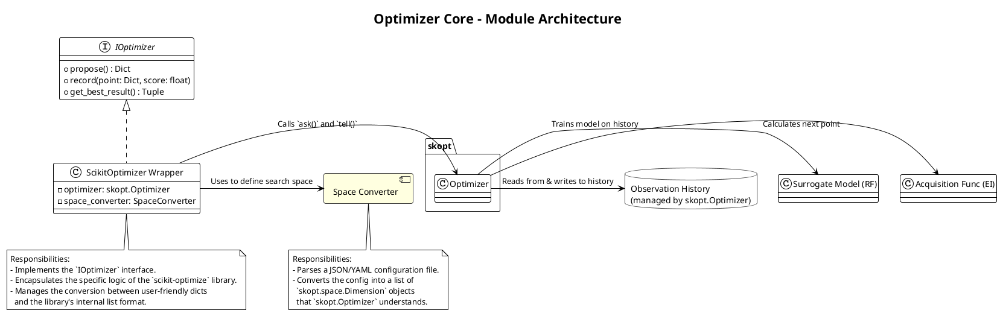
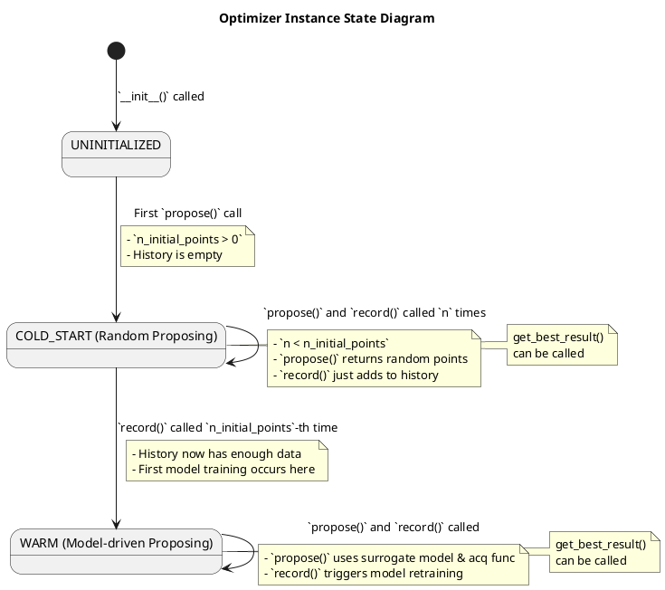
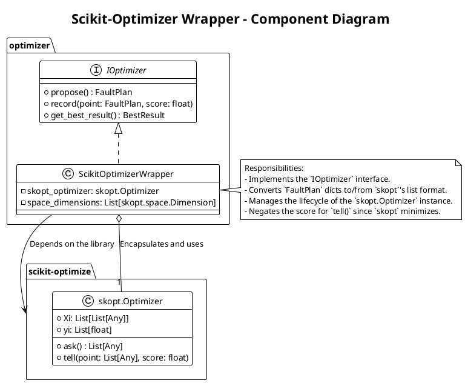
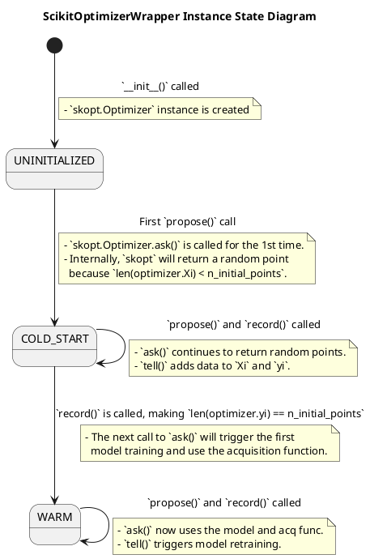
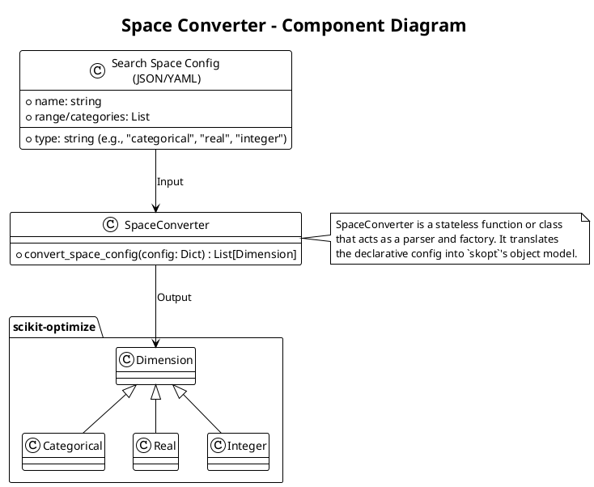

# 2. Optimizer Core (优化器核心)

这是封装了贝叶斯优化算法的纯计算模块。



## 模块 2.1: Optimizer Interface (`optimizer/interface.py`)

*   职责: 定义优化器的标准接口（契约），以便未来可以轻松替换底层实现（例如，从 `scikit-optimize` 换到 `BoTorch`）。
*   技术: 使用 Python 的 `abc` (Abstract Base Classes)。
*   接口定义:
    ```python
    class BaseOptimizer(ABC):
        @abstractmethod
        def propose(self) -> Dict[str, Any]: ...
        
        @abstractmethod
        def record(self, point: Dict[str, Any], score: float): ...
    ```


### 概述 (Overview)

Optimizer Interface 模块是 Optimizer Core 的统一抽象契约。它的核心职责是定义一套标准的、与具体优化算法库（如 `scikit-optimize`, `BoTorch`）无关的接口。所有上层模块（特别是 `Optimization Worker`）都将通过这个接口与优化器进行交互。本模块的设计目标是解耦、可替换性和清晰的职责边界。

### 类图 (Component Diagram)

此图展示了 Optimizer 接口及其与具体实现（Wrapper）和数据对象的关系。


主要领域对象/组件说明:

*   IOptimizer (Interface):
    *   职责: 定义所有优化器实现都必须遵守的方法签名。它是 `Optimization Worker` 的唯一依赖。
    *   实现: 在 Python 中，这通常通过 `abc` (Abstract Base Classes) 模块来定义。
*   FaultPlan (Type Alias / Dataclass):
    *   职责: 一个标准化的数据结构（如 `Dict` 或 `dataclass`），用于表示一个具体的故障注入计划。这是接口方法之间传递的核心数据对象。
*   BestResult (Type Alias / Dataclass):
    *   职责: 一个标准化的数据结构，用于封装迄今为止找到的最佳结果。
*   Concrete Implementations (e.g., `ScikitOptimizerWrapper`):
    *   职责: 具体的优化器实现类。它们实现了 `IOptimizer` 接口，并在内部封装了特定第三方库的调用逻辑。这种设计模式被称为适配器模式 (Adapter Pattern)。

### 状态转换图 (State Transition Diagram)

`IOptimizer` 接口本身是无状态的，它只定义行为。然而，其具体实现（如 `ScikitOptimizerWrapper`）是有状态的，其内部状态会随着方法的调用而演进。此图描述了优化器实例的内部状态变迁。



状态说明:
1.  UNINITIALIZED: 对象刚刚被创建，但尚未开始任何优化工作。
2.  COLD_START: 优化器正处于初始的随机探索阶段。在此状态下，`propose()` 方法不使用任何模型，而是返回一个随机生成的点。
3.  WARM: 优化器已经收集了足够的初始数据，并成功训练了其第一个代理模型。从此状态开始，`propose()` 方法将基于贝叶斯优化理论进行智能决策。

### 异常处理矩阵 (Error Handling Matrix)

`IOptimizer` 接口及其实现应该定义清晰的、领域特定的异常，以向上层（`Optimization Worker`）传递错误信息。

自定义领域异常 (Domain-Specific Exceptions):
*   `OptimizerError(Exception)`: 所有优化器相关错误的基类。
*   `ProposalError(OptimizerError)`: 当 `propose()` 方法失败时抛出。
*   `RecordingError(OptimizerError)`: 当 `record()` 方法失败时抛出。
*   `InitializationError(OptimizerError)`: 当 `__init__` 失败时抛出。

错误分类与处理矩阵:

| 业务方法 | 触发条件 | 抛出的异常类型 | 上层 `Worker` 的处理策略 | 描述 |
| : | : | : | : | : |
| `__init__` | 搜索空间配置无效（例如，`SpaceConverter` 失败）。 | `InitializationError` | 致命错误。`Worker` 初始化失败，整个会话应立即进入 `FAILED` 状态。 | 这是一个配置错误，无法继续。 |
| | 底层优化库（如 `skopt.Optimizer`）初始化失败。 | `InitializationError` | 同上。 | 可能是库的 bug 或配置问题。 |
| `propose` | 底层库的 `ask()` 方法失败或 `panic`。 | `ProposalError` | 致命错误。`Worker` 无法获取下一步的计划，优化循环无法继续。应中断循环并进入 `FAILED` 状态。 | 这是一个严重的内部错误，表明优化器状态已损坏。 |
| | 连续多次尝试都无法生成一个满足约束的点（如果使用了拒绝采样）。 | `ProposalError` | 同上。 | 可能表明搜索空间或约束定义有误，导致可行域过小。 |
| `record` | 底层库的 `tell()` 方法失败（例如，模型更新失败）。 | `RecordingError` | 致命错误。`Worker` 无法更新模型，后续的 `propose` 将基于陈旧的信息，优化将失效。应中断循环并进入 `FAILED` 状态。 | 表明代理模型训练失败，无法继续学习。 |
| | 传入的 `point` 或 `score` 格式不正确。 | `ValueError` (标准异常) | 致命错误。这是调用方的编程错误，应立即失败并修复。 | `Worker` 模块应确保传入的数据格式正确。 |
| `get_best_result` | 历史记录为空。 | (无，应返回默认值) | (无) | 方法应返回一个清晰的默认值，如 `(None, -inf)`。 |

核心健壮性设计:
*   接口隔离: `Worker` 只与 `IOptimizer` 接口交互，这使得替换底层实现（例如，增加一个 `RandomOptimizer` 用于基线测试）变得非常简单，只需提供一个新的实现类即可。
*   明确的错误信号: 接口实现不应该“吞掉”错误或返回 `None` 来表示失败。它应该抛出明确的、可被捕获的异常，让调用方（`Worker`）能够清晰地知道优化流程已无法继续，并采取相应的失败处理措施。
*   无副作用: 接口方法应该是幂等的或具有明确的副作用。`propose` 应该可以被重复调用（虽然结果可能不同），`record` 的作用就是将一个观测点加入历史，副作用明确。

## 模块 2.2: Scikit-Optimizer Wrapper (`optimizer/skopt_wrapper.py`)

*   职责: 具体实现 `Optimizer Interface`，内部封装 `scikit-optimize` 库。
*   技术: `scikit-optimize`。
*   核心逻辑:
    *   `__init__(...)`: 接收 `Space Converter` 生成的 `space` 定义，初始化 `skopt.Optimizer`。
    *   `propose()`: 调用 `self.optimizer.ask()` 并将结果从列表转换为字典。
    *   `record(...)`: 将评分取负，并将点从字典转为列表后，调用 `self.optimizer.tell()`。

### 概述 (Overview)

Scikit-Optimizer Wrapper 是 `IOptimizer` 接口的一个具体实现。它的核心职责是将通用的 `propose`, `record` 等调用，翻译成对 `scikit-optimize` (`skopt`) 库中 `Optimizer` 对象的具体方法调用（如 `ask`, `tell`）。它负责处理数据格式的转换、封装库的特定行为，并向上层屏蔽 `skopt` 的实现细节。本模块的设计目标是正确适配、高效封装、错误传递清晰。

### 类图 (Component Diagram)

此图展示了 Wrapper 类如何实现接口并封装 `skopt.Optimizer`。



主要领域对象/组件说明:

*   Scikit-OptimizerWrapper:
    *   职责: 实现 `IOptimizer` 接口，充当我们的系统与 `skopt` 库之间的适配器。
    *   `skopt_optimizer`: 一个 `skopt.Optimizer` 的实例，是实际执行贝叶斯优化计算的对象。
    *   `space_dimensions`: 一个 `skopt.space.Dimension` 对象的列表，由 `SpaceConverter` 生成。Wrapper 保存这个列表的引用，因为它包含了维度的名称和顺序，这对于在字典和列表之间转换至关重要。

### 状态转换图 (State Transition Diagram)

这个状态转换图与 `IOptimizer` 接口的状态图完全一致，因为它描述的是同一个逻辑状态的演进。这里我们再次呈现它，并附加上与 `skopt` 方法调用相关的注释。



### 异常处理矩阵 (Error Handling Matrix)

Wrapper 层的职责是将底层 `skopt` 库可能抛出的异常，捕获并翻译成我们定义的、统一的领域异常（如 `ProposalError`, `RecordingError`）。

| `skopt` 方法 / 阶段 | 潜在异常/错误 | 严重性 | Wrapper 的处理策略 | 向上层 (`Worker`) 抛出的异常 |
| : | : | : | : | : |
| `__init__` | `skopt.Optimizer(...)` 初始化失败（例如，传入的 `dimensions` 格式错误）。 | 高 (Config Error) | 1. 使用 `try...except` 块包裹 `skopt.Optimizer` 的创建。<br>2. 捕获 `ValueError`, `TypeError` 等。<br>3. 记录详细的原始错误日志。 | `InitializationError` (包装原始错误) |
| `propose` | `self.skopt_optimizer.ask()` 失败或 `panic`。 | 高 (Critical Bug) | 1. 使用 `try...except Exception` 块包裹 `ask()` 调用。<br>2. 捕获任何异常。<br>3. 记录致命错误日志和堆栈。 | `ProposalError` (包装原始异常) |
| `record` | `self.skopt_optimizer.tell(point, score)` 失败。 | 高 (Critical Bug) | 1. 使用 `try...except Exception` 块包裹 `tell()` 调用。<br>2. 捕获任何异常（例如，模型拟合失败）。<br>3. 记录致命错误日志和堆栈。 | `RecordingError` (包装原始异常) |
| | 传入的 `point` 字典的 `keys` 与 `self.space_dimensions` 不匹配。 | 中 (Programming Error) | 在将 `dict` 转换为 `list` 之前进行校验，如果失败则抛出 `ValueError`。 | `ValueError` (或包装为 `RecordingError`) |
| `get_best_result` | `self.optimizer.yi` 为空。 | 低 (Normal Case) | 在访问 `yi` 之前进行检查。如果为空，返回一个预定义的默认值，如 `(None, -float('inf'))`。 | (不抛出异常) |
| | `numpy.argmin` 等操作失败（理论上不应发生）。 | 高 (Critical Bug) | 使用 `try...except` 捕获，并包装为 `OptimizerError`。 | `OptimizerError` |

核心健壮性设计:
*   封装与隔离: Wrapper 的核心价值在于它像一个“防爆墙”。它将 `skopt` 这个第三方库的所有行为都“关”在自己内部。即使 `skopt` 的某个版本在特定情况下会 `panic`，我们的 `try...except` 也能捕获它，并将其转换为一个可控的 `Exception`，防止整个应用程序崩溃。
*   数据格式转换的健壮性: 在 `dict` to `list` 和 `list` to `dict` 的转换中，必须严格依赖 `self.space_dimensions` 中定义的维度名称和顺序。这是最容易出错的地方，需要有详尽的单元测试来保证其正确性。
*   负分转换: 必须牢记 `skopt` 的目标是最小化，而我们的目标是最大化严重性评分。因此，在调用 `tell()` 时，传入的分数必须是 `-score`。在 `get_best_result()` 中，取出的最小 `yi` 值也需要取反才能得到正确的最高分。这个逻辑必须正确实现。

## 模块 2.3: Space Converter (`optimizer/space_converter.py`)

职责：
1. 加载并验证 YAML/JSON 格式的搜索空间配置
2. 将配置转换为 scikit-optimize 的 Dimension 对象
3. 提供双向转换（字典 ↔ 列表）以支持参数传递

### 概述 (Overview)

Space Converter 是一个无状态的、工具性的模块。它的核心职责是解析一个人类可读的、结构化的搜索空间配置文件（通常是 JSON 或 YAML 格式），并将其转换为 `scikit-optimize` (`skopt`) 库能够理解的、由 `Dimension` 对象组成的列表。本模块的设计目标是配置灵活、转换精确、错误提示清晰。

配置 Schema：

```yaml
# config/fault_space_config.yaml 示例
version: "1.0"
description: "Payment Service 的故障空间配置"

dimensions:
  # 无条件维度 - 总是参与搜索
  - name: "fault_type"
    type: "categorical"
    values: ["delay", "abort", "error_injection"]
    description: "故障类型"
  
  - name: "service"
    type: "categorical"
    values: ["PaymentService", "OrderService", "UserService"]
    description: "目标服务"
  
  - name: "percentage"
    type: "integer"
    min: 10
    max: 100
    description: "故障注入百分比"
  
  # 条件维度 - 仅在特定条件下有效
  - name: "delay_seconds"
    type: "real"
    min: 0.1
    max: 30.0
    condition:
      field: "fault_type"
      operator: "equals"
      value: "delay"
    description: "延迟时间（仅 fault_type=delay 时有效）"
  
  - name: "abort_http_status"
    type: "categorical"
    values: [400, 403, 500, 503]
    condition:
      field: "fault_type"
      operator: "equals"
      value: "abort"
    description: "HTTP 状态码（仅 fault_type=abort 时有效）"
```

### 类图 (Component Diagram)

此图展示了 Space Converter 作为一个转换函数的角色。



主要领域对象/组件说明:

*   Search Space Config: 一个结构化的配置文件，定义了故障空间的所有维度。

#### 完整的 `fault_space_config.yaml` 示例

```yaml
# config/fault_space_config.yaml
# ================================
# Fault Space Configuration for Payment Service
# Version: 1.0
# Description: 定义了 PaymentService 的故障注入搜索空间

version: "1.0"
description: "Payment Service 的故障空间配置"

# 冷启动阶段的配置
cold_start:
  n_initial_points: 10        # 初始随机采样点数
  strategy: "random"          # 初始采样策略：random, sobol, lhs
  warm_start_points: []       # 可选：预设的初始点

# 优化器的超参数
optimizer:
  acq_func: "EI"              # 采集函数：Expected Improvement
  n_initial_calls: 10         # 初始调用次数（同 cold_start.n_initial_points）
  acq_func_kwargs:
    xi: 0.0                   # EI 的探索参数
    kappa: 2.576              # 置信度参数（2.576 ≈ 95% 置信）
  base_estimator: "RF"        # 代理模型：Random Forest

# 搜索空间定义
dimensions:
  # 1. 无条件维度 - 在所有迭代中都参与
  - name: "service"
    type: "categorical"
    categories: ["AuthService", "PaymentService", "OrderService"]
    description: "目标微服务名称"

  - name: "api"
    type: "categorical"
    categories: ["/api/v1/auth/login", "/api/v1/payment/process", "/api/v1/order/create"]
    description: "目标 API 端点"

  - name: "fault_type"
    type: "categorical"
    categories: ["delay", "abort", "error_injection"]
    description: "故障类型"

  # 2. 条件维度 (Conditional Dimensions)
  #    - 仅当父维度满足特定条件时才参与搜索
  #    - 需要特殊的处理策略（expand/filter/encode）
  
  - name: "delay_seconds"
    type: "real"
    range: [0.1, 30.0]
    description: "延迟时间（秒）"
    condition:
      field: "fault_type"
      operator: "equals"
      value: "delay"
    # 说明：此维度仅当 fault_type="delay" 时有效
    # Phase 1 使用 "expand" 策略：搜索空间中包含所有维度的笛卡尔积
    # 在执行时，若 fault_type!="delay"，则忽略 delay_seconds 的值

  - name: "abort_http_status"
    type: "integer"
    range: [400, 599]
    description: "中止时的 HTTP 状态码"
    condition:
      field: "fault_type"
      operator: "equals"
      value: "abort"
    # 说明：此维度仅当 fault_type="abort" 时有效

  - name: "error_percentage"
    type: "integer"
    range: [1, 100]
    description: "注入错误的百分比"
    condition:
      field: "fault_type"
      operator: "equals"
      value: "error_injection"

  - name: "percentage"
    type: "integer"
    range: [1, 100]
    description: "受影响的请求百分比（通用）"

  - name: "duration_seconds"
    type: "integer"
    range: [1, 300]
    description: "故障持续时间（秒）"

# 条件维度处理策略选择
conditional_strategy: "expand"
# 可选值：
#   - "expand": (推荐 Phase 1) 搜索空间包含所有可能的维度组合
#     优点：简单、无需复杂逻辑
#     缺点：搜索空间较大（含大量无效点）
#   
#   - "filter": (推荐 Phase 2) 动态计算条件，仅当条件满足时才添加维度
#     优点：搜索空间紧凑，无效点少
#     缺点：需要复杂的条件评估和动态维度构造
#   
#   - "encode": (高级) 使用编码技巧将条件维度转换为额外的特征
#     优点：数学上优雅
#     缺点：需要特殊的解码和特征工程

# 约束条件（可选）
constraints:
  - name: "high_percentage_low_delay"
    description: "若错误百分比高，则延迟必须低"
    rule: "if percentage > 50 then delay_seconds < 5.0"
    # 约束的具体实现方式待定（可选的拒绝采样或惩罚函数）

  - name: "one_service_at_a_time"
    description: "优化时每次只针对一个服务"
    note: "由调用方确保（Session 初始化时指定）"

# 基线配置（用于性能评分的参考）
baseline:
  latency_ms: 200             # 基线延迟（毫秒）
  error_rate: 0.0             # 基线错误率

# 阈值配置
thresholds:
  latency_threshold_ms: 1000  # 性能评分的延迟阈值
  error_rate_threshold: 0.1   # 错误率阈值（10%）

# 评分权重（可选，若不指定则使用默认权重）
weights:
  bug_score: 10.0             # Bug 触发权重（最高）
  performance_score: 2.0      # 性能影响权重
  structure_score: 5.0        # 结构变化权重
```

#### 配置 Schema 的加载示例 (Python)

```python
# 在 SpaceConverter 中的使用示例
import yaml
from pathlib import Path

class SpaceConverter:
    def __init__(self, config_path: str):
        """
        初始化 Space Converter，加载并解析配置文件。
        
        Args:
            config_path: 指向 YAML 配置文件的路径
        
        Raises:
            FileNotFoundError: 配置文件不存在
            ValueError: 配置文件格式或内容无效
        """
        # 1. 加载 YAML 文件
        with open(config_path, 'r', encoding='utf-8') as f:
            self.config = yaml.safe_load(f)
        
        # 2. 验证配置结构
        self._validate_config()
        
        # 3. 解析维度定义
        self.dimensions = self.config.get('dimensions', [])
        
        # 4. 维度名称 → 索引的映射（用于双向转换）
        self.name_to_index = {
            dim['name']: idx 
            for idx, dim in enumerate(self.dimensions)
        }
        self.index_to_name = {
            idx: dim['name'] 
            for idx, dim in enumerate(self.dimensions)
        }
        
        # 5. 创建 scikit-optimize 的 Dimension 对象
        self.skopt_dimensions = self._convert_to_skopt_dimensions()
    
    def _validate_config(self):
        """
        验证配置文件的正确性。
        
        检查项：
        - dimensions 字段存在且是列表
        - 每个维度都有 name 和 type
        - 维度名称唯一
        - 维度类型有效
        - 类型与参数匹配
        """
        if 'dimensions' not in self.config:
            raise ValueError("Config must contain 'dimensions' key")
        
        dimensions = self.config['dimensions']
        if not isinstance(dimensions, list):
            raise ValueError("'dimensions' must be a list")
        
        names_seen = set()
        for idx, dim in enumerate(dimensions):
            # 检查必需字段
            if 'name' not in dim or 'type' not in dim:
                raise ValueError(
                    f"Dimension at index {idx} is missing 'name' or 'type'"
                )
            
            # 检查名称唯一性
            if dim['name'] in names_seen:
                raise ValueError(
                    f"Duplicate dimension name: '{dim['name']}'"
                )
            names_seen.add(dim['name'])
            
            # 检查类型有效性
            valid_types = ['categorical', 'real', 'integer']
            if dim['type'] not in valid_types:
                raise ValueError(
                    f"Dimension '{dim['name']}' has invalid type '{dim['type']}'"
                )
            
            # 类型特定的检查
            if dim['type'] == 'categorical':
                if 'categories' not in dim or not isinstance(dim['categories'], list):
                    raise ValueError(
                        f"Categorical dimension '{dim['name']}' is missing 'categories' list"
                    )
            else:  # real or integer
                if 'range' not in dim:
                    raise ValueError(
                        f"{dim['type'].capitalize()} dimension '{dim['name']}' is missing 'range'"
                    )
                if not isinstance(dim['range'], list) or len(dim['range']) != 2:
                    raise ValueError(
                        f"Dimension '{dim['name']}' has invalid 'range' format"
                    )

    def _convert_to_skopt_dimensions(self):
        """将配置维度转换为 scikit-optimize 的 Dimension 对象"""
        from skopt.space import Categorical, Real, Integer
        
        dimensions = []
        for dim_config in self.dimensions:
            name = dim_config['name']
            dtype = dim_config['type']
            
            try:
                if dtype == 'categorical':
                    dim_obj = Categorical(
                        dim_config['categories'],
                        name=name
                    )
                elif dtype == 'real':
                    dim_obj = Real(
                        dim_config['range'][0],
                        dim_config['range'][1],
                        name=name
                    )
                elif dtype == 'integer':
                    dim_obj = Integer(
                        dim_config['range'][0],
                        dim_config['range'][1],
                        name=name
                    )
                dimensions.append(dim_obj)
            except Exception as e:
                raise ValueError(
                    f"Failed to create {dtype} dimension '{name}': {str(e)}"
                )
        
        return dimensions
```

*   SpaceConverter:
    *   职责: 实现 `convert_space_config` 函数。这个函数是本模块的唯一入口。
*   `skopt.space.Dimension`: `scikit-optimize` 库中所有维度类的基类，包括 `Categorical`, `Real`, `Integer`。Converter 的目标就是创建这些对象的列表。

### 状态转换图 (State Transition Diagram)

Space Converter 是一个纯函数式、无状态的模块。它没有自身的生命周期或内部状态。每次调用 `convert_space_config` 都是一次独立的、从输入到输出的确定性转换。

因此，使用活动图 (Activity Diagram) 来描述其内部处理流程更为合适。


流程说明:
1.  接收一个从 YAML/JSON 文件加载而来的字典。
2.  创建一个空列表用于存放结果。
3.  遍历配置中的每个维度定义。
4.  使用一个 `switch` (或 `if/elif/else`) 语句，根据 `type` 字段来决定创建哪种 `skopt.space.Dimension` 对象。
5.  从配置中提取相应的参数（如 `categories`, `range`, `name`）来实例化对象。
6.  如果遇到未知的 `type`，立即抛出配置错误异常。
7.  将创建的对象追加到结果列表中。
8.  循环结束后，返回完整的 `Dimension` 对象列表。

### 异常处理矩阵 (Error Handling Matrix)

Converter 的核心职责之一就是验证配置文件的正确性。它的异常处理必须能提供清晰、可定位的错误信息，帮助用户快速修复配置问题。

自定义领域异常 (Domain-Specific Exceptions):
*   `InvalidConfigError(ValueError)`: 当配置文件格式或内容不合法时抛出。

错误分类与处理矩阵:

| 发生阶段 | 潜在异常/错误 | 严重性 | 处理策略 | 向上层 (`Optimizer` 初始化) 抛出的异常/信息 |
| : | : | : | : | : |
| 文件加载时 | 文件不存在、无权限、非标准 YAML/JSON。 | 高 (User/Config Error) | 由调用方处理。`SpaceConverter` 假设它接收的是一个已经成功加载的 Python `dict`。 | (调用方应处理 `FileNotFoundError`, `yaml.YAMLError` 等) |
| 转换过程中 | `dimensions` 列表不存在或不是列表。 | 高 (Config Error) | 在循环前检查 `config.get("dimensions")` 是否为列表，否则抛出异常。 | `InvalidConfigError("'dimensions' key is missing or not a list")` |
| | 维度对象缺少 `name` 或 `type` 字段。 | 高 (Config Error) | 在循环内部，检查每个维度字典是否包含必要的 `key`。 | `InvalidConfigError("Dimension at index 2 is missing 'name' field")` |
| | `type` 字段的值是未知的（如 "string"）。 | 高 (Config Error) | `switch` 语句的 `else` 分支会捕获这种情况。 | `InvalidConfigError("Dimension 'my_dim' has an unknown type 'string'")` |
| | `type` 与参数不匹配：<br>- `type: categorical`, 但缺少 `categories` 字段。<br>- `type: real`, 但 `range` 不是包含2个数字的列表。 | 高 (Config Error) | 在每个 `case` 内部，对特定于类型的参数进行严格的格式和类型检查。 | `InvalidConfigError("Categorical dimension 'service' is missing 'categories' field")`<br>`InvalidConfigError("Real dimension 'delay' has an invalid 'range', expected a list of two numbers")` |

核心健壮性设计:
*   明确的错误信息: 所有的 `InvalidConfigError` 都必须包含上下文信息，例如是哪个维度（通过名称或索引）出了什么具体问题。这对于用户调试配置文件至关重要。
*   尽早失败 (Fail Fast): 在转换过程中的任何一点发现配置错误，都应立即抛出异常并终止，而不是尝试继续处理或返回一个不完整/不正确的结果。
*   无副作用: `convert_space_config` 必须是一个纯函数。对于相同的输入，它总是返回相同的输出，并且不会修改任何外部状态。这使得它非常容易进行单元测试。


## 模块 2.3 详解: Space Converter 算法与实现

### 算法概述

Space Converter 的核心职责是实现配置 → skopt 对象的转换。这个过程涉及三个关键的子算法：

1. 配置加载与验证 (Load & Validate)
2. 维度到 scikit-optimize 对象的转换 (Convert to skopt.space.Dimension)
3. 维度名称与索引的映射管理 (Name ↔ Index Mapping)

### 算法 1: 配置加载与验证

伪代码:
```
function load_and_validate_config(config_dict):
    1. 检查 'dimensions' 键是否存在
       if 'dimensions' not in config_dict:
           raise ValueError("Missing 'dimensions' key")
    
    2. 检查 'dimensions' 是否为列表
       if not isinstance(config_dict['dimensions'], list):
           raise ValueError("'dimensions' must be a list")
    
    3. 初始化已见过的名称集合
       seen_names = set()
    
    4. 遍历每个维度配置
       for idx, dimension_config in enumerate(config_dict['dimensions']):
           a. 检查必需字段 ('name', 'type')
              if 'name' not in dimension_config:
                  raise ValueError(f"Dimension at index {idx} missing 'name'")
              if 'type' not in dimension_config:
                  raise ValueError(f"Dimension at index {idx} missing 'type'")
           
           b. 检查名称唯一性
              if dimension_config['name'] in seen_names:
                  raise ValueError(f"Duplicate dimension name: '{dimension_config['name']}'")
              seen_names.add(dimension_config['name'])
           
           c. 检查类型有效性
              if dimension_config['type'] not in ['categorical', 'real', 'integer']:
                  raise ValueError(f"Invalid type: '{dimension_config['type']}'")
           
           d. 类型特定的验证
              validate_type_specific_fields(dimension_config)
    
    5. 返回验证通过的配置
       return config_dict
```

关键点:
- ✅ 尽早检测错误，提供清晰的错误消息，包含维度索引和名称
- ✅ 检查名称唯一性（后续映射表依赖此）
- ✅ 逐个维度进行类型特定的验证

### 算法 2: 维度转换 (Dimension Conversion)

伪代码:
```
function convert_dimensions_to_skopt(dimensions_list, conditional_strategy):
    skopt_dimensions = []
    
    for dimension_config in dimensions_list:
        name = dimension_config['name']
        dtype = dimension_config['type']
        
        # 检查是否是条件维度
        if 'condition' in dimension_config:
            # 条件维度处理
            if conditional_strategy == "expand":
                # Phase 1: 保留所有维度，忽略条件
                skopt_dim = create_dimension_object(dimension_config)
            elif conditional_strategy == "filter":
                # Phase 2: 动态添加维度（较复杂）
                # 仅在运行时满足条件时添加
                # 此处跳过，交由运行时处理
                continue
            elif conditional_strategy == "encode":
                # 高级：编码为额外特征
                # 留作未来实现
                skopt_dim = create_encoded_dimension(dimension_config)
        else:
            # 无条件维度：总是添加
            skopt_dim = create_dimension_object(dimension_config)
        
        skopt_dimensions.append(skopt_dim)
    
    return skopt_dimensions

function create_dimension_object(dimension_config):
    dtype = dimension_config['type']
    name = dimension_config['name']
    
    try:
        if dtype == 'categorical':
            return Categorical(
                dimension_config['categories'],
                name=name
            )
        elif dtype == 'real':
            return Real(
                dimension_config['range'][0],
                dimension_config['range'][1],
                name=name
            )
        elif dtype == 'integer':
            return Integer(
                dimension_config['range'][0],
                dimension_config['range'][1],
                name=name
            )
    except Exception as e:
        raise ValueError(f"Failed to create {dtype} dimension '{name}': {str(e)}")
```

关键点:
- ✅ 根据条件维度策略进行不同的处理
- ✅ Phase 1 使用 "expand" 策略最简单
- ✅ 每个维度对象创建时都捕获异常，提供清晰的错误信息

### 算法 3: 名称 ↔ 索引映射管理

维度名称与索引的双向映射是实现字典 ↔ 列表转换的基础。

数据结构:
```python
class SpaceConverter:
    def __init__(self, config_path):
        self.dimensions = [...]  # 原始配置中的维度列表
        
        # 构建映射表
        self.name_to_index = {}
        self.index_to_name = {}
        
        for idx, dim in enumerate(self.dimensions):
            name = dim['name']
            self.name_to_index[name] = idx
            self.index_to_name[idx] = name
```

字典 → 列表转换算法 (`dict_to_list`):
```
function dict_to_list(point_dict: Dict[str, Any]) -> List[Any]:
    """
    将用户友好的字典转换为 scikit-optimize 的列表格式。
    
    示例：
    Input:  {"service": "PaymentService", "delay_seconds": 2.5, "percentage": 50}
    Output: ["PaymentService", 2.5, 50, ...]  (按 self.dimensions 的顺序)
    """
    
    result = []
    
    for idx in range(len(self.dimensions)):
        dim_name = self.index_to_name[idx]
        
        if dim_name in point_dict:
            # 维度存在于输入字典中
            result.append(point_dict[dim_name])
        else:
            # 维度缺失：
            # - 若是可选维度（条件不满足），使用默认值
            # - 若是必需维度，抛出错误
            if self._is_optional_dimension(dim_name):
                default_value = self._get_default_value(dim_name)
                result.append(default_value)
            else:
                raise ValueError(f"Missing required dimension: '{dim_name}'")
    
    return result
```

列表 → 字典转换算法 (`list_to_dict`):
```
function list_to_dict(point_list: List[Any]) -> Dict[str, Any]:
    """
    将 scikit-optimize 的列表格式转换回用户友好的字典。
    
    示例：
    Input:  ["PaymentService", 2.5, 50, ...]
    Output: {"service": "PaymentService", "delay_seconds": 2.5, "percentage": 50, ...}
    """
    
    if len(point_list) != len(self.dimensions):
        raise ValueError(
            f"Point list length {len(point_list)} does not match "
            f"expected {len(self.dimensions)}"
        )
    
    result = {}
    
    for idx, value in enumerate(point_list):
        dim_name = self.index_to_name[idx]
        
        # 验证值的有效性（可选，用于调试）
        if self._validate_dimension_value(dim_name, value):
            result[dim_name] = value
        else:
            raise ValueError(
                f"Invalid value '{value}' for dimension '{dim_name}': "
                f"out of bounds or type mismatch"
            )
    
    return result
```

验证函数:
```
function _validate_dimension_value(dim_name: str, value: Any) -> bool:
    """验证值是否符合该维度的类型和范围"""
    
    dimension_config = self.get_dimension_config(dim_name)
    dtype = dimension_config['type']
    
    if dtype == 'categorical':
        # 验证值在 categories 中
        return value in dimension_config['categories']
    
    elif dtype == 'real':
        # 验证值是数字且在范围内
        min_val, max_val = dimension_config['range']
        return isinstance(value, (int, float)) and min_val <= value <= max_val
    
    elif dtype == 'integer':
        # 验证值是整数且在范围内
        min_val, max_val = dimension_config['range']
        return isinstance(value, int) and min_val <= value <= max_val
    
    return False
```

关键点:
- ✅ 映射表的顺序必须与 `self.dimensions` 中的顺序一致
- ✅ `dict_to_list` 和 `list_to_dict` 必须是互逆的操作（幂等性）
- ✅ 两个转换函数都需要验证和错误处理

### 条件维度的三种处理策略对比

| 策略 | 描述 | Phase 1 可用性 | 优点 | 缺点 | 实现复杂度 |
|:|:|::|:|:|::|
| Expand | 搜索空间包含所有维度的笛卡尔积。条件维度总是参与，但在不满足条件时被忽略。 | ✅ Yes | 简单、无需动态维度构造 | 搜索空间可能很大（含无效点） | 低 |
| Filter | 在运行时根据条件动态确定包含哪些维度。只有满足条件的维度才加入 skopt。 | ⏳ No | 搜索空间紧凑、高效 | 需要动态维度列表、复杂的状态管理 | 中 |
| Encode | 将条件维度编码为额外的特征或独立维度。使用编码技巧处理条件逻辑。 | 🔮 No | 数学上优雅、支持复杂条件 | 需要特殊的特征工程和解码逻辑 | 高 |

推荐:
- Phase 1: 使用 `expand` 策略，配置中 `conditional_strategy: "expand"`
- Phase 2: 如果搜索性能成为瓶颈，升级至 `filter` 策略
- 未来: 根据需要探索 `encode` 策略

```
