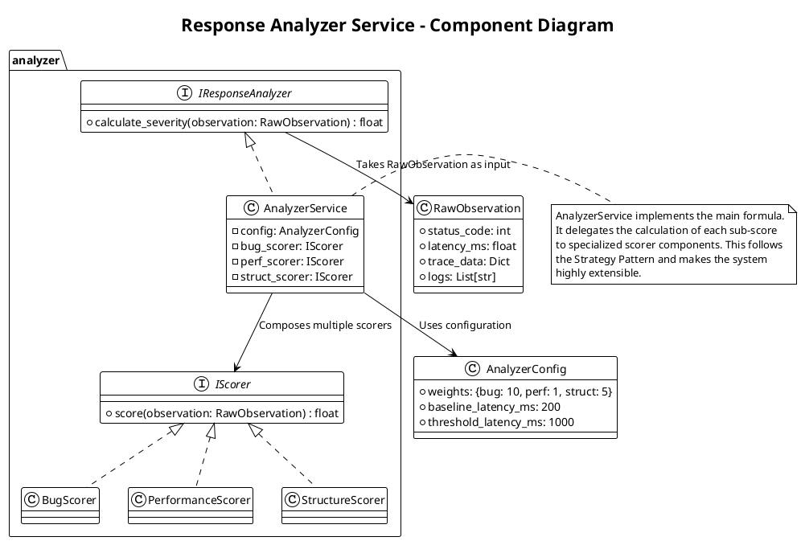
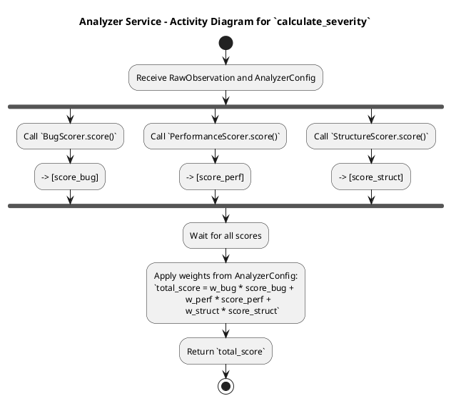

# 3. Response Analyzer (响应分析器)

这是一个独立的、可复用的领域知识模块。

## 模块 3.1: Analyzer Service (`analyzer/service.py`)

*   职责: 实现技术规格中定义的加权严重性评分函数 `f(x)`。
*   技术: 纯 Python 逻辑。
*   核心逻辑:
    *   一个主函数 `def calculate_severity(raw_observation: dict, config: dict) -> float:`
    *   内部包含多个子函数，分别计算 `Score_Bug`, `Score_Performance`, `Score_Structure`。
    *   例如，`_calculate_structure_score(trace_data)` 可能需要一个 Trace 比对的逻辑。
    *   最终根据权重配置，加权求和并返回总分。

好的，我们来为 模块 3.1: Analyzer Service (`analyzer/service.py`) 编写一份详细的设计文档。这是将原始、混乱的观测数据转化为贝叶斯优化器可以理解的、有价值的“知识”的关键模块。

### 概述 (Overview)

Response Analyzer Service 是一个领域知识密集型的组件，负责实现技术规格中定义的加权严重性评分函数 `f(x)`。它的核心职责是将从 `Executor Client` 获取的、多模态的原始观测数据（如 HTTP 状态码、延迟、分布式追踪信息）分析、量化，并最终计算出一个单一的、连续的严重性评分 (Severity Score)。本模块的设计目标是逻辑清晰、可配置、可扩展，以便于领域专家不断迭代和优化评分策略。

### 类图 (Component Diagram)

此图展示了 Analyzer Service 的结构及其主要的逻辑组件。



主要领域对象/组件说明:

*   IResponseAnalyzer (Interface): 定义了 Analyzer 的统一契约。`Optimization Worker` 将依赖此接口。
*   AnalyzerService (Implementation):
    *   职责: 实现 `y = w_bug * Score_Bug + ...` 的主加权求和逻辑。它不亲自计算每个分项，而是将任务委托给具体的 `Scorer` 组件。
    *   `config`: 一个包含所有评分权重和阈值的配置对象。
*   IScorer (Interface): 定义了所有分项评分器的通用接口，遵循策略模式 (Strategy Pattern)。
*   Concrete Scorers (`BugScorer`, `PerformanceScorer`, `StructureScorer`):
    *   职责: 每个 Scorer 负责一个独立的评分维度，封装了该维度的所有复杂逻辑。
        *   `BugScorer`: 检查 `status_code` 和 `logs` 来判断是否触发了明确的 bug。
        *   `PerformanceScorer`: 根据 `latency_ms` 和配置中的基线/阈值来计算性能影响分。
        *   `StructureScorer`: 最复杂的部分。它需要分析 `trace_data`，将其与一个已知的基线 Trace 进行比对，以检测重试、降级等模式。
*   RawObservation: 一个数据类，用于封装从 `Executor Client` 返回的所有原始观测数据。
*   AnalyzerConfig: 一个数据类，用于封装所有可配置的参数，方便管理和调整。

### 状态转换图 (State Transition Diagram)

Analyzer Service 是一个纯函数式、无状态的模块。它的 `calculate_severity` 方法对于相同的输入 `RawObservation` 和 `AnalyzerConfig`，总是返回相同的输出。

因此，使用活动图 (Activity Diagram) 来描述其内部的计算流程更为合适。



流程说明:
1.  接收原始观测数据和配置。
2.  并行地（或串行地）调用三个独立的 Scorer 组件，分别计算各自维度的分数。
3.  收集所有分项分数。
4.  根据配置中的权重，进行加权求和，得到最终的严重性评分。
5.  返回总分。

### 异常处理矩阵 (Error Handling Matrix)

Analyzer Service 必须对不完整或格式错误的输入数据具有鲁棒性。

自定义领域异常 (Domain-Specific Exceptions):
*   `AnalysisError(Exception)`: 所有分析相关错误的基类。
*   `IncompleteObservationError(AnalysisError)`: 当 `RawObservation` 中缺少必要的字段（如 `latency_ms`）时抛出。

错误分类与处理矩阵:

| 模块/操作 | 潜在异常/错误 | 严重性 | 处理策略 | 上层 `Worker` 的处理策略 |
| : | : | : | : | : |
| `calculate_severity` (主函数) | 传入的 `RawObservation` 为 `None` 或格式错误。 | 高 (Programming Error) | 在函数入口进行检查，如果输入无效，抛出 `ValueError`。 | 致命错误。表明 `Executor Client` 或 `Worker` 的代码有 bug。应中断会话并进入 `FAILED` 状态。 |
| `BugScorer` | `RawObservation` 中缺少 `status_code` 字段。 | 中 (Data Error) | 1. 记录警告日志。<br>2. 安全地回退 (Fail-safe): 返回该分项的默认值 0.0。 | 可恢复。本次评分可能不准，但优化循环可以继续。 |
| `PerformanceScorer` | `RawObservation` 中缺少 `latency_ms` 字段。 | 中 (Data Error) | 同上，返回分项的默认值 0.0。 | 可恢复。 |
| `StructureScorer` | `RawObservation` 中缺少 `trace_data` 或其格式无法解析。 | 中 (Data Error) | 同上，返回分项的默认值 0.0。 | 可恢复。 |
| | Trace 比对逻辑中发生 `panic` 或未知异常。 | 高 (Critical Bug) | 1. 在 `StructureScorer.score()` 内部使用 `try...except` 捕获。<br>2. 记录严重错误日志和堆栈。<br>3. 返回分项的默认值 0.0。 | 可恢复。但需要触发告警，因为这表明 Trace 分析逻辑有 bug。 |
| 主函数加权求和 | (通常不会失败) | (无) | (无) | (无) |

核心健壮性设计:
*   模块化与策略模式: 将每个评分维度拆分为独立的 `Scorer` 类，极大地提高了代码的可维护性和可扩展性。未来如果想增加一个新的评分维度（例如，"资源消耗分"），只需实现一个新的 `IScorer` 类，并在 `AnalyzerService` 中注册即可，无需修改现有代码。
*   Fail-Safe 原则: 任何一个分项评分器的失败，都不应该导致整个 `calculate_severity` 调用失败。它应该安全地返回一个默认值（通常是0），并记录一条警告。这确保了即使观测数据有部分缺失，优化循环也能继续进行下去。
*   可配置性: 将所有"魔法数字"（如权重、延迟阈值、基线值）都提取到 `AnalyzerConfig` 中，使得领域专家可以轻松地调整评分策略，而无需修改代码。


## 评分公式详解与实现

### 核心加权评分公式

$$
\text{Severity Score} = \frac{w_{bug} \cdot \text{Score}_{bug} + w_{perf} \cdot \text{Score}_{perf} + w_{struct} \cdot \text{Score}_{struct}}{w_{bug} + w_{perf} + w_{struct}}
$$

其中：
- $w_{bug}, w_{perf}, w_{struct}$ 为权重（可配置，单位无关）
- $\text{Score}_* \in [0, 10]$ 为各维度的评分
- 结果 $\in [0, 10]$（归一化到同一范围）

为什么使用加权平均而非加权求和?
- 加权求和: $s = w_1 \cdot x_1 + w_2 \cdot x_2$ 
  - 问题: 改变权重会改变输出范围 (权重改变→范围改变)
  - 难以调参: 权重的含义不清晰
- 加权平均: $s = \frac{w_1 \cdot x_1 + w_2 \cdot x_2}{w_1 + w_2}$
  - 优点: 输出始终在 [0, 10] (与权重无关)
  - 易于调参: 权重的相对比例才重要，绝对值无关

### 维度 1: Bug 触发评分 (Score_Bug)

定义: 检查是否发现了明确的软件缺陷迹象（异常响应、日志错误等）

评分规则 (优先级从高到低):

| 触发条件 | 分数 | 说明 |
|:|::|:|
| HTTP 5xx (>=500, <600) | 10.0 | 服务器错误，严重故障 |
| HTTP 4xx (>=400, <500) | 8.0 | 客户端错误，可能表示请求失败 |
| 日志中有 "ERROR" | 6.0 | 应用日志显示错误，但响应正常 |
| 错误率 > 0% (error_rate > 0) | 3.0 | 检测到部分请求失败 |
| 无上述迹象 | 0.0 | 无 Bug 迹象 |

实现 (Python):
```python
class BugScorer(IScorer):
    def score(self, observation: RawObservation, config: AnalyzerConfig) -> float:
        """
        Args:
            observation: 包含 status_code, logs, error_rate 等
            config: 分析器配置
        
        Returns:
            分数 ∈ [0, 10]
        """
        try:
            # 1. 检查 HTTP 状态码
            if observation.status_code is not None:
                if observation.status_code >= 500:
                    return 10.0
                elif observation.status_code >= 400:
                    return 8.0
            
            # 2. 检查日志中的错误
            if observation.logs:
                for log_line in observation.logs:
                    if "ERROR" in log_line.upper():
                        return 6.0
            
            # 3. 检查错误率
            if observation.error_rate is not None and observation.error_rate > 0:
                return 3.0
            
            # 4. 无 Bug 迹象
            return 0.0
        
        except Exception as e:
            logger.warning(f"BugScorer failed: {e}")
            return 0.0  # Fail-Safe: 返回默认值
```

示例计算:
```
观测 1: status_code=500, logs=[], error_rate=0.5
  → Score_Bug = 10.0 (首先匹配 5xx)

观测 2: status_code=200, logs=["ERROR: db connection timeout"], error_rate=0.1
  → Score_Bug = 6.0 (首先匹配 ERROR 日志)

观测 3: status_code=200, logs=[], error_rate=0.05
  → Score_Bug = 3.0 (匹配 error_rate > 0)

观测 4: status_code=200, logs=["info: request completed"], error_rate=0.0
  → Score_Bug = 0.0 (无异常)
```

### 维度 2: 性能影响评分 (Score_Performance)

定义: 衡量注入的故障对服务响应时间的影响

评分公式:

设：
- $\text{baseline}$ = 正常服务的延迟（毫秒），如 200ms
- $\text{threshold}$ = 可接受的最大延迟（毫秒），如 1000ms  
- $\text{actual}$ = 当前观测的延迟（毫秒）

评分规则：
$$
\text{Score}_{perf} = \begin{cases}
10.0 & \text{if } actual > threshold \\
9.0 \cdot \frac{actual - baseline}{threshold - baseline} & \text{if } baseline \leq actual \leq threshold \\
0.0 & \text{if } actual < baseline
\end{cases}
$$

最终得分：$\text{Score}_{perf}' = \min(10.0, \max(0.0, \text{Score}_{perf}))$

性能影响等级:

| actual 值 | 说明 | Score |
|:|:|::|
| actual < 200ms | 比基线还快（不应发生） | 0.0 |
| actual = 200ms | 无损伤（基线） | 0.0 |
| actual = 600ms | 中等性能降低 | 4.5 |
| actual = 1000ms | 达到阈值 | 9.0 |
| actual > 1000ms | 超过阈值，严重性能问题 | 10.0 |

实现 (Python):
```python
class PerformanceScorer(IScorer):
    def score(self, observation: RawObservation, config: AnalyzerConfig) -> float:
        """
        Args:
            observation: 包含 latency_ms
            config: 包含 baseline_latency_ms, threshold_latency_ms
        """
        try:
            if observation.latency_ms is None:
                logger.warning("PerformanceScorer: missing latency_ms")
                return 0.0
            
            baseline = config.baseline_latency_ms  # 如 200
            threshold = config.threshold_latency_ms  # 如 1000
            actual = observation.latency_ms
            
            if actual > threshold:
                return 10.0
            elif actual < baseline:
                return 0.0
            else:
                # actual 在 [baseline, threshold] 之间
                ratio = (actual - baseline) / (threshold - baseline)
                score = ratio * 9.0
                return min(10.0, max(0.0, score))
        
        except Exception as e:
            logger.warning(f"PerformanceScorer failed: {e}")
            return 0.0
```

示例计算 (baseline=200ms, threshold=1000ms):
```
观测 1: latency_ms = 200
  → ratio = (200 - 200) / (1000 - 200) = 0
  → Score_Perf = 0 * 9.0 = 0.0 (无性能损伤)

观测 2: latency_ms = 600
  → ratio = (600 - 200) / (1000 - 200) = 400/800 = 0.5
  → Score_Perf = 0.5 * 9.0 = 4.5 (中等性能降低)

观测 3: latency_ms = 1000
  → ratio = (1000 - 200) / (1000 - 200) = 1.0
  → Score_Perf = 1.0 * 9.0 = 9.0 (达到阈值)

观测 4: latency_ms = 3500
  → latency_ms > threshold
  → Score_Perf = 10.0 (超过阈值，最严重)
```

### 维度 3: 结构变化评分 (Score_Structure)

定义: 检测分布式追踪中的异常模式（重试、降级、级联失败等）

评分规则 (基于 Trace 分析):

| 观测到的现象 | 子分数 | 说明 |
|:|::|:|
| Span 数量增加 > 50% | 3.0 | 可能发生重试或级联调用 |
| 操作序列编辑距离 > 2 | 5.0 | 执行流程显著改变（如某个调用被跳过或插入） |
| 存在状态为 ERROR 的 Span | 2.0 | 分布式链路中有错误 Span |
| 单个 Span 延迟增加 > 5 倍 | 2.0 | 发现潜在的服务瓶颈 |
| 无上述异常 | 0.0 | 结构未改变 |

分数计算: $\text{Score}_{struct} = \max(\text{所有匹配的子分数})$

Trace 比对方法 (伪代码):
```python
def analyze_trace_structure(current_trace: List[Span], baseline_trace: List[Span]) -> float:
    """
    比对当前 Trace 与基线 Trace，检测结构变化
    """
    
    # 1. 检查 Span 数量变化
    span_increase_ratio = (len(current_trace) - len(baseline_trace)) / len(baseline_trace)
    if span_increase_ratio > 0.5:
        score = max(score, 3.0)
    
    # 2. 检查操作序列变化 (编辑距离)
    current_ops = [span.operation_name for span in current_trace]
    baseline_ops = [span.operation_name for span in baseline_trace]
    edit_dist = levenshtein_distance(current_ops, baseline_ops)
    if edit_dist > 2:
        score = max(score, 5.0)
    
    # 3. 检查错误 Span
    error_spans = [s for s in current_trace if s.error_tag]
    if len(error_spans) > 0:
        score = max(score, 2.0)
    
    # 4. 检查单个 Span 的延迟增长
    for baseline_span in baseline_trace:
        current_span = find_matching_span(baseline_span, current_trace)
        if current_span:
            latency_ratio = current_span.duration / baseline_span.duration
            if latency_ratio > 5.0:
                score = max(score, 2.0)
                break
    
    return score
```

实现 (Python):
```python
class StructureScorer(IScorer):
    def score(self, observation: RawObservation, config: AnalyzerConfig) -> float:
        """
        分析 Trace 结构变化
        """
        try:
            if not observation.trace_data:
                logger.warning("StructureScorer: missing trace_data")
                return 0.0
            
            current_trace = parse_trace(observation.trace_data)
            baseline_trace = config.baseline_trace  # 预先记录的基线
            
            score = 0.0
            
            # 检查 1: Span 数量增加
            span_ratio = (len(current_trace) - len(baseline_trace)) / len(baseline_trace)
            if span_ratio > 0.5:
                score = max(score, 3.0)
            
            # 检查 2: 操作序列编辑距离
            current_ops = [s.operation_name for s in current_trace]
            baseline_ops = [s.operation_name for s in baseline_trace]
            edit_dist = self._levenshtein_distance(current_ops, baseline_ops)
            if edit_dist > 2:
                score = max(score, 5.0)
            
            # 检查 3: 错误 Span
            error_spans = [s for s in current_trace if s.status == "ERROR"]
            if len(error_spans) > 0:
                score = max(score, 2.0)
            
            # 检查 4: Span 延迟激增
            for cs in current_trace:
                bs = self._find_baseline_span(cs, baseline_trace)
                if bs and (cs.duration / bs.duration) > 5.0:
                    score = max(score, 2.0)
                    break
            
            return min(10.0, score)
        
        except Exception as e:
            logger.warning(f"StructureScorer failed: {e}")
            return 0.0  # Fail-Safe
    
    def _levenshtein_distance(self, s1: List[str], s2: List[str]) -> int:
        """计算编辑距离"""
        # 实现标准的编辑距离算法
        ...
    
    def _find_baseline_span(self, span, baseline_spans):
        """在基线 Trace 中找到匹配的 Span"""
        for bs in baseline_spans:
            if bs.operation_name == span.operation_name:
                return bs
        return None
```

示例计算:
```
Trace 1: [HTTP GET, Authenticate, Query DB, Return Response]
  vs
Baseline: [HTTP GET, Authenticate, Query DB, Return Response]
  → 无变化 → Score_Struct = 0.0

Trace 2: [HTTP GET, Authenticate, Query DB (retry), Query DB, Return Response, Timeout]
  vs
Baseline: [HTTP GET, Authenticate, Query DB, Return Response]
  → Span 数量增加 33% (6 vs 4)，但未超过 50%
  → 操作序列编辑距离 = 2 (插入 retry, 插入 Timeout)
  → 有 Timeout 错误 Span
  → Score_Struct = max(0, 5.0, 2.0) = 5.0 (超过阈值)

Trace 3: [HTTP GET, Circuit Breaker Open, Return Error]
  vs
Baseline: [HTTP GET, Authenticate, Query DB, Return Response]
  → Span 数量显著减少（降级行为）
  → 编辑距离很大
  → 有 ERROR Span (Circuit Breaker)
  → Score_Struct = 5.0 (结构显著变化)
```

### 完整的评分示例

配置:
```python
config = AnalyzerConfig(
    weights={
        "bug": 10.0,
        "perf": 2.0,
        "struct": 5.0
    },
    baseline_latency_ms=200,
    threshold_latency_ms=1000,
)

analyzer = AnalyzerService(config)
```

观测数据:
```python
observation = RawObservation(
    status_code=500,           # 严重错误
    latency_ms=3500,          # 远超阈值
    error_rate=0.3,
    trace_data={...},         # 结构中有重试
    logs=["ERROR: timeout"]
)
```

计算过程:
```
Step 1: 计算各维度的分数
  Score_Bug:
    → status_code=500 ≥ 500
    → Score_Bug = 10.0

  Score_Perf:
    → latency_ms=3500 > threshold=1000
    → Score_Perf = 10.0

  Score_Struct:
    → Trace 中检测到重试和错误 Span
    → Score_Struct = 5.0 (取最大子分数)

Step 2: 加权平均
  w_bug=10, w_perf=2, w_struct=5
  
  总分 = (10 * 10.0 + 2 * 10.0 + 5 * 5.0) / (10 + 2 + 5)
       = (100 + 20 + 25) / 17
       = 145 / 17
       ≈ 8.53

结果: Severity Score = 8.53 (严重故障)
```

解读:
- Score_Bug = 10.0: HTTP 500 是明确的异常
- Score_Perf = 10.0: 3500ms 远超可接受范围
- Score_Struct = 5.0: Trace 结构有显著变化（重试）
- 最终 8.53: 多维度都指向严重故障，优化器应该避免这样的参数组合

### 权重推荐值与调整指南

默认推荐 (Phase 1):
```yaml
weights:
  bug_score: 10.0      # Bug 信号最可靠，权重最高
  performance_score: 2.0    # 性能影响次之
  structure_score: 5.0      # 结构变化也重要（表示系统应激）
```

调整场景:

| 场景 | 推荐调整 | 理由 |
|:|:|:|
| 关注 正确性 多于性能 | 增加 bug 权重 (15.0) | 避免返回错误结果 |
| 关注 性能 多于正确性 | 增加 perf 权重 (5.0) | 尽量保持低延迟 |
| 关注 系统稳定性 | 增加 struct 权重 (8.0) | 避免级联失败和重试 |
| 均衡所有维度 | 相等权重 (1, 1, 1) | 当各维度同等重要 |

权重调整公式:
$$
\text{相对权重} = \frac{w_i}{\sum_j w_j}
$$

例：`(10, 2, 5)` 的相对权重：
- Bug: 10/17 ≈ 59%
- Perf: 2/17 ≈ 12%
- Struct: 5/17 ≈ 29%

### Fail-Safe 原则的具体实现

Analyzer Service 必须保证任何单点故障都不会导致整个评分过程崩溃。

实现模式:
```python
class AnalyzerService:
    def calculate_severity(self, observation: RawObservation) -> Tuple[float, ScoringBreakdown]:
        """
        安全的评分计算，即使某个 Scorer 失败也能继续
        """
        
        breakdown = ScoringBreakdown()
        
        # 评分维度 1: Bug
        try:
            breakdown.bug_score = self.bug_scorer.score(observation, self.config)
        except Exception as e:
            logger.warning(f"BugScorer failed: {e}, using default")
            breakdown.bug_score = 0.0
        
        # 评分维度 2: Performance
        try:
            breakdown.perf_score = self.perf_scorer.score(observation, self.config)
        except Exception as e:
            logger.warning(f"PerfScorer failed: {e}, using default")
            breakdown.perf_score = 0.0
        
        # 评分维度 3: Structure
        try:
            breakdown.struct_score = self.struct_scorer.score(observation, self.config)
        except Exception as e:
            logger.warning(f"StructScorer failed: {e}, using default")
            breakdown.struct_score = 0.0
        
        # 加权求和
        w_bug = self.config.weights['bug']
        w_perf = self.config.weights['perf']
        w_struct = self.config.weights['struct']
        
        total_weight = w_bug + w_perf + w_struct
        total_score = (
            w_bug * breakdown.bug_score +
            w_perf * breakdown.perf_score +
            w_struct * breakdown.struct_score
        ) / total_weight
        
        # 返回规范化的分数
        final_score = min(10.0, max(0.0, total_score))
        
        return final_score, breakdown
```

---

## **Trace 分析方法详解**

本部分详细说明如何获取、存储和比对分布式追踪数据，实现结构变化的检测。

### **概述**

分布式追踪 (Distributed Tracing) 记录了请求在微服务系统中的执行轨迹，包含：
- **Span**: 表示一个服务或操作的执行
- **Trace**: 一次完整请求的 Span 集合
- **Attributes**: Span 的属性（服务名、延迟、错误状态等）

通过比对基线 Trace 和当前 Trace，我们可以检测：
- ✅ 重试（Span 数量增加）
- ✅ 降级（某些调用被跳过）
- ✅ 错误传播（ERROR Span 的出现）
- ✅ 性能瓶颈（单个 Span 延迟激增）

### **推荐的 Trace 数据格式 (OpenTelemetry)**

使用 **OpenTelemetry (OTel) 标准格式**，便于与业界主流系统（Jaeger、Zipkin、DataDog）互操作。

#### **OTel Trace 的 JSON 结构**

```json
{
  "traceId": "d51f4bf90b45417688221ae4d7b12f98",
  "spans": [
    {
      "traceId": "d51f4bf90b45417688221ae4d7b12f98",
      "spanId": "0af7651916cd43dd",
      "parentSpanId": "b7ad6b7169203331",
      "name": "payment-service-process",
      "kind": "SPAN_KIND_INTERNAL",
      "startTimeUnixNano": "1680213865123456789",
      "endTimeUnixNano": "1680213865500000000",
      "durationMs": 376.543,
      "status": {
        "code": "STATUS_CODE_OK",
        "description": ""
      },
      "attributes": {
        "service.name": "payment-service",
        "http.method": "POST",
        "http.url": "/api/v1/payment/process",
        "http.status_code": 200,
        "db.system": "postgresql",
        "db.statement": "INSERT INTO transactions VALUES (...)",
        "error": false,
        "error.type": null
      },
      "events": [
        {
          "name": "exception",
          "timeUnixNano": "1680213865300000000",
          "attributes": {
            "exception.type": "timeout",
            "exception.message": "Database connection timeout"
          }
        }
      ]
    },
    {
      "traceId": "d51f4bf90b45417688221ae4d7b12f98",
      "spanId": "b7ad6b7169203331",
      "parentSpanId": null,
      "name": "http-request",
      "kind": "SPAN_KIND_SERVER",
      "startTimeUnixNano": "1680213865100000000",
      "endTimeUnixNano": "1680213865600000000",
      "durationMs": 500.0,
      "status": {
        "code": "STATUS_CODE_OK"
      },
      "attributes": {
        "service.name": "api-gateway",
        "http.method": "POST",
        "http.target": "/api/v1/payment",
        "http.status_code": 200
      },
      "events": []
    }
  ]
}
```

#### **关键字段说明**

| 字段 | 类型 | 说明 |
|:---|:---:|:---|
| **traceId** | string | 全局唯一的追踪 ID，同一请求的所有 Span 共享 |
| **spanId** | string | Span 的唯一 ID（在 trace 内唯一） |
| **parentSpanId** | string | 父 Span 的 ID（null 表示根 Span） |
| **name** | string | Span 的名称（如操作名） |
| **kind** | enum | Span 类型：SPAN_KIND_SERVER, SPAN_KIND_CLIENT, SPAN_KIND_INTERNAL 等 |
| **startTimeUnixNano** | int64 | 纳秒精度的开始时间戳 |
| **endTimeUnixNano** | int64 | 纳秒精度的结束时间戳 |
| **durationMs** | float | 执行时间（毫秒），便于比对 |
| **status.code** | enum | 状态：OK, ERROR, UNSET |
| **attributes** | object | 自定义属性键值对 |
| **events** | array | Span 中的事件（如异常）|

### **基线 Trace 的获取方式**

基线 Trace 用于与当前 Trace 比对，以检测异常模式。

#### **方式 1: 离线采集（推荐 Phase 1）**

在系统正常运行时，手动记录一次标准的 Trace 并保存。

**步骤**:
1. 启动支持 Trace 导出的应用（如通过 OTel SDK）
2. 发送一个标准请求（无故障注入）
3. 从 Jaeger/Zipkin 后端导出该 Trace 的 JSON
4. 保存为 `baseline_trace.json`

**示例**:
```python
# 启动时加载基线 Trace
class AnalyzerConfig:
    def __init__(self, baseline_trace_file: str):
        with open(baseline_trace_file, 'r') as f:
            self.baseline_trace = json.load(f)
            self.baseline_spans = {
                span['spanId']: span 
                for span in self.baseline_trace['spans']
            }

config = AnalyzerConfig('config/baseline_trace.json')
```

**优点**:
- ✅ 简单可控
- ✅ 无需额外的采集逻辑
- ✅ 适合 Phase 1

**缺点**:
- ❌ 无法自动适应系统演进
- ❌ 需要手动更新基线

#### **方式 2: 在线自适应（推荐 Phase 2）**

系统运行时，基于最近的**健康请求**动态更新基线 Trace。

**步骤**:
1. 记录每个请求的 Trace
2. 计算其严重性评分
3. 如果评分 < 1.0（无异常），将其作为新的基线候选
4. 定期更新基线（如每 1000 个请求）

**实现**:
```python
class AdaptiveBaseline:
    def __init__(self, window_size=1000):
        self.window_size = window_size
        self.recent_traces = []
        self.baseline = None
    
    def add_trace(self, trace, severity_score):
        """添加新的 Trace 观测"""
        self.recent_traces.append({
            'trace': trace,
            'score': severity_score
        })
        
        if len(self.recent_traces) > self.window_size:
            self.recent_traces.pop(0)
        
        # 定期更新基线
        if len(self.recent_traces) % (self.window_size // 10) == 0:
            self._update_baseline()
    
    def _update_baseline(self):
        """从健康请求中选择基线"""
        # 过滤严重性低的请求
        healthy = [
            t for t in self.recent_traces 
            if t['score'] < 1.0
        ]
        
        if healthy:
            # 选择最近的健康请求
            self.baseline = healthy[-1]['trace']
```

**优点**:
- ✅ 自动适应系统变化
- ✅ 无需手动维护

**缺点**:
- ❌ 需要更复杂的逻辑
- ❌ 可能偏离真实基线

### **Trace 比对算法的 Python 实现**

#### **完整的 StructureScorer 实现**

```python
from typing import List, Dict, Any, Tuple
from dataclasses import dataclass
import json
from difflib import SequenceMatcher

@dataclass
class Span:
    """OTel Span 的 Python 表示"""
    span_id: str
    parent_span_id: str
    name: str
    duration_ms: float
    status_code: str
    attributes: Dict[str, Any]
    events: List[Dict[str, Any]]
    
    @classmethod
    def from_otel_json(cls, otel_span: dict) -> 'Span':
        """从 OTel JSON 解析"""
        return cls(
            span_id=otel_span['spanId'],
            parent_span_id=otel_span.get('parentSpanId'),
            name=otel_span['name'],
            duration_ms=otel_span.get('durationMs', 0.0),
            status_code=otel_span['status']['code'],
            attributes=otel_span.get('attributes', {}),
            events=otel_span.get('events', [])
        )

class StructureScorer(IScorer):
    """
    基于 OTel Trace 的结构变化评分器
    """
    
    def __init__(self):
        self.baseline_spans: Dict[str, Span] = {}
    
    def set_baseline(self, baseline_trace: dict):
        """设置基线 Trace"""
        self.baseline_spans = {
            span['spanId']: Span.from_otel_json(span)
            for span in baseline_trace.get('spans', [])
        }
    
    def score(self, observation: RawObservation, config: AnalyzerConfig) -> float:
        """
        计算结构变化评分
        
        Args:
            observation: 包含 trace_data (OTel JSON)
            config: 配置，包含基线 Trace
        
        Returns:
            评分 ∈ [0, 10]
        """
        try:
            # 1. 解析当前 Trace
            current_trace = observation.trace_data
            if not current_trace:
                return 0.0
            
            current_spans = {
                span['spanId']: Span.from_otel_json(span)
                for span in current_trace.get('spans', [])
            }
            
            # 2. 设置基线（如果尚未设置）
            if not self.baseline_spans:
                self.set_baseline(current_trace)
                return 0.0  # 第一次观测，无比对基线
            
            score = 0.0
            
            # 检查 1: Span 数量变化
            baseline_count = len(self.baseline_spans)
            current_count = len(current_spans)
            
            if baseline_count > 0:
                span_increase_ratio = (current_count - baseline_count) / baseline_count
                if span_increase_ratio > 0.5:
                    logger.info(
                        f"Span count increased by {span_increase_ratio*100:.1f}% "
                        f"({current_count} vs {baseline_count})"
                    )
                    score = max(score, 3.0)
            
            # 检查 2: 操作序列的编辑距离
            current_ops = self._get_operation_sequence(current_spans)
            baseline_ops = self._get_operation_sequence(self.baseline_spans)
            
            edit_dist = self._levenshtein_distance(baseline_ops, current_ops)
            if edit_dist > 2:
                logger.info(
                    f"Operation sequence changed (edit distance: {edit_dist}). "
                    f"Baseline: {baseline_ops}, Current: {current_ops}"
                )
                score = max(score, 5.0)
            
            # 检查 3: 错误 Span 的检测
            error_spans = [
                s for s in current_spans.values()
                if s.status_code == 'STATUS_CODE_ERROR' or 
                   any('exception' in e.get('name', '').lower() for e in s.events)
            ]
            
            if error_spans:
                logger.info(f"Found {len(error_spans)} error spans")
                score = max(score, 2.0)
            
            # 检查 4: 单个 Span 的延迟激增
            for span_id, baseline_span in self.baseline_spans.items():
                current_span = current_spans.get(span_id)
                
                if current_span and baseline_span.duration_ms > 0:
                    latency_ratio = current_span.duration_ms / baseline_span.duration_ms
                    
                    if latency_ratio > 5.0:
                        logger.warning(
                            f"Span '{baseline_span.name}' latency increased {latency_ratio:.1f}x "
                            f"({current_span.duration_ms:.1f}ms vs {baseline_span.duration_ms:.1f}ms)"
                        )
                        score = max(score, 2.0)
                        break
            
            return min(10.0, score)
        
        except Exception as e:
            logger.error(f"StructureScorer failed: {e}", exc_info=True)
            return 0.0  # Fail-Safe
    
    def _get_operation_sequence(self, spans: Dict[str, Span]) -> List[str]:
        """
        从 Span 集合提取操作序列（按调用顺序）
        
        Args:
            spans: Dict[span_id -> Span]
        
        Returns:
            操作名列表，按调用时间顺序
        """
        if not spans:
            return []
        
        # 按 startTime 排序（这里假设已从 OTel JSON 中提取）
        # 对于生产环境，应该从 OTel JSON 中直接读取 startTimeUnixNano
        ordered_spans = sorted(
            spans.values(),
            key=lambda s: s.attributes.get('start_time', 0)
        )
        
        return [span.name for span in ordered_spans]
    
    def _levenshtein_distance(self, s1: List[str], s2: List[str]) -> int:
        """
        计算编辑距离 (Levenshtein Distance)
        
        表示将 s1 转换为 s2 所需的最少单字符编辑（插入、删除、替换）次数。
        
        例：
        s1 = ['A', 'B', 'C']
        s2 = ['A', 'B', 'C', 'D']  (插入 'D')
        distance = 1
        
        s1 = ['A', 'B', 'C']
        s2 = ['A', 'C']  (删除 'B')
        distance = 1
        
        s1 = ['A', 'B', 'C']
        s2 = ['A', 'X', 'C']  (替换 'B' 为 'X')
        distance = 1
        """
        m, n = len(s1), len(s2)
        
        # 初始化 DP 表
        dp = [[0] * (n + 1) for _ in range(m + 1)]
        
        # 第一行：从空字符串插入 s2 的字符
        for j in range(n + 1):
            dp[0][j] = j
        
        # 第一列：从 s1 删除所有字符
        for i in range(m + 1):
            dp[i][0] = i
        
        # 填充 DP 表
        for i in range(1, m + 1):
            for j in range(1, n + 1):
                if s1[i-1] == s2[j-1]:
                    # 字符相同，不需要编辑
                    dp[i][j] = dp[i-1][j-1]
                else:
                    # 字符不同，取三种操作的最小值
                    dp[i][j] = 1 + min(
                        dp[i-1][j],      # 删除 s1[i-1]
                        dp[i][j-1],      # 插入 s2[j-1]
                        dp[i-1][j-1]     # 替换 s1[i-1] 为 s2[j-1]
                    )
        
        return dp[m][n]
    
    def _find_matching_baseline_span(self, current_span: Span) -> Span:
        """
        在基线中查找匹配的 Span
        
        匹配策略：按 Span 名称匹配（大多数情况下足够）
        """
        for baseline_span in self.baseline_spans.values():
            if baseline_span.name == current_span.name:
                return baseline_span
        return None
```

#### **使用示例**

```python
# 初始化
config = AnalyzerConfig()
config.baseline_trace = json.load(open('baseline_trace.json'))

analyzer = AnalyzerService(config)

# 观测数据（包含 OTel Trace）
current_trace = json.load(open('current_trace.json'))
observation = RawObservation(
    status_code=500,
    latency_ms=3500,
    error_rate=0.3,
    trace_data=current_trace,
    logs=[]
)

# 计算评分
severity_score, breakdown = analyzer.calculate_severity(observation)

print(f"Severity Score: {severity_score:.2f}")
print(f"  Bug: {breakdown.bug_score:.1f}")
print(f"  Performance: {breakdown.perf_score:.1f}")
print(f"  Structure: {breakdown.struct_score:.1f}")
```

### **Trace 数据的采集和存储**

#### **采集方式**

使用 **OpenTelemetry Python SDK** 自动采集 Trace：

```python
from opentelemetry import trace, metrics
from opentelemetry.sdk.trace import TracerProvider
from opentelemetry.sdk.trace.export import SimpleSpanProcessor
from opentelemetry.exporter.jaeger.thrift import JaegerExporter
from opentelemetry.sdk.resources import SERVICE_NAME, Resource

# 配置 Jaeger 导出器
jaeger_exporter = JaegerExporter(
    agent_host_name='localhost',
    agent_port=6831,
)

# 设置 Trace Provider
trace.set_tracer_provider(
    TracerProvider(
        resource=Resource.create({SERVICE_NAME: "payment-service"})
    )
)
trace.get_tracer_provider().add_span_processor(
    SimpleSpanProcessor(jaeger_exporter)
)

# 使用
tracer = trace.get_tracer(__name__)

def process_payment(order_id):
    with tracer.start_as_current_span("process_payment") as span:
        span.set_attribute("order_id", order_id)
        
        with tracer.start_as_current_span("validate_order") as child_span:
            # 验证逻辑
            pass
        
        with tracer.start_as_current_span("charge_card") as child_span:
            # 扣款逻辑
            pass
```

#### **Trace 导出和存储**

从 Jaeger 或 Zipkin 导出为 JSON：

```python
import requests
import json

# 从 Jaeger API 获取 Trace
def export_trace_from_jaeger(trace_id: str) -> dict:
    """
    从 Jaeger 后端导出指定 Trace
    """
    response = requests.get(
        f'http://localhost:16686/api/traces/{trace_id}'
    )
    trace_data = response.json()['data'][0]
    
    # 保存为 JSON
    with open(f'traces/{trace_id}.json', 'w') as f:
        json.dump(trace_data, f, indent=2)
    
    return trace_data

# 导出并保存基线 Trace
baseline_trace = export_trace_from_jaeger('d51f4bf90b45417688221ae4d7b12f98')
```

### **推荐的 Trace 比对配置**

在 `AnalyzerConfig` 中添加 Trace 相关设置：

```python
@dataclass
class AnalyzerConfig:
    weights: Dict[str, float]
    baseline_latency_ms: float
    threshold_latency_ms: float
    baseline_trace_file: str  # 基线 Trace 文件路径
    
    # Trace 比对参数
    span_count_increase_threshold: float = 0.5  # 50% 增加为异常
    operation_distance_threshold: int = 2       # 编辑距离 > 2 为异常
    latency_spike_multiplier: float = 5.0       # 延迟增加 > 5x 为异常
    
    baseline_trace: Dict[str, Any] = None  # 缓存的基线 Trace
    
    def __post_init__(self):
        """初始化时加载基线 Trace"""
        if self.baseline_trace_file:
            with open(self.baseline_trace_file, 'r') as f:
                self.baseline_trace = json.load(f)

# 使用
config = AnalyzerConfig(
    weights={'bug': 10, 'perf': 2, 'struct': 5},
    baseline_latency_ms=200,
    threshold_latency_ms=1000,
    baseline_trace_file='config/baseline_trace.json',
    span_count_increase_threshold=0.5,
    operation_distance_threshold=2,
    latency_spike_multiplier=5.0
)
```

### **总结**

| 方面 | 推荐 |
|:---|:---|
| **Trace 格式** | OpenTelemetry JSON (OTel 标准) |
| **基线获取** | Phase 1: 离线采集 + 手动更新<br>Phase 2: 在线自适应 |
| **比对算法** | Span 数量、编辑距离、错误检测、延迟激增 |
| **实现** | 完整的 `StructureScorer` 实现（见上） |
| **存储** | JSON 文件或 Trace 后端数据库 |

