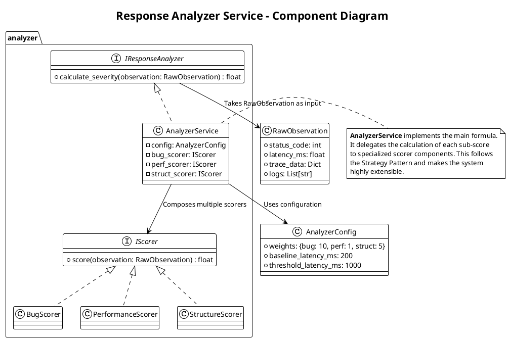
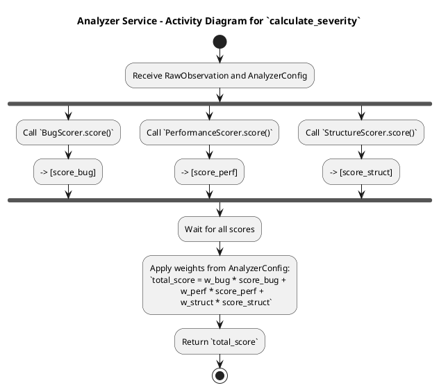

# **3. Response Analyzer (响应分析器)**

这是一个独立的、可复用的领域知识模块。

## **模块 3.1: Analyzer Service (`analyzer/service.py`)**

*   **职责**: 实现技术规格中定义的**加权严重性评分函数 `f(x)`**。
*   **技术**: 纯 Python 逻辑。
*   **核心逻辑**:
    *   一个主函数 `def calculate_severity(raw_observation: dict, config: dict) -> float:`
    *   内部包含多个子函数，分别计算 `Score_Bug`, `Score_Performance`, `Score_Structure`。
    *   例如，`_calculate_structure_score(trace_data)` 可能需要一个 Trace 比对的逻辑。
    *   最终根据权重配置，加权求和并返回总分。

好的，我们来为 **模块 3.1: Analyzer Service (`analyzer/service.py`)** 编写一份详细的设计文档。这是将原始、混乱的观测数据转化为贝叶斯优化器可以理解的、有价值的“知识”的关键模块。

### **概述 (Overview)**

**Response Analyzer Service** 是一个**领域知识密集型**的组件，负责实现技术规格中定义的**加权严重性评分函数 `f(x)`**。它的核心职责是将从 `Executor Client` 获取的、多模态的原始观测数据（如 HTTP 状态码、延迟、分布式追踪信息）**分析、量化**，并最终计算出一个**单一的、连续的严重性评分 (Severity Score)**。本模块的设计目标是**逻辑清晰、可配置、可扩展**，以便于领域专家不断迭代和优化评分策略。

### **类图 (Component Diagram)**

此图展示了 Analyzer Service 的结构及其主要的逻辑组件。

**主要领域对象/组件说明**:

*   **IResponseAnalyzer (Interface)**: 定义了 Analyzer 的统一契约。`Optimization Worker` 将依赖此接口。
*   **AnalyzerService (Implementation)**:
    *   **职责**: 实现 `y = w_bug * Score_Bug + ...` 的主加权求和逻辑。它不亲自计算每个分项，而是将任务**委托**给具体的 `Scorer` 组件。
    *   `config`: 一个包含所有评分权重和阈值的配置对象。
*   **IScorer (Interface)**: 定义了所有分项评分器的通用接口，遵循**策略模式 (Strategy Pattern)**。
*   **Concrete Scorers (`BugScorer`, `PerformanceScorer`, `StructureScorer`)**:
    *   **职责**: 每个 Scorer 负责一个独立的评分维度，封装了该维度的所有复杂逻辑。
        *   `BugScorer`: 检查 `status_code` 和 `logs` 来判断是否触发了明确的 bug。
        *   `PerformanceScorer`: 根据 `latency_ms` 和配置中的基线/阈值来计算性能影响分。
        *   `StructureScorer`: **最复杂的部分**。它需要分析 `trace_data`，将其与一个已知的基线 Trace 进行比对，以检测重试、降级等模式。
*   **RawObservation**: 一个数据类，用于封装从 `Executor Client` 返回的所有原始观测数据。
*   **AnalyzerConfig**: 一个数据类，用于封装所有可配置的参数，方便管理和调整。

### **状态转换图 (State Transition Diagram)**

**Analyzer Service 是一个纯函数式、无状态的模块**。它的 `calculate_severity` 方法对于相同的输入 `RawObservation` 和 `AnalyzerConfig`，总是返回相同的输出。

因此，使用**活动图 (Activity Diagram)** 来描述其内部的计算流程更为合适。

**流程说明**:
1.  接收原始观测数据和配置。
2.  **并行地**（或串行地）调用三个独立的 Scorer 组件，分别计算各自维度的分数。
3.  收集所有分项分数。
4.  根据配置中的权重，进行加权求和，得到最终的严重性评分。
5.  返回总分。

### **异常处理矩阵 (Error Handling Matrix)**

Analyzer Service 必须对不完整或格式错误的输入数据具有鲁棒性。

**自定义领域异常 (Domain-Specific Exceptions)**:
*   `AnalysisError(Exception)`: 所有分析相关错误的基类。
*   `IncompleteObservationError(AnalysisError)`: 当 `RawObservation` 中缺少必要的字段（如 `latency_ms`）时抛出。

**错误分类与处理矩阵**:

| 模块/操作 | 潜在异常/错误 | 严重性 | 处理策略 | 上层 `Worker` 的处理策略 |
| :--- | :--- | :--- | :--- | :--- |
| **`calculate_severity`** (主函数) | 传入的 `RawObservation` 为 `None` 或格式错误。 | **高** (Programming Error) | 在函数入口进行检查，如果输入无效，抛出 `ValueError`。 | **致命错误**。表明 `Executor Client` 或 `Worker` 的代码有 bug。应中断会话并进入 `FAILED` 状态。 |
| **`BugScorer`** | `RawObservation` 中缺少 `status_code` 字段。 | **中** (Data Error) | 1. 记录警告日志。 2. **安全地回退 (Fail-safe)**: 返回该分项的**默认值 0.0**。 | **可恢复**。本次评分可能不准，但优化循环可以继续。 |
| **`PerformanceScorer`** | `RawObservation` 中缺少 `latency_ms` 字段。 | **中** (Data Error) | 同上，返回分项的默认值 0.0。 | **可恢复**。 |
| **`StructureScorer`** | `RawObservation` 中缺少 `trace_data` 或其格式无法解析。 | **中** (Data Error) | 同上，返回分项的默认值 0.0。 | **可恢复**。 |
| | Trace 比对逻辑中发生 `panic` 或未知异常。 | **高** (Critical Bug) | 1. 在 `StructureScorer.score()` 内部使用 `try...except` 捕获。 2. 记录严重错误日志和堆栈。 3. 返回分项的默认值 0.0。 | **可恢复**。但需要触发告警，因为这表明 Trace 分析逻辑有 bug。 |
| **主函数加权求和** | (通常不会失败) | (无) | (无) | (无) |

**核心健壮性设计**:
*   **模块化与策略模式**: 将每个评分维度拆分为独立的 `Scorer` 类，极大地提高了代码的可维护性和可扩展性。未来如果想增加一个新的评分维度（例如，“资源消耗分”），只需实现一个新的 `IScorer` 类，并在 `AnalyzerService` 中注册即可，无需修改现有代码。
*   **Fail-Safe 原则**: 任何一个分项评分器的失败，都不应该导致整个 `calculate_severity` 调用失败。它应该安全地返回一个默认值（通常是0），并记录一条警告。这确保了即使观测数据有部分缺失，优化循环也能继续进行下去。
*   **可配置性**: 将所有“魔法数字”（如权重、延迟阈值、基线值）都提取到 `AnalyzerConfig` 中，使得领域专家可以轻松地调整评分策略，而无需修改代码。
