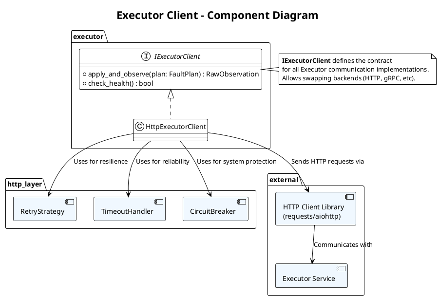

# **5. Executor Integration (执行器集成)**

这是 Recommender 系统与 Executor 之间的**通信层**，负责安全、可靠的故障注入计划下发和观测数据回收。

## **模块 5.1: Executor Client (`executor/client.py`)**

### **概述 (Overview)**

**Executor Client** 是 Recommender 的**外向接口**，负责与故障注入 Executor 进行 HTTP 通信。它的核心职责是：
1. 将 Recommender 生成的 `FaultPlan` 转换为 Executor API 的请求格式
2. 发送请求到 Executor，触发故障注入
3. 等待请求执行完成并收集响应数据
4. 将响应数据转换为 `RawObservation`
5. 实现重试和超时机制，保证可靠性

本模块的设计目标是**健壮、高效、易于测试**。

### **架构和组件**



### **接口定义**

```python
from abc import ABC, abstractmethod
from typing import Optional
from src.types import FaultPlan, RawObservation

class IExecutorClient(ABC):
    """执行器客户端的统一接口"""
    
    @abstractmethod
    def apply_and_observe(self, plan: FaultPlan, timeout_sec: float = 30.0) -> RawObservation:
        """
        下发故障计划并等待执行完成，返回原始观测数据。
        
        Args:
            plan: 要执行的故障注入计划
            timeout_sec: 整个操作的超时时间（秒）
        
        Returns:
            RawObservation: 执行结果和原始观测数据
        
        Raises:
            ExecutorClientError: 通信或执行失败
            TimeoutError: 超时
        """
        ...
    
    @abstractmethod
    def check_health(self) -> bool:
        """
        检查 Executor 服务是否可用。
        
        Returns:
            True 如果 Executor 可用，False 否则
        """
        ...
```

### **HTTP 执行器客户端的完整实现**

#### **核心类**

```python
import requests
import json
import logging
import time
from typing import Optional, Dict, Any
from dataclasses import dataclass
from enum import Enum
from datetime import datetime, timedelta

logger = logging.getLogger(__name__)

class ExecutorClientError(Exception):
    """Executor Client 的基类异常"""
    pass

class TimeoutError(ExecutorClientError):
    """超时异常"""
    pass

class ConnectionError(ExecutorClientError):
    """连接异常"""
    pass

class RetryStrategy(Enum):
    """重试策略"""
    NONE = "none"              # 无重试
    EXPONENTIAL_BACKOFF = "exp"  # 指数退避
    LINEAR_BACKOFF = "linear"   # 线性退避

@dataclass
class ExecutorClientConfig:
    """Executor Client 的配置"""
    executor_host: str = "localhost"      # Executor 服务地址
    executor_port: int = 8000             # Executor 服务端口
    base_url: str = None                  # 完整的基础 URL
    
    # 重试配置
    max_retries: int = 3
    retry_strategy: RetryStrategy = RetryStrategy.EXPONENTIAL_BACKOFF
    initial_retry_delay_sec: float = 0.5
    max_retry_delay_sec: float = 10.0
    
    # 超时配置
    default_timeout_sec: float = 30.0
    connection_timeout_sec: float = 5.0
    
    # 健康检查
    health_check_interval_sec: float = 60.0
    
    # 电路断路器
    circuit_breaker_enabled: bool = True
    circuit_breaker_failure_threshold: int = 5
    circuit_breaker_timeout_sec: float = 60.0
    
    def __post_init__(self):
        """初始化时构建 base_url"""
        if self.base_url is None:
            self.base_url = f"http://{self.executor_host}:{self.executor_port}"

class CircuitBreaker:
    """
    电路断路器模式，防止频繁调用故障服务。
    
    状态转换:
    CLOSED (正常) → OPEN (故障) → HALF_OPEN (恢复试验) → CLOSED
    """
    
    def record_success(self)
        """记录成功调用"""
    
    def record_failure(self)
        """记录失败调用"""

    def can_attempt(self) -> bool
        """检查是否可以尝试调用"""

    def reset(self)
        """重置电路断路器"""

class HttpExecutorClient(IExecutorClient):
    """HTTP 协议的 Executor Client 实现"""
    
    def apply_and_observe(
        self, 
        plan: FaultPlan, 
        timeout_sec: float = None
    ) -> RawObservation:
        """
        下发故障计划并等待执行完成。
        
        执行流程:
        1. 检查电路断路器状态
        2. 检查 Executor 健康状态（周期性）
        3. 将 FaultPlan 转换为 HTTP 请求体
        4. 重试循环：发送请求 → 等待响应 → 验证结果
        5. 解析响应为 RawObservation
        """
```

#### **配置示例**

```python
# 创建 Client 实例
config = ExecutorClientConfig(
    executor_host="executor-service",
    executor_port=8000,
    max_retries=3,
    retry_strategy=RetryStrategy.EXPONENTIAL_BACKOFF,
    initial_retry_delay_sec=0.5,
    max_retry_delay_sec=10.0,
    default_timeout_sec=30.0,
    connection_timeout_sec=5.0,
    circuit_breaker_enabled=True,
    circuit_breaker_failure_threshold=5
)

client = HttpExecutorClient(config)

# 下发故障计划
plan = FaultPlan(
    service="PaymentService",
    api="/api/v1/payment/process",
    fault_type=FaultType.DELAY,
    delay_seconds=2.5,
    percentage=50,
    duration_seconds=30,
    start_delay_ms=200  # 可选：请求到达 200ms 后才开始阻断
)

```

---

## **模块 5.2: 重试和超时策略详解**

### **重试策略对比**

| 策略 | 特点 | 使用场景 | 代码 |
|:---|:---|:---|:---|
| **NONE** | 不重试，快速失败 | 测试、调试 | `delay = 0.0` |
| **LINEAR_BACKOFF** | 延迟线性增长 | 低频重试 | `delay = base * attempt` |
| **EXPONENTIAL_BACKOFF** | 延迟指数增长（推荐） | 通用，避免雪崩 | `delay = base * 2^(attempt-1)` |

**指数退避示例** (base=0.5s, max=10s):
```
attempt 1: 0.5s    ┌──────┐
attempt 2: 1.0s    ├──────────┐
attempt 3: 2.0s    ├──────────────┐
attempt 4: 4.0s    ├────────────────────┐
attempt 5: 8.0s    ├──────────────────────────────┐
```

**优点**:
- ✅ 避免 thundering herd（狂犬病）
- ✅ 给服务恢复时间
- ✅ 符合大多数分布式系统的最佳实践

### **超时配置**

```python
# 两层超时设置
timeout = (
    self.config.connection_timeout_sec,  # 连接超时 (如 5s)
    timeout_sec                          # 读超时 (如 30s)
)

# 总时间限制
total_time = connection_timeout + read_timeout
```

**推荐值**:
- 连接超时: 5 秒（建立 TCP 连接）
- 读超时: 30 秒（等待响应）
- 总请求超时: 30 秒（可配置）

### **电路断路器**

**状态机**:
```
┌─────────────────────────────────────┐
│  CLOSED (正常)                      │
│  - 允许请求通过                     │
│  - 记录失败次数                     │
└──────────────────┬──────────────────┘
                   │ 失败次数 >= threshold
                   ▼
┌─────────────────────────────────────┐
│  OPEN (熔断)                        │
│  - 拒绝所有请求                     │
│  - 等待恢复超时                     │
└──────────────────┬──────────────────┘
                   │ 超时后尝试恢复
                   ▼
┌─────────────────────────────────────┐
│  HALF_OPEN (半开)                   │
│  - 允许少量请求通过                 │
│  - 测试服务是否恢复                 │
└──────────────────┬──────────────────┘
         ┌─────────┴─────────┐
         │                   │
      成功                  失败
         │                   │
         ▼                   ▼
      CLOSED             OPEN
```

**保护机制**:
```python
# 当 Executor 故障时的行为
if not circuit_breaker.can_attempt():
    # 快速失败，不浪费时间和资源
    raise ConnectionError("Circuit breaker is OPEN")

# 健康检查周期
health_check_interval = 60  # 每 60 秒检查一次
```

### **错误分类与恢复策略**

| 错误类型 | HTTP Status | 原因 | 可重试 | 恢复策略 |
|:---|:---:|:---|:---:|:---|
| **Timeout** | 无 | 请求超过时限 | ✅ | 重试 + 退避延迟 |
| **Connection Refused** | 无 | 无法连接到 Executor | ✅ | 重试 + 健康检查 + 电路断路器 |
| **DNS Resolution Failed** | 无 | DNS 解析失败 | ✅ | 重试 + 电路断路器 |
| **Bad Request** | 400 | 请求格式错误 | ❌ | 快速失败，修复请求 |
| **Unauthorized** | 401 | 认证失败 | ❌ | 检查凭证 |
| **Not Found** | 404 | API 端点不存在 | ❌ | 检查 Executor 版本 |
| **Internal Server Error** | 500 | Executor 内部错误 | ✅ | 重试 + 电路断路器 |
| **Service Unavailable** | 503 | 服务暂时不可用 | ✅ | 重试 + 电路断路器 |

### **恢复流程代码示例**

```python
def apply_and_observe(self, plan: FaultPlan) -> RawObservation:
    """完整的错误恢复流程"""
    
    # 第 1 步: 电路断路器检查
    # 第 2 步: 健康检查（周期性）
    # 第 3 步: 重试循环
```

### **监控和告警**

建议在 Recommender 系统中添加以下监控指标：

```python
@dataclass
class ExecutorClientMetrics:
    """执行器客户端的监控指标"""
    
    # 请求统计
    total_requests: int = 0
    successful_requests: int = 0
    failed_requests: int = 0
    
    # 错误统计
    timeout_errors: int = 0
    connection_errors: int = 0
    bad_request_errors: int = 0
    
    # 重试统计
    total_retries: int = 0
    successful_retries: int = 0
    
    # 电路断路器统计
    circuit_breaker_opens: int = 0
    circuit_breaker_half_opens: int = 0
    
    # 性能指标
    avg_latency_ms: float = 0.0
    p95_latency_ms: float = 0.0
    p99_latency_ms: float = 0.0
    
    def get_success_rate(self) -> float:
        """成功率"""
        if self.total_requests == 0:
            return 0.0
        return self.successful_requests / self.total_requests
    
    def get_retry_rate(self) -> float:
        """重试率"""
        if self.total_requests == 0:
            return 0.0
        return self.total_retries / self.total_requests

# 在 Recommender 中集成
metrics = ExecutorClientMetrics()

def apply_and_observe(self, plan: FaultPlan) -> RawObservation
```

---

## **最佳实践总结**

| 方面 | 推荐 | 说明 |
|:---|:---|:---|
| **重试策略** | 指数退避 + 小随机抖动 | 避免雪崩，符合业界标准 |
| **最大重试次数** | 3-5 次 | 权衡可靠性和响应时间 |
| **初始延迟** | 0.5-1.0 秒 | 给故障服务一些恢复时间 |
| **最大延迟** | 10-30 秒 | 避免等待过长 |
| **连接超时** | 5 秒 | TCP 连接的标准等待时间 |
| **读超时** | 30 秒 | 给故障注入充足的执行时间 |
| **电路断路器** | 启用，5 次失败后打开 | 保护系统免受级联失败 |
| **健康检查** | 每 60 秒一次 | 缓存结果避免过度调用 |
| **日志级别** | DEBUG (成功), INFO (重试), ERROR (失败) | 便于问题排查 |

---

## **附录 A: 与现有 Executor 项目的集成**

### **背景**

现有 Executor 项目基于 **Policy 管理模式**，提供以下 API：

```
POST   /v1/policies              # 创建或更新策略
DELETE /v1/policies/:id          # 删除策略
GET    /v1/policies/:id          # 获取策略
GET    /v1/health                # 健康检查
```

**问题**: Design_5 假设有 `/v1/faults/apply` 端点来执行故障并等待完成，但现有 Executor 没有这个端点。

#### **方式 2: 扩展 Executor（推荐 ✅）**

在现有 Executor 上新增三个端点来直接支持故障注入：

```go
// 1. POST /v1/faults/apply - 申请故障注入
type FaultApplyRequest struct {
    Service         string                 `json:"service"`         // 服务名
    API             string                 `json:"api"`             // API 路径
    FaultType       string                 `json:"fault_type"`      // "delay" | "abort"
    Percentage      int                    `json:"percentage"`      // [0, 100]
    DurationSeconds int                    `json:"duration_seconds"` // 故障执行时间
    FaultConfig     map[string]interface{} `json:"fault_config"`    // 故障特定配置
}

type FaultApplyResponse struct {
    ApplyID   string    `json:"apply_id"`   // 故障执行 ID，用于后续查询
    Status    string    `json:"status"`     // "applied" | "failed"
    Message   string    `json:"message,omitempty"`
}

// 2. GET /v1/faults/:apply_id/status - 查询故障执行状态
type FaultStatusResponse struct {
    ApplyID     string    `json:"apply_id"`
    Status      string    `json:"status"`       // "running" | "completed" | "failed"
    StartTime   time.Time `json:"start_time"`
    EndTime     *time.Time `json:"end_time,omitempty"`
    ErrorMsg    string    `json:"error_msg,omitempty"`
}

// 3. GET /v1/faults/:apply_id/metrics - 获取观测数据
type FaultMetricsResponse struct {
    ApplyID    string      `json:"apply_id"`
    StatusCode int         `json:"status_code"`      // HTTP 状态码
    LatencyMs  float64     `json:"latency_ms"`       // 平均延迟（毫秒）
    ErrorRate  float64     `json:"error_rate"`       // 错误比例 [0, 1]
    TraceData  interface{} `json:"trace_data"`       // OTel Trace JSON
    Logs       []string    `json:"logs"`             // 应用日志
}
```

对应的 HttpExecutorClient 实现：

```python
class HttpExecutorClientWithExtendedAPI(IExecutorClient):
    """使用扩展的 Executor API（推荐）"""
    
    def apply_and_observe(
        self, 
        plan: FaultPlan, 
        timeout_sec: float = 30.0,
        start_time: Optional[datetime] = None
    ) -> RawObservation:
        """
        发送故障申请并轮询等待完成。
        
        流程:
        1. POST /v1/faults/apply 发送故障申请
        2. 轮询 GET /v1/faults/:apply_id/status 直到完成
        3. GET /v1/faults/:apply_id/metrics 获取观测数据
        
        Args:
            plan: 故障计划
            timeout_sec: 轮询的总超时时间（秒）
            start_time: [可选] 故障注入的开始时间（RFC3339 格式）
                       如不指定，故障将立即开始
        
        Returns:
            RawObservation: 观测数据
        """
```

**优点**:
- ✅ 精确控制故障执行时间
- ✅ 无需额外的代理服务
- ✅ 清晰的执行流程和状态管理
- ✅ 完全符合 Design_5 的设计理念

**缺点**:
- ❌ 需要修改 Executor 项目（新增 3 个端点）
- ❌ 需要在 Executor 中实现故障执行和指标收集逻辑
