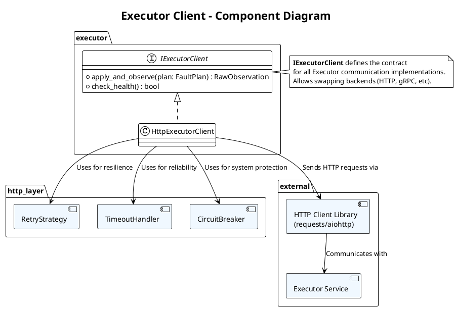

# **5. Executor Integration (执行器集成)**

这是 Recommender 系统与 Executor 之间的**通信层**，负责安全、可靠的故障注入计划下发和观测数据回收。

## **模块 5.1: Executor Client (`executor/client.py`)**

### **概述 (Overview)**

**Executor Client** 是 Recommender 的**外向接口**，负责与故障注入 Executor 进行 HTTP 通信。它的核心职责是：
1. 将 Recommender 生成的 `FaultPlan` 转换为 Executor API 的请求格式
2. 发送请求到 Executor，触发故障注入
3. 等待请求执行完成并收集响应数据
4. 将响应数据转换为 `RawObservation`
5. 实现重试和超时机制，保证可靠性

本模块的设计目标是**健壮、高效、易于测试**。

### **架构和组件**



### **接口定义**

```python
from abc import ABC, abstractmethod
from typing import Optional
from src.types import FaultPlan, RawObservation

class IExecutorClient(ABC):
    """执行器客户端的统一接口"""
    
    @abstractmethod
    def apply_and_observe(self, plan: FaultPlan, timeout_sec: float = 30.0) -> RawObservation:
        """
        下发故障计划并等待执行完成，返回原始观测数据。
        
        Args:
            plan: 要执行的故障注入计划
            timeout_sec: 整个操作的超时时间（秒）
        
        Returns:
            RawObservation: 执行结果和原始观测数据
        
        Raises:
            ExecutorClientError: 通信或执行失败
            TimeoutError: 超时
        """
        ...
    
    @abstractmethod
    def check_health(self) -> bool:
        """
        检查 Executor 服务是否可用。
        
        Returns:
            True 如果 Executor 可用，False 否则
        """
        ...
```

### **HTTP 执行器客户端的完整实现**

#### **核心类**

```python
import requests
import json
import logging
import time
from typing import Optional, Dict, Any
from dataclasses import dataclass
from enum import Enum
from datetime import datetime, timedelta

logger = logging.getLogger(__name__)

class ExecutorClientError(Exception):
    """Executor Client 的基类异常"""
    pass

class TimeoutError(ExecutorClientError):
    """超时异常"""
    pass

class ConnectionError(ExecutorClientError):
    """连接异常"""
    pass

class RetryStrategy(Enum):
    """重试策略"""
    NONE = "none"              # 无重试
    EXPONENTIAL_BACKOFF = "exp"  # 指数退避
    LINEAR_BACKOFF = "linear"   # 线性退避

@dataclass
class ExecutorClientConfig:
    """Executor Client 的配置"""
    executor_host: str = "localhost"      # Executor 服务地址
    executor_port: int = 8000             # Executor 服务端口
    base_url: str = None                  # 完整的基础 URL
    
    # 重试配置
    max_retries: int = 3
    retry_strategy: RetryStrategy = RetryStrategy.EXPONENTIAL_BACKOFF
    initial_retry_delay_sec: float = 0.5
    max_retry_delay_sec: float = 10.0
    
    # 超时配置
    default_timeout_sec: float = 30.0
    connection_timeout_sec: float = 5.0
    
    # 健康检查
    health_check_interval_sec: float = 60.0
    
    # 电路断路器
    circuit_breaker_enabled: bool = True
    circuit_breaker_failure_threshold: int = 5
    circuit_breaker_timeout_sec: float = 60.0
    
    def __post_init__(self):
        """初始化时构建 base_url"""
        if self.base_url is None:
            self.base_url = f"http://{self.executor_host}:{self.executor_port}"

class CircuitBreaker:
    """
    电路断路器模式，防止频繁调用故障服务。
    
    状态转换:
    CLOSED (正常) → OPEN (故障) → HALF_OPEN (恢复试验) → CLOSED
    """
    
    def __init__(self, failure_threshold: int = 5, timeout_sec: float = 60.0):
        self.failure_threshold = failure_threshold
        self.timeout_sec = timeout_sec
        self.failure_count = 0
        self.last_failure_time = None
        self.state = "CLOSED"  # CLOSED, OPEN, HALF_OPEN
    
    def record_success(self):
        """记录成功调用"""
        self.failure_count = 0
        self.state = "CLOSED"
    
    def record_failure(self):
        """记录失败调用"""
        self.failure_count += 1
        self.last_failure_time = time.time()
        
        if self.failure_count >= self.failure_threshold:
            self.state = "OPEN"
            logger.warning(
                f"Circuit breaker OPENED after {self.failure_count} failures"
            )
    
    def can_attempt(self) -> bool:
        """检查是否可以尝试调用"""
        if self.state == "CLOSED":
            return True
        
        if self.state == "OPEN":
            # 检查是否可以转换到 HALF_OPEN
            elapsed = time.time() - self.last_failure_time
            if elapsed > self.timeout_sec:
                self.state = "HALF_OPEN"
                logger.info("Circuit breaker transitioned to HALF_OPEN")
                return True
            return False
        
        # HALF_OPEN: 允许尝试
        return True
    
    def reset(self):
        """重置电路断路器"""
        self.failure_count = 0
        self.state = "CLOSED"

class HttpExecutorClient(IExecutorClient):
    """HTTP 协议的 Executor Client 实现"""
    
    def __init__(self, config: ExecutorClientConfig):
        self.config = config
        self.session = requests.Session()
        self.circuit_breaker = CircuitBreaker(
            failure_threshold=config.circuit_breaker_failure_threshold,
            timeout_sec=config.circuit_breaker_timeout_sec
        )
        self.last_health_check = None
        self.is_healthy = None
    
    def apply_and_observe(
        self, 
        plan: FaultPlan, 
        timeout_sec: float = None
    ) -> RawObservation:
        """
        下发故障计划并等待执行完成。
        
        执行流程:
        1. 检查电路断路器状态
        2. 检查 Executor 健康状态（周期性）
        3. 将 FaultPlan 转换为 HTTP 请求体
        4. 重试循环：发送请求 → 等待响应 → 验证结果
        5. 解析响应为 RawObservation
        """
        
        if timeout_sec is None:
            timeout_sec = self.config.default_timeout_sec
        
        # 检查电路断路器
        if not self.circuit_breaker.can_attempt():
            raise ConnectionError(
                f"Circuit breaker is OPEN. "
                f"Executor service may be unavailable."
            )
        
        # 周期性检查健康状态
        self._check_health_periodic()
        if self.is_healthy is False:
            raise ConnectionError(
                "Executor service is unhealthy or unreachable"
            )
        
        # 构建请求体
        request_payload = self._build_request_payload(plan)
        
        # 重试循环
        last_error = None
        for attempt in range(1, self.config.max_retries + 1):
            try:
                logger.info(
                    f"Applying fault plan (attempt {attempt}/{self.config.max_retries}): "
                    f"{plan.fault_type} to {plan.service}/{plan.api}"
                )
                
                # 发送请求
                response = self._send_request(
                    request_payload,
                    timeout_sec=timeout_sec
                )
                
                # 记录成功
                self.circuit_breaker.record_success()
                
                # 解析响应
                observation = self._parse_response(response, plan)
                
                logger.info(
                    f"Fault plan execution completed. "
                    f"Status: {observation.status_code}, "
                    f"Latency: {observation.latency_ms:.1f}ms"
                )
                
                return observation
            
            except (requests.Timeout, TimeoutError) as e:
                last_error = e
                logger.warning(
                    f"Timeout on attempt {attempt}: {str(e)}"
                )
                
                if attempt < self.config.max_retries:
                    delay = self._calculate_retry_delay(attempt)
                    logger.info(f"Retrying after {delay:.1f}s...")
                    time.sleep(delay)
                else:
                    self.circuit_breaker.record_failure()
                    raise TimeoutError(
                        f"Failed after {self.config.max_retries} retries: {str(e)}"
                    ) from e
            
            except (requests.ConnectionError, ConnectionError) as e:
                last_error = e
                logger.warning(
                    f"Connection error on attempt {attempt}: {str(e)}"
                )
                
                if attempt < self.config.max_retries:
                    delay = self._calculate_retry_delay(attempt)
                    logger.info(f"Retrying after {delay:.1f}s...")
                    time.sleep(delay)
                else:
                    self.circuit_breaker.record_failure()
                    raise ConnectionError(
                        f"Failed after {self.config.max_retries} retries: {str(e)}"
                    ) from e
            
            except ExecutorClientError as e:
                # 业务层错误，不重试
                self.circuit_breaker.record_failure()
                logger.error(f"Executor returned error: {str(e)}")
                raise
            
            except Exception as e:
                # 未知错误
                self.circuit_breaker.record_failure()
                logger.error(f"Unexpected error: {str(e)}", exc_info=True)
                raise ExecutorClientError(f"Unexpected error: {str(e)}") from e
        
        # 不应该到达此处
        raise ExecutorClientError(f"Failed to apply fault plan: {str(last_error)}")
    
    def check_health(self) -> bool:
        """检查 Executor 健康状态"""
        try:
            response = self.session.get(
                f"{self.config.base_url}/health",
                timeout=self.config.connection_timeout_sec
            )
            
            is_healthy = response.status_code == 200
            self.is_healthy = is_healthy
            self.last_health_check = time.time()
            
            if is_healthy:
                logger.debug("Executor health check passed")
            else:
                logger.warning(
                    f"Executor health check failed: {response.status_code}"
                )
            
            return is_healthy
        
        except Exception as e:
            logger.error(f"Health check failed: {str(e)}")
            self.is_healthy = False
            return False
    
    def _check_health_periodic(self):
        """定期检查健康状态（缓存结果以避免过度调用）"""
        now = time.time()
        
        if (self.last_health_check is None or 
            now - self.last_health_check > self.config.health_check_interval_sec):
            self.check_health()
    
    def _send_request(self, payload: dict, timeout_sec: float) -> requests.Response:
        """
        发送 HTTP POST 请求到 Executor。
        
        Args:
            payload: 请求体
            timeout_sec: 超时时间
        
        Returns:
            requests.Response
        
        Raises:
            requests.Timeout: 超时
            requests.ConnectionError: 连接错误
        """
        url = f"{self.config.base_url}/api/v1/faults/apply"
        
        logger.debug(f"Sending request to {url}")
        logger.debug(f"Payload: {json.dumps(payload, indent=2)}")
        
        try:
            response = self.session.post(
                url,
                json=payload,
                timeout=(
                    self.config.connection_timeout_sec,
                    timeout_sec
                ),  # (连接超时, 读超时)
                headers={
                    "Content-Type": "application/json",
                    "User-Agent": "BOIFI-Recommender/1.0"
                }
            )
            
            return response
        
        except requests.Timeout as e:
            raise TimeoutError(f"Request timeout after {timeout_sec}s") from e
        except requests.ConnectionError as e:
            raise ConnectionError(f"Connection error: {str(e)}") from e
    
    def _build_request_payload(self, plan: FaultPlan) -> dict:
        """
        将 FaultPlan 转换为 Executor API 的请求格式。
        
        请求格式示例:
        ```json
        {
          "service": "PaymentService",
          "api": "/api/v1/payment/process",
          "fault_type": "delay",
          "percentage": 50,
          "duration_seconds": 30,
          "start_delay_ms": 200,
          "fault_config": {
            "delay_milliseconds": 2500
          }
        }
        ```
        """
        payload = {
            "service": plan.service,
            "api": plan.api,
            "fault_type": plan.fault_type.value,
            "percentage": plan.percentage,
            "duration_seconds": getattr(plan, 'duration_seconds', 30)
        }
        
        # 可选：添加请求延迟（在请求到达后延迟多少 ms 才开始阻断）
        if hasattr(plan, 'start_delay_ms') and plan.start_delay_ms is not None:
            payload["start_delay_ms"] = plan.start_delay_ms
        
        # 根据故障类型添加特定配置
        if plan.fault_type == "delay":
            payload["fault_config"] = {
                "delay_milliseconds": int(plan.delay_seconds * 1000)
            }
        elif plan.fault_type == "abort":
            payload["fault_config"] = {
                "http_status_code": plan.abort_http_status
            }
        elif plan.fault_type == "error_injection":
            payload["fault_config"] = {
                "error_percentage": plan.error_percentage
            }
        
        return payload
    
    def _parse_response(self, response: requests.Response, plan: FaultPlan) -> RawObservation:
        """
        解析 Executor 的响应为 RawObservation。
        
        响应格式示例:
        ```json
        {
          "apply_id": "fault-20251111-abc123de",
          "status": "completed",
          "metrics": {
            "total_request_count": 523,
            "blocked_request_count": 261,
            "success_rate": 0.48,
            "error_rate": 0.02,
            "avg_latency_ms": 3250.45,
            "p95_latency_ms": 5100.00,
            "p99_latency_ms": 6500.00,
            "max_latency_ms": 8000.00
          },
          "trace_data": {...},
          "logs": ["log1", "log2"]
        }
        ```
        """
        try:
            data = response.json()
        except json.JSONDecodeError as e:
            raise ExecutorClientError(
                f"Invalid JSON response from Executor: {str(e)}"
            ) from e
        
        # 验证必需字段
        required_fields = ['metrics']
        for field in required_fields:
            if field not in data:
                raise ExecutorClientError(
                    f"Missing required field in Executor response: {field}"
                )
        
        metrics = data['metrics']
        
        # 构建 RawObservation
        observation = RawObservation(
            status_code=200,  # 故障注入成功
            latency_ms=metrics.get('avg_latency_ms', 0.0),
            error_rate=metrics.get('error_rate', 0.0),
            trace_data=data.get('trace_data', {}),
            logs=data.get('logs', [])
        )
        
        return observation
    
    def _calculate_retry_delay(self, attempt: int) -> float:
        """
        根据重试策略计算延迟。
        
        Args:
            attempt: 当前尝试次数（从 1 开始）
        
        Returns:
            延迟时间（秒）
        
        示例 (指数退避):
        attempt 1: 0.5s
        attempt 2: 1.0s
        attempt 3: 2.0s
        (每次加倍，但不超过 max_retry_delay_sec)
        """
        if self.config.retry_strategy == RetryStrategy.NONE:
            return 0.0
        
        elif self.config.retry_strategy == RetryStrategy.EXPONENTIAL_BACKOFF:
            delay = self.config.initial_retry_delay_sec * (2 ** (attempt - 1))
        
        elif self.config.retry_strategy == RetryStrategy.LINEAR_BACKOFF:
            delay = self.config.initial_retry_delay_sec * attempt
        
        else:
            delay = 0.0
        
        # 限制最大延迟
        delay = min(delay, self.config.max_retry_delay_sec)
        
        # 添加小的随机抖动，避免 thundering herd 问题
        import random
        jitter = random.uniform(0, 0.1 * delay)
        
        return delay + jitter
```

#### **配置示例**

```python
# 创建 Client 实例
config = ExecutorClientConfig(
    executor_host="executor-service",
    executor_port=8000,
    max_retries=3,
    retry_strategy=RetryStrategy.EXPONENTIAL_BACKOFF,
    initial_retry_delay_sec=0.5,
    max_retry_delay_sec=10.0,
    default_timeout_sec=30.0,
    connection_timeout_sec=5.0,
    circuit_breaker_enabled=True,
    circuit_breaker_failure_threshold=5
)

client = HttpExecutorClient(config)

# 下发故障计划
plan = FaultPlan(
    service="PaymentService",
    api="/api/v1/payment/process",
    fault_type=FaultType.DELAY,
    delay_seconds=2.5,
    percentage=50,
    duration_seconds=30,
    start_delay_ms=200  # 可选：请求到达 200ms 后才开始阻断
)

try:
    observation = client.apply_and_observe(plan, timeout_sec=30.0)
    print(f"Success: {observation.latency_ms}ms, error_rate: {observation.error_rate}")
except TimeoutError as e:
    print(f"Timeout: {str(e)}")
except ConnectionError as e:
    print(f"Connection error: {str(e)}")
except ExecutorClientError as e:
    print(f"Error: {str(e)}")
```

---

## **模块 5.2: 重试和超时策略详解**

### **重试策略对比**

| 策略 | 特点 | 使用场景 | 代码 |
|:---|:---|:---|:---|
| **NONE** | 不重试，快速失败 | 测试、调试 | `delay = 0.0` |
| **LINEAR_BACKOFF** | 延迟线性增长 | 低频重试 | `delay = base * attempt` |
| **EXPONENTIAL_BACKOFF** | 延迟指数增长（推荐） | 通用，避免雪崩 | `delay = base * 2^(attempt-1)` |

**指数退避示例** (base=0.5s, max=10s):
```
attempt 1: 0.5s    ┌──────┐
attempt 2: 1.0s    ├──────────┐
attempt 3: 2.0s    ├──────────────┐
attempt 4: 4.0s    ├────────────────────┐
attempt 5: 8.0s    ├──────────────────────────────┐
```

**优点**:
- ✅ 避免 thundering herd（狂犬病）
- ✅ 给服务恢复时间
- ✅ 符合大多数分布式系统的最佳实践

### **超时配置**

```python
# 两层超时设置
timeout = (
    self.config.connection_timeout_sec,  # 连接超时 (如 5s)
    timeout_sec                          # 读超时 (如 30s)
)

# 总时间限制
total_time = connection_timeout + read_timeout
```

**推荐值**:
- 连接超时: 5 秒（建立 TCP 连接）
- 读超时: 30 秒（等待响应）
- 总请求超时: 30 秒（可配置）

### **电路断路器**

**状态机**:
```
┌─────────────────────────────────────┐
│  CLOSED (正常)                      │
│  - 允许请求通过                     │
│  - 记录失败次数                     │
└──────────────────┬──────────────────┘
                   │ 失败次数 >= threshold
                   ▼
┌─────────────────────────────────────┐
│  OPEN (熔断)                        │
│  - 拒绝所有请求                     │
│  - 等待恢复超时                     │
└──────────────────┬──────────────────┘
                   │ 超时后尝试恢复
                   ▼
┌─────────────────────────────────────┐
│  HALF_OPEN (半开)                   │
│  - 允许少量请求通过                 │
│  - 测试服务是否恢复                 │
└──────────────────┬──────────────────┘
         ┌─────────┴─────────┐
         │                   │
      成功                  失败
         │                   │
         ▼                   ▼
      CLOSED             OPEN
```

**保护机制**:
```python
# 当 Executor 故障时的行为
if not circuit_breaker.can_attempt():
    # 快速失败，不浪费时间和资源
    raise ConnectionError("Circuit breaker is OPEN")

# 健康检查周期
health_check_interval = 60  # 每 60 秒检查一次
```

---

## **模块 5.3: 错误恢复流程**

### **完整的错误处理流程图**

```plantuml
@startuml
title Executor Client - Error Recovery Flow

start

:接收 FaultPlan;

:检查电路断路器;

if (电路断路器是否 OPEN?) then (是)
    :抛出 ConnectionError;
    stop
else (否)
    :继续;
endif

:周期性检查 Executor 健康状态;

if (Executor 健康?) then (否)
    :抛出 ConnectionError;
    stop
else (是)
    :继续;
endif

:构建 HTTP 请求;

:重试循环开始;

loop 最多 max_retries 次
    :发送 HTTP POST 请求;
    
    if (请求成功?) then (是)
        :记录电路断路器成功;
        :解析响应为 RawObservation;
        :返回 observation;
        stop
    else (否)
        :判断错误类型;
        
        if (超时错误?) then (是)
            :记录超时;
            :判断是否还有重试机会;
            
            if (还有重试?) then (是)
                :计算退避延迟;
                :等待后重试;
            else (否)
                :记录电路断路器失败;
                :抛出 TimeoutError;
                stop
            endif
        
        else if (连接错误?) then (是)
            :记录连接错误;
            :判断是否还有重试机会;
            
            if (还有重试?) then (是)
                :计算退避延迟;
                :等待后重试;
            else (否)
                :记录电路断路器失败;
                :抛出 ConnectionError;
                stop
            endif
        
        else (其他错误)
            :记录电路断路器失败;
            :抛出 ExecutorClientError;
            stop
        endif
    endif
end loop

:抛出最终错误;
stop

@enduml
```

### **错误分类与恢复策略**

| 错误类型 | HTTP Status | 原因 | 可重试 | 恢复策略 |
|:---|:---:|:---|:---:|:---|
| **Timeout** | 无 | 请求超过时限 | ✅ | 重试 + 退避延迟 |
| **Connection Refused** | 无 | 无法连接到 Executor | ✅ | 重试 + 健康检查 + 电路断路器 |
| **DNS Resolution Failed** | 无 | DNS 解析失败 | ✅ | 重试 + 电路断路器 |
| **Bad Request** | 400 | 请求格式错误 | ❌ | 快速失败，修复请求 |
| **Unauthorized** | 401 | 认证失败 | ❌ | 检查凭证 |
| **Not Found** | 404 | API 端点不存在 | ❌ | 检查 Executor 版本 |
| **Internal Server Error** | 500 | Executor 内部错误 | ✅ | 重试 + 电路断路器 |
| **Service Unavailable** | 503 | 服务暂时不可用 | ✅ | 重试 + 电路断路器 |

### **恢复流程代码示例**

```python
def apply_and_observe(self, plan: FaultPlan) -> RawObservation:
    """完整的错误恢复流程"""
    
    # 第 1 步: 电路断路器检查
    if not self.circuit_breaker.can_attempt():
        logger.error("Circuit breaker is OPEN, rejecting request")
        raise ConnectionError("Service temporarily unavailable")
    
    # 第 2 步: 健康检查（周期性）
    if not self._is_executor_healthy():
        logger.error("Executor health check failed")
        self.circuit_breaker.record_failure()
        raise ConnectionError("Executor service is unhealthy")
    
    # 第 3 步: 重试循环
    for attempt in range(1, self.config.max_retries + 1):
        try:
            logger.info(f"Attempt {attempt}/{self.config.max_retries}")
            
            # 发送请求
            response = self._send_request(plan, timeout_sec=30.0)
            
            # 成功
            self.circuit_breaker.record_success()
            return self._parse_response(response)
        
        except TimeoutError as e:
            logger.warning(f"Timeout on attempt {attempt}")
            
            if attempt < self.config.max_retries:
                delay = self._calculate_retry_delay(attempt)
                logger.info(f"Retrying after {delay:.1f}s")
                time.sleep(delay)
            else:
                self.circuit_breaker.record_failure()
                raise
        
        except ConnectionError as e:
            logger.warning(f"Connection error on attempt {attempt}")
            
            if attempt < self.config.max_retries:
                delay = self._calculate_retry_delay(attempt)
                logger.info(f"Retrying after {delay:.1f}s")
                time.sleep(delay)
                
                # 尝试恢复
                if attempt == self.config.max_retries // 2:
                    self._check_health_force()
            else:
                self.circuit_breaker.record_failure()
                raise
        
        except (BadRequest, Unauthorized, NotFound) as e:
            # 不可恢复的错误，快速失败
            logger.error(f"Non-retryable error: {e}")
            self.circuit_breaker.record_failure()
            raise
    
    # 不应该到达此处
    raise ExecutorClientError("Max retries exceeded")
```

### **监控和告警**

建议在 Recommender 系统中添加以下监控指标：

```python
@dataclass
class ExecutorClientMetrics:
    """执行器客户端的监控指标"""
    
    # 请求统计
    total_requests: int = 0
    successful_requests: int = 0
    failed_requests: int = 0
    
    # 错误统计
    timeout_errors: int = 0
    connection_errors: int = 0
    bad_request_errors: int = 0
    
    # 重试统计
    total_retries: int = 0
    successful_retries: int = 0
    
    # 电路断路器统计
    circuit_breaker_opens: int = 0
    circuit_breaker_half_opens: int = 0
    
    # 性能指标
    avg_latency_ms: float = 0.0
    p95_latency_ms: float = 0.0
    p99_latency_ms: float = 0.0
    
    def get_success_rate(self) -> float:
        """成功率"""
        if self.total_requests == 0:
            return 0.0
        return self.successful_requests / self.total_requests
    
    def get_retry_rate(self) -> float:
        """重试率"""
        if self.total_requests == 0:
            return 0.0
        return self.total_retries / self.total_requests

# 在 Recommender 中集成
metrics = ExecutorClientMetrics()

def apply_and_observe(self, plan: FaultPlan) -> RawObservation:
    metrics.total_requests += 1
    
    try:
        observation = self._execute(plan)
        metrics.successful_requests += 1
        return observation
    except TimeoutError:
        metrics.timeout_errors += 1
        raise
    except ConnectionError:
        metrics.connection_errors += 1
        raise
```

---

## **最佳实践总结**

| 方面 | 推荐 | 说明 |
|:---|:---|:---|
| **重试策略** | 指数退避 + 小随机抖动 | 避免雪崩，符合业界标准 |
| **最大重试次数** | 3-5 次 | 权衡可靠性和响应时间 |
| **初始延迟** | 0.5-1.0 秒 | 给故障服务一些恢复时间 |
| **最大延迟** | 10-30 秒 | 避免等待过长 |
| **连接超时** | 5 秒 | TCP 连接的标准等待时间 |
| **读超时** | 30 秒 | 给故障注入充足的执行时间 |
| **电路断路器** | 启用，5 次失败后打开 | 保护系统免受级联失败 |
| **健康检查** | 每 60 秒一次 | 缓存结果避免过度调用 |
| **日志级别** | DEBUG (成功), INFO (重试), ERROR (失败) | 便于问题排查 |

---

## **附录 A: 与现有 Executor 项目的集成**

### **背景**

现有 Executor 项目基于 **Policy 管理模式**，提供以下 API：

```
POST   /v1/policies              # 创建或更新策略
DELETE /v1/policies/:id          # 删除策略
GET    /v1/policies/:id          # 获取策略
GET    /v1/health                # 健康检查
```

**问题**: Design_5 假设有 `/v1/faults/apply` 端点来执行故障并等待完成，但现有 Executor 没有这个端点。

### **两种集成方式**

#### **方式 1: Policy Adapter（使用现有 API）**

利用现有的 Policy 创建/删除 API：

```python
class ExecutorPolicyAdapter:
    """将 FaultPlan 转换为 FaultInjectionPolicy"""
    
    @staticmethod
    def plan_to_policy(plan: FaultPlan) -> dict:
        """将 FaultPlan 映射到 Executor 的 Policy 格式"""
        policy_name = f"auto-{uuid4().hex[:8]}"
        
        fault_action = {"percentage": plan.percentage}
        
        if plan.fault_type == FaultType.DELAY:
            fault_action["delay"] = {
                "fixed_delay": f"{int(plan.delay_seconds * 1000)}ms"
            }
        elif plan.fault_type == FaultType.ABORT:
            fault_action["abort"] = {
                "httpStatus": plan.abort_http_status
            }
        
        return {
            "metadata": {
                "name": policy_name,
                "version": "1.0"
            },
            "spec": {
                "rules": [{
                    "match": {
                        "path": {"exact": plan.api}
                    },
                    "fault": fault_action
                }]
            }
        }


class HttpExecutorClientWithPolicyMode(IExecutorClient):
    """使用 Policy API 的 Executor Client 实现"""
    
    def apply_and_observe(
        self, 
        plan: FaultPlan, 
        timeout_sec: float = 30.0
    ) -> RawObservation:
        """
        使用 Policy API 执行故障注入。
        
        流程:
        1. 转换 FaultPlan → Policy
        2. POST /v1/policies 创建策略
        3. 等待 WASM 插件加载（启发式）
        4. 通过代理服务采集观测数据
        5. DELETE /v1/policies/:id 清理
        """
        policy_name = f"auto-{uuid4().hex[:8]}"
        policy = ExecutorPolicyAdapter.plan_to_policy(plan)
        policy["metadata"]["name"] = policy_name
        
        try:
            # Step 1: 创建 Policy
            logger.info(f"Creating policy {policy_name}")
            self._create_policy(policy_name, policy)
            
            # Step 2: 等待 WASM 插件生效（启发式）
            # 实际延迟取决于 WASM 模块加载时间
            time.sleep(2.0)
            
            # Step 3: 采集观测数据（通过代理服务）
            # 需要: 部署一个代理服务来调用实际的业务 API
            # 代理服务会记录：status_code, latency, error_rate, trace, logs
            observation = self._collect_observation_via_proxy(
                plan, 
                duration_sec=plan.duration_seconds
            )
            
            logger.info(f"Observation collected: {observation}")
            return observation
        
        finally:
            # Step 4: 清理 Policy
            try:
                logger.info(f"Deleting policy {policy_name}")
                self._delete_policy(policy_name)
            except Exception as e:
                logger.warning(f"Failed to delete policy {policy_name}: {e}")
    
    def _create_policy(self, name: str, policy: dict):
        """使用 POST /v1/policies 创建 Policy"""
        response = self.session.post(
            f"{self.config.base_url}/v1/policies",
            json=policy,
            timeout=self.config.connection_timeout_sec
        )
        
        if response.status_code not in [200, 201]:
            raise ExecutorClientError(
                f"Failed to create policy: {response.status_code} {response.text}"
            )
    
    def _delete_policy(self, name: str):
        """使用 DELETE /v1/policies/:id 删除 Policy"""
        response = self.session.delete(
            f"{self.config.base_url}/v1/policies/{name}",
            timeout=self.config.connection_timeout_sec
        )
        
        if response.status_code not in [200, 204]:
            raise ExecutorClientError(
                f"Failed to delete policy {name}: {response.status_code}"
            )
    
    def _collect_observation_via_proxy(
        self, 
        plan: FaultPlan, 
        duration_sec: int = 30
    ) -> RawObservation:
        """
        通过代理服务采集观测数据。
        
        代理服务需要:
        1. 多次调用目标 API: plan.service/plan.api
        2. 记录每次调用的响应和延迟
        3. 统计错误率、平均延迟等
        4. 收集 OTel Trace（如果可用）
        5. 收集应用日志（如果可用）
        
        Args:
            plan: 故障计划
            duration_sec: 采集持续时间（秒）
        
        Returns:
            RawObservation
        """
        # 调用代理服务的 API 来采集数据
        # 代理服务应该在故障执行期间持续调用目标 API
        
        proxy_response = self.session.get(
            f"{self.config.proxy_service_url}/collect",
            params={
                "service": plan.service,
                "api": plan.api,
                "duration_sec": duration_sec
            },
            timeout=duration_sec + 10  # 给采集留充足的时间
        )
        
        if proxy_response.status_code != 200:
            raise ExecutorClientError(
                f"Failed to collect observations from proxy: {proxy_response.text}"
            )
        
        metrics = proxy_response.json()
        return RawObservation(
            status_code=metrics['status_code'],
            latency_ms=metrics['latency_ms'],
            error_rate=metrics['error_rate'],
            trace_data=metrics.get('trace_data', {}),
            logs=metrics.get('logs', [])
        )
```

**优点**:
- ✅ 可以立即使用现有 Executor API
- ✅ 不需要修改 Executor

**缺点**:
- ❌ 无法精确控制故障执行时间（依赖启发式等待）
- ❌ 需要部署额外的代理服务来采集数据
- ❌ Policy 创建/删除增加延迟和失败风险

---

#### **方式 2: 扩展 Executor（推荐 ✅）**

在现有 Executor 上新增三个端点来直接支持故障注入：

```golang
// 1. POST /v1/faults/apply - 申请故障注入
type FaultApplyRequest struct {
    Service         string                 `json:"service"`         // 服务名
    API             string                 `json:"api"`             // API 路径
    FaultType       string                 `json:"fault_type"`      // "delay" | "abort"
    Percentage      int                    `json:"percentage"`      // [0, 100]
    DurationSeconds int                    `json:"duration_seconds"` // 故障执行时间
    FaultConfig     map[string]interface{} `json:"fault_config"`    // 故障特定配置
}

type FaultApplyResponse struct {
    ApplyID   string    `json:"apply_id"`   // 故障执行 ID，用于后续查询
    Status    string    `json:"status"`     // "applied" | "failed"
    Message   string    `json:"message,omitempty"`
}

// 2. GET /v1/faults/:apply_id/status - 查询故障执行状态
type FaultStatusResponse struct {
    ApplyID     string    `json:"apply_id"`
    Status      string    `json:"status"`       // "running" | "completed" | "failed"
    StartTime   time.Time `json:"start_time"`
    EndTime     *time.Time `json:"end_time,omitempty"`
    ErrorMsg    string    `json:"error_msg,omitempty"`
}

// 3. GET /v1/faults/:apply_id/metrics - 获取观测数据
type FaultMetricsResponse struct {
    ApplyID    string      `json:"apply_id"`
    StatusCode int         `json:"status_code"`      // HTTP 状态码
    LatencyMs  float64     `json:"latency_ms"`       // 平均延迟（毫秒）
    ErrorRate  float64     `json:"error_rate"`       // 错误比例 [0, 1]
    TraceData  interface{} `json:"trace_data"`       // OTel Trace JSON
    Logs       []string    `json:"logs"`             // 应用日志
}
```

对应的 HttpExecutorClient 实现：

```python
class HttpExecutorClientWithExtendedAPI(IExecutorClient):
    """使用扩展的 Executor API（推荐）"""
    
    def apply_and_observe(
        self, 
        plan: FaultPlan, 
        timeout_sec: float = 30.0,
        start_time: Optional[datetime] = None
    ) -> RawObservation:
        """
        发送故障申请并轮询等待完成。
        
        流程:
        1. POST /v1/faults/apply 发送故障申请
        2. 轮询 GET /v1/faults/:apply_id/status 直到完成
        3. GET /v1/faults/:apply_id/metrics 获取观测数据
        
        Args:
            plan: 故障计划
            timeout_sec: 轮询的总超时时间（秒）
            start_time: [可选] 故障注入的开始时间（RFC3339 格式）
                       如不指定，故障将立即开始
        
        Returns:
            RawObservation: 观测数据
        """
        
        # Step 1: 构建请求体（适配新 API 格式）
        request_payload = {
            "service": plan.service,
            "api": plan.api,
            "fault_type": plan.fault_type.value,
            "percentage": plan.percentage,
            "duration_seconds": getattr(plan, 'duration_seconds', 30),
            "fault_config": self._build_fault_config(plan)
        }
        
        # 如果指定了开始时间，添加到请求体
        if start_time is not None:
            request_payload["start_time"] = start_time.isoformat()
            logger.info(f"Scheduled fault to start at {start_time.isoformat()}")
        
        # Step 2: 发送故障申请
        apply_response = self._send_fault_apply(request_payload, timeout_sec)
        apply_id = apply_response['apply_id']
        
        logger.info(f"Fault applied with ID {apply_id}")
        
        # Step 3: 轮询等待完成
        observation = self._wait_for_fault_completion(apply_id, timeout_sec)
        
        return observation
    
    def _send_fault_apply(self, payload: dict, timeout_sec: float) -> dict:
        """发送故障申请请求"""
        response = self.session.post(
            f"{self.config.base_url}/v1/faults/apply",
            json=payload,
            timeout=(self.config.connection_timeout_sec, timeout_sec),
            headers={"Content-Type": "application/json"}
        )
        
        if response.status_code != 200:
            raise ExecutorClientError(
                f"Failed to apply fault: {response.status_code} {response.text}"
            )
        
        apply_response = response.json()
        logger.info(
            f"Fault apply request accepted: {apply_response['apply_id']}, "
            f"scheduled_start: {apply_response['scheduled_start_time']}, "
            f"scheduled_end: {apply_response['scheduled_end_time']}"
        )
        
        return apply_response
    
    def _wait_for_fault_completion(
        self, 
        apply_id: str, 
        timeout_sec: float
    ) -> RawObservation:
        """轮询等待故障执行完成"""
        start_time = time.time()
        poll_interval = 0.5  # 500ms
        
        while time.time() - start_time < timeout_sec:
            try:
                # 查询状态
                status_response = self.session.get(
                    f"{self.config.base_url}/v1/faults/{apply_id}/status",
                    timeout=self.config.connection_timeout_sec
                )
                
                if status_response.status_code != 200:
                    logger.warning(
                        f"Failed to get fault status: {status_response.status_code}"
                    )
                    time.sleep(poll_interval)
                    continue
                
                status_data = status_response.json()
                
                if status_data['status'] == 'completed':
                    # 获取观测数据
                    metrics_response = self.session.get(
                        f"{self.config.base_url}/v1/faults/{apply_id}/metrics",
                        timeout=self.config.connection_timeout_sec
                    )
                    
                    if metrics_response.status_code != 200:
                        raise ExecutorClientError(
                            f"Failed to get fault metrics: {metrics_response.text}"
                        )
                    
                    response_data = metrics_response.json()
                    metrics = response_data['metrics']
                    
                    logger.info(
                        f"Fault {apply_id} completed successfully. "
                        f"Requests: {metrics['request_count']}, "
                        f"Affected: {metrics['affected_count']}, "
                        f"Success Rate: {metrics['success_rate']:.2%}"
                    )
                    
                    # 构建 RawObservation
                    # 注意：Executor 新 API 返回详细的指标，这里取平均延迟和错误率
                    return RawObservation(
                        status_code=200,  # 故障注入本身成功
                        latency_ms=metrics['avg_latency_ms'],  # 使用平均延迟
                        error_rate=metrics['error_rate'],
                        trace_data=response_data.get('trace_data', {}),
                        logs=response_data.get('logs', [])
                    )
                
                elif status_data['status'] == 'failed':
                    error_msg = status_data.get('error_message', 'Unknown error')
                    raise ExecutorClientError(f"Fault execution failed: {error_msg}")
                
                else:  # 'running' or 'pending'
                    progress = status_data.get('progress_percent', 0)
                    logger.debug(f"Fault {apply_id} is {status_data['status']} ({progress}%)...")
            
            except requests.Timeout as e:
                raise TimeoutError(f"Fault execution timeout: {str(e)}") from e
            except requests.ConnectionError as e:
                raise ConnectionError(f"Connection error: {str(e)}") from e
            
            time.sleep(poll_interval)
        
        raise TimeoutError(
            f"Fault execution {apply_id} did not complete within {timeout_sec}s"
        )
    
    @staticmethod
    def _build_fault_config(plan: FaultPlan) -> dict:
        """
        根据故障类型构建特定的故障配置。
        
        根据 Executor 的临时故障 API 规范，故障配置如下：
        - delay 类型: {"delay_milliseconds": ...}
        - abort 类型: {"http_status_code": ...}
        
        Args:
            plan: FaultPlan 对象
        
        Returns:
            故障特定配置的字典
        """
        if plan.fault_type == FaultType.DELAY:
            # 转换为毫秒（FaultPlan 中通常以秒表示）
            return {
                "delay_milliseconds": int(plan.delay_seconds * 1000)
            }
        elif plan.fault_type == FaultType.ABORT:
            return {
                "http_status_code": plan.abort_http_status
            }
        else:
            return {}
```

**优点**:
- ✅ 精确控制故障执行时间
- ✅ 无需额外的代理服务
- ✅ 清晰的执行流程和状态管理
- ✅ 完全符合 Design_5 的设计理念

**缺点**:
- ❌ 需要修改 Executor 项目（新增 3 个端点）
- ❌ 需要在 Executor 中实现故障执行和指标收集逻辑

---

### **推荐方案总结**

| 方面 | 方式 1 (Policy Adapter) | 方式 2 (扩展 Executor) ✅ |
|:---|:---:|:---:|
| **实施难度** | 低 | 高 |
| **对现有代码的影响** | 无 | 需要修改 Executor |
| **执行精度** | ⚠️ 启发式 | ✅ 精确 |
| **采集方式** | ❌ 需要代理服务 | ✅ 内置支持 |
| **维护成本** | 中等 | 低（扩展后） |
| **性能** | ⚠️ 额外延迟 | ✅ 最优 |
| **长期适用性** | ⚠️ 有局限 | ✅ 最佳 |

**结论**: 
- **短期** (1-2 周): 使用方式 1 快速整合
- **中期** (2-4 周): 扩展 Executor（方式 2）
- **长期**: 方式 2 是正确的架构选择

详见: [`../EXECUTOR_COMPATIBILITY_ANALYSIS.md`](../EXECUTOR_COMPATIBILITY_ANALYSIS.md)

````

